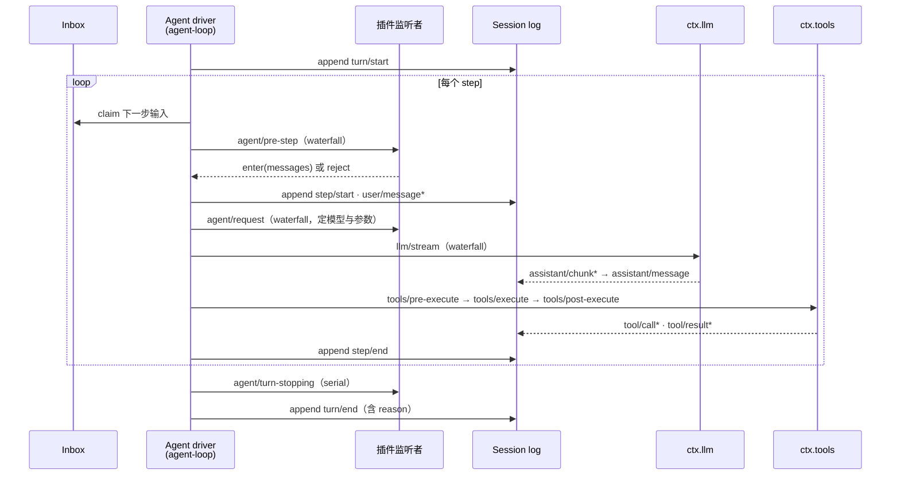

# 第 3 章 Everything is a Plugin：整体架构鸟瞰

这一章以 `docs/architecture.md` 为地图，但每个论断都回到 `src/*.ts` 求证，鸟瞰 dsh 的运行时结构：插件树如何从配置层叠而来、核心包各自认领哪个 `ctx` key、事件为什么分成三个域、一个 turn 从开始到结束经过哪些扩展点。最后我们把官方的「Where new behavior goes」总表提炼成中文速查。这一章是全书的路由表——后面每一部分都是对本章某一节的放大。

## 问题背景：可替换性从哪里来

第 1 章说 dsh「没有特权核心」，这句话要成立，必须同时回答三个工程问题。第一，**组成**：如果一切皆插件，那插件清单由谁决定、放在哪里？写死在 `main.ts` 里就谈不上可替换。第二，**寻址**：插件之间如何互相找到对方而不 `import` 具体实现？第三，**介入**：第三方代码如何在「模型请求发出前」「工具执行前」这些关键时机插入策略，而不修改循环？dsh 的答案分别是：配置层叠出的插件树、`ctx.<key>` 服务寻址、三个域的类型化事件。下面逐个看。

## 插件树：从 package.json 的 dsh 字段开始

一个运行中的 dsh 是一棵插件树，在启动时由有序的配置层「拍」出来。参与组成的实体有两种，都在自己的 `package.json` 里用 `dsh` 字段自我声明——**profile** 列出它层叠哪些 bundle，**bundle** 指向自己携带的补丁文件：

```jsonc
// packages/bundle/base/package.json（节选）
"dsh": {
  "bundle": {
    "patch": "./cordis.patch.yml"
  }
}
```

层叠顺序在 `docs/architecture.md` 里有明文：从空的配置行列表开始，按 profile 声明的顺序应用每个 bundle 的补丁，再叠 profile 自己的 `cordis.patch.yml`，再叠 Harness home 层的，最后是命令行 `--patch`。补丁按 `id` 定位配置行并**整体替换**其 config（不做深合并），或插入新行。`dsh-base` 永远是第一层（模型适配器、工具、持久化、沙箱与审批策略、settings、credentials、telemetry），`dsh-web-app` / `dsh-headless` 在其上各自加一小叠，就成了两种产品形态。`dsh --profile web --dump-config` 可以打印最终的树。层叠与补丁的实现细节（loader、include、`!!js` 表达式）留给[第 7 章](../part2/07-profiles-and-bundles.md)。

## 核心包与 ctx key：源码对照表

`docs/architecture.md` 给了一张核心包表，我们逐行到源码里核对 Service 声明的 key。六个包的 Service 子类和构造器调用如下（行号截至本书写作时的仓库快照）：

```ts
// packages/core/session/src/index.ts:792
export class SessionStore extends Service {
  // ...
    super(ctx, 'sessions')

// packages/core/system-prompt/src/index.ts:338
export class SystemPrompt extends Service {
  // ...
    super(ctx, 'systemPrompt')

// packages/core/tools/src/index.ts:787
export class ToolRuntime extends Service {
  // ...
    super(ctx, 'tools')

// packages/core/agent/src/index.ts:256
export class AgentRegistry extends Service {
  // ...
    super(ctx, 'agents')

// packages/core/agent-loop/src/index.ts:296
export class AgentLoop extends Service implements AgentFactory {
  // ...
    super(ctx, 'agentLoop')

// packages/llm/llm/src/index.ts:284
export class LlmRuntime extends Service {
  // ...
    super(ctx, 'llm')
```

整理成表，并标注本书的详解章节：

| 包 | Service 类 | ctx key | 拥有什么 | 详解 |
|---|---|---|---|---|
| `core/session` | `SessionStore` | `ctx.sessions` | append-only 的 `SessionEvent` 日志与内存 store | [第 13 章](../part4/13-session-event-log.md) |
| `core/system-prompt` | `SystemPrompt` | `ctx.systemPrompt` | prompt 分节与工具 schema 的组装注册表 | [第 21 章](../part5/21-system-prompt.md) |
| `core/tools` | `ToolRuntime` | `ctx.tools` | 作用域工具注册表与带守卫的执行流水线 | [第 18 章](../part5/18-tool-registry.md) |
| `core/agent` | `AgentRegistry` | `ctx.agents` | `Agent` 接口、活体注册表、`agent/*` 事件词汇 | [第 8 章](../part3/08-turn-and-step.md) |
| `core/agent-loop` | `AgentLoop` | `ctx.agentLoop` | 上述接口的默认驱动实现 | [第 9 章](../part3/09-agent-loop-deep-dive.md) |
| `core/scope` | —（库） | 无 key | per-agent 作用域注册原语 | [第 11 章](../part3/11-scope.md) |
| `llm/llm` | `LlmRuntime` | `ctx.llm` | 消息/流式词汇表 + adapter 接缝 | [第 27 章](../part7/27-llm-vocabulary-and-streaming.md) |

注意 `AgentLoop extends Service implements AgentFactory`：循环是一个服务，且实现的是 `core/agent` 定义的工厂接口——第 1 章「连主循环都是插件」在类型签名层面的落实。

## 三类事件域

`docs/architecture.md` 说「Events are the extension points, and picking the right domain is the first decision in most changes」。三个域的分界在于**事实的寿命与载体**：

- **Session 事件**（`turn/*`、`step/*`、`user/message`、`assistant/*`、`tool/*`）是持久事实：追加进日志、通过 `session/event` 广播，重启后仍在。判据：这个事实必须活过 reload 吗？
- **Agent 事件**（`agent/*`）携带一个活体 `Agent` 对象：inbox、step、status、request、validation、continuation。它们是运行中的介入点，不落盘。
- **Capability 事件**（`fs/*`、`tools/*`、`telemetry/*`）把策略和适配器挂到某个 seam 上，监听者完全不需要 import 循环。

事件的分发模式（`emit` / `waterfall` / `parallel` / `serial`）是公开契约的一部分，声明处用 `@mode` JSDoc 标注，生成的事件目录会校验声明与分发点一致。以 `agent/pre-step` 为例，它在 `core/agent` 的事件词汇表里声明为 waterfall——签名里那个 `next` 参数就是证据：

```ts
// packages/core/agent/src/runtime-types.ts:231（@mode waterfall）
'agent/pre-step'(
  this: Scoped<Agent>,
  payload: { agent: Agent; messages: UserMessage[]; turn: number; step: number; signal: AbortSignal },
  next: () => Promise<PreStepDecision>,
): Promise<PreStepDecision>
```

waterfall 是环绕式中间件：监听者可以改写 payload 后调 `next()` 委托，也可以不调 `next()` 直接短路返回自己的决策。dsh 用这一个原语同时实现了策略注入、消息改写和请求拦截（[第 5 章](../part2/05-typed-events.md)展开语义，[第 19 章](../part5/19-tool-pipeline.md)看它在工具流水线的三连用法）。每个事件的生产者/消费者全景在生成的 `docs/event-producer-consumer.md`，本书[附录 C](../appendix/c-event-map.md) 有提炼。

## Turn flow：一次对话轮的时序

词汇先钉死（`docs/glossary.md`）：**step** = 一次模型请求加上它引发的工具执行；**turn** = 对已接纳输入的一次排空，含零或多个 step。时序总览如下——虚线框内是每个 step 循环经过的扩展点：



图中的持久事件（`turn/*`、`step/*`、`user/message`、`assistant/*`、`tool/*`）落日志；其余全是活体扩展点，其中 `agent/pre-step`、`agent/request`、`llm/stream` 和三个 `tools/*` 是 waterfall，`agent/turn-stopping` 是 serial。对照驱动源码（有删节）：

```ts
// packages/core/agent-loop/src/agent.ts（turn()，有删节）
const turn = phase.turn + 1
this.session.append('turn/start', { turn })
let turnEnds: TurnEndReason | null = null
try {
  while (true) {
    const step = phase.step + 1
    const decision = await this.preStep(target, { turn, step })   // agent/pre-step waterfall
    if (decision.kind === 'reject') { turnEnds = { kind: 'blocked' }; return false }
    // A removed waking message or an enter decision rewritten to empty
    // still owns the initial turn boundary, but it spends no model call.
    if (phase.step === 0 && decision.messages.length === 0) {
      turnEnds = { kind: 'completed' }; return false
    }
    this.session.append('step/start', { turn, step })
    try {
      for (const message of decision.messages)
        this.session.append('user/message', message, { surfaceOp: 'append' })
      const stepEnd = await this.step(decision.assembly)          // llm/stream + tools/*
      if (turnEnds === null || turnEnds.kind !== 'max-tokens') turnEnds = stepEnd
    } finally {
      this.session.append('step/end', { turn, step })
    }
    if (turnEnds && this.inbox.nextStep.length === 0) {
      await this.dispatch.serial('agent/turn-stopping', { turn, signal })
    }
    if (turnEnds && this.inbox.nextStep.length === 0) break
    target = 'next-step'
  }
} finally {
  this.session.append('turn/end', { turn, reason: turnEnds! })
}
```

短短一段浓缩了好几个决定。输入统一经由一个 inbox 被 `claim`，注入的上下文会在 inbox 里等待，直到某条唤醒消息到来才一起入场（[第 10 章](../part3/10-inbox-and-injection.md)）。`agent/pre-step` 的监听者能改写甚至清空本步消息——而**被 reject 或首个 claim 被改写为空时，仍然会留下一个「零 step」的持久 turn**：`turn/start` 已经落盘，`finally` 里的 `turn/end` 带着 `blocked` / `completed` 的 reason 闭合它，日志如实记录这次未遂的尝试。`step/end` 也在 `finally` 里，模型请求抛错不会留下悬空的 step。`turnEnds` 的 sticky 语义（一旦某步撞了 max-tokens，后续正常完成的步不能降级这个结论）和 `agent/turn-stopping` 之后再查一次 inbox 的二次检查，都是并发窗口下的细账，留到[第 9 章](../part3/09-agent-loop-deep-dive.md)细算。

## 一条运行时不变量：Model-visible means logged

`docs/architecture.md` 宣称「anything that reaches a model request must be reconstructable from the log, and a runtime invariant asserts it」。这不是文档修辞——断言真实存在，就在 `agent-loop` 的伴生插件里：

```ts
// packages/core/agent-loop/src/invariant.ts（有删节）
// Prepend prevents a short-circuiting replay listener from silencing the check.
ctx.on('llm/stream', (options: GenerateOptions, next) => {
  if (!isAgentLoopRequest(options)) return next()
  if (!Object.isFrozen(options)) fail('a loop-built request must be frozen')
  // ...
  const expected = session.deriveMessages()
  if (JSON.stringify(options.messages) !== JSON.stringify(expected)) {
    fail(`llm request for session "${String(session.id)}" diverges from the dispatch-time durable derivation (log-reconstruction desync)`)
  }
  // ...
  return next()
}, { global: true, prepend: true })
```

它以 `prepend` 监听者的身份挂在 `llm/stream` waterfall 的最前面：每一个由循环构建的模型请求经过时，现场用 `deriveMessages()` 从日志重新推导一遍模型上下文，逐字节比对即将发出的 `options.messages`。任何「绕过日志偷塞内容进 prompt」的代码——无论来自核心还是第三方插件——都会在第一次请求时被当场击毙。这条不变量是第四部分的主角（[第 15 章](../part4/15-model-visible-invariant.md)），invariants 设施本身见[第 39 章](../part10/39-invariants-and-defensive-patterns.md)。

## Where new behavior goes：中文速查

`docs/architecture.md` 末尾那张「Where new behavior goes」表是整个架构的验收标准：如果真的一切皆插件，那任何新需求都应该能落到一个已文档化的扩展点上。中文提炼如下（改循环本身则必须同步更新这张表——这条规则写在根 `AGENTS.md`）：

| 你想做什么 | 挂到哪里 | 详解 |
|---|---|---|
| 加一个模型供应商 | 在 `ctx.llm` 注册 adapter | [第 28 章](../part7/28-adapters.md) |
| 加一个模型可见的能力 | 在 `ctx.tools` 注册工具，schema 自动进入 prompt 组装 | [第 18 章](../part5/18-tool-registry.md) |
| 给某个会话换一套能力 | 组合 agent preset（隔离 realm） | [第 7 章](../part2/07-profiles-and-bundles.md) |
| 加 shell / 持久终端执行 | 注册 `ctx.shell` / `ctx.terminals` 后端 | [第 24 章](../part6/24-execution-world.md) |
| 加人类斜杠命令 | 注册到 `ctx.commands`，不经过模型 turn | [第 31 章](../part8/31-skills-and-hooks.md) |
| 加后台工作 | 注册到 `ctx.jobs`，`job_*` 工具负责收集与停止 | [第 32 章](../part8/32-workflow-jobs-goal.md) |
| 加文件系统访问或策略 | 注册 `ctx.fs` provider 或监听 `fs/*` | [第 23 章](../part6/23-filesystem.md) |
| 约束子进程 | 用 `ctx.sandbox` 后端包装 argv | [第 25 章](../part6/25-sandbox.md) |
| 拦截请求 / 工具 / turn | 对应的 `agent/*` 或 `tools/*` 事件 | [第 19 章](../part5/19-tool-pipeline.md) |
| 给模型塞上下文 | `agent.inject()`，落到下一个被接纳的请求 | [第 10 章](../part3/10-inbox-and-injection.md) |
| 加 UI / 编辑器集成 | 驱动 `ctx.agents`，从 `session/event` 渲染 | [第 36 章](../part9/36-web-client.md) |
| 加持久会话状态 | 扩展 `SessionEventMap`，从日志渲染与重放 | [第 13 章](../part4/13-session-event-log.md) |
| Fork 一个活体会话 | `ctx.sessions.fork(source, boundary?, childSessionId?)` | [第 16 章](../part4/16-fork-resume-compaction.md) |
| 把注册限定到单个 agent | 用该 agent 的 `agent.ctx` | [第 11 章](../part3/11-scope.md) |

> 💎 **设计亮点：扩展点的默认行为就是 waterfall 的最内层。** 看 `preStep`：默认决策（「原样进入，并附上运行时上下文」）不是写在监听者之外的 if-else，而是作为 `dispatch.waterfall` 的最后一个参数——`next()` 链的终点。普通写法是「先跑钩子，钩子没拦截就走默认逻辑」，两条路径各自演化迟早裂开；dsh 里默认行为与插件行为共享同一条链，插件既可以在默认值前拦截，也可以拿到默认值再加工，语义由一个原语统一。

> 💎 **设计亮点：日志永不悬空——每条出口都要交代 reason。** `turn/end` 写在 `finally` 里，且 payload 必须携带结构化的 `TurnEndReason`（completed / blocked / max-tokens / aborted / error），源码注释直言「every exit assigns a turn ending」。连被 pre-step 拒绝、一个模型 call 都没花的 turn 也会闭合落盘。普通实现里异常路径经常留下没有结尾的日志，重放和 UI 只能靠猜；这里日志的完整性是控制流结构保证的，不是靠每个作者记得写。

> 💎 **设计亮点：用插件机制守护插件机制。** 「model-visible means logged」的执法者不是循环里的特判代码，而是一个标准的 `prepend` waterfall 监听者，挂在与被检对象完全相同的事件总线上——注释还解释了为什么必须 prepend：防止某个短路的 replay 监听者让检查失声。不变量因此天然覆盖所有第三方插件的请求路径，而循环源码保持零检查逻辑。「没有特权核心」再次自洽：连警察也是普通插件。

## 小结与延伸

本章把 dsh 的运行时结构走了一遍：配置层叠出插件树（`dsh` 字段自声明，补丁按 id 整行替换）；核心能力各自认领一个 `ctx` key，循环本身也只是 `ctx.agentLoop` 的默认 provider；事件按事实寿命分成 session / agent / capability 三域，waterfall 是贯穿始终的介入原语；turn flow 的每个边界都持久落日志，并由一条运行时不变量保证模型所见必可从日志重建。「Where new behavior goes」表是这套架构的验收标准，也是本书余下章节的目录。下一部分我们下到地基，拆 Cordis 本身。

**阅读清单**（相对仓库根）：

- `docs/architecture.md` — 本章的底图，读源码前的必读件
- `docs/agent-lifecycle.md` — 官方的完整时序图，比本章的 mermaid 更细
- `packages/core/agent-loop/src/agent.ts` — turn/step 状态机全文（约 500 行）
- `packages/core/agent-loop/src/invariant.ts` — 63 行读懂运行时不变量的写法
- `packages/core/agent/src/runtime-types.ts` — `agent/*` 事件词汇表与 `@mode` 标注
- `docs/event-producer-consumer.md` — 生成的事件生产者/消费者矩阵
