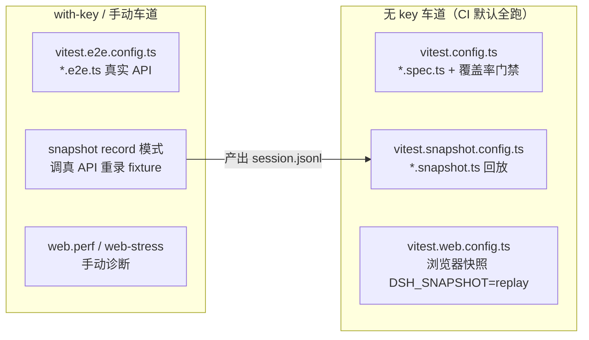

# 第 38 章 测试策略：七份 vitest 配置与 test-support

一个 50+ 包的 Agent Harness monorepo，测试对象横跨纯函数、子进程、真实模型 API 和浏览器渲染，用一份 vitest 配置根本装不下。DeepSeek Harness 的答案是把仓库根摊开成 7 份 vitest 配置，每份对应一条独立的「测试车道」（lane），再用 `packages/test-support/` 下的 6 个基建包把「假模型、录制回放、Loader 冒烟」做成可复用原语。这一章带你读完这 7 份配置各管什么、为什么这样切，以及 `docs/testing.md` 里那几条足以当团队军规的测试哲学——包括最反直觉的一条：「我们是 DeepSeek，不要节省真实 API 测试」。

## 问题背景

如果你自己给一个 Agent 框架搭测试，朴素做法是一份 `vitest.config.ts` 打天下：单测、集成测、e2e 全塞进 `include`，coverage 开个全局 80% 阈值完事。跑起来会立刻撞上几堵墙：

- **成本维度不同**。调用真实 DeepSeek API 的 e2e 花钱且不确定，混进单测里会让每次 `pnpm test` 都变慢变贵；而没有 key 的贡献者和 CI 会直接红掉。
- **运行环境不同**。浏览器快照测试要先 build 前端、起 Chromium、串行跑；单测要并行、要覆盖率插桩。两者的 timeout、并行度、setup 完全冲突。
- **全局覆盖率阈值是假安全**。全局 80% 意味着一个测得很满的大文件可以「补贴」一个几乎没测的新文件——数字绿了，洞还在。
- **mock 模型各写各的**。每个包手搓一个假 LLM adapter，行为漂移、录制格式不一致，最后没人知道哪个 mock 还忠实于真实协议。

DeepSeek Harness 把这些维度物理切开：一个维度一份配置文件、一条 npm script、一条 CI 车道。

## 源码剖析

### 七份配置的分工

先看全景。`package.json` 里每条 `test:*` script 对应一份配置：

| 配置文件 | 命令 | 车道 |
|---|---|---|
| `vitest.config.ts` | `test` / `test:coverage` | 单测 + 覆盖率门禁（gating run） |
| `vitest.e2e.config.ts` | `test:e2e` | 真实 API e2e（花钱，无 key 自跳过） |
| `vitest.snapshot.config.ts` | `test:snapshot[:record/:refresh]` | 无 key 快照回放 |
| `vitest.web.config.ts` | `test:web` | 浏览器快照（Linux PR 必过门禁） |
| `vitest.web.perf.config.ts` | `test:web:perf` | 手动性能诊断（不进 CI） |
| `vitest.web-stress.config.ts` | `test:web:stress` | 浏览器压力测试（opt-in） |
| `vitest.shared.ts` | —— | 各车道共享的插件与 execArgv |

车道之间靠**文件后缀**划界：`*.spec.ts` 归单测，`*.e2e.ts` 归 e2e，`*.snapshot.ts` 归快照，`*.stress.ts` / `*.perf.ts` 故意不出现在任何默认 include 里，只能显式点名运行。



### 单测车道：per-file 100% 与两类进程

`vitest.config.ts` 是最重的一份。它内部又用 vitest 的 `projects` 把套件分成两个池：

```ts
// vitest.config.ts
// These suites exercise process-global state, process APIs, or timing-sensitive process I/O
// that worker threads cannot isolate reliably under aggregate gate contention.
const processBoundTests = [
  'packages/session/session-persistence-jsonl/tests/jsonl.spec.ts',
  'packages/subagent/subagent-acp/tests/subagent-acp.spec.ts',
  // ...
]

export default defineConfig({
  plugins: [pathsPlugin(), standardDecoratorPlugin()],
  test: {
    setupFiles: ['./scripts/test-invariants.ts'],
    projects: [
      {
        test: {
          name: 'thread-safe',
          pool: 'forks',
          include: testIncludes,
          exclude: [...windowsUnsupportedTests, ...processBoundTests, ...coverageExemptExcludes],
          // ...
        },
      },
      {
        test: {
          name: 'process-bound',
          pool: 'forks',
          include: processBoundTests,
          // ...
        },
      },
    ],
    // ...
  },
})
```

两个 project 都用 `pool: 'forks'`（源码注释解释：Node 24 的 CJS lexer 在 worker thread 下会在三大平台上 abort，fork 进程绕开了共享线程路径），但 `process-bound` 名单单独成池，让改动进程全局状态的套件不与其他套件抢占同一批 worker。注意 `setupFiles` 指向 `scripts/test-invariants.ts`——每个测试进程启动时都会挂载 [第 39 章](39-invariants-and-defensive-patterns.md) 讲的 invariant 服务，运行时断言在**所有**单测里默认开启。

覆盖率门禁是这份配置里最锋利的部分：

```ts
// vitest.config.ts
coverage: {
  provider: 'v8',
  include: ['packages/*/*/src/**/*.{ts,tsx}'],
  // ...
  // 100% or it doesn't merge (docs/testing.md: excessive tests are welcome).
  // Per-file so a well-covered big file can't subsidize a bare one.
  thresholds: {
    perFile: true,
    statements: 100,
    branches: 100,
    functions: 100,
    lines: 100,
  },
},
```

per-file 100%，不到不许合并。`docs/testing.md` 对这条的解读比数字本身更重要：「一行未覆盖的代码往往是门禁在正确地标记一段该删的死代码，而不是提示你补一个测试」；同时「行覆盖是必要条件、永远不是充分条件——它只证明代码跑过，不证明功能如出厂般工作」。配置里那一长串 `exclude` 也不是随手豁免：每条都带注释说明豁免原因（types-only 文件无运行时代码、client GUI 债标着 `TODO(gui)`、Windows-only 包在 Linux 覆盖车道上永远跑不到），豁免本身是有账可查的技术债清单。

配套的 `scripts/coverage-exempt.ts` 处理另一个现实问题——v8 插桩对编译器级重型套件是巨大的税：

```ts
// scripts/coverage-exempt.ts
// Membership rule: a suite qualifies only when every coverage-measured
// file it executes in-process ... is already fully covered by other suites,
// so removing it from the instrumented run changes no threshold outcome.
export const COVERAGE_EXEMPT_ENV = 'DSH_COVERAGE_EXEMPT_HEAVY'

export const coverageExemptHeavySuites: readonly CoverageExemptSuite[] = [
  // Whole-workspace compiler analysis per case — the lane's longest tail.
  { filter: 'packages/typert/generator/tests/', exclude: 'packages/typert/generator/tests/**' },
  // ...
]
```

插桩门禁设置这个环境变量后，重型套件从插桩运行中剔除、改在旁边不插桩地照常跑——正确性信号不变，只省掉插桩税。而 `vitest.config.ts` 里对这个变量还有一段防御：值存在但不是 `'1'` 就直接抛错，「设置了但设错」是配置事故，不是静默 no-op。

### e2e 车道：花钱的测试如何不拖累无 key 的人

`vitest.e2e.config.ts` 的头注释就是它的设计说明：

```ts
// vitest.e2e.config.ts
// Real-API suite, separate because it spends tokens. Each test self-skips without
// its provider credential for keyless CI; credentialed workflows preflight the
// secrets they require.
// ...
// Real model calls: generous timeouts, and retries for transient flakes
// (the shared internal key hits concurrency quotas). No coverage — the
// unit suites own the coverage gate.
testTimeout: 120_000,
hookTimeout: 30_000,
retry: 2,
fileParallelism: e2eMaxWorkers > 1,
maxWorkers: e2eMaxWorkers,
```

关键机制是 **self-skip**：没有 `DEEPSEEK_API_KEY`（或 `EXA_API_KEY` 等 provider 专属 key）时测试自跳过，无 key 的 CI 和贡献者保持绿色。`docs/testing.md` 特意强调这不是成本信号——「我们是 DeepSeek，推理在这里很便宜，不要配给真实 API 测试」。最高价值的是 smoke 测试：启动真实 example、发一条 prompt、检查世界状态，它们抓的是「单测全绿、产品挂掉」这一类 mock 永远抓不到的问题（`docs/postmortem/0001-acp-default-export-drops-inject.md` 就是实证，见[第 40 章](40-docs-as-engineering.md)）。

### 快照车道：一份 fixture 的三种人生

`vitest.snapshot.config.ts` 用环境变量 `DSH_SNAPSHOT` 把同一批测试文件切成三种模式：

```ts
// vitest.snapshot.config.ts
// Replay is the keyless default: boot real subprocess paths from recorded model responses and diff
// assembled requests, normalized protocol or transcript output, and persisted-log expected outputs.
// `record` calls the real API and updates fixtures and expected outputs; `refresh` replays committed scripts
// and updates current expected outputs. Replay/refresh never load `.env`; only record reads a key from the
// environment or root `.env`.
// ...
fileParallelism: (process.env.DSH_SNAPSHOT || 'replay') === 'replay' && snapshotMaxConcurrency > 1,
```

- **replay**（默认，无 key）：从录好的模型响应启动真实子进程，diff 组装出的请求、归一化的协议输出、持久化日志。
- **record**：调真实 API，重录 fixture 和期望输出——模型 transcript 变了才跑。
- **refresh**：回放已提交的脚本、只重写派生的期望输出——回放输入仍有效时用。

并行策略跟着模式走：replay 只读已提交 fixture、每个场景拥有独占临时目录，所以可以并行；record 花真金白银的 API 配额、refresh 会写回 golden 文件，并发写会写坏，所以两者强制串行。这个「并行度由模式的写行为决定」的推导全部写在配置注释里。

### 浏览器三车道

`vitest.web.config.ts` 是 Linux PR 的必过门禁：先 `npm run build`（快照要执行生成的 client bundle），Chromium 回放并与 `apps/web/tests/snapshots/` 的 golden 对比，CI 强制 `DSH_SNAPSHOT=replay` 只读。因为多个文件共享一个浏览器实例，`fileParallelism: false` 串行执行。`vitest.web.perf.config.ts` 直接展开复用 web 配置、只换 include 为 `*.perf.ts`——注释言明「手动高基数诊断留在 CI web 门禁之外」。`vitest.web-stress.config.ts` 同理，`*.stress.ts` 不在任何默认 include 里，600 秒 timeout，纯 opt-in。

### vitest.shared.ts：被七份配置共享的两件小事

```ts
// vitest.shared.ts
export const vitestExecArgv = process.allowedNodeEnvironmentFlags.has('--webstorage') ? ['--no-webstorage'] : []

export function standardDecoratorPlugin() {
  return {
    name: 'dsh-standard-decorators',
    enforce: 'pre' as const,
    transform(code: string, id: string) {
      // ...
      return {
        code: result.outputText
          .replace(
            /^(\s*)(__esDecorate\()/gmu,
            '$1/* v8 ignore next -- compiler-synthetic decorator accessors have no source behavior */ $2',
          )
          // ...
      }
    },
  }
}
```

`standardDecoratorPlugin` 在 Vite 默认解析器之前用 tsc 转译标准 TypeScript decorator，并且在转译产物里给编译器合成的 `__esDecorate` 调用自动注入 `v8 ignore` 注释——合成代码没有源码级行为，不该算进 per-file 100% 的分母。这是覆盖率门禁与构建工具链咬合的细节：门禁越严，工具链就得越懂「哪些行不是你写的」。

### test-support：把 mock 压缩到唯一边界

`packages/test-support/` 有 6 个包，README 一句话定性：「这些包服务于仓库开发、测试和示例，而不是产品 API」。这里没有「内存文件系统」这类通用 fake——`docs/testing.md` 的原则是**只 mock 昂贵或不确定的边界（LLM adapter、网络、时钟），下游一切保持真实**。所以 6 个包全部围着模型边界和进程边界打转：

| 包 | 角色 |
|---|---|
| `llm-mock-server` | 确定性的 OpenAI 兼容故障服务器 |
| `llm-replay` | 从录制的 session 日志回放模型响应 |
| `agent-loop-testkit` | 挂载 AgentLoop 测试的公共前置服务 |
| `loader-smoke` | 启动 Loader 组合的应用做冒烟测试 |
| `acp-snapshot` | ACP 快照测试套件工厂 |
| `client-runtime` | Web client 测试的 fixture 与会话工具 |

`llm-mock-server` 是一台可编排的故障机，24 种请求级行为覆盖了传输层能出的所有事故：

```ts
// packages/test-support/llm-mock-server/src/index.ts
export const MOCK_LLM_BEHAVIORS = [
  'connection_reset', 'stream_disconnect', 'empty', 'empty_body',
  'stream_eof', 'partial_eof', 'partial_disconnect', 'stall',
  'malformed_json', 'malformed_event', 'wrong_content_type',
  'rate_limit', 'server_error', 'service_unavailable', 'auth_error',
  // ...
  'success', 'reasoning_success', 'tool_call_success', 'max_tokens',
  'slow_success', 'random',
] as const
```

每个接受的请求消费一条脚本行为，服务器自身「从不重试、从不解读 harness 策略」——重试是被测系统的职责，故障机只负责忠实地坏。`random` 行为按可配置权重随机选取具体故障，默认权重表注释直言这是「可配置的测试压力，不是对生产事故频率的断言」。

`llm-replay` 则解决快照车道的核心问题——无 key 时模型响应从哪来：

```ts
// packages/test-support/llm-replay/src/index.ts
/**
 * Keyless snapshot-test LLM replay. It derives one model-call script per
 * recorded session from `assistant/chunk` events and explicitly marked local
 * compaction calls, then binds fresh live sessions to parent/child scripts by
 * first-call order. Throw and hang cases require an explicit override because
 * a session log cannot reconstruct them alone.
 */
```

它不要求维护独立的 mock 脚本格式，而是直接从[第 13 章](../part4/13-session-event-log.md)讲的 `session.jsonl` 事件日志里派生模型调用脚本——录制时的会话日志既是回放输入、又是期望输出。嵌套 subagent 场景的父子会话按 `createdAt` 排序、以首次调用顺序绑定到脚本；日志无法重构的 throw/hang 场景才需要 override 侧车文件。

单个包内的协议测试则常用更轻的手写 adapter。ACP 桥接测试的 harness 是个好样本：

```ts
// packages/acp/acp/tests/harness.ts
/** Scripted adapter for protocol tests. */
class MockAdapter extends LlmAdapter {
  readonly requests: GenerateOptions[] = []

  constructor(private readonly script: (StreamChunk[] | 'hang')[]) { super() }

  async * stream(options: GenerateOptions): AsyncIterable<StreamChunk> {
    this.requests.push(options)
    const entry = this.script.shift()
    if (entry === undefined) throw new Error('MockAdapter: script exhausted')
    if (entry === 'hang') {
      yield { type: 'block-start', index: 0, blockType: 'text' }
      yield { type: 'text-delta', index: 0, text: 'partial' }
      await new Promise<void>((_resolve, reject) => {
        // ... reject on options.signal abort
      })
      return
    }
    for (const chunk of entry) {
      if (options.signal?.aborted) throw new Error('aborted')
      yield chunk
    }
  }
}
```

注意 mock 的位置：只有 `LlmAdapter.stream` 是假的，桥另一端的工具、执行器、事件日志全是真的。`docs/testing.md` 点名这个模式：`makeBridgeHarness({ withBash: true })` 会插入真实的 `dsh-bash-local` 和 `dsh-tool-bash` 然后真的跑一条 `echo`——「手搓的替身只能证明桥在搬字节，不能证明出厂的工具行为如断言所述」。

`loader-smoke` 管的是另一条军规「test the real entry path」——测试必须能从**构建产物**启动 example，而不是永远走 tsx 源码路径：

```ts
// packages/test-support/loader-smoke/src/index.ts
/** Which artifact an example bin is booted from: unbuilt `src` via tsx, or built `lib` via plain Node. */
export type ExampleMode = 'src' | 'lib'

export function resolveExampleMode(raw = process.env[EXAMPLE_MODE_ENV]): ExampleMode {
  switch (raw) {
    case undefined: case '': case 'src': return 'src'
    case 'lib': return 'lib'
    default:
      throw new Error(`${EXAMPLE_MODE_ENV} must be 'src' or 'lib', got ${JSON.stringify(raw)}.`)
  }
}
```

CI 设 `DSH_EXAMPLE_MODE=lib`：example 的 bin 以 `node lib/bin.js` 启动、包引用走真实 `exports`——和安装后的用户一模一样。这暴露的正是 tsx 会掩盖的问题：settle 竞态、模块解析、被吞的加载失败。而 `docs/testing.md` 的「source plane only」规则是它的镜像：所有 vitest 配置都通过 `vite-tsconfig-paths` 指向 `tsconfig.base.json` 的 paths map，测试内的裸包名导入永远解析到 `src`，绝不落到过期的 `lib/`——否则模块单例会被加载第二份。源码归源码平面，产物归子进程，两个世界不许串。

### pytest.ini 与 Python SDK

Python 侧只有一个测试目标——`python/sdk/` 的 SDK 客户端。`pytest.ini` 全文 5 行：

```ini
# pytest.ini
# Restrict root collection to SDK tests; recursive collection can include
# ignored worktrees or venvs and collide on same-named modules.
[pytest]
testpaths = python/sdk/tests
norecursedirs = node_modules .git dist-exe
```

`python/sdk/tests/test_client.py` 的打法和 TS 侧同构：测试现场生成一个假的 runtime 脚本（读 stdin 的 JSON-RPC、按 method 回应 `initialize` / `session/prompt`），让真实的 `HarnessClient` 以子进程方式跟它对话——mock 的仍然是进程边界的另一端，SDK 自身的启动、环境注入（`DSH_CWD`、`DSH_SESSION_ROOT`）、协议编解码全部走真实路径。

> 💎 **设计亮点：per-file 100%，并把「未覆盖」重新定义为死代码信号**
> 普通做法是全局 80%，结果是大文件补贴小文件、阈值沦为仪式。这里 `perFile: true` + 四项 100% 让每个文件独立对账，且 `docs/testing.md` 明确「未覆盖的行往往是该删的死代码」——门禁从「逼你补测试」变成「逼你删代码或写测试，二选一」。所有豁免集中在配置里、每条带注释和 `TODO(gui)` 标签，技术债是显式清单而非隐式常态。

> 💎 **设计亮点：session 日志既是回放输入又是期望输出**
> 普通做法是为 mock 模型单独维护一套脚本格式，与真实协议渐行渐远。`llm-replay` 直接从录制的 `session.jsonl` 派生模型调用脚本——record 模式录一次，replay 模式既用它驱动假模型、又用它校验重新持久化的日志。fixture 没有第二种格式可以漂移，事件日志子系统（第四部分）在这里意外收获了第二个消费者。

> 💎 **设计亮点：用文件后缀给测试分级，车道间物理隔离**
> `*.spec.ts` / `*.e2e.ts` / `*.snapshot.ts` / `*.stress.ts` / `*.perf.ts` 各归各的配置文件，互相的 include 不重叠。写测试的人在起文件名的那一刻就完成了「这个测试花不花钱、进不进 CI 门禁、能不能并行」的声明，不需要任何注册表或标签系统。

> 💎 **设计亮点：环境变量配置一律 fail-loud**
> `DSH_COVERAGE_EXEMPT_HEAVY` 设了但不是 `'1'` 直接抛错；`DSH_EXAMPLE_MODE` 拼错直接抛错；`DSH_E2E_MAX_WORKERS` 不是正整数直接抛错。三处独立代码采用同一个反射：环境变量的「设置了但设错」永远不许静默降级成默认行为——门禁的旋钮如果能被拼写错误悄悄关掉，门禁就不存在。

## 小结与延伸

七份 vitest 配置不是配置膨胀，而是把「成本、环境、并行度、写权限」四个正交维度各自装进一条车道，让无 key 贡献者、烧钱的 e2e、串行的浏览器快照互不拖累。test-support 的六个包共享同一个信条：mock 只出现在模型和进程边界，边界以内全部真实；而 per-file 100% 覆盖率、self-skip、fail-loud 环境变量这些机制，把 `docs/testing.md` 里的政策文本变成了机器可执行的门禁。下一章会看到同样的思路更进一步——把「纪律」直接写成运行时断言。

**阅读清单**

- `docs/testing.md` — 测试政策全文，本章多处引用的军规原文
- `vitest.config.ts` — 覆盖率豁免清单本身就是一份技术债地图
- `packages/test-support/llm-replay/src/index.ts` — 日志派生回放脚本的完整实现
- `packages/test-support/llm-mock-server/src/index.ts` — 24 种故障行为的故障机
- `packages/core/agent-loop/tests/contract-regressions.spec.ts` — 政策里点名的「契约回归永久测试」样本
- [第 39 章 Invariants 与防御式编程](39-invariants-and-defensive-patterns.md) — `scripts/test-invariants.ts` 挂载的断言体系
