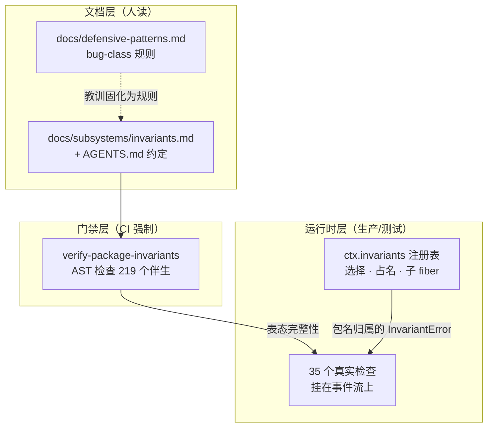

# 第 39 章 Invariants 与防御式编程

一个跑着模型、工具、子进程、并发回调的 harness，最怕的不是崩溃，而是**悄悄错了**——上下文与日志不一致、审批流水没有配对、请求在中间件里被偷偷改写。DeepSeek Harness 的答案是把工程纪律写成三层可执行的东西：一个包无关的运行时 invariant 注册表（`ctx.invariants`）、覆盖全部 219 个 workspace 包的伴生插件契约、以及一份把「踩过的坑」固化成规则的 `docs/defensive-patterns.md`。这一章带你读完这条链路：断言如何注册、如何归属到包、如何被 CI 强制「每个包都必须表态」。它与[第 15 章](../part4/15-model-visible-invariant.md)讲的 "model-visible means logged" 是互补关系：那一章讲的是**一条**最重要的不变量，这一章讲的是承载所有不变量的**基础设施与文化**。

## 问题背景

如果让你给一个 Agent 框架加运行时断言，朴素做法大概是：在核心代码里散落 `assert(...)`，再配一个全局 `DEBUG` 开关。这条路会遇到四个坑：

1. **断言没有归属**。`assert failed: messages mismatch` 抛出来时，你不知道这是哪个子系统的契约被谁破坏了。在一个 50+ 包的 monorepo 里，排查等于全库考古。
2. **断言无法选择性开关**。生产环境想关掉昂贵的检查（比如整段消息数组的深比较），又想保留便宜的词汇表校验，全局开关做不到；按模块开关则需要每个模块自己发明配置项。
3. **断言的「缺席」不可见**。最危险的不是写错的断言，而是**该写却没人写**的断言。代码评审很难发现「这里少了一个检查」，因为缺席没有 diff。
4. **防御式编程经验只活在人脑里**。「子进程可能 timeout 且 exit 0」「dispose 要等到 quiescence」这类教训，通常在 postmortem 里写一次就沉底了，下一个人照样再踩。

DeepSeek Harness 对这四个坑分别给出了机制化的回答，而且互相咬合。

## 源码剖析

### 注册表：一个不认识任何产品包的服务

`ctx.invariants` 由 `packages/runtime-diagnostics/invariants` 提供。它刻意做成一个纯粹的「登记处」：不 import 任何产品包，只管选择（开关与正则过滤）、名字占用、子 fiber 生命周期和**按包归属的失败**。

```ts
// packages/runtime-diagnostics/invariants/src/index.ts
/** Thrown when a package-owned runtime invariant is violated. */
export class InvariantError extends Error {
  /** Stable machine-readable invariant failure code. */
  readonly code = 'INVARIANT' as const
  /** Full npm package name that owns the violated invariant. */
  readonly packageName: string

  constructor(packageName: string, message: string) {
    super(`invariant violated by "${packageName}": ${message}`)
    this.name = 'InvariantError'
    this.packageName = packageName
  }
}
```

注册入口是全部机制的枢纽，值得逐行看：

```ts
// packages/runtime-diagnostics/invariants/src/index.ts
register(packageName: string, installer: InvariantInstaller): () => void {
  // ...（空白 / 重名校验，直接 throw）
  const ctx = this.ownerCtx
  const registrations = this.registrations
  registrations.add(packageName)

  let registration: PendingInvariantRegistration
  try {
    registration = ctx.effect(async () => {
      if (!this.selected(packageName)) {
        return () => { registrations.delete(packageName) }
      }
      const installInvariant = (childCtx: Context) => (
        installer(childCtx, (message): never => {
          throw new InvariantError(packageName, message)
        })
      )
      try {
        const child = ctx.plugin(installer.inject === undefined
          ? installInvariant
          : Object.assign(installInvariant, { inject: installer.inject }))
        try {
          await child
        } catch (error) {
          await child.dispose()
          throw error
        }
        return async () => {
          try { await child.dispose() }
          finally { registrations.delete(packageName) }
        }
      } catch (error) {
        registrations.delete(packageName)
        throw error
      }
    }, `invariants.register(${JSON.stringify(packageName)})`)
  } catch (error) {
    registrations.delete(packageName)
    throw error
  }
  return registration
}
```

三件事值得注意。第一，`fail` 回调是在注册时**闭包绑定**了包名的——检查代码里只写 `fail('a loop-built request must be frozen')`，抛出来的却是 `invariant violated by "@deepseek-ai/dsh-agent-loop": ...`，注册表不需要认识这个包就完成了归属。第二，每个包的检查跑在**独立的子 Cordis fiber** 里，通过 `installer.inject` 声明它需要的服务（比如 `sessions`）；这意味着 invariant 本身也是[第 6 章](../part2/06-reversible-effects.md)意义上的可逆副作用，HMR 重载一个包时它的检查会被干净地卸掉再装回。第三，即使配置里的过滤器把这个包的检查关掉了（`selected` 返回 false），**名字占用依然成立**——两个插件永远不可能悄悄注册同一个包名，无论过滤器怎么配。

选择逻辑本身也「fail loud」：`package_allowlist` / `package_blocklist` 里任何空白、重复或非法的正则都会在服务启动时直接 throw，而不是被静默跳过（`compilePatterns`，同文件）。一个配置错误的过滤器如果被悄悄忽略，你会以为检查在跑而其实没有——这正是 invariant 系统自己最不能犯的错。

### 伴生契约：每个包都必须表态

注册表只是地基，真正的制度是**伴生插件契约**：每个 workspace 包都必须发布一个 `./invariant` 导出。数一下仓库：`packages/*/*/src/invariant.ts` 共有 219 个，其中 35 个装了真实检查，其余 184 个是「解释过的空实现」。

先看一个真检查——`dsh-agent-loop` 的请求重建 invariant，它就是第 15 章那条不变量的运行时化身：

```ts
// packages/core/agent-loop/src/invariant.ts
const install: InvariantInstaller = Object.assign((ctx: Context, fail: InvariantFailure) => {
  // Prepend prevents a short-circuiting replay listener from silencing the check.
  ctx.on('llm/stream', (options: GenerateOptions, next) => {
    if (!isAgentLoopRequest(options)) return next()
    if (!Object.isFrozen(options)) fail('a loop-built request must be frozen')
    // ...（session id 存活、messages 冻结、step/start 存在等检查）
    const expected = session.deriveMessages()
    if (JSON.stringify(options.messages) !== JSON.stringify(expected)) {
      fail(`llm request for session "${String(session.id)}" diverges from the dispatch-time durable derivation (log-reconstruction desync)`)
    }
    const headerMatches = options.model === header.config.model
      && options.system === header.system
      // ...（temperature / maxTokens / stop / tools 逐项比对）
    if (!headerMatches) {
      fail(`llm request for session "${String(session.id)}" diverges from the folded request header`)
    }
    return next()
  }, { global: true, prepend: true })
}, { inject: ['sessions'] })
```

它挂在 `llm/stream` 这条 waterfall（见[第 5 章](../part2/05-typed-events.md)）上，且带 `prepend: true`——注释一句话点破原因：如果某个 replay 中间件短路了链条，检查就被静默跳过了，prepend 保证检查永远第一个跑。检查内容则是把「日志是唯一真相」变成字节级比对：请求发出的那一刻，重新从事件日志 `deriveMessages()` 推导一遍，和实际要发给模型的 `options.messages` 做 `JSON.stringify` 全等比较；任何绕过日志直接塞进请求的内容都会在这里现形。

再看空实现长什么样。连 invariant 包自己也必须给自己写伴生：

```ts
// packages/runtime-diagnostics/invariants/src/invariant.ts
/**
 * No runtime invariant: registration ownership and child lifecycle are the service's mutation
 * boundary itself; observing them from the same registry would only duplicate its implementation.
 */
const install: InvariantInstaller = () => {}

export const apply = (ctx: Context): Promise<() => void> =>
  Promise.resolve(ctx.invariants.register(PACKAGE_NAME, install))
```

空实现不是偷懒的出口：注释必须以 `No runtime invariant:` 开头，并给出**这个包特有的**理由。什么算合法理由？`docs/subsystems/invariants.md` 和 AGENTS.md 的约定说得很清楚：runtime invariant 只断言**这个包拥有的事件流或可变数据关系**；「某服务存在」「某方法可调用」这类事实是类型系统、加载器和单元测试的职责，写成运行时断言只是合成噪音。换句话说，这套系统同时防两个方向的失败——该写不写，和不该写乱写。

### 机械门禁：让「表态」无法敷衍

契约靠什么执行？`pnpm run verify-package-invariants`（挂在 `package.json` 的 `hygiene` 脚本链里）。它不是 grep 一把梭，而是用 TypeScript compiler API 做 AST 级检查：

```ts
// scripts/package-invariants.ts
if (ts.isBlock(installer.body) && installer.body.statements.length === 0) {
  // ...
  if (!declarationText.includes(NO_RUNTIME_INVARIANT_MARKER)) {
    addViolation(violations, owner.sourcePath,
      `empty install function must explain why with a "${NO_RUNTIME_INVARIANT_MARKER}" comment`)
  }
  return
}
const reporter = installer.parameters[1]?.name
if (reporter === undefined || !ts.isIdentifier(reporter)) {
  addViolation(violations, owner.sourcePath,
    'install function must accept the bound failure reporter as its second parameter')
  return
}
if (!usesIdentifier(installer.body, reporter.text)) {
  addViolation(violations, owner.sourcePath, 'install function must use its bound failure reporter')
}
```

被拒绝的形态包括：空实现却没有 `No runtime invariant:` 解释；非空实现却没接收或没**使用** `fail` 报告器（写了检查但忘了报告，等于没写）；注册的包名和 `package.json` 的 `name` 不一致；带 `@generated` 标记（伴生必须是手写的，不许生成器代笔）；甚至 `exports["./invariant"]`、`files`、peerDependency、tsconfig project reference 的发布布线缺一项都算违规（`checkManifest` / `checkBuild`，同文件）。配套的 `verify-built-package-invariants.mjs` 再对构建产物验一遍。

整条链路合起来是一个三层结构：



### 防御式编程手册：把 postmortem 蒸馏成规则

运行时断言覆盖不了所有纪律——有些坑只能靠写代码的人当场避开。`docs/defensive-patterns.md` 的定位在开篇一句话里："Hard-won bug-class rules: each pattern below is a class of defect that actually shipped or nearly shipped here"。每一条都是真实翻过车（或差点翻车）的缺陷类别，反写成规则：

- **Report orthogonal outcomes independently**：一个子进程可以既 timeout 又 exit 0（因为它捕获了信号），所以 `timedOut` / `signal` / `exitCode` 必须各自独立上报，绝不许把一个标志的报告嵌进另一个的分支里——否则调用方会把被掐断的运行读成干净的成功。
- **Dispose must reach quiescence, not just request it**：teardown 发出 kill 就返回等于留孤儿；必须 `kill → await done`，而且要**先**关闭监听注册表再杀进程，让迟到的完成通知保持沉默。
- **Never hand untrusted output the ambient environment or predictable paths**：spawn 出去的命令拿到的是洗过的环境变量（剔除 `*KEY*`/`*SECRET*`/`*TOKEN*`/`*PASSWORD*`），临时文件用 0700 私有目录、随机名、`'wx'` 独占打开——可预测的世界可读路径就是 symlink race 的邀请函。

注意这份文档和 invariant 系统的分工：能表达成「某条事件流上的可观察关系」的纪律进伴生插件，由运行时执行；只能表达成「写这类代码时要这样做」的纪律进 defensive-patterns.md，由评审和[第 40 章](40-docs-as-engineering.md)讲的文档工程维持新鲜度。两边都不指望人的自觉。

## 设计亮点

> 💎 **设计亮点：把「断言的缺席」变成可检查的违规。** 普通项目里，没写断言的地方就是一片空白，评审不可见、工具不可查。这里每个包必须发布 `./invariant` 伴生，空实现必须附带 `No runtime invariant:` 开头的包特定解释，且由 AST 门禁强制——184 个空伴生每一个都是一份签了名的「我考虑过了，这个包没有可断言的运行时关系」。当这个包日后长出可变状态或事件协议，这条解释就是必须重新审视的显式债务记录。

> 💎 **设计亮点：注册表与产品完全解耦，归属却精确到包。** 朴素做法要么让断言库 import 各产品包（循环依赖地狱），要么丢失归属信息。这里 `fail` 报告器在注册时闭包绑定包名，`InvariantError` 带稳定的 `code: 'INVARIANT'` 和 `packageName` 字段——注册表零产品依赖，而任何一次违规都能立刻指认责任包。219 个伴生反向依赖注册表（peerDependency），依赖箭头只有一个方向。

> 💎 **设计亮点：`prepend: true` 防止检查被链条短路。** agent-loop 的请求重建检查挂在 `llm/stream` waterfall 的最前端。如果不这么做，任何一个短路的 replay/cache 中间件都会让检查形同虚设——而「检查悄悄没跑」恰好是 invariant 系统自己最致命的失败模式。一行选项加一行注释，堵死了元层面的漏洞。

> 💎 **设计亮点：invariant 检查自身服从可逆副作用纪律。** 每个包的检查跑在独立子 fiber 里，注册返回 effect-scoped disposer，安装失败时子 fiber 销毁与占名释放是原子的。这让 invariant 系统在 HMR、插件热插拔下不需要任何特殊处理——它不是站在框架之外的监工，而是框架内一个普通的、可卸载的插件。

## 小结与延伸

这一章的核心不是某条具体断言，而是一套让纪律**可执行、可归属、可审计**的基础设施：注册表管归属与生命周期，伴生契约管覆盖率（写检查或书面解释，二选一），AST 门禁管契约本身不被敷衍，defensive-patterns.md 承接断言表达不了的经验。对比大多数项目里「断言靠自觉、经验靠口传」的状态，这里的每一环都被机械化了——包括「为什么这里没有断言」。

延伸阅读：

- `docs/subsystems/invariants.md` — 本章蓝图，含生成的 Cordis API 目录
- `packages/runtime-diagnostics/invariants/README.md` — 35 个可执行伴生保护的关系全表
- `packages/core/agent-loop/tests/invariant.spec.ts` — 每个真伴生都有的语义测试（门禁只保结构，语义靠测试）
- `docs/defensive-patterns.md` 与 `docs/testing.md` — 防御规则的运行时侧与测试侧对照
- `.agents/notes/implemented/architecture/2026-07-19-package-owned-invariant-service.md` — 这套设计的原始决策记录
- [第 15 章](../part4/15-model-visible-invariant.md)（那条最重要的不变量）、[第 6 章](../part2/06-reversible-effects.md)（effect/disposer 原语）
