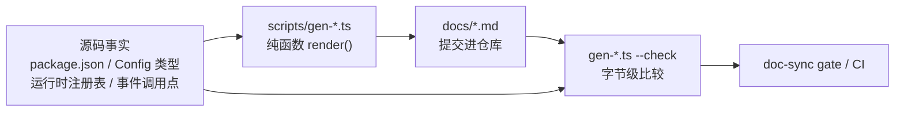

# 第 40 章 文档即工程：生成式目录、i18n 流水线与 postmortem

大多数仓库的文档是「写完就开始腐烂」的一次性产物。DeepSeek Harness 反过来，把文档当成一等工程产物来对待：能从源码推导的目录一律由脚本生成、由 CI 校验新鲜度；不能推导的双语文档用 git blob hash 加结构签名锁成「配对契约」；连失败经验也被固化成有准入标准、必须链接护栏的 postmortem。这一章带你读 `scripts/gen-*.ts` 与 translation-pairing 这套流水线的源码，看一个 50+ 包的 monorepo 如何让文档跟代码一样有「编译错误」。

## 问题背景

如果你维护过一个多包仓库的文档，大概率经历过这几种腐烂方式：

1. **目录类文档漂移**。「模块依赖图」「配置项一览」「事件生产者/消费者矩阵」这类文档，本质是源码某个切面的投影。手写一次不难，难的是每次改代码都记得同步——三个月后它就变成了误导新人的旧地图。
2. **翻译失同步**。中英双语文档如果靠自觉维护，改了英文忘了中文是常态；更糟的是没人说得清「中文版对应英文版的哪个历史状态」，想补翻都找不到基线。
3. **教训蒸发**。踩过的坑写在 PR 评论里、聊天记录里，半年后同一个坑换个人再踩一遍。

朴素解法各有陷阱：目录文档改成「运行时看代码，别写文档」会牺牲可发现性；翻译走独立 l10n 仓库会让两边的 review 彻底脱节；postmortem 没有准入标准就会退化成流水账。这个仓库对三个问题分别给出了机械化的答案，而且共享同一个骨架：**把「一致性」定义成可计算的谓词，放进 CI gate**。

## 源码剖析

### 生成式目录：每个 gen 脚本同时是 verify 脚本

`docs/` 下的 `module-graph.md`、`tool-catalog.md`、`config-catalog.md`、`event-producer-consumer.md`、`persistence-catalog.md` 等页面开头都有一行 `<!-- Generated by scripts/gen-*.ts — do not edit by hand -->`。对应的生成脚本全部遵循同一个模式，以最小的 `gen-module-graph.ts` 为例：

```ts
// scripts/gen-module-graph.ts
const content = render(collectPackageGraph(root, GROUP_ORDER, 'gen-module-graph'))

if (process.argv.includes('--check')) {
  let committed: string | null = null
  try {
    committed = readFileSync(resolve(root, OUT), 'utf8')
  } catch {
    // ...
    committed = null
  }
  if (committed === content) {
    console.log(`gen-module-graph: ${OUT} is up to date.`)
    process.exit(0)
  }
  console.error(`gen-module-graph: ${OUT} is stale. Run \`pnpm run gen-module-graph\` and commit ${OUT}.`)
  process.exit(1)
}

writeFileSync(resolve(root, OUT), content)
```

关键在 `render()` 是**纯函数、确定性输出**：同一份源码永远渲染出同一串字节。于是「文档是否新鲜」退化成一次字符串比较——`package.json` 里每个 `gen-X` 都配了一个 `verify-X`（即 `gen-X --check`），后者挂进 `doc-sync` gate（`pnpm run doc-sync`，由 `scripts/run-gates.ts` 聚合调度）和 CI。改了 `peerDependencies` 却没重新生成模块图？CI 直接红。

各生成器的取材方式值得对比，因为它们代表了三种不同的「事实来源」：

- **`gen-module-graph.ts`（119 行）**：从各包 `package.json` 的 `peerDependencies` 提取边——脚本注释明确说这是「the canonical runtime edges」（还记得[第 2 章](../part1/02-repo-tour.md)讲的 peer-dependency 约定吗），渲染成 mermaid 分组图加依赖表。
- **`gen-config-catalog.ts`（880 行）**：用 TypeScript Compiler API 解析每个包的入口文件，把 `Config` 类型声明连同 JSDoc **原文粘贴**进目录，再和运行时的 Schemastery schema 做交叉验证——「every enumerable schema path must exist on the declared config type」。它对未知类型名的态度是硬错误：

```ts
// scripts/gen-config-catalog.ts
/** TypeScript/Node global type names a config declaration may reference
 * without importing; never treated as unresolved. Extend when a new global
 * legitimately appears — the generator hard-errors on unknown names, so an
 * omission is loud, not silent. */
const GLOBAL_TYPES = new Set([
  'Array', 'ReadonlyArray', 'Record', 'Partial', 'Required', // ...
])
```

- **`gen-tool-catalog.ts`（759 行）**：最激进——它不解析源码，而是**真的把每个 tool 插件 boot 起来**，从运行时注册表里收割 schema：「Runtime registration is the source of truth for computed schemas」。为了让条件注册的工具（如依赖 attachment 能力的 `read_image`）也能被采集，它注入一个只为「让插件肯挂载」而存在的打桩 seam，所有真实操作路径都故意 reject：

```ts
// scripts/gen-tool-catalog.ts
/** Attachment seam marker that makes the attachments-conditional `read_image` schema harvestable. */
class CatalogAttachmentStore extends AttachmentStore {
  readonly imageLimits: ImageAttachmentLimits = Object.freeze({
    maxImageBytes: 1,
    // ...
  })

  override saveImage(_input: SaveImageAttachment): Promise<ImageAttachmentRef> {
    return Promise.reject(new Error('gen-tool-catalog: attachment writes are unreachable during schema harvest'))
  }
  // ...
}
```

- **`gen-doc-graphs.ts`（1461 行）**：站在前几个目录之上生成「关系层」，包括 `event-producer-consumer.md`——它构建 ts.Program，追踪 `on/once/emit/parallel/serial/waterfall/dispatch` 这些调用点的**接收者类型**（是 `Context`、`AgentEventDispatch` 还是 events service），从而区分谁在派发、谁在监听哪个事件，产出[第 5 章](../part2/05-typed-events.md)分析过的那张事件矩阵。

`docs/graph-atlas.md` 本身也是生成物：一张「图索引」，列出每张图的维护模式——`generated`（全自动）、`hybrid generated`（源码可推导的部分自动生成，策略性内容来自 manifest）、`curated`（人写）。混合模式依赖一套「生成区域」语法（下文 i18n 部分会看到它的解析器）：人写的文档里用 `<!-- BEGIN GENERATED <slug> -->` / `<!-- END GENERATED <slug> -->` 圈出机器管辖区，生成器只重写标记内的字节。

整条流水线可以画成一张图：



### i18n 流水线：把「翻译同步」变成可计算谓词

仓库里几乎每份文档都是三个兄弟文件：`foo.md`、`foo.zh.md`、`foo.i18n.yaml`。第三个文件是「配对一致性记录」，由 `scripts/translation-pairing.ts` 定义读写：

```ts
// scripts/translation-pairing.ts
export function renderPairMeta(source: string, sourceHash: string, zh: string, zhHash: string): string {
  return [
    '# Bilingual-pair consistency record (docs/i18n/README.md): the git blob hash of each',
    '# side as of the last confirmed-consistent state. Both languages carry equal authority;',
    // ...
    `${basename(source)}: ${sourceHash}`,
    `${basename(zh)}: ${zhHash}`,
    '',
  ].join('\n')
}
```

记录的是两侧文件的 **git blob hash**（`blobHash()` 手工实现了 `git hash-object` 的 `blob <len>\0` 前缀算法），而不是 commit hash。这个选择很讲究：blob hash 是纯内容函数，同一个 PR 里刚编辑、还没提交的文件也能算；而且按 `docs/i18n/README.md` 的说明，`--write` 时会把快照 blob 固定在 `refs/dsh/translation-pairing/snapshots/` 引用下，防止 GC 回收——记录的 hash 因此永远能还原「上一次确认一致时」两侧的精确文本，失同步的 pair 可以拿编辑侧的 diff 对着基线做最小补丁，而不是整篇重翻（`gen-translation-brief.ts` 进一步把这个补丁装配自动化了）。

`verify-translation-pairing`（`doc-sync` 的一环）检查三件事：pair 三文件齐全、两侧当前 blob hash 等于记录值（改了任何一侧不重新确认就红）、以及**结构签名**逐项相等。结构签名用 mdast 解析两侧 Markdown 后提取：

```ts
// scripts/translation-pairing.ts
/** The structural signature compared between the two sides of a pair. */
export interface TranslationStructureSignature {
  /** Heading depths in document order (h2 -> 2). */
  headings: number[]
  /** Fenced code blocks verbatim: info string plus content, in order. */
  code: string[]
  /** Row and column count of each table, in order. */
  tables: string[]
  /** Kind, ordered-list start, and direct item count of each list, in order. */
  lists: string[]
  /** Every link target in order; the language switcher is excluded. */
  links: string[]
}
```

标题层级序列、**逐字节相等的代码块**、表格行列数、列表形态、链接目标——这些是翻译不该动的骨架。骨架相等不能证明两边「说的是同一件事」，`docs/i18n/README.md` 把这个边界讲得很直白：「a green gate means the pair was confirmed consistent at these exact contents, not that the confirmation was sound」——hash 与结构是机械下界，语义忠实度归 reviewer 管。诚实标注工具的能力边界，本身就是一种工程品味。

重新确认一致（`--write`）的 CLI 参数校验里还藏着一个防御细节：

```ts
// scripts/translation-pairing.ts — parseTranslationPairingCliArgs()
if (writeMode) {
  if (anchors.length > 0 && allMode) throw new Error('--write takes either pair paths or --all, not both')
  if (anchors.length === 0 && !allMode) {
    throw new Error('--write requires the pair(s) you confirmed (any file of a pair), or --all to re-record every '
      + 'complete pair; recording pairs you did not review blesses unconfirmed content')
  }
  // ...
}
```

裸 `--write` 是非法的：它会把全仓库所有漂移的 pair 一次性「祝福」成一致，包括你根本没看过的。要么点名你确认过的 pair，要么显式 `--all`——错误信息直接把理由写给你看。这与[第 39 章](39-invariants-and-defensive-patterns.md)的 invariant 文化一脉相承：危险的默认行为不该存在。

生成式文档与 i18n 两条流水线在 `partitionGeneratedRegions()` 处交汇——它把文档切成「生成区域」与「人写内容」，配对守卫只对后者较真；同一文件里的区域标记语法有完整的错误分类（嵌套 BEGIN、无主 END、slug 不匹配、疑似标记但格式不对，全部抛错）。生成的英文源还被豁免语言切换链接（`requiresSourceLanguageSwitcher()` 里那张显式清单），因为在生成物里手加一行链接会让生成器立刻判定文档过期——两个 gate 互相咬合时，豁免规则必须精确到文件。

### postmortem：有准入标准的复盘

`docs/postmortem/` 目前有四篇编号复盘。README 先划清它和 Agent Note 的边界——后者记录「深思熟虑的设计决策及被否掉的备选」，前者记录「一个 bug 为什么能穿过所有防线」——然后给出三条准入标准：**subtle**（机制不显然，换个细心工程师也得重新硬啃）、**systemic**（逃逸原因是测试/工具/惯例的缺口，不是一次性笔误）、**costly to rediscover**（真烧了调试时间，还会再烧）。每篇必须以 30 秒能读完的 Executive summary 开头，且必须链接它推动新增的护栏。

以 0002 为例（《Filesystem snapshot tools were permanently disabled》）：ACP 示例想用 `disabled: !!js ...` 表达式按条件启用文件系统插件，但 Cordis 只在插件的 `config` 字段内求值 `!!js` 表达式——`Entry._resolveConfig()` 插值 config，而 `Entry.disabled` 直接测试未插值的原始值。一个表达式对象永远为真，于是文件系统栈**在所有模式下都被禁用**。更微妙的是第二层失败：快照刷新把 `UNKNOWN_TOOL` 错误当成新的期望输出写进了 fixture，测试全绿——「它证明的是对回归的确定性重放，而不是文件系统行为正确」。复盘落地的护栏每条都可执行：`verify-cordis-config` 从此拒绝 Loader entry 元数据里出现表达式节点；快照框架从此在新跑和已提交 fixture 里都拒绝结构化的 `UNKNOWN_TOOL` 结果；教训被总结成一句可复用的判断——「A snapshot refresh is fixture production, not correctness review」。

0003（Web agent 验证了一个替身 server 而不是托管自己会话的 GUI）同样符合三条标准：反馈回路指错对象这种错，逃逸原因是流程性的。四篇的共同点是：结尾的 Guardrails 小节列出的不是「下次注意」，而是新增的断言、gate 和文档规则的链接——复盘的产出是仓库里可 grep 到的工件。

### rescope.md：一份由脚本背书的映射文档

`docs/rescope.md` 回答「vendored 的 Cordis 全家为什么以 `@deepseek-ai` scope 发布、名字怎么映射」（背景见[第 42 章](42-vendoring.md)）。它有趣的地方是文档与脚本的权责划分：页面只是映射表的**投影**，「`scripts/rescope-vendor.ts` owns the mapping above and performs the rename, so no reference is renamed by hand」——`pnpm run rescope-vendor` 报告将改动什么，`--apply` 执行重命名，`--apply --reverse` 可逆地退回上游名字，`rescope-vendor:check` 在 hygiene gate 里断言重命名后状态。文档里那张「什么不改」的清单（目录名、版本号、`cordis:` 协议前缀、`cordis.yml` 配置族、含 cordis 字样的自家包名……）不是给人背的规范，而是脚本行为的说明书。决策本身及其被否掉的备选则住在 Agent Note 里——文档、决策记录、执行脚本三者各归其位。

## 设计亮点

> 💎 **设计亮点：gen 与 verify 是同一个脚本的两种心情。** 普通做法是「生成脚本 + 一篇祈祷大家记得跑的 CONTRIBUTING 说明」。这里每个生成器的 `--check` 模式把同一个纯函数 `render()` 的输出和已提交文件做字节比较，挂进 CI——文档漂移从「社会问题」变成「构建失败」。代价只是要求渲染确定性（分组排序、稳定 tie-break），而这本来就是好习惯。

> 💎 **设计亮点：tool-catalog 用「boot 真插件 + 故意 reject 的打桩 seam」收割运行时 schema。** 换成解析源码猜 schema，任何计算出来的 schema（条件字段、组合 schema）都会猜错。`gen-tool-catalog.ts` 直接把插件树挂载起来读注册表，让「运行时注册」这个唯一事实来源同时喂养模型和文档；`CatalogAttachmentStore` 之类的桩只提供「让消费者肯挂载」的能力声明，所有实际操作路径都 reject——采集器绝无可能意外执行真实 IO。

> 💎 **设计亮点：用 blob hash + 结构签名给「翻译一致」下机械下界，并诚实声明上界归人。** blob hash 让基线可还原（快照还 pin 在专用 ref 下防 GC），结构签名让骨架漂移必被抓住，而 `--write` 拒绝不点名的批量祝福。最难得的是文档明说 gate 检查不了语义忠实度——工具划清自己的能力边界，reviewer 才知道自己还剩多少责任。

> 💎 **设计亮点：postmortem 的产出物是护栏链接，不是感想。** 三条准入标准（subtle / systemic / costly）过滤掉流水账，「每篇必须链接它推动的 guardrail」把复盘闭环成仓库里可验证的断言——0002 的教训直接物化为 `verify-cordis-config` 的一条拒绝规则和快照框架的一条语义断言。

## 小结与延伸

这一章看到的其实是同一个思想在三个领域的实例化：凡是能定义成可计算谓词的一致性——文档对源码、中文对英文、教训对护栏——就写成脚本挂进 gate，剩下真正需要人类判断的部分（策略性图注、翻译语感、复盘深度）才交给 review。文档因此获得了和代码同等的待遇：会过期的东西有编译错误，不会过期的东西有明确的 owner。下一章[Monorepo 工具链](41-monorepo-toolchain.md)会看到承载这些 gate 的更底层设施。

**阅读清单**：

- `scripts/gen-module-graph.ts` — 119 行，读懂 gen/check 骨架的最小样本
- `scripts/gen-tool-catalog.ts` 与 `scripts/gen-config-catalog.ts` — 两种事实来源（运行时注册 vs 类型声明）的对照
- `scripts/gen-doc-graphs.ts` — 事件矩阵的 AST 提取与 hybrid 模式
- `scripts/translation-pairing.ts` + `docs/i18n/README.md` — 配对契约的定义与实现
- `docs/postmortem/README.md` 及 0001–0004 — 复盘写作标准与四个实例
- `docs/rescope.md`、`docs/graph-atlas.md` — 文档、脚本、决策记录三分权责的样本
