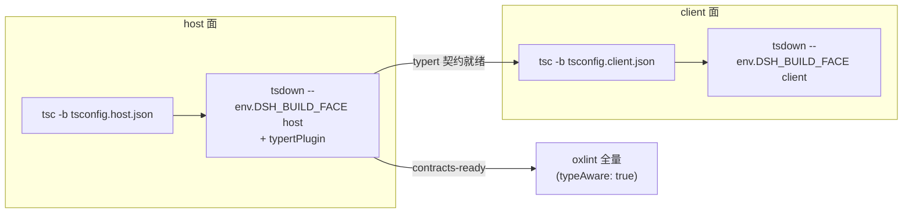

# 第 41 章 Monorepo 工具链：tsconfig 分层、knip、oxlint、lefthook

DeepSeek Harness 的 `packages/` 下有 219 个包，加上 `vendor/` 里 12 个 vendored 框架包、`apps/`、`native/`、`website/`，一次 `pnpm install` 要装起 230 多个 workspace 成员。这一章讲支撑这个规模的工具链组合拳：tsconfig 如何拆成 host/client 两个编译面、oxlint 如何做到"提交时秒级、CI 时全量类型感知"、lefthook 钩子如何选择"重新生成而不是拒绝提交"、pnpm-workspace.yaml 如何把供应链防御写成配置。读完你会发现：这套工具链的每一个文件都不是模板抄来的默认配置，而是带着注释说明"为什么必须这样"的工程决策记录。

## 问题背景

如果你自己维护一个 200+ 包的 TypeScript monorepo，朴素做法大概是：一个根 `tsconfig.json` 用 `paths` 别名把所有包映射到源码，`tsc --noEmit` 全量检查；ESLint 挂在 pre-commit 上跑全仓库；构建用每个包各自的 `tsc -p`。

这条路会在三个地方撞墙：

1. **类型全局污染**。Harness 的插件框架 Cordis 靠 declaration merging 扩展 `Context`（见[第 4 章](../part2/04-context-and-service.md)）：host 侧和 client 侧的包在**同一个接口的同一批 key** 上合并了**不同的 service 类型**（比如 `sessions`、`loader` 在服务端和浏览器端是两套实现）。只要它们进了同一个 `ts.Program`，两侧的类型声明就会互相污染——不是报错，而是悄悄合并出一个两边都不对的类型。这类错误 `tsc` 根本查不出来。
2. **检查速度失控**。类型感知的 lint 规则（`no-floating-promises` 这类）需要完整类型信息，全仓库跑一次是分钟级。挂在 pre-commit 上，开发者第二天就会 `--no-verify`。
3. **死代码和重复代码无人认领**。200 个包里删一个导出，没人知道还有没有消费者；复制粘贴的代码散在各处，review 时肉眼根本看不出来。

Harness 的答案是一套分层的工具矩阵：每类问题一个专职工具，每个工具一份带理由注释的配置，本地钩子只做快的事，CI 拥有全量矩阵。

## 源码剖析

### tsconfig：一个 solution file，两个编译面

仓库根有五个 tsconfig，职责严格分层。入口 `tsconfig.json` 全文如下：

```jsonc
// tsconfig.json
{
  // Solution file: the whole-repo graph for `tsc -b tsconfig.json` and the
  // tsserver entry. `extends` carries the base paths for get-tsconfig
  // consumers — tsx running examples/ and scripts/ (no nearer tsconfig)
  // resolves workspace imports through this file. `files: []` keeps it
  // program-less, so the host/client cordis Context merges never meet.
  // NEVER add include/files entries, and NEVER flatten this solution into a
  // single ts.Program (scripts seed tsconfig.host.json or tsconfig.client.json).
  "extends": "./tsconfig.base.json",
  "files": [],
  "references": [
    { "path": "./tsconfig.host.json" },
    { "path": "./tsconfig.client.json" }
  ]
}
```

注释直接把不变量写死在配置里：这个文件必须是 program-less 的（`files: []`），只做两件事——给 tsserver 和 `tsc -b` 提供全仓库图，给 `tsx` 跑 `scripts/`、`examples/` 时提供 `paths` 解析。**绝对不能**把 include 加进来，否则 host/client 两侧的 Context merge 就会在同一个 program 里相遇。

`tsconfig.host.json` 和 `tsconfig.client.json` 是两个平行的检查聚合（aggregate）。host 侧的头注释说得很直白：

```jsonc
// tsconfig.host.json
{
  // Host aggregate (one of the two check units; see tsconfig.json). packages/client
  // type-checks in tsconfig.client.json: the two sides merge cordis Context under
  // the same keys, one program cannot see both.
  "extends": "./tsconfig.base.json",
  // ...
  "exclude": [
    "packages/client/*/src/**",
    "packages/*/*/tests/**/*.client.ts",
    // ...
  ]
}
```

两个聚合怎么划界？靠文件名后缀约定：`packages/client` 之外的包如果有面向浏览器的测试，命名为 `*.client.spec.ts`，归 client 聚合；client 包里覆盖 host 半边的测试命名为 `*.host.spec.ts`，归 host 聚合。两个后缀互斥，所以各自 exclude 对方的后缀即可，include 里的宽 glob 不需要逐文件维护。

`tsconfig.base.json` 是所有配置的公共底座，同时兼任 vitest 的解析门面（vitest 配置通过 `vite-tsconfig-paths` 指向它）。它最重的部分是 `paths`——把每个 `@deepseek-ai/dsh-*` 包名映射到**源码**而非构建产物，其中有一段很讲究的通配符设计：

```jsonc
// tsconfig.base.json（paths 节选）
{
  "compilerOptions": {
    "strict": true,
    "noUncheckedIndexedAccess": true,
    "exactOptionalPropertyTypes": true,
    // ...
    "paths": {
      "@deepseek-ai/cordis": ["./vendor/cordis/src"],
      // ...
      "@deepseek-ai/dsh-*/invariant": [
        "./packages/core/*/src/invariant.ts",
        "./packages/prompt/*/src/invariant.ts",
        // ... 40 余个包组逐一列出
      ],
      // host/client package names prefix the group dir (dsh-client-<dir>), so
      // the generic dsh-*/invariant list above cannot map them; strip the
      // group prefix with a dedicated wildcard per group instead.
      "@deepseek-ai/dsh-host-*/invariant": ["./packages/host/*/src/invariant.ts"],
      "@deepseek-ai/dsh-client-*/invariant": ["./packages/client/*/src/invariant.ts"]
    }
  }
}
```

`dsh-*/invariant` 一条通配映射覆盖了所有包的 invariant 子入口（[第 39 章](39-invariants-and-defensive-patterns.md)的主角）；因为包目录名在各组之间唯一，first-on-disk-wins 的解析不会歧义——新增包时**不需要**改这个文件。而项目引用（references）没有通配符形式，所以 host/client 两个聚合里的引用列表仍是显式维护的。

`tsconfig.base.client.json` 则只有 11 行：在 base 之上换掉 `jsx`、`lib`（加 DOM）、清空 `types`（去掉 node 环境类型）。client 聚合和每个 `packages/client/*` 包都从它继承——浏览器代码里 `process.env` 直接编译不过。

构建同样按"面"（face）分两趟跑，`package.json` 里的脚本串出了完整流程：

```jsonc
// package.json（scripts 节选）
{
  "build:lib": "npm run build:lib:host && npm run build:lib:client",
  "build:lib:host": "tsc -b tsconfig.host.json && tsdown --env.DSH_BUILD_FACE host",
  "build:lib:client": "tsc -b tsconfig.client.json && tsdown --env.DSH_BUILD_FACE client",
  "typecheck": "npm run build:lib:host && npm run typecheck:contracts-ready",
  "typecheck:contracts-ready": "tsc -b tsconfig.client.json",
  "lint": "npm run build:lib:host && npm run lint:contracts-ready",
  "lint:contracts-ready": "tsx scripts/run-oxlint.ts ."
}
```

注意 `typecheck` 和 `lint` 都先跑 `build:lib:host`：host 构建会驱动 typert 生成类型契约（见 `tsdown.config.ts` 的 `typertPlugin`），后半段的 `*-contracts-ready` 命名明说了自己的前置假设——契约已就绪。`tsdown.config.ts` 只有 30 行，却把两个面的差异说清楚了：

```ts
// tsdown.config.ts
export default defineConfig(({ env }) => {
  const client = isBuildFaceClient(env?.DSH_BUILD_FACE)
  return {
    workspace: ['vendor/*', 'packages/*/*', 'apps/cli'],
    entry: client ? '' : ['lib/types/{index,invariant,startup}.js'],
    // ...
    plugins: client ? [] : [typertPlugin({ mode: 'workspace', faces: ['host'] })],
  }
})
```

host 面的 tsdown **不从 `src/` 打包**，而是消费 `tsc -b` 已经发射到 `lib/types/` 的 JavaScript，再叠加 typert 插件；client 面则交给各包自己的 config 去发射浏览器产物。整体流水线如下：



### oxlint：全量类型感知 + staged 快速档

lint 用的是 oxlint（Rust 实现）配 `oxlint-tsgolint`（Go 实现的类型感知后端）。`.oxlintrc.json` 的第一手是把默认规则集整个关掉，然后手工挑选每一条：

```jsonc
// .oxlintrc.json（节选）
{
  "categories": { "correctness": "off" },
  "options": { "typeAware": true },
  "overrides": [
    {
      "rules": {
        "typescript/no-explicit-any": "error", // Every intentional any needs a narrow suppression with rationale.
        // Lost promises in the agent loop are the repository's highest-value linted bug class.
        "typescript/no-floating-promises": "error",
        "typescript/no-namespace": "off", // Cordis Config namespaces are the repository idiom.
        "no-void": "off", // void foo() marks deliberate fire-and-forget arrow listeners.
        // ...
      }
    }
  ]
}
```

每条非常规的开关都带一行理由：`no-floating-promises` 的注释直接标明这是"本仓库价值最高的可 lint bug 类别"——agent loop 里丢掉的 promise 意味着一次悄无声息的执行中断（回顾[第 12 章](../part3/12-cancellation-and-recovery.md)）；`no-namespace` 关掉是因为 Cordis 的 `Config` namespace 是仓库惯用法。测试文件另有一组 override 放宽（`no-non-null-assertion` off，理由是"断言通常跟在证明了存在性的 expect() 后面"）。

`.oxlintrc.staged.json` 是给 pre-commit 用的变体，核心就一行：

```jsonc
// .oxlintrc.staged.json
{
  "extends": ["./.oxlintrc.json"],
  "options": { "typeAware": false },
  // ...
}
```

`typeAware: false` 一举解决两个问题：类型感知需要完整的 `ts.Program` 和已生成的 typert 契约，staged 场景既没时间构建、也只有零散几个文件根本组不出 program。于是同一套规则表分成两档——提交时跑语法层规则（毫秒级、还能 `--fix` 自动修复），CI 里跑全量类型感知。包一层的 `scripts/run-oxlint.ts` 还顺手把并发度环境变量同时喂给两个后端：`--threads` 给 Rust 侧、`GOMAXPROCS` 给 Go 侧的 tsgolint。

### lefthook：本地钩子只做快的事

`lefthook.yml` 开头第一句注释就是本地/CI 的分界宣言："Keep these local checkpoints fast; CI owns the full repository-wide gate matrix"：

```yaml
# lefthook.yml（节选）
pre-commit:
  jobs:
    - name: lint (staged)
      glob: '*.{ts,tsx,mts,cts,mjs}'
      exclude:
        - 'vendor/*/src/**'
      run: node_modules/.bin/tsx scripts/run-oxlint.ts --config .oxlintrc.staged.json --fix --no-error-on-unmatched-pattern {staged_files}
      stage_fixed: true

    # Regenerate rather than reject: a dependency edit that forgot the notices
    # would otherwise fail the test lane long after the commit. ...
    - name: third-party notices (staged)
      glob: '{package.json,*/package.json,...,pnpm-lock.yaml,vendor/README.md,...}'
      run: node_modules/.bin/tsx scripts/gen-third-party-notices.ts && git add THIRD_PARTY_NOTICES.md

    - name: vendor manifest guard
      run: scripts/check-vendor-manifest.sh

pre-push:
  jobs:
    - name: typecheck
      run: pnpm run typecheck
```

三个细节值得停下来看。第一，staged lint 带 `--fix` 且 `stage_fixed: true`——修完自动重新 stage，开发者感知不到格式问题的存在。第二，third-party notices 这个钩子的策略是**重新生成而不是拒绝**：改了依赖忘了更新 NOTICES，普通做法是钩子报错让你手工跑命令；这里直接跑生成器然后 `git add`，把正确状态塞进这次提交。注释甚至标明了这个方案的已知盲区——删除 manifest 文件不会触发 glob（lefthook 只检查磁盘上存在的文件），这个 case 由测试 lane 里的新鲜度断言兜底。第三，全量 `typecheck` 放在 pre-push 而不是 pre-commit：提交要快，推送前才值得等一次两个面的 `tsc -b`。

### knip、jscpd 与 pnpm-workspace：各管一段

**knip**（死代码检查）的配置有 787 行，绝大部分是逐 workspace 声明 entry/project glob。根部的几行划出了它和别的工具的边界：

```jsonc
// knip.json（节选）
{
  "exclude": ["duplicates"],
  "ignoreWorkspaces": ["vendor/*", "python/sdk-runtime"],
  "workspaces": {
    "examples": {
      "entry": [
        "headless-agent/tests/fixtures/cli-mock-llm.ts",
        // ... 逐个列出测试 fixture 入口
        "*/tests/**/*.e2e.ts"
      ]
    }
    // ...
  }
}
```

`exclude: ["duplicates"]` 是因为重复检查归 jscpd 管；`vendor/*` 整体忽略是因为 vendored 源码保持上游习惯（见[第 42 章](42-vendoring.md)）。测试 fixture 逐个登记为 entry 最能说明 knip 在这种仓库里的难点：fixture 是被测试用子进程拉起的，静态分析看不到引用边，不登记就会被误报为死代码。CI 里跑的是 `knip --treat-config-hints-as-errors`——连配置本身的冗余（比如某条 ignore 已经没用了）也是错误。

**jscpd**（重复度）只有 16 行，`minTokens: 60` / `mode: "mild"`，忽略 `**/tests/**`，`exitCode: 1` 让它成为硬门禁。它和 oxlint 里的 `sonarjs/no-identical-functions` 形成两层：前者跨文件找大段复制，后者在单文件内抓相同函数。

**pnpm-workspace.yaml** 承担的角色远超"列出包路径"，它是这个仓库的供应链策略文件：

```yaml
# pnpm-workspace.yaml（节选）
linkWorkspacePackages: true
overrides:
  '@deepseek-ai/cosmokit': 'link:vendor/cosmokit'
  '@deepseek-ai/schemastery': 'link:vendor/schemastery'

# pnpm 10+ blocks any dependency shipping an install/build script until it is
# explicitly reviewed here ... we deny by default and only allow scripts we need.
allowBuilds:
  esbuild: true
  lefthook: true
  node-pty: true
  '@google/genai': false     # 生命周期脚本是 no-op，直接拒绝，安装仍成功
  # ...
minimumReleaseAgeExclude:
  - '@earendil-works/pi-ai@0.82.1'   # 新发布本身就是要拿的模型目录更新
  # ...
patchedDependencies:
  node-pty@1.1.0: patches/node-pty@1.1.0.patch
```

`allowBuilds` 是 deny-by-default 的安装脚本审查清单：任何带 install script 的依赖必须在这里登记为 true（真的需要，如 esbuild 的原生二进制）或 false（明确拒绝但不阻断安装），每条都带理由注释。`minimumReleaseAge` 是"新发布的包先冷却一段时间再装"的供应链防御，而 exclude 列表记录了哪些包必须豁免及原因。最后的 `patchedDependencies` 指向 `patches/` 目录里唯一一份补丁——node-pty 的 spawn-helper 路径解析补丁，让单可执行文件（single-exe）分发场景下 helper 能从 `process.execPath` 旁边找到，这是上游没有的能力，用 pnpm patch 而不是 fork 整个包来解决。

以上所有检查最终都由 `scripts/run-gates.ts`（890 行）聚合成命名的门禁集：`check-all`（本地全量）、`ci-primary`、`ci-static`、`doc-sync` 等 14 个模式，还内置了并发策略——本地模式把 worker 上限压到 4，因为多个文档门禁各自会构建完整的 `ts.Program`，不设限会在大内存机器上换来 OOM。`scripts/check-workspace-constraints.ts` 则专门检查 workspace 结构不变量：包目录布局、发布 payload 白名单、repository 字段指向等。

## 设计亮点

> 💎 **设计亮点：用 solution file 把 declaration merging 关进两个隔离的 program**
> 普通 monorepo 一个根 program 全量检查就够了；但 Cordis 的 declaration merging 让 host/client 在同一接口 key 上合并不同类型，同一 program 里两侧会静默互相污染。Harness 的解法是让根 `tsconfig.json` 保持 program-less（`files: []`），host/client 各成聚合，共享的叶子包只编译一次、被两个 program 通过 references 复用。用文件名后缀（`*.client.spec.ts` / `*.host.spec.ts`）互斥划界，让宽 glob 不需要逐文件维护。这是"类型系统特性反过来约束构建拓扑"的少见案例。

> 💎 **设计亮点：同一份规则表的快慢两档**
> lint 的矛盾在于：最有价值的规则（`no-floating-promises`）必须类型感知，而类型感知在 pre-commit 里等不起。`.oxlintrc.staged.json` 用一行 `"typeAware": false` 继承同一份规则表并降档，配合 lefthook 的 `--fix` + `stage_fixed`，提交时的 lint 既快又自动修复；全量类型感知档由 `lint:contracts-ready` 在 typert 契约构建完成后跑。换普通写法——维护两份独立的 lint 配置——两档规则很快就会漂移。

> 💎 **设计亮点：钩子"重新生成而不是拒绝"**
> THIRD_PARTY_NOTICES 钩子不报错，而是直接跑生成器并 `git add` 结果，把提交修成正确状态。更难得的是注释诚实标注了方案边界：删除 manifest 不触发 glob，这个盲区交给测试 lane 的新鲜度断言兜底。生成式产物的一致性检查普遍适合这个模式（对比[第 40 章](40-docs-as-engineering.md)里 `gen-*.ts --check` 的 CI 侧用法：本地生成、CI 校验）。

> 💎 **设计亮点：把供应链策略写进 pnpm-workspace.yaml**
> `allowBuilds` 对安装脚本 deny-by-default、逐包登记理由；`minimumReleaseAge` 给新版本设冷却期、豁免必须列明原因；vendored 包用 `overrides: link:` 强制本地解析。供应链防御通常散落在 CI 脚本和口头约定里，这里全部收敛为一份声明式、带注释、可 review 的 manifest。

## 小结与延伸

这套工具链的共同气质是：**每份配置都是决策记录**——tsconfig 注释里写着"NEVER add include/files"，oxlint 每条非默认规则带理由，lefthook 注释标明兜底路径，pnpm-workspace 每个例外说明动机。工具各管一段（tsc 管类型面、oxlint 管规则、knip 管死代码、jscpd 管重复、lefthook 管本地节奏、run-gates 管聚合），没有一个万能工具，但边界清晰到新人改错地方会被最近的那个门禁拦下。对照[第 2 章](../part1/02-repo-tour.md)的仓库导览重读这些配置，会看到目录结构和工具约定是互相成就的。

延伸阅读：

- `tsconfig.json` / `tsconfig.base.json` / `tsconfig.host.json` / `tsconfig.client.json` / `tsconfig.base.client.json` — 五层注释本身就是最好的文档
- `scripts/run-gates.ts` — 14 种门禁聚合模式与并发策略
- `scripts/check-workspace-constraints.ts` — workspace 结构不变量
- `docs/development.md` — 官方的开发环境与门禁说明
- `pnpm-workspace.yaml` 与 `patches/node-pty@1.1.0.patch` — 供应链策略与最小补丁实践
- [第 42 章](42-vendoring.md) — vendor/ 目录为什么存在，`overrides: link:` 的另一半故事
