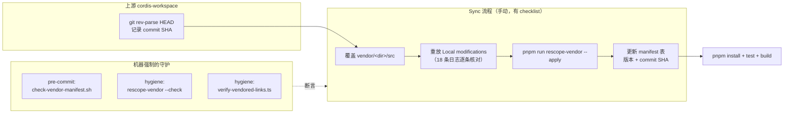

# 第 42 章 Vendoring：为什么把 Cordis 整个搬进仓库

打开仓库根目录，你会看到一个不太常见的 `vendor/` 目录：Cordis 框架核心和它的基础库（cosmokit、schemastery）以及六个官方插件，共九个包，源码整个复制进了 monorepo，而不是写进 `package.json` 从 npm 安装。本书第二部分四章讲的 `Context`、`Fiber`、事件系统，读的全是这份 vendored 源码。这一章回答三个问题：为什么要这么做、这套 vendoring 是怎么在工程上「守住」的（manifest 契约、pre-commit 钩子、lockfile 校验、rescope codemod）、以及这个决策的真实代价。它是全书讲的最后一个子系统，却可能是最能体现这个仓库工程文化的一个——因为 vendoring 最容易烂尾，而这里把每一个烂尾路径都堵上了。

## 问题背景

假设你在造一个 agent harness，底座选了一个第三方插件框架。朴素做法是 `pnpm add cordis`，像依赖 lodash 一样依赖它。这在大多数项目里没问题，但这里有三个致命麻烦：

第一，**上游还在 RC**。仓库启动时 Cordis core 停在 `4.0.0-rc.6`——release candidate 意味着 API 和内部行为都可能在下一个小版本变掉。而 harness 不是浅层使用者：agent loop 的取消语义靠 fiber 生命周期（[第 12 章](../part3/12-cancellation-and-recovery.md)）、可逆副作用靠 effect disposal（[第 6 章](../part2/06-reversible-effects.md)）、工具流水线靠 waterfall 派发的精确顺序（[第 19 章](../part5/19-tool-pipeline.md)）。这些**正确性保证建立在框架内部行为之上**，一次上游 RC 升级就可能悄悄破坏它们，而你没有本地修复通道。

第二，**你会需要改框架**。深度使用一个 RC 期框架，早晚撞上框架自己的 bug。走 npm 依赖时你的选择是：提 PR 等合并（周级延迟）、用 `patch-package`/pnpm patch 维护补丁（本仓库对 `node-pty` 就是这么干的，见 `patches/node-pty@1.1.0.patch`，但补丁只适合小改动）、或者 fork 发私有 npm 包（运维成本高且对读者不透明）。

第三，也是最隐蔽的：**vendoring 本身容易腐烂**。见过太多仓库里的 `vendor/` 目录：没人记得是从哪个 commit 复制的、改过哪些行、还能不能升级。复制进来的那一刻是自由，三年后是考古现场。

DeepSeek Harness 的答案是：只 vendor「内部行为攸关」的框架层，其余留在 npm；然后用一整套自动化把 vendoring 的纪律变成机器强制执行的契约。

## 源码剖析

### 决策记录：vendor 什么、不 vendor 什么

这个决策本身有存档（`.agents/notes/implemented/process/2026-06-11-vendor-cordis-as-source.md`），Alternatives considered 一节写得很清楚：

```markdown
<!-- .agents/notes/implemented/process/2026-06-11-vendor-cordis-as-source.md -->
## Alternatives considered

- **Depend on the npm packages** — rejected: core was at a release candidate, and
  the harness leans on framework internals (fiber lifecycle, effect disposal,
  waterfall dispatch) whose exact behavior the agent loop's correctness
  guarantees depend on; an upstream RC bump could break them without a local fix path.
- **Vendor everything transitively** — rejected: truly third-party dependencies
  (js-yaml, chokidar, @standard-schema/spec, …) stay on npm; only the framework
  layer whose internals matter is owned.
```

划界标准不是「重要不重要」，而是「**内部行为是否攸关正确性**」。chokidar 换个版本，文件监听照常工作；cordis 的 `fiber.ts` 换个版本，agent 取消时的清理顺序可能就变了。于是九个包进 `vendor/`：`cordis`（核心）、`cosmokit`（工具库）、`schemastery`（配置 schema）、`loader` / `include` / `group` / `timer` / `hmr` / `logger-console`（官方插件），它们的第三方依赖全部留在 npm。

### manifest：把「考古现场」变成账本

`vendor/README.md` 不是普通说明文档，它是一份**契约**，三个部分各司其职：

- **Manifest 表**：每个包一行——目录名、npm 名、上游名、版本、上游仓库、上游 commit SHA。任何人任何时候都能回答「这份代码是从哪来的」。
- **Local modifications 日志**：编号列出每一处对上游的偏离，写这一版时已有 **18 条**，从「删掉 hmr 的 locale YAML import」这样的小修剪，到「`cordis/src/fiber.ts` lifecycle hardening：修复三处可重入 dispose 的空洞」这样的深度修改。每条注明动机，多数还注明覆盖它的测试文件（如 `packages/boot/app-boot/tests/config-reload.spec.ts`）。
- **Sync procedure**：五步升级流程——记上游 commit、覆盖 `src/`、**逐条重放（或删除）Local modifications**、更新 manifest 表、跑 `pnpm install && pnpm run test && pnpm run build`。

其中第 11 条 modification 值得单独一看，它是「vendoring 让你能修上游修不到的 bug」的实证：`include/src/index.ts` 里上游在 patch 循环前一次性建好 id 索引，导致同一个 patch 列表里前面 `insert` 的条目后面的 patch 摸不到——本地改成边插入边索引，并把私有的 `applyPatches` 提取为导出的纯函数 `applyEntryPatches`，让 `dsh --dump-config` 能在不启动插件树的情况下复用同一份 patch 算法，「配置工具绝不重新实现（然后偏离）patch 算法」。这是 [第 7 章](../part2/07-profiles-and-bundles.md) 配置分层能可靠工作的地基。

### 钩子：忘写账本，commit 不过

日志靠自觉是守不住的，所以有 `scripts/check-vendor-manifest.sh`，挂在 `lefthook.yml` 的 pre-commit 上（[第 41 章](41-monorepo-toolchain.md)）：

```bash
# scripts/check-vendor-manifest.sh
# Vendoring discipline, mechanized: any staged change under vendor/*/src or a
# vendored bin.js must come with a vendor/README.md change in the same commit
set -euo pipefail

staged=$(git diff --cached --name-only)

vendor_src_changed=$(echo "$staged" | grep -E '^vendor/[^/]+/(src/|bin\.js)' || true)
manifest_changed=$(echo "$staged" | grep -x 'vendor/README.md' || true)

if [[ -n "$vendor_src_changed" && -z "$manifest_changed" ]]; then
  echo 'vendor manifest guard: vendored SOURCE changed without updating vendor/README.md:'
  echo "$vendor_src_changed" | sed 's/^/  /'
  echo 'Log the modification in vendor/README.md ("Local modifications") and stage it.'
  exit 1
fi
```

十几行 shell，守住的不变量却是整个 vendoring 方案的命门：**vendored 源码的每次改动必须与账本更新同 commit**。注释里那句 "Vendoring discipline, mechanized" 就是这个仓库的方法论——不写「请记得更新 README」的口号，直接让忘记的 commit 失败。这与 [第 39 章](39-invariants-and-defensive-patterns.md) 的 runtime invariant 是同一种思路在流程层的投影。

### 解析：同一个名字，绝不能有两份实现

vendored 包如何被 950+ 个源文件引用？靠 pnpm workspace 机制而不是路径 alias：

```yaml
# pnpm-workspace.yaml
packages:
  - vendor/*
  - packages/*/*
  # ...

# Vendored framework packages keep their upstream semver ranges, while local
# builds must resolve those matching names to this workspace's pinned sources.
linkWorkspacePackages: true

overrides:
  '@deepseek-ai/cosmokit': 'link:vendor/cosmokit'
  '@deepseek-ai/schemastery': 'link:vendor/schemastery'
```

`vendor/*` 是普通 workspace 成员，`linkWorkspacePackages: true` 让所有匹配的 semver range 解析到本地目录。这里潜伏着 vendoring 最阴险的失败模式：如果某个包名同时存在于 registry（比如上游发了新版本），一次不经意的 `pnpm install` 可能让部分依赖静默解析到 registry 副本——同一个进程里跑着**两份不同的框架**，`Symbol` 不相等、`instanceof` 失败、事件系统分叉，症状离病因十万八千里。于是 hygiene 门禁里有 `scripts/verify-vendored-links.ts`：

```typescript
// scripts/verify-vendored-links.ts
// Importer resolutions: every dependency entry naming a vendored package must
// resolve to a link:, or the build silently uses a registry copy.
for (const [importer, sections] of Object.entries(lockfile.importers ?? {})) {
  for (const [section, dependencies] of Object.entries(sections)) {
    // ...
    for (const [dependency, entry] of Object.entries(dependencies as Record<string, { version?: string }>)) {
      if (!names.has(dependency)) continue
      const version = entry.version ?? ''
      if (!version.startsWith('link:')) {
        violations.push(`${importer} ${section}.${dependency} resolves to ${JSON.stringify(version)} (expected link:)`)
      }
    }
  }
}

// Package/snapshot keys: a registry copy materializes as a `<name>@<version>`
// key; vendored names must never appear there at all.
for (const section of ['packages', 'snapshots'] as const) {
  for (const key of Object.keys(lockfile[section] ?? {})) {
    const atIndex = key.lastIndexOf('@')
    if (atIndex <= 0) continue
    const packageName = key.slice(0, atIndex)
    if (names.has(packageName)) violations.push(`${section} entry ${key} is a registry copy of a vendored package`)
  }
}
```

它直接解析 `pnpm-lock.yaml`，断言两件事：每个引用 vendored 名字的依赖项都解析为 `link:`；`packages` / `snapshots` 里**根本不出现** vendored 名字的 registry 条目。第二条是关键——它抓的不是「解析错了」，而是「registry 副本存在于 lockfile」这个更早期的信号。

### rescope：当 vendoring 遇上发布

2026 年 8 月出现了新问题（`.agents/notes/implemented/process/2026-08-10-vendor-package-rescope.md`）：harness 的包要发布到 registry，而每个 harness 包都把 `cordis` 声明为 peer dependency——发布 harness 就必须连框架层一起发布。用上游原名 `cordis`、`@cordisjs/plugin-*` 发布等于在 registry 上**抢注上游的名字**，在代理 npmjs 的 registry 里还会遮蔽真正的上游包。解法是把九个包全部改名进 `@deepseek-ai` scope，执行这次改名（约 1300 个文件）的是一个可重放、可校验的 codemod：

```typescript
// scripts/rescope-vendor.ts
/**
 * The generic pass rewrites ONLY delimited, complete package-name tokens:
 * `'old'` / `"old"` / `` `old` `` / `'old/subpath'`, plus a YAML `name: old`
 * scalar. // ... which excludes `cordis.yml`, the Loader's `cordis:` builtin
 * prefix, `cordis-config-entry`, `@deepseek-ai/dsh-tool-cordis`, and
 * `cordiverse/cordis`, and makes the rewrite idempotent because the scoped
 * name's `cordis` is preceded by `/`.
 *
 * Sites the token rule cannot express (dot-notation access, unquoted object
 * keys, regex literals, the vendored-manifest table) are listed in
 * {@link EXACT_EDITS} with an exact hit count, so an upstream change to one of
 * them fails loudly instead of being silently skipped.
 */

/** The mapping this codemod applies; `vendor/README.md` carries the same table. */
const RENAMES: readonly Rename[] = [
  { directory: 'cordis', upstream: 'cordis', scoped: '@deepseek-ai/cordis' },
  { directory: 'cosmokit', upstream: 'cosmokit', scoped: '@deepseek-ai/cosmokit' },
  // ...
  { directory: 'hmr', upstream: '@cordisjs/plugin-hmr', scoped: '@deepseek-ai/cordis-plugin-hmr' },
]
```

难点不在替换而在**不替换什么**：`cordis.yml` 是配置文件名、`cordis:include` 是 Loader 的协议前缀、`Symbol.for('schemastery')` 是运行时标识符、`@deepseek-ai/dsh-tool-cordis` 是恰好含这个词的 harness 包——全都不能动。通用 pass 只改「被引号定界的完整包名 token」；token 规则够不到的位置（属性访问 `manifest.peerDependencies?.cordis`、把包名当数据的常量表）逐个列进 `EXACT_EDITS` 并**声明期望命中次数**，上游代码变了导致命中数不符就报错而不是静默跳过。`pnpm run rescope-vendor:check` 挂在 hygiene 门禁第一位，持续断言改名后状态成立且再次 `--apply` 是 no-op；`--reverse` 则保留了回到上游原名的完整退路。同步流程因此多一步：覆盖上游源码后重放 `pnpm run rescope-vendor --apply`。目录名和 manifest 表的上游版本号刻意不动，让 `vendor/` 依然读起来像一份上游快照。对使用者的名字映射单独整理在 `docs/rescope.md`。

值得注意的是仓库当前状态揭示的演化轨迹：早期决策记录写的是「保留上游原名、`private: true` 不发布」，而现在 `vendor/cordis/package.json` 已是 `@deepseek-ai/cordis`、`4.0.1`、`publishConfig.access: public`——vendored fork 的版本号已经越过上游快照（`4.0.0-rc.7`）独立演进。两篇日期不同的决策记录（2026-06-11 vendor 决策、2026-08-10 rescope 决策）如实记下了每一次转向及其理由，这本身就是 [第 40 章](40-docs-as-engineering.md) 讲的文档文化。

### 新增 vendored 包的 cookbook

`docs/cookbook/adding-a-vendored-package.md` 是给「要 vendor 第十个包」的人的逐文件 checklist：复制 `src/`、`tsconfig.json` 继承根 `tsconfig.base.json` 并放宽上游代码需要的严格度（`noUncheckedIndexedAccess: false` 等——vendored 代码保持上游风格，不强行套本仓库的 lint 标准）、在 `tsconfig.base.json` 的 `paths` 和 `tsconfig.host.json` 的 `references` 登记、manifest 加行。文中特意标注哪些根配置**不需要**改（workspace、tsdown、vitest、oxlint 的 glob 都写的是 `vendor/*`，自动覆盖新包），并提醒传递依赖问题：「vendor 一个包往往意味着 vendor 它的依赖树」。

整个同步与守护体系可以画成一张图：



## 设计亮点

> 💎 **设计亮点：纪律机械化——账本与钩子的闭环**
> 普通写法是在 README 里写「修改 vendored 代码请记得登记」，半年后日志和现实脱节，`vendor/` 沦为无人敢动的黑盒。这里的写法是：`vendor/README.md` 的 Local modifications 日志承诺 exhaustive（每条偏离都有编号、动机和覆盖测试），再用 `check-vendor-manifest.sh` 把「改源码必须同 commit 改账本」变成 pre-commit 硬约束。账本可信 ⇒ sync 时知道要重放什么 ⇒ 升级永远可行。vendoring 最大的风险（腐烂）被一个 15 行的 shell 脚本结构性地消除了。

> 💎 **设计亮点：verify-vendored-links——把「静默分叉」变成 CI 红灯**
> `linkWorkspacePackages` 的普通用法到 `pnpm install` 成功就为止，没人检查 lockfile 里是否混进了同名 registry 副本——那是一种运行时才爆炸、且症状与病因严重脱节的故障（两份框架、两套 Symbol）。这里直接解析 `pnpm-lock.yaml`，断言 vendored 名字只以 `link:` 出现、registry 条目零容忍，把一个「几乎不可能调试」的故障类别提前到 hygiene 门禁里以秒级失败。

> 💎 **设计亮点：EXACT_EDITS 的期望命中数——codemod 的防御式写法**
> 1300 个文件的改名 codemod，普通写法是全局正则替换加人工抽查，token 规则覆盖不到的位置（属性访问、把名字当数据的常量）就是漏网之鱼。`rescope-vendor.ts` 把这些位置逐个列举并声明**期望命中次数**：上游同步改变了其中任何一处，命中数对不上，脚本失败——「宁可 loudly fail 也不 silently skip」。加上幂等性设计（scoped 名字里的 `cordis` 前面必有 `/`，重跑无害）和 `--check` / `--reverse` 模式，一次性迁移变成了可持续断言、可回退的状态。

> 💎 **设计亮点：只 vendor「行为攸关层」，第三方依赖留在 npm**
> 一刀切的 vendoring（连 chokidar、js-yaml 都搬进来）会把维护面扩大数倍，换来的安全性却为零——harness 不依赖 chokidar 的内部行为。划界标准「agent loop 的正确性是否建立在它的内部行为上」让 vendor 集合收敛到 9 个包，而后续对 `fiber.ts` 的 lifecycle hardening、对 `include` patch 索引 bug 的修复证明了这个集合选对了：需要深改的恰恰全在圈内。

## 小结与延伸

Vendoring 在这里不是「懒得管依赖」的捷径，而是一个被完整工程化的决策：以手动同步成本换取对框架层的完全所有权，再用账本 + 钩子 + lockfile 校验 + 可重放 codemod 把这个成本压到可控。代价同样真实——上游更新不会自动到达，每次 sync 要人肉重放 18 条（且还在增长的）本地修改，rescope 之后 fork 与上游的版本号已经分道扬镳，事实上这已经从「vendored snapshot」滑向「长期维护的 fork」。但每一步滑动都有日期、有理由、有退路（`--reverse`），这正是与烂尾 vendoring 的本质区别。

延伸阅读：

- `vendor/README.md` — manifest、18 条 Local modifications 日志、sync 流程，本章的一手材料
- `.agents/notes/implemented/process/2026-06-11-vendor-cordis-as-source.md` 与 `2026-08-10-vendor-package-rescope.md` — 两次决策的完整记录
- `docs/cookbook/adding-a-vendored-package.md` — 新增 vendored 包的逐文件 checklist
- `docs/rescope.md` — 名字映射表与「改了什么、没改什么」的边界清单
- `scripts/rescope-vendor.ts`（690 行）与 `scripts/rescope-vendor.spec.ts` — codemod 本体连同它自己的测试
- [第 4-7 章](../part2/04-context-and-service.md) — vendored Cordis 源码（`vendor/cordis/src/`）的逐文件精读
