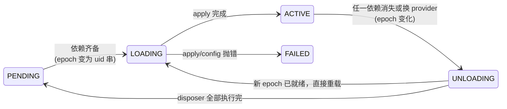

# Context 与 Service：依赖注入的另一种答案

Cordis 是整个 DeepSeek Harness 的地基：`ctx.tools`、`ctx.llm`、`ctx.sessions` 这些贯穿全书的名字，全都是注册在 Context 上的 Service。这一章读 `vendor/cordis/src/` 中 Context、Service、ReflectService 三个类的源码，回答三个问题：为什么插件之间用 `ctx.<key>` 相互发现而不是 `import`；`inject` 声明如何让加载顺序问题彻底消失；以及这套机制与 NestJS 一类传统 DI 容器的本质差别在哪。读懂这一章，后面所有「某某能力注册在 `ctx.xxx` 上」的说法都会变得具体。

## 问题背景

假设你自己给一个 Agent Harness 设计插件系统，最朴素的做法是模块直接互相 `import`：工具注册表 `import` 模型适配器，审批插件 `import` 工具注册表。三个坑马上出现：

第一，**实现被焊死**。消费方拿到的是某个具体实现的模块引用，想把本地 shell 换成远程 sandbox，就得改每一个 `import` 语句。第二，**加载顺序变成手工活**。谁先初始化谁后初始化，要么靠小心排列的启动脚本，要么靠"懒加载 + 判空"的防御式代码，插件一多就是灾难。第三，**卸载无从谈起**。`import` 进来的单例没有生命周期，热重载一个插件时，其他模块手里还攥着旧实例的引用。

改进方案通常是引入一个 DI 容器——但传统容器（如 NestJS）在启动时解析一次依赖图就冻结了，它回答不了「provider 在运行中被替换了怎么办」这个对支持 HMR 的系统至关重要的问题。Cordis 给出的答案是：把「服务定位」做成 Context 上的一次普通属性读取，把「依赖解析」做成贯穿整个运行期的响应式状态机。

## 源码剖析

### Context 是一个 Proxy

`Context` 的构造函数透露了全部机密——它返回的不是 `this`，而是一层 Proxy：

```ts
// vendor/cordis/src/context.ts
export class Context {
  constructor() {
    this[symbols.isolate] = Object.create(null)
    this[symbols.intercept] = Object.create(null)
    const self = new Proxy<this>(this, ReflectService.handler)
    this.root = self
    // ...
    this.reflect = new ReflectService(self)
    this.registry = new RegistryService(self)
    this.events = new EventsService(self)
    // ...
    return self
  }
}
```

从此以后，任何 `ctx.foo` 都不是普通的属性访问，而是进入 `ReflectService.handler` 的 `get` 陷阱。这就是「服务定位」的实现载体——`ctx` 表面上像一个普通对象，实际上是一个带解析逻辑的服务仓库：

```ts
// vendor/cordis/src/reflect.ts — ReflectService.handler
get: (target, prop, ctx: Context) => {
  if (isSpecialProperty(prop)) return Reflect.get(target, prop, ctx)
  if (Reflect.has(target, prop)) {
    return getTraceable(ctx, Reflect.get(target, prop, ctx))
  }

  const error = new Error(`cannot get property "${prop}" without inject`)
  // ...
  return ctx.events.waterfall('internal/get', ctx, prop, error, () => {
    const key = target[symbols.isolate][prop]
    let fiber = (ctx[symbols.shadow] as Context ?? ctx).fiber
    while (true) {
      const impl = fiber.store?.[prop]
      if (impl) return getTraceable(ctx, impl.value)
      if (prop in fiber.inject) {
        error.message = `cannot get required service "${prop}" in inactive context`
        throw error
      }
      if (!fiber.runtime) throw error
      if (fiber.parent[symbols.isolate][prop] !== key) throw error
      fiber = fiber.parent.fiber
    }
  })
}
```

解析路径值得逐行读：自身属性直接放行；否则视为服务名，沿着 fiber 链向上找已声明依赖的快照 `fiber.store`。找不到时不是返回 `undefined`，而是抛出 `cannot get property "xxx" without inject`——**未声明依赖的访问是错误，不是空值**。注意错误对象在进入循环前就已创建好，这是为了让 stack trace 指向调用方而非框架内部（`enhanceError` 会裁掉框架帧）。循环中还有一个细节：一旦父级的 `isolate` 标签和当前不一致就停止上溯，这是服务隔离（`ctx.isolate()`）的实现点，第 7 章的 agent preset 隔离域正是踩在这一行上。

### Service：注册即效果

提供方这边，`Service` 基类的构造函数出奇地短：

```ts
// vendor/cordis/src/service.ts
constructor(protected ctx: Context, name: string) {
  name ??= this.constructor['provide'] as string
  let self = this
  // ...（callable service 的封装，略）
  self.ctx = ctx
  self.name = name
  self.ctx.reflect.provide(name, self, this[symbols.check])
  return self
}
```

真正的注册在 `ReflectService.provide` 里，它把整个动作包进 `ctx.fiber.effect()`：

```ts
// vendor/cordis/src/reflect.ts
provide(name: string, value?: any, check?: () => boolean) {
  return this.ctx.fiber.effect(() => {
    // ...（属性类型冲突检查，略）
    this.ctx.root[symbols.isolate][name] ??= Symbol(name)
    const key = this.ctx[symbols.isolate][name]
    const impl: Impl = { name, value, fiber: this.ctx.fiber, check }
    if (this.store[key]) {
      throw new Error(`service "${name}" has been registered at <${this.store[key].fiber.name}>`)
    }
    this.store[key] = impl
    this.ctx.fiber.store![name] = impl
    if (this.ctx.fiber.state === FiberState.ACTIVE) {
      this.notify([name])
    }
    return async () => {
      delete this.store[key]
      const fibers = this.notify([name])
      await Promise.allSettled(fibers.map(fiber => fiber.await()))
      delete this.ctx.fiber.store![name]
    }
  }, `ctx.provide(${JSON.stringify(name)})`)
}
```

三件事同时发生：服务写入以 isolate symbol 为键的全局 `store`；`notify()` 立刻唤醒所有 `inject` 了这个名字的插件；返回的 disposer 保证提供方卸载时反向执行——删除注册、再次 `notify`、并**等待所有依赖方完成自己的卸载**之后才清理自身。同名重复注册直接抛错，错误信息里带上了先注册者的 fiber 名，冲突无处遁形。

### inject：把加载顺序编译成依赖状态机

消费方声明 `inject: ['greeter']` 后发生了什么？`RegistryService.plugin()` 创建 Fiber 时把依赖表传进去，此后 Fiber 用一个「epoch 字符串」持续追踪依赖的满足状态：

```ts
// vendor/cordis/src/fiber.ts
_refresh() {
  let epoch: string | boolean = false
  epoch = ''
  for (const name of Object.keys(this.inject)) {
    const impl = this._store[name]
    if (!impl) {
      epoch = INACTIVE
      break
    }
    epoch += ':' + impl.fiber.uid
  }
  this._setEpoch(epoch)
}

private _setEpoch(epoch: string) {
  const oldEpoch = this._runner.epoch
  if (epoch === oldEpoch) return
  this._runner.epoch = epoch
  if (this.inertia) return
  this._updateState(() => {
    if (epoch !== INACTIVE && oldEpoch === INACTIVE) {
      this.inertia = this._reload()
      return FiberState.LOADING
    } else {
      this.inertia = this._unload()
      return FiberState.UNLOADING
    }
  })
}
```

epoch 是所有依赖项的 provider fiber uid 拼接成的字符串。任何一个依赖缺失，epoch 变为 `INACTIVE`，插件卸载并进入 PENDING；所有依赖齐备，epoch 变为形如 `:3:7:12` 的串，插件加载。这个设计的精妙之处在第二种变化：如果依赖没有消失、但**换了一个 provider**（旧 fiber 卸载、新 fiber 注册同名服务），uid 变了，epoch 字符串也变了——依赖方会自动经历一次卸载再加载，拿到新实现。`docs/cordis-tutorial/03-services.md` 里"unload 掉 `dsh-bash-local`、挂载另一个 `shell` provider，所有 `inject: ['shell']` 的插件干净地重启"说的就是这条路径。

于是配置文件里的条目顺序彻底失去语义。`docs/cordis-tutorial/01-first-plugin.md` 明确写着：entries 并发启动，顺序不保证任何东西；ordering 来自 `inject`，不来自文件位置。加载顺序问题不是被"解决"了，而是被这个状态机**取消**了。



### 类型这条腿：declaration merging

运行时的服务定位是字符串键，类型安全靠 TypeScript 的声明合并补齐。提供方在自己的模块里写：

```ts
// docs/cordis-tutorial/03-services.md 中的示例
declare module '@deepseek-ai/cordis' {
  interface Context {
    greeter: GreeterService
  }
}
```

这段声明零运行时代价，却让 `ctx.greeter` 在**所有**插件里获得精确类型。`reflect.ts` 顶部对 `ctx.get`/`ctx.provide` 的重载签名（`K extends string & keyof this`）保证了连 `ctx.get('greeter')` 这种松散访问也能推导出返回类型。整个 harness 的服务目录（`docs/subsystems/` 下的 cordis-surface 区块）就是从这些合并声明生成的——类型声明同时是文档源。

### 与 NestJS 式 DI 容器的对比

把两套模型摆在一起，差异不在 API 风格，而在生命周期假设：

| | NestJS 等传统 DI | Cordis |
|---|---|---|
| 解析时机 | 启动时构建完整依赖图，之后冻结 | 运行期持续解析，服务可随时来去 |
| 依赖标识 | class token / injection token，靠装饰器元数据 | 字符串键 + declaration merging 补类型 |
| provider 替换 | 不支持（重启进程） | 换 provider ⇒ epoch 变化 ⇒ 依赖方自动重载 |
| 缺依赖的表现 | 启动时报错，全局失败 | 单个插件停在 PENDING，其余照常运行 |
| 作用域 | 层级 injector（module 边界） | 原型链上的 `isolate` symbol 表，任意子树可开新作用域 |
| 卸载 | 无一等公民支持 | 注册即 effect，卸载即反向执行（见[第 6 章](06-reversible-effects.md)） |

传统容器优化的是「一次装配、长期运行」；Cordis 优化的是「装配本身就是运行时行为」。对一个插件可以被配置文件热改、被 HMR 热换、被 preset 按 agent 隔离的系统来说，后者是唯一走得通的路。代价也很诚实：PENDING 是合法状态，插件悄悄不加载而不报错（`docs/cordis-tutorial/06-composition-and-hmr.md` 专门教怎么诊断），这是把"启动时全局失败"换成"运行期局部静默"的交易。

## 设计亮点

> 💎 **设计亮点：未声明的访问抛错，而不是返回 undefined**
> 普通写法会让 `ctx.foo` 对未注册的服务返回 `undefined`，错误在几层调用之后才以 `cannot read property of undefined` 的形态爆炸。Cordis 的 Proxy get 陷阱把它变成即时的 `cannot get property "foo" without inject`，并且预先构造 error 对象、用 `enhanceError` 裁剪堆栈，让第一行就指向出错的插件代码。想要"可有可无"的语义？显式写 `ctx.get('foo')`——宽松是一种需要声明的选择，不是默认。

> 💎 **设计亮点：epoch 字符串把「依赖是否满足」和「依赖是否还是原来那个」合并成一次比较**
> 朴素实现会用布尔值追踪"依赖齐了没有"，于是 provider 原地替换这种情况根本检测不到。把所有 provider 的 fiber uid 拼成字符串后，"缺失"和"换人"都表现为字符串不等，`_setEpoch` 一个 `===` 判断统一处理，依赖方永远不会攥着旧实现的引用继续跑。
>
> 顺带地，`_setEpoch` 里的 `if (this.inertia) return` 处理了加载中途依赖又变化的竞态——正在进行的转换结束后会检查 epoch 是否仍然匹配（见 `_reload`/`_unload` 尾部的 `_updateState`），不匹配就继续翻转，状态机永不卡死。

> 💎 **设计亮点：isolate 作用域是原型链上的一张 symbol 表**
> `ctx.isolate(name)` 只做一件事：`Object.create(this[symbols.isolate])` 再覆写一个键。子树内对该服务名的读写解析到新 symbol，父作用域完全不受影响；两次 `isolate` 传同一个 label 还能把作用域连通。没有 injector 树、没有作用域对象的显式管理，JavaScript 原型链本身就是作用域链。第 7 章 web-app bundle 把 agent 能力搬进 preset 隔离域，用的就是这一个原语。

> 💎 **设计亮点：`provide` 的 disposer 先 notify、再等依赖方卸载完、最后才删自己的 fiber store**
> 反过来写（先清理自己）会让依赖方在卸载过程中访问 `ctx.xxx` 时拿到半拆除的服务。源码注释「ensure self access before dependencies cleanup」标记的正是这个顺序约束：拆除窗口内，依赖方仍能看到完整的服务实例，直到它们各自的 disposer 跑完。可逆性不只是"能撤销"，还包括"撤销期间的一致性"。

## 小结与延伸

Context 用一层 Proxy 把服务定位做成属性访问，Service 用 effect 把注册做成可逆操作，Fiber 用 epoch 状态机把加载顺序化归为依赖满足问题——三者合起来，就是"插件通过名字找能力、通过声明表达依赖、通过卸载保持干净"的完整闭环。这也是后面几章的公共地基：[第 5 章](05-typed-events.md)的事件监听、[第 6 章](06-reversible-effects.md)的 effect 原语都注册在同一个 fiber 生命周期上，[第 7 章](07-profiles-and-bundles.md)的配置分层则决定这棵插件树上到底长出哪些服务。

**阅读清单**

- `vendor/cordis/src/context.ts` — Context、`extend`/`isolate`/`intercept` 全文不到 150 行，值得通读
- `vendor/cordis/src/reflect.ts` — Proxy handler 与 `provide`/`notify`/`mixin`
- `vendor/cordis/src/fiber.ts` — `_refresh`/`_setEpoch`/`_reload` 的状态机主干
- `docs/cordis-primer.md` — 官方五句话总纲（"A context is a repository of services"）
- `docs/cordis-tutorial/03-services.md` — 可跑的 provide/inject 最小例子
- `docs/architecture.md` 的 Core packages 表 — harness 里每个 `ctx` 键的归属
