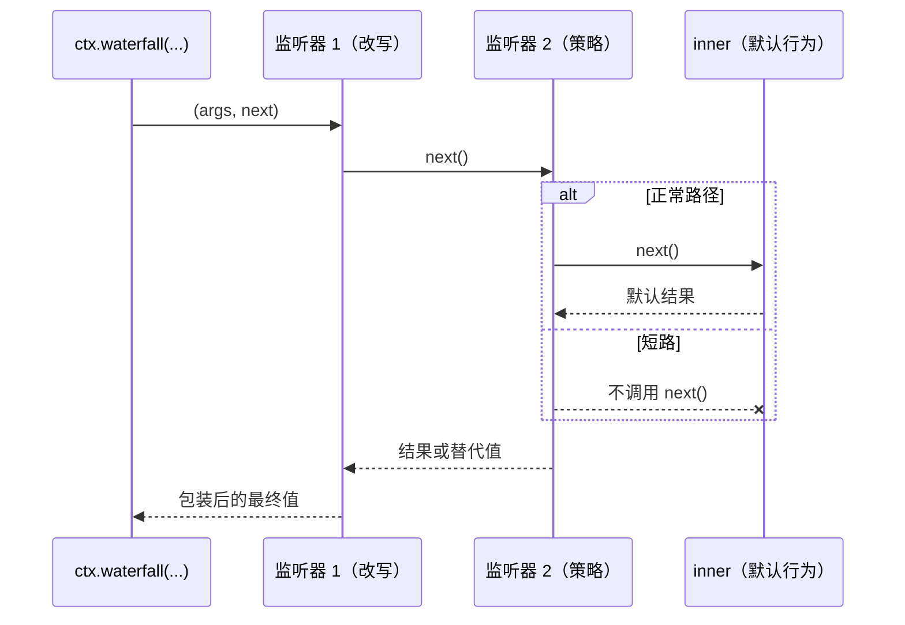

# 类型化事件系统：emit / waterfall / parallel / serial

服务解决"我要调用某个能力"，事件解决"我宣布一件事，谁关心谁听"。Cordis 的事件系统只有 300 多行（`vendor/cordis/src/events.ts`），却是整个 harness 的扩展点机制：工具执行流水线、模型请求改写、审批决策，全都跑在它上面。这一章讲清四种 dispatch mode 的语义与实现、declaration merging 如何让一个分布式声明的事件目录获得完整类型、waterfall 的 `next()` 作为 around-middleware 的两种用法，以及 `@mode` 标注如何被生成脚本强制校验——最后这一点是"文档即工程"的第一个实例。

## 问题背景

自己实现事件总线，第一版八成是 Node 的 `EventEmitter`：字符串事件名、`any[]` 参数、监听器返回值直接丢弃。三个问题随插件数量增长而恶化：

一是**类型黑洞**。事件名拼错要到运行时才发现，参数签名靠口头约定，重构一个事件的 payload 时没有编译器帮你找到所有监听器。二是**返回值语义缺失**。"广播"之外的模式——想收集监听器的决定、想让监听器改写一个值、想让第一个有意见的监听器一票否决——都得在 emit 之上手搓约定，每个作者搓出来的还不一样。三是**监听器泄漏**，`removeListener` 的簿记在热重载场景下几乎必然出错。

Cordis 的回答分三层：用 TypeScript declaration merging 让事件全类型化；把"监听器返回值如何参与"提炼成五种正式的 dispatch mode，作为事件公开契约的一部分；让 `ctx.on()` 本身是一个 effect（[第 6 章](06-reversible-effects.md)），监听器随插件卸载自动消失。

## 源码剖析

### 一次 dispatch 的公共前奏

五种模式共享同一个 `dispatch()`，它做两件事——解析监听器列表、应用上下文过滤：

```ts
// vendor/cordis/src/events.ts
dispatch(type: string, args: any[]) {
  const thisArg = typeof args[0] === 'object' || typeof args[0] === 'function' ? args.shift() : null
  const name: string = args.shift()
  if (!name.startsWith('internal/')) {
    this.emit('internal/dispatch', type, name, args, thisArg)
  }
  const filter = thisArg?.[Context.filter]
  return (this._hooks[name] || [])
    .filter(hook => hook.global || !filter || filter.call(thisArg, hook.ctx))
    .map(hook => hook.callback.bind(thisArg))
}
```

两个细节。其一，非 internal 事件在派发前会先发出 `internal/dispatch`，事件总线自身是可观测的——调试面板、遥测都挂在这里。其二，第一个参数如果是对象会被当作 `thisArg`，它身上的 `Context.filter` 决定哪些监听器能收到这次事件。回看[第 4 章](04-context-and-service.md) `Service` 基类里的 `[symbols.filter]` 实现——比较双方的 isolate 标签——就明白了：**服务的作用域隔离和事件的投递范围是同一套机制**。

### 四种模式的实现

`emit` 与 `parallel` 是"观察型"的一对，`serial` 与 `bail` 是"决策型"的一对：

```ts
// vendor/cordis/src/events.ts
emit(...args: any[]) {
  this.dispatch('emit', args).map(cb => cb(...args))
}

async parallel(...args: any[]) {
  const results = await Promise.allSettled(this.dispatch('emit', args).map(async cb => cb(...args)))
  const errors = results.filter((result): result is PromiseRejectedResult => result.status === 'rejected')
  if (errors.length) throw new AggregateError(errors.map(error => error.reason))
}

async serial(...args: any[]) {
  for (const cb of this.dispatch('serial', args)) {
    const result = await cb(...args)
    if (isBailed(result)) return result
  }
}
```

`emit` 同步遍历、不 await、不收集返回值——适合"事已发生，仅供观察"的通知。`parallel` 用 `Promise.allSettled` 而非 `Promise.all`：**一个监听器抛错不会打断其他监听器**，所有错误最后聚合成一个 `AggregateError` 抛给派发方，观察者之间互不连坐。`serial` 按注册顺序逐个 await，第一个"有效返回值"（`isBailed`：非 `null`/`false`/`undefined`）胜出并停止后续监听器——这是"问一圈，谁有答案谁说话"的语义；`bail` 是它的同步版。harness 里 `agent/turn-stopping` 用 serial（`docs/architecture.md` 的 Turn flow 节），正是"任何一个监听器都可以叫停这个 turn"。

### waterfall：十行实现的 around-middleware

```ts
// vendor/cordis/src/events.ts
waterfall(...args: any[]) {
  const cbs = this.dispatch('waterfall', args)
  const inner = args.pop()
  const next = () => {
    const cb = cbs.shift() ?? inner
    return cb(...args)
  }
  args.push(next)
  return next()
}
```

派发方传入的最后一个参数是"最内层的默认行为" `inner`。实现把它弹出，替换成一个 `next` 闭包：每次调用 `next()` 就从队列里取下一个监听器，队列耗尽则执行 `inner`。于是每个监听器都拿到 `(...args, next)`，站在链条上包裹住"它下游的一切"。

这个原语同时覆盖两种用法，`docs/cordis-primer.md` 的 Waterfall Semantics 节把它们说成一对纪律：

- **合作式改写**：监听器调用 `next()` 拿到下游结果，然后包装、修饰、变换它再返回——`agent/request` 的监听器改写模型调用配置、`llm/stream` 的监听器包装流,都是这一类。改写者必须调用 `next()`。
- **短路决策**：监听器不调用 `next()` 直接返回，下游监听器和默认行为**都不会执行**——`approval/request` 里策略插件替用户作答、`tools/pre-execute` 里权限插件拦下一次工具调用，是这一类。短路是一个刻意的动作。

`docs/cordis-tutorial/04-events.md` 的 demo 值得在脑内跑一遍：监听器 1 把下游结果转大写，监听器 2 见到 `blocked` 就短路返回替代文本。输入 `'blocked words'` 时，监听器 1 先运行、调用 `next()` 进入监听器 2，监听器 2 短路，`inner` 从未执行，而替代文本在返回途中仍被监听器 1 转成了大写——**短路只砍掉下游，上游的包装依然生效**，这正是 around-middleware 与 before/after 钩子的本质区别。



由此得出仓库的一条标准纪律：**只观察、只记录的 waterfall 监听器必须调用 `next()`**。一个忘了 `next()` 的日志监听器会悄无声息地吞掉所有人的默认行为——这不是风格问题，是正确性问题。

框架自己也吃这套原语。`internal/update`（fiber 配置热更新）声明为 waterfall：HMR 插件监听它，可以否决或替换"重启插件"这个默认行为；`internal/get`/`internal/set`（服务读写）同样是 waterfall,第 4 章 Proxy 陷阱里那次 `ctx.events.waterfall('internal/get', ...)` 调用，让任何插件都有机会拦截服务解析本身。

### declaration merging：分布式声明，集中式类型

事件名的类型从哪来？和服务一样，靠声明合并。每个包在自己的模块里扩展 `Events` 接口：

```ts
// vendor/cordis/src/events.ts — 类型化派发 API 的签名（节选）
declare module './context.ts' {
  export interface Context {
    emit<K extends keyof Events>(name: K, ...args: Parameters<Events[K]>): void
    serial<K extends keyof Events>(name: K, ...args: Parameters<Events[K]>): Promisify<ReturnType<Events[K]>>
    waterfall<K extends keyof Events>(name: K, ...args: Parameters<Events[K]>): ReturnType<Events[K]>
    on<K extends keyof Events>(name: K, listener: Events[K], options?: boolean | EventOptions): () => boolean
  }
}
```

事件在 `Events` 接口里声明为一个函数签名，`ctx.on` 的监听器类型、`ctx.emit` 的参数元组（`Parameters<Events[K]>`）、`ctx.waterfall` 的返回值（`ReturnType<Events[K]>`）全部从同一个签名推导。业务插件这样加入目录：

```ts
// docs/cordis-tutorial/04-events.md 中的示例
declare module '@deepseek-ai/cordis' {
  interface Events {
    'stats/report'(name: string, count: number): void
  }
}
```

事件名拼错、参数个数不对、waterfall 监听器忘了 `next` 参数的类型——全部变成编译错误。签名里的 `this` 类型（如 `'internal/update'(this: Fiber, ...)`）还额外编码了"事件以谁的身份派发"，供上文的 filter 机制使用。整个 harness 上百个事件由几十个包各自声明，却在类型层面汇成一张完整目录，零运行时开销。

### @mode 标注与生成目录的校验

Dispatch mode 是事件契约的一部分，但 TypeScript 本身表达不了"这个事件必须用 `ctx.waterfall` 派发"。harness 的做法是让每个事件的 JSDoc 携带 `@mode` 标注，再用文档生成流水线把它变成强制检查。解析端在 `scripts/jsdoc.ts`：

```ts
// scripts/jsdoc.ts
const m = /^@mode\s+(emit|waterfall|parallel|serial|bail)\s*$/.exec(tagLine)
if (m) { mode = m[1] as Mode; hasMode = true; flushPara(); inTags = true; continue }
```

校验端在 typert 生成器里，`scripts/gen-cordis-catalog.ts` 每次生成事件目录时执行：

```ts
// packages/typert/generator/src/cordis-catalog.ts — collectEvents()（节选）
const mode = event.mode
if (!isMode(mode)) {
  violations.push(`${where} is missing an @mode tag. Add '@mode emit|bail|waterfall|parallel|serial' to its JSDoc (see AGENTS.md).`)
}
const last = node.signature.parameters.at(-1)
const hasNext = last?.name === 'next'
if (isMode(mode) && hasNext && mode !== 'waterfall') {
  violations.push(`${where} has a trailing 'next' parameter (structurally a waterfall) but is tagged '@mode ${mode}'. Fix the tag or the signature.`)
}
if (isMode(mode) && !hasNext && mode === 'waterfall') {
  violations.push(`${where} is tagged '@mode waterfall' but has no trailing 'next' parameter. A waterfall delegates via next().`)
}
```

三条规则：没有 `@mode` 的事件声明直接违规；签名末尾有 `next` 参数（结构上是 waterfall）却标注了别的 mode，违规；标注 waterfall 却没有 `next` 参数，也违规。**标注与类型签名互相印证**，任何一边撒谎都会让 `gen-cordis-catalog` 报错、CI 失败。校验通过的事件连同 mode 徽章一起渲染进 `docs/subsystems/*.md` 的生成区块——读者在文档里看到的 `agent/request — waterfall`，不是有人手写后忘了更新的注释，而是从源码签名验证过的事实。

## 设计亮点

> 💎 **设计亮点：mode 是契约，且被机器守着**
> 普通写法里"这个事件该怎么派发"活在 README 或口口相传里，迟早有人对 waterfall 事件用了 `emit`，监听器的返回值被静默丢弃。这里把 mode 写进 JSDoc、用生成器对着类型签名交叉校验（`next` 参数的有无是结构证据），mode 漂移从"代码评审时靠人眼"降级为"CI 直接拒绝"。这是全书反复出现的模式——用工程化自动化把约定升级成不变量——的最小样本。

> 💎 **设计亮点：waterfall 用一个原语统一了改写、策略与短路**
> 朴素设计会为"修改值"做一个 filter 链、为"拦截"做一个 canXxx 钩子、为"替换默认行为"再做一个 override 注册表——三套 API、三份文档。waterfall 的 `next()` 语义让三者变成同一个原语的三种用法，且组合自由：策略监听器短路时，上游改写监听器的包装依然生效。实现只有十行，复杂度全部转移给了一条社会性纪律（"观察者必须调用 next()"），而这条纪律又被 primer 文档和生成目录明文固定。

> 💎 **设计亮点：parallel 用 allSettled + AggregateError，观察者互不连坐**
> `Promise.all` 版本的 parallel 会让第一个抛错的监听器取消所有同伴——遥测插件的一次网络抖动就能掐断别人的清理逻辑。`allSettled` 保证每个监听器都跑完，错误最后打包上抛，派发方一个都不漏看。对"多个互不相识的插件挂在同一个事件上"的生态来说，这是唯一正确的失败语义。

> 💎 **设计亮点：`this` 参数一物三用——过滤、类型、身份**
> 派发时的第一个对象参数既是监听器的 `this`（类型由 `Events` 签名里的 `this: Fiber` 声明），又携带 `Context.filter` 决定投递范围（与服务隔离共用 isolate 标签），还让监听器知道"事件源自哪个 fiber"。一个参数位同时服务于类型系统、作用域系统和运行时诊断，没有引入任何额外概念。

## 小结与延伸

Cordis 事件系统的三层——declaration merging 给类型、五种 dispatch mode 给语义、effect 给生命周期——各自都不新奇，合在一起却让"扩展点"变成可以被类型检查、被文档生成、被 CI 校验的一等工程对象。harness 把最关键的决策路径（`agent/pre-step`、`agent/request`、`tools/*` 三段流水线）全都建在 waterfall 上，[第 19 章](../part5/19-tool-pipeline.md)会看到这条链最繁忙的一段。

**阅读清单**

- `vendor/cordis/src/events.ts` — 全文 352 行，五种模式加内置事件目录
- `docs/cordis-primer.md` — Dispatch Modes 表与 Waterfall Semantics 节
- `docs/cordis-tutorial/04-events.md` — 可跑的 waterfall 短路 demo
- `packages/typert/generator/src/cordis-catalog.ts` — `collectEvents()` 的完整校验规则
- `scripts/jsdoc.ts`、`scripts/gen-cordis-catalog.ts` — `@mode` 解析与目录生成入口
- `docs/architecture.md` 的 Turn flow 节 — 哪些事件是 waterfall、哪个是 serial 的权威清单
