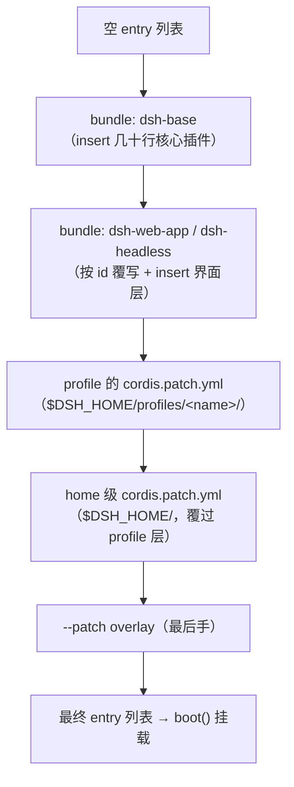

# Profiles、Bundles 与配置分层：一棵可补丁的插件树

前三章讲清了插件如何相互发现、通信、卸载；这一章回答"那这棵插件树本身从哪来"。一个能跑的 `dsh` 不是硬编码的启动序列，而是从有序的补丁层（bundles → profile patch → home patch → `--patch`）叠加出来的一份 entry 列表，每一行都可以被上层按 id 整段替换。我们读 `packages/boot/app-boot/` 的 profile 机制、`packages/bundle/` 三个 bundle 的 patch 文件、`vendor/include` 的补丁算法与 `vendor/loader` 的 `!!js` 插值，最后看 `dsh --dump-config` 如何保证"你看到的就是启动的"。

## 问题背景

发行一个高度可配置的应用，常见做法有三种，各有各的死法。**代码里硬编码组合**：改任何组件都要改源码重新发版。**环境变量开关**：开关之间的组合关系无人管理，if 森林迅速失控。**多份 YAML 深合并**：这是最诱人也最危险的一条——deep merge 的语义天生模糊（数组是替换还是拼接？null 是删除还是赋值？），叠三层配置之后，没人能从任何一份文件推断出最终生效的值，调试全靠 print。

DeepSeek Harness 的选择基于第 4-6 章的地基：既然应用就是一份 entry 列表（每行一个插件 + 它的 config），那发行与定制的问题就化归为**对这份列表的补丁代数**——补丁按行 id 定位、整段替换不做深合并、层与层按固定顺序应用、同一个算法同时服务于启动和 dump。

## 源码剖析

### 分层顺序与两个 manifest 字段

`docs/architecture.md` 一句话给出分层顺序："Layers apply to an empty entry list in this order: each bundle in the profile's listed order, then the profile's `cordis.patch.yml`, then the home-level one, then any `--patch` overlay."



层的身份声明在各自的 `package.json` 里，`dsh` 字段分两个角色（`packages/boot/app-boot/src/profile.ts`）：

```ts
// packages/boot/app-boot/src/profile.ts
export interface DshBundleManifest {
  /** The patch layer this bundle exports, relative to its package root. */
  patch: string
}
export interface DshProfileManifest {
  /** Ordered bundle layer list (package names). */
  bundles?: string[]
}

export const PROFILE_TEMPLATES: Record<string, readonly string[]> = {
  web: ['@deepseek-ai/dsh-base', '@deepseek-ai/dsh-web-app'],
  headless: ['@deepseek-ai/dsh-base', '@deepseek-ai/dsh-headless'],
}
```

bundle 是一个普通 npm 包，`"dsh": { "bundle": { "patch": "./cordis.patch.yml" } }` 指向它导出的补丁文件（`packages/bundle/web-app/package.json` 就这一句）；profile 是 `$DSH_HOME/profiles/<name>` 下的一个目录，其 `package.json` 的 `dsh.profile.bundles` 列出它按序堆叠的 bundle。`web`、`headless` 两个模板首次使用时自动初始化。`loadProfile` 逐层解析，对"列了一个不含 `dsh.bundle` 声明的包"直接 fail loud——源码注释说得直白：那是配置错误，不是"没有补丁"。

### 补丁算法：按 row id 整段替换

三层结构落到同一个算法上：`vendor/include/src/index.ts` 的 `applyEntryPatches`。

```ts
// vendor/include/src/index.ts — applyEntryPatches()（删节）
export function applyEntryPatches(data, patches, warn) {
  data = structuredClone(data)
  if (!patches?.length) return data

  const entryMap = new Map<string, EntryOptions>()
  const buildMap = (entries: EntryOptions[]) => {
    for (const entry of entries) {
      if (entry.id) entryMap.set(entry.id, entry)
      if (entry.group && Array.isArray(entry.config)) buildMap(entry.config)
    }
  }
  buildMap(data)

  for (const patch of patches) {
    const { id, insert, name, ...overrides } = patch
    if (insert) {
      // ...（有 id 时插入指定 group，否则追加到顶层）
      data.push(...insert)
      // Index what this patch added so a LATER patch in the same list can
      // target it. ... without this, inserted rows were silently unpatchable.
      buildMap(insert)
      continue
    }
    if (!id) { warn('patch: id is required for non-insert patches'); continue }
    const target = entryMap.get(id)
    if (!target) { warn('patch: entry %C not found', id); continue }
    if (name && name !== target.name) {
      warn('patch: name mismatch for %C (expected %C, got %C), skipping', id, target.name, name)
      continue
    }
    for (const [key, value] of Object.entries(overrides)) {
      if (key === 'id') continue
      target[key] = value
    }
  }
  return data
}
```

补丁只有两种动作：`insert` 追加新行，或按 `id` 定位已有行、把补丁携带的字段**逐个整体赋值**——注意 `target[key] = value` 是赋值不是合并，一个带 `config` 的补丁替换目标行的**整个** config。可选的 `name` 字段是防呆栓：补丁以为自己在改 A 插件、实际那个 id 已被换成 B 时，跳过并警告而不是默默改错对象。匹配不到目标一律 warn-and-skip，一层的笔误不会炸掉整个组合。

"整段替换、不深合并"是刻意的设计决定，`packages/bundle/base/cordis.patch.yml` 的头注释把理由和推论都写明了：

```yaml
# packages/bundle/base/cordis.patch.yml（头注释,节选）
# A patch replaces the targeted row's whole `config` rather than merging into
# it, so a row whose value differs by mode does NOT live here: it belongs to
# each mode bundle, keeping any single row down to one bundle layer plus the
# user's. Mode-specific rows appear below only with shared plugin identity and
# neutral defaults; each mode bundle restates its complete configuration.
```

推论就是行的归属纪律：一行 config 若因模式（web/headless）而异，它就不该放在 base，而是各模式 bundle 完整重述——这样任何一行的最终值最多来自"一个 bundle 层 + 用户层"两个地方，可推断性靠架构约束而非合并算法保住。app-boot README 的 Known Limitations 也提醒了用户侧的代价：覆写一行时要**重述你想保留的字段**。

对照 web-app bundle 的实际用法，两种动作都有教科书式样本——覆写 base 的行（`- id: hmr` / `disabled: true`）、插入自己的界面层，还有整整一段 `- id: tool-bash` / `disabled: true`，注释解释了为什么是 disable 而不是从 base 删掉：base 是共享的，"a row absent from a surface overlay would silently reappear the day someone reorders the composition"——用 disabled 显式占位，比依赖"没有这行"的脆弱事实可靠。

### `!!js` 表达式与 Loader 插值

补丁文件是静态 YAML，但有些值只能运行时算出来。include 注册了一个 YAML 自定义标签，把 `!!js` 标量解析成表达式节点而非立即求值：

```ts
// vendor/include/src/index.ts
const JsExpr = new yaml.Type('tag:yaml.org,2002:js', {
  kind: 'scalar',
  construct: (data) => ({ __jsExpr: data }),
  predicate: isJsExpr,
  represent: (data) => data['__jsExpr'],
})
export const entryListSchema = yaml.JSON_SCHEMA.extend(JsExpr)
```

求值发生在 Loader 侧,挂在[第 5 章](05-typed-events.md)见过的 `internal/config` waterfall 上：

```ts
// vendor/loader/src/index.ts
ctx.on('internal/config', function (this: Fiber, _config, next) {
  const config = next()
  if (!this.entry || this.parent.fiber?.entry === this.entry) return config
  // Tree carriers (Group, Include) keep their configs literal: their
  // entry and patch lists hold other rows' configs, whose `!!js`
  // expressions belong to those rows' own fibers.
  const plugin = this.runtime?.callback as Record<PropertyKey, unknown> | undefined
  if (plugin?.[EntryGroup.key]) return config
  return interpolate(this.ctx, config)
}, { global: true })
```

时机是关键：`internal/config` 在 fiber 的依赖注入激活**之后**、插件启动之前触发（`fiber.ts` 的 `_resolveConfig`），求值上下文是**该行自己的插件 context**。于是 web-app bundle 里可以写：

```yaml
# packages/bundle/web-app/cordis.patch.yml
- id: webserver
  name: '@deepseek-ai/dsh-host-webserver'
  inject: [webStartup]
  config:
    host: !!js ctx.webStartup.host ?? '127.0.0.1'
    port: !!js ctx.webStartup.port ?? 3080
```

配置行声明 `inject: [webStartup]`，Loader 等 `webStartup` 服务就绪才求值表达式，`ctx.webStartup.host` 稳稳拿到解析好的命令行参数——**配置文件借用了第 4 章的整套依赖机制**，"这个值依赖另一个组件"不需要任何启动顺序 hack。另外两条规则收窄了魔法的边界：`disabled: !!js ...` 在每次挂载决策时对 **loader context** 求值（`vendor/loader/src/config/entry.ts` 的 `disabledOf`），用于按平台/环境门控一行；而 Group/Include 这类"树载体"的 config 保持字面（`EntryGroup.key` 检查）——嵌套行的表达式属于那一行自己的 fiber，不能被外层树提前吃掉。`id`、`name`、`inject` 等元数据则永远是静态数据。

### `--dump-config`：可观测性与"不可漂移"

四层补丁叠出来的树到底长什么样？`dsh --profile web --dump-config` 给出答案，实现是 `packages/boot/app-boot/src/index.ts` 的 `renderConfigDump`。它的头注释就是设计说明：

```ts
// packages/boot/app-boot/src/index.ts — renderConfigDump()（文档注释节选）
/**
 * Compose the effective entry list exactly as `boot()` would mount it: parse
 * the base config file with the include's entry-list dialect, apply every
 * layer's patches as ONE flattened list through the include's own patch
 * algorithm (`applyEntryPatches`) — the same single call `boot()` makes —
 * then render the result as YAML in the same dialect (`!!js` expressions
 * print verbatim, unevaluated).
 */
```

三个保真点。第一，dump 走的是**同一个** `entryListSchema` 解析、**同一个** `applyEntryPatches` 补丁算法、同样的单次扁平化调用——`profile.ts` 的 `composeEntries` 注释直说目的："so flag derivation and config dumps see exactly what mounts"。dump 与 boot 不是两套代码的近似，而是一份代码的两次调用，**结构上不可能漂移**。第二，`!!js` 表达式原样打印不求值（YAML 类型的 `represent` 定义保证 round-trip），dump 是"将要执行的配方"而非某一次执行的快照。第三，溯源：dump 对每个"前缀层快照"做位置对比，给每段连续的行打上 `# == <来源文件> <补丁层>` 注释——你不仅看到最终值，还看到**哪一层动过这一行**；匹配不到目标的补丁按层名警告到 stderr，和 boot 时 Loader 的警告一一对应。

这让 profile 定制有了闭环工作流：`--dump-config` 看当前树 → 找到要改的行的 id → 在自己的 `cordis.patch.yml` 里整段重述它的 config → 再 dump 确认。architecture.md 的表述是"Any row it prints can be replaced by a patch of your own"——可观测性直接兑换成可定制性。

## 设计亮点

> 💎 **设计亮点：拒绝深合并，换来每一行的可推断性**
> 深合并让"最终值"成为 N 层文件与一套合并规则的函数，谁也算不清。按 row id 整段替换把语义压缩成一句话：**每行取最后写它的那一层的完整值**。代价（覆写要重述保留字段）被架构纪律吃掉——base 注释里"模式相异的行归各模式 bundle"的规矩保证正常情况下一行只有两个可能的作者。简单的代数 + 明确的归属，胜过聪明的合并算法。

> 💎 **设计亮点：`buildMap(insert)` 一行，让层与层真正可组合**
> 补丁算法在处理完 insert 后立刻把新行编入 id 索引，源码注释记录了没有它的病症："inserted rows were silently unpatchable"——base insert 的行，用户层竟然 patch 不到。这一行让"下层插入、上层修改"成为普适规则，分层才成其为分层。修复以注释形式留在现场，是这个仓库"决策就地存档"文化的一个缩影。

> 💎 **设计亮点：`!!js` 惰性求值 + 求值上下文绑定到行自己的 fiber**
> 朴素的配置模板在解析时求值，只能引用环境变量。这里表达式作为节点存活到该行 fiber 激活、在 `internal/config` waterfall 里对**行自己的 ctx** 求值，于是 `!!js ctx.webStartup.host` 让配置值参与了完整的服务依赖图——等待、重载、隔离域全部适用。同时边界收得很紧：`disabled` 对 loader ctx 求值、树载体保持字面、其余元数据纯静态——表达能力精确停在需要它的地方。

> 💎 **设计亮点：dump 与 boot 共享同一次函数调用，"看到的"与"跑起来的"由构造保证一致**
> 配置系统最常见的谎言是诊断工具与真实启动路径各自实现、渐行渐远。`renderConfigDump` 和 `boot()` 调的是同一个 `applyEntryPatches`、同一份 YAML 方言 schema，连补丁警告都镜像出现。再叠加逐层快照 diff 生成的溯源注释，`--dump-config` 从"辅助脚本"升格为分层系统的权威调试界面。

## 小结与延伸

Profiles 与 bundles 把"发行一个可定制的应用"化归为补丁列表的有序应用：bundle 用 `dsh.bundle.patch` 导出一层，profile 用 `dsh.profile.bundles` 排序堆叠，用户和运维在更上面继续叠——所有层说同一种语言（按 id 的整段替换 + insert），由同一个算法执行，被同一个 dump 工具照亮。至此第二部分闭环：第 4-6 章的服务、事件、effect 决定插件树上的节点如何协作，本章决定这棵树本身如何被组合与改写。[第 34 章](../part9/34-boot.md)会回到 `boot()` 看这份 entry 列表如何真正挂载成进程，[第 42 章](../part10/42-vendoring.md)则解释为什么 loader/include/hmr 这些包被整个 vendor 进仓库。

**阅读清单**

- `packages/boot/app-boot/README.md` 的 Profiles 节 — 分层顺序、`.env` 与 patch 文件语义的权威描述
- `packages/boot/app-boot/src/profile.ts` — `loadProfile`/`composeEntries`/两锚点 bundle 解析/`healProfilesModuleFallback`
- `vendor/include/src/index.ts` — `applyEntryPatches` 与 `entryListSchema` 全文
- `packages/bundle/base/cordis.patch.yml`、`packages/bundle/web-app/cordis.patch.yml` — 生产补丁层，头注释即设计文档
- `vendor/loader/src/config/utils.ts`、`vendor/loader/src/index.ts` — `evaluate`/`interpolate` 与 `internal/config` 挂钩
- `docs/cordis-tutorial/05-config.md` — `!!js` 的边界规则；`docs/architecture.md` 的 Profiles and bundles 节
