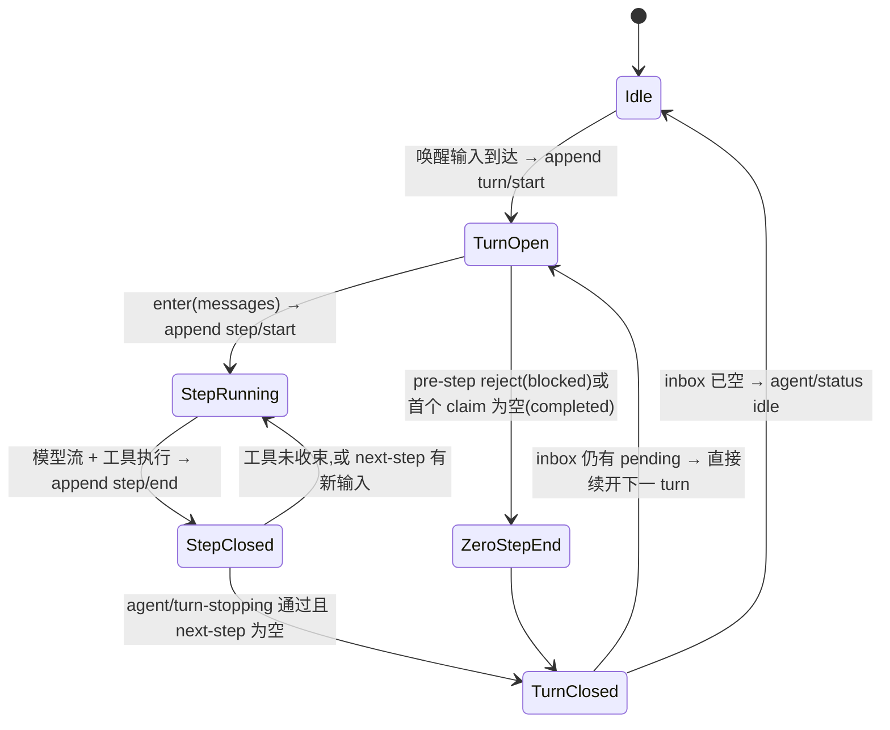

# 第 8 章 Turn 与 Step：把对话建模成状态机

Agent 循环最容易写糊的地方不是调模型,而是「一轮对话到底从哪里开始、到哪里结束」。DeepSeek Harness 给出了一对精确的原语:**step 是一次模型请求加上它引发的工具调用,turn 是零个或多个 step**——turn 在第一份输入被认领(claim)之前打开,在「不再欠任何东西」时关闭。这一章读 `packages/core/agent-loop/src/agent.ts` 里的 `Phase` 状态机和 `turn()` 主体,看这两个边界如何落成持久化事件,以及为什么一个被拒绝的、甚至空的首次 claim 也要留下一个零 step 的 turn。理解了这对边界,后面几章的主循环、inbox、取消恢复才有共同的坐标系。

## 问题背景

朴素的 agent 循环通常长这样:`while (true) { 取一条用户消息; 调模型; 执行工具; 若无工具则 break }`。它在 demo 里能跑,但三个问题会接连出现:

1. **边界没有名字**。工具调用引发第二次模型请求时,这算「同一轮」还是「新一轮」?没有 turn/step 的显式建模,压缩(compaction)、恢复(resume)、UI 分组都只能靠猜。
2. **边界不持久**。崩溃重启后,你无法知道上一轮是正常结束、被取消,还是模型撞了 max-tokens——除非这些结束原因本身就是日志的一部分。
3. **失败的尝试消失了**。用户发了消息、hook 把这一步拒了,朴素实现里什么都不会留下,事后没人能解释「为什么模型没有回话」。

Harness 的答案是把 turn/step 边界做成**持久化 session 事件**(`turn/start`、`turn/end`、`step/start`、`step/end`),让「对话的形状」和对话内容一起写进 append-only 日志;而 `agent/status`、`agent/pre-step` 这类**实时事件**只负责活着的协调,不承担回放责任。`docs/architecture.md` 的 Turn flow 一节用一句话钉死定义:

> A **step** is one model request plus the tools it calls. A **turn** is zero or more steps: it opens before its first input is claimed and closes once nothing is owed.

「once nothing is owed」值得咀嚼:模型发了工具调用,就欠一次结果回传;工具结果带回了 `additionalContexts`,或用户 steering 消息落进了 next-step 队列,就欠一次续步。turn 关闭的条件不是「模型说完了」,而是**账清了**。

## 源码剖析

### Phase:驱动器的三态

`ReactLoopAgent` 用一个私有的 `Phase` 联合类型描述自己:

```ts
// packages/core/agent-loop/src/agent.ts
type Phase =
  | { kind: 'idle'; lastTurn: number }
  | {
    kind: 'maintenance'
    abort: AbortController
    lastTurn: number
    wakeRequested: boolean
  }
  | { kind: 'running'; abort: AbortController; turn: number; step: number; wakeRequested: boolean }
```

三个状态各自携带的字段就是它的合法操作面:`idle` 只记得上一个 turn 号;`running` 才有 `abort` 控制器和当前 turn/step 坐标;`maintenance`(空闲期维护任务,如 compaction)有 abort 但没有 turn 坐标——它不开 turn。想在 idle 状态取消一个 turn?类型系统直接不给你 `abort` 字段。对外只暴露两态:

```ts
// packages/core/agent-loop/src/agent.ts
get status(): AgentStatus {
  return this.phase.kind === 'idle' || this.phase.kind === 'maintenance' ? 'idle' : 'running'
}
```

`maintenance` 对外仍报 `idle`,因为公开契约里「running 意味着正在花模型调用」;维护任务不花,就不该让 UI 转菊花。

### turn():打开、循环、必然关闭

`turn()` 是整个建模的落点,骨架如下(有删节):

```ts
// packages/core/agent-loop/src/agent.ts
private async turn(): Promise<boolean> {
  // ...
  const turn = phase.turn + 1
  this.session.append('turn/start', { turn })
  phase.turn = turn
  let turnEnds: TurnEndReason | null = null
  let target: InboxTarget = 'next-turn'
  try {
    while (true) {
      signal.throwIfAborted()
      const step = phase.step + 1
      const decision = await this.preStep(target, { turn, step })
      if (decision.kind === 'reject') {
        turnEnds = { kind: 'blocked' }
        return false
      }
      if (turnEnds && decision.messages.length === 0) break
      // A removed waking message or an enter decision rewritten to empty
      // still owns the initial turn boundary, but it spends no model call.
      if (phase.step === 0 && decision.messages.length === 0) {
        turnEnds = { kind: 'completed' }
        return false
      }
      this.session.append('step/start', { turn, step })
      phase.step = step
      try {
        for (const message of decision.messages) {
          this.session.append('user/message', message, { surfaceOp: 'append' })
        }
        const stepEnd = await this.step(decision.assembly)
        // max-tokens stays sticky: a later completed step must not
        // downgrade the turn outcome.
        if (turnEnds === null || turnEnds.kind !== 'max-tokens') turnEnds = stepEnd
      } finally {
        this.session.append('step/end', { turn, step })
      }
      // ...
      if (turnEnds && this.inbox.nextStep.length === 0) break
      target = 'next-step'
    }
  } catch (error: unknown) {
    // ...(第 12 章详解错误与取消路径)
  } finally {
    // oxlint-disable-next-line typescript/no-non-null-assertion -- every exit assigns a turn ending
    this.session.append('turn/end', { turn, reason: turnEnds! })
  }
  if (!this.inbox.hasPending) return false
  // ...重置 abort 与 step 计数,返回 true 续开下一个 turn
  return true
}
```

几个关键读法:

**turn 开在 claim 之前。**`turn/start` 先落日志,`preStep()` 才去 `inbox.claim()`。顺序不能反:claim 是「这个 turn 认领了这批输入」的归属声明,必须有 turn 号可挂——`agent/inbox/claimed` 事件的载荷就带着 `{ message, turn }`。

**零 step 的 turn 是刻意的。**两个提前返回都发生在 `step/start` 之前:pre-step waterfall 返回 `reject` 时,turn 以 `{ kind: 'blocked' }` 关闭;首个 claim 到手后消息批次为空(消息在 claim 前被移除,或 hook 把 enter 决定改写成空数组)时,以 `{ kind: 'completed' }` 关闭。两条路都不写 `step/start`,但 `finally` 里的 `turn/end` 照落不误。日志里于是留下一对紧邻的 `turn/start`/`turn/end`——**尝试本身被记录了**。事后审计时,「用户发过消息但被策略拦下」和「用户根本没发消息」在日志上是可区分的两件事;被 claim 走的消息也有明确的归宿(`agent/inbox/claimed` 之后不再出现,`docs/subsystems/core.md` 称之为 "the claimed message ends here")。

**step/end 在 finally 里,turn/end 也在 finally 里。**step 执行中途抛错,`step/end` 仍然闭合;整个 turn 无论正常、报错还是被取消,`turn/end` 都会带着 `TurnEndReason` 落盘。注释 "every exit assigns a turn ending" 支撑了那个非空断言:代码的每条退出路径(正常 break、reject 返回、catch 里赋 `aborted`/`error`)都先给 `turnEnds` 赋了值。日志因此有一条硬不变量:**每个 `turn/start` 必有配对的 `turn/end`,每个 `step/start` 必有配对的 `step/end`**——回放器和 UI 可以放心按括号匹配解析。

**max-tokens 是粘性的。**一个 turn 里某个 step 撞了输出上限,后续靠工具续步正常完成,turn 的最终 reason 仍是 `max-tokens`。`if (turnEnds === null || turnEnds.kind !== 'max-tokens')` 这行保证坏消息不会被后来的好消息覆盖——消费方(比如自动续写策略)需要知道「这一轮曾经被截断过」。

### 状态图



注意 `TurnClosed --> TurnOpen` 这条边:驱动器一次唤醒可以连续消化多个排队的 turn,对外的 `running` 状态覆盖整个排空区间。所以 `agent/status` 的 `running` **不能**当作「某个 turn 还开着」的证据——文档专门强调了这点。

### 事件的分工:durable 与 live

turn/step 边界是 `session/event`(持久),`agent/*` 是实时协调,这个分界在 `packages/core/agent/src/runtime-types.ts` 的模块注释里写成一句话:"Durable transcript facts and turn/step boundaries remain `@deepseek-ai/dsh-session` events."。对照表:

| 关注点 | 持久事件(session) | 实时事件(agent) |
|---|---|---|
| 边界 | `turn/start`、`turn/end`、`step/start`、`step/end` | `agent/status`(idle ⇄ running) |
| 输入 | `agent/inbox/spliced`、`user/message` | `agent/inbox/inserted` / `claimed` / `discarded` |
| 失败 | `turn/end` 的 `{ kind: 'error' \| 'aborted' }` | `agent/error`(带原始 error 对象) |

同一个事实往往两边各记一份,但职责不同:持久侧记「可回放的结果」,实时侧递「不可序列化的现场」(比如 `agent/error` 里 verbatim 的 error 对象、`agent/inbox/claimed` 里的 turn 归属通知)。SDK 文档由此给出使用铁律:要 transcript 就消费 `session/event`,要活协调就订 `agent/*`。

## 设计亮点

> 💎 **设计亮点:零 step 的 durable turn——把「没发生」也记下来**
> 普通写法里,输入被 hook 拒绝就默默丢弃,日志上无痕,用户面对的是「我发了消息但 AI 没反应」的灵异现场。这里 reject/空 claim 仍然落一对 `turn/start`/`turn/end`(reason 分别为 `blocked`/`completed`),配合 `agent/inbox/claimed` 事件,完整回答了「消息去哪了、为什么没花模型调用」。代价只是日志里多两行;换来的是每一次尝试都可审计。

> 💎 **设计亮点:turn 关闭条件是「账清了」,不是「模型停了」**
> 把续步条件写成数据谓词——`turnEnds && this.inbox.nextStep.length === 0` 才 break——意味着工具的 `additionalContexts`、用户的 steering、`agent/turn-stopping` 监听器补投的消息,统统走同一条「往 next-step 队列放东西」的路来延长 turn。没有任何监听器能靠返回值强行续命或强行掐断,listener 的注册顺序因此不影响结局(文档原话:"Data decides, so listener order cannot change the outcome")。
>
> 反过来,提前收束也走数据:tool result 上的 `concludesTurn` 标志在该 step 结束 turn,而不是某个 hook 的一票否决。

> 💎 **设计亮点:粘性 max-tokens 与 finally 双保险**
> `step/end` 与 `turn/end` 都挂在 `finally` 上,加上「每条退出路径必赋 `turnEnds`」的书写纪律,让「日志括号必闭合」从约定升级为代码结构保证;粘性 max-tokens 则展示了 turn outcome 的语义:它是整轮的**最坏诊断**,不是最后一步的心情。这两处都是几行代码,但都是回放正确性的承重墙。

## 小结与延伸

turn/step 不是注释里的口头约定,而是一组落在 append-only 日志上的持久边界:turn 开在首次 claim 之前、关在账清之时,step 精确等于一次模型请求加其工具调用,连失败的尝试都有自己的零 step turn。`Phase` 联合类型让驱动器的每个状态只携带该状态的合法能力,`finally` 结构保证边界事件必然闭合。下一章沿着这套坐标系走读主循环的完整控制流;inbox 的 claim 语义在[第 10 章](10-inbox-and-injection.md),取消与错误路径在[第 12 章](12-cancellation-and-recovery.md),日志本身的事件溯源设计在[第 13 章](../part4/13-session-event-log.md)。

**阅读清单**
- `packages/core/agent-loop/src/agent.ts` — `Phase`、`turn()`、`step()` 全文
- `docs/architecture.md` 的 Turn flow 节 — 一页纸的边界定义
- `docs/agent-lifecycle.md` — 生成式 mermaid 时序图,与本章状态图互补
- `packages/core/agent/src/runtime-types.ts` — `agent/*` 事件的完整 JSDoc 契约
- `docs/subsystems/session.md` — `TurnEndReason` 的全部变体
