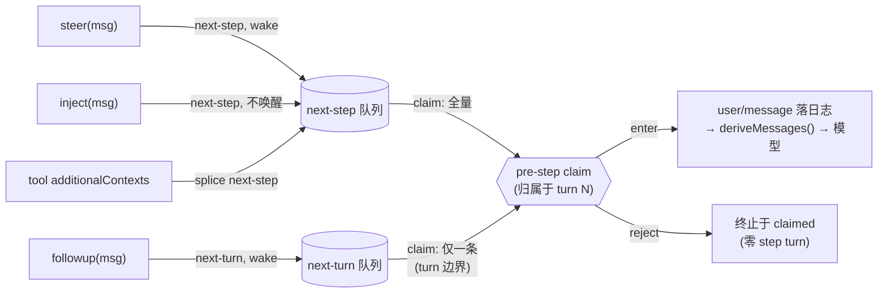

# 第 10 章 Inbox 与消息注入:输入如何到达模型

用户的 follow-up、运行中的 steering、插件塞的环境上下文、工具结果带回的附加材料——一个 agent 的输入远不止「用户发消息」一种。DeepSeek Harness 把它们全部收进**一个 inbox**:两条有序队列(`next-turn` 与 `next-step`)加一个布尔(是否唤醒驱动器),就区分开了所有投递语义。本章读 `packages/core/agent/src/inbox.ts` 和 `agent.ts` 的 `send()` 家族,重点看三件事:哪些消息立即唤醒、injected context 如何「搭车」、以及 claim 的归属语义。这套词汇是[第 9 章](09-agent-loop-deep-dive.md)主循环的输入端,也是[第 12 章](12-cancellation-and-recovery.md)取消语义的作用对象。

## 问题背景

朴素实现会为每种输入开一条专用通道:用户消息一个队列,steering 一个回调,注入上下文直接拼进下一次请求的 prompt 字符串。然后问题排着队来:

1. **通道爆炸**。每种新输入(工具附加上下文、hook 的补充材料、子 agent 的汇报)都要决定走哪条通道,或再开一条;每条通道都要单独处理取消、去重、持久化。
2. **注入的时机困境**。「给模型补充一段环境信息」如果立即触发一次模型调用,纯粹是浪费钱——上下文自己不构成提问;但如果只是拼 prompt 字符串,它就绕开了日志,回放时模型看到的历史和当时不一致,违反 "model-visible means logged" 不变量([第 15 章](../part4/15-model-visible-invariant.md))。
3. **崩溃后队列蒸发**。内存队列在进程重启后消失,用户排队的消息无声丢掉。
4. **归属不明**。消息被取出后这一轮失败了,消息算消费了还是该退回?退回的话顺序怎么保证?每个实现各有各的猜法。

Harness 的答案:**inbox 本身是持久化事件的投影**(每次变更都是一条 `agent/inbox/spliced` session 事件),投递语义压缩成 `(target, wakeup)` 二维组合,claim 是不可逆的归属声明。

## 源码剖析

### send():三个别名,一个入口

```ts
// packages/core/agent-loop/src/agent.ts
send(message: UserMessage, target: InboxTarget, wakeup: boolean): void {
  // Waking input cannot join an aborted activity, so it starts the next turn.
  // Captured before the insertion so a reentrant cancel from a splice observer cannot reclassify it.
  const wakingAfterAbort = wakeup && this.phase.kind !== 'idle' && this.phase.abort.signal.aborted
  const resolvedTarget = wakingAfterAbort ? 'next-turn' : target
  this.inbox.splice(resolvedTarget, Infinity, 0, [message])
  if (wakeup) this.wakeDriver(wakingAfterAbort)
}

followup(input: UserMessage): void {
  this.send(input, 'next-turn', true)
}

steer(input: UserMessage): void {
  this.send(input, 'next-step', true)
}

inject(input: UserMessage): void {
  this.send(input, 'next-step', false)
}
```

三个公开动词是同一入口的固定预设,语义矩阵一目了然:

| 方法 | target | wakeup | 语义 |
|---|---|---|---|
| `followup` | `next-turn` | true | 普通追问:独占一个新 turn,立即唤醒 |
| `steer` | `next-step` | true | 运行中转向:最近的 step 边界消费;空闲则开 turn |
| `inject` | `next-step` | false | 注入上下文:**不唤醒**,等下一次 pre-step 顺路带走 |

`inject` 就是「搭车」语义的全部实现——它与 `steer` 唯一的区别是那个布尔。`docs/architecture.md` 的原话:"Some messages wake it immediately; **injected context waits in the inbox until another message does**." 注入的上下文安静地躺在 `next-step` 队列里:如果驱动器正在跑,下一个 step 边界的 `claim` 会把它和其他输入一起取走;如果 agent 空闲,它一直等到某条 `followup`/`steer` 唤醒驱动器,才作为同一批次进入模型视野。一次模型调用都不多花,又因为 claim 后会以 `user/message` 落日志,完全不破坏日志与请求的一致性。

`inject()` 的典型用途在事件契约里写着:`agent/session-start` 的 JSDoc 说 "Use `agent.inject()` to seed model-facing context"——session 开始时插件铺垫环境信息,正是「有内容要给模型、但不该替用户开口」的场景。工具结果的 `additionalContexts` 也走同型通道(第 9 章里 `executeToolCalls` 的回调直接 splice 进 `next-step`)。JSDoc 同时诚实标注了它的弱保证:"It may miss a request whose pre-step already claimed its batch"——pre-step 已经 claim 完,本次请求就赶不上了,只能等下一个边界。

开头两行的 `wakingAfterAbort` 处理重入:取消刚触发、驱动器还在收敛时,一条唤醒消息不能加入已中止的活动,于是强制改道 `next-turn`,并把分类结果在 splice **之前**捕获——防止 splice 的同步观察者重入调用 `cancel()` 后,分类结果被重新计算。这一行注释背后是一整篇 bug 修复笔记(见第 9 章的 wake latch 一节)。

### Inbox:持久化事件的投影

`Inbox` 类的自我定位写在类注释里:"A replay-once projection that incrementally consumes later inbox splices"。构造函数先回放:

```ts
// packages/core/agent/src/inbox.ts
constructor(
  private readonly session: Session,
  private readonly notifications: InboxNotifications,
) {
  for (const event of session.events.slice(session.header.seedLength ?? 0)) {
    if (event.type !== 'agent/inbox/spliced') continue
    try {
      this.apply(event.data)
    } catch (error: unknown) {
      throw new Error(`invalid persisted inbox splice at session seq ${event.seq}`, { cause: error })
    }
  }
}
```

resume 一个 session 时,内存里的两条队列从日志里的历史 splice 事件重建——**崩溃前排队的消息在重启后仍在排队**。这不是给 inbox 单独做的持久化机制,而是复用了 session 日志:队列变更本来就是一种 session 事件。

写路径的核心在 `mutate()`(有删节):

```ts
// packages/core/agent/src/inbox.ts
private mutate(
  target: InboxTarget, start: number, deleteCount: number,
  inserted: UserMessage[], discardRemoved: boolean,
): UserMessage[] {
  const inbox = this.state[target]
  // ...(将 start/deleteCount 归一化为 actualStart/actualDeleteCount,语义同 Array.prototype.splice)
  if (actualDeleteCount === 0 && inserted.length === 0) return []
  const splice = {
    target,
    start: actualStart,
    ...(actualDeleteCount === 0 ? {} : { removedCount: actualDeleteCount }),
    inserted,
    ...(outcome === undefined ? {} : { outcome }),
  }
  this.validate(splice)
  const event = this.session.append('agent/inbox/spliced', splice)
  const removed = inbox.splice(actualStart, actualDeleteCount, ...event.data.inserted)
  if (discardRemoved) {
    for (const message of removed) this.notifications.discarded(message)
  }
  for (const message of event.data.inserted) this.notifications.inserted(message)
  return removed
}
```

三个顺序决定值得注意。其一,**先落日志,后改内存**:`session.append` 在 `inbox.splice` 之前。注释解释了为什么——同步的 `session/event` 观察者看到事件时,内存队列还是变更前的状态,配合事件里归一化的坐标,观察者能精确重构「哪些消息被移走了」。其二,变更以**归一化 splice**持久化(负索引、越界、NaN 都先折算成确定坐标),回放时 `apply()` 不需要再处理任何边界情况——日志里只有规范形式。其三,`validate()` 在 append 之前跑,包括跨两条队列的 `MessageId` 去重:同一消息不可能同时 pending 两次,坏 splice 根本进不了日志。

### claim:纯删除的归属声明

```ts
// packages/core/agent/src/inbox.ts
claim(target: InboxTarget, turn: number): UserMessage[] {
  const claimed = this.mutate('next-step', 0, this.nextStep.length, [], false)
  if (target === 'next-turn') {
    claimed.push(...this.mutate('next-turn', 0, 1, [], false))
  }
  for (const message of claimed) this.notifications.claimed(message, turn)
  return claimed
}
```

claim 的批次构成是固定公式:**全部 `next-step` 输入,加上(仅在 turn 边界)一条 `next-turn` 消息**。注意 `next-turn` 只取一条——`followup` 的契约是「独占一个 turn」("The item becomes the sole ordinary message of its own turn"),排队的多个 follow-up 会由驱动器连续开多个 turn 依次消化,而不是挤进同一次请求。而 `next-step` 全量取走,意味着 steering 和注入的上下文总是搭上最近的一班车。

`discardRemoved: false` 是 claim 与普通删除的分野:claim 产生的 splice 事件是纯删除,但**不发 discarded 通知**——消息不是被丢弃,而是被这个 turn 认领;归属通知走单独的 `claimed(message, turn)`,载荷带 turn 号。从此这批消息只有两种下场:进入 step(以 `user/message` 落日志),或随 pre-step reject 终止于 claimed 状态(第 8 章的零 step turn)。**没有退回路径**——这是刻意的:退回需要处理顺序、去重、与新到消息的交织,而「claim 即消费」让归属在日志上单调向前,回放器永远不用处理消息的第二次人生。

三类通知(`inserted`/`discarded`/`claimed`)由 `ReactLoopAgent` 构造时接线成 `agent/inbox/*` 实时事件。文档给消费方划了两条路:整队列 UI 用持久的 `agent/inbox/spliced` 重建列表;追踪单条消息命运的用三个实时通知。`MessageId` 是唯一身份,`followup()` 不返回 handle——它标识的是「插入、认领、丢弃」这些队列事实,不承诺任何模型输出(文档为此专门写了一条 "followup-enqueue-and-owned-runs" 决策)。

### 消息的旅程



每条边上的持久化事实都是 `agent/inbox/spliced`;图里没有任何一条越过日志直达模型的路径。

## 设计亮点

> 💎 **设计亮点:`(target, wakeup)` 二维压缩掉整个通道动物园**
> follow-up、steering、注入上下文、工具附加材料、hook 补充信息——五种投递用一个 `send(message, target, wakeup)` 表达完。新的输入种类不需要新通道,只需要选一次坐标;取消、持久化、去重、claim 的实现全部只写一遍。对比通道爆炸的写法,这里的扩展成本是零。

> 💎 **设计亮点:inject 的「搭车」语义——上下文不该花钱**
> `wakeup: false` 一个布尔解决了注入的时机困境:上下文自己不触发模型调用,但一定会在下一次真正的请求里被模型看到(claim 全量取 next-step),且以 `user/message` 落日志、可回放。换普通写法——拼 prompt 字符串——省了队列但破坏了日志一致性;立即触发调用则白花一次请求。躺在队列里等车,是唯一同时满足「省钱」「持久」「模型可见即已记录」三条的方案。

> 💎 **设计亮点:先 append 后 mutate,同步观察者获得「变更前+变更量」**
> 日志事件先于内存变更提交,同步 `session/event` 监听器看到的是 pre-splice 队列加归一化坐标——足以无损重构被移除的消息,而不需要事件里冗余携带它们。这是「事件溯源系统里通知顺序即 API」的一个精确示范:顺序反过来,观察者就只能看到事后状态,信息永久丢失。

## 小结与延伸

单一 inbox 用两条队列、一个唤醒布尔和一个不可逆的 claim,统一了 agent 的全部输入面:持久化搭 session 日志的便车,注入搭下一次请求的便车,归属随 turn 号单调向前。它是主循环([第 9 章](09-agent-loop-deep-dive.md))的进料口,也是取消语义([第 12 章](12-cancellation-and-recovery.md)里 `clear()` 与 `keepInbox` 的作用面)。`agent/inbox/spliced` 事件在日志里的编码细节见[第 13 章](../part4/13-session-event-log.md)。

**阅读清单**
- `packages/core/agent/src/inbox.ts` — 全文仅 220 行,值得逐行读
- `packages/core/agent-loop/src/agent.ts` — `send`/`wakeDriver`/`preStep` 的接线
- `packages/core/agent/src/runtime-types.ts` — `Agent.send/followup/steer/inject` 的完整契约 JSDoc
- `docs/subsystems/core.md` 的 inbox 一节 — 消费方双轨(整队列投影 vs 单消息追踪)的官方指引
- `.agents/notes/implemented/architecture/2026-07-22-unified-send-and-coalesced-user-messages.md` — 统一 send 的决策记录
