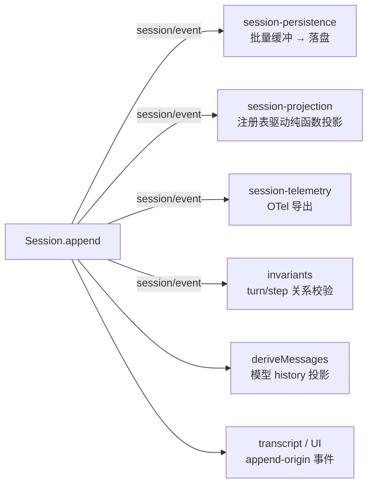

# 第 13 章 SessionEvent：append-only 日志与事件溯源

一个 Agent 的会话状态是整个 harness 中被最多方消费的数据：模型请求要读它，UI 要渲染它，telemetry 要统计它，持久化要存它，resume 和 fork 要重建它。DeepSeek Harness 的答案是把会话建模为一条 append-only 的类型化事件日志（event sourcing），所有下游全部从这一条流派生。本章读 `packages/core/session/src/types.ts` 和 `index.ts`，看 `SessionEventMap` 的类型设计、`Session.append()` 的提交协议、以及 `session/event` 广播如何把一次写入分发给所有消费者。

## 问题背景：消息数组 + 状态对象的坑

如果你自己实现一个 Agent 会话，朴素做法几乎一定是「一个 `messages: Message[]` 数组 + 一个状态对象」：模型请求前 push 一条 user message，流式响应结束 push 一条 assistant message，另外拿一些散装字段记录当前 turn 号、token 用量、todo 列表。

这个方案会在三个方向上碎裂：

1. **消费者各自持有副本**。UI 需要 token 级流式渲染，所以它自己攒 chunk；telemetry 需要 usage，所以它在响应回调里另记一份；持久化序列化 `messages` 数组。三份数据没有一致性来源，改一处忘一处，重启后 UI 里见过的内容和模型下次收到的 history 可能已经不是一回事。
2. **历史可以被原地改写**。压缩上下文时直接 `messages.splice()`，被删掉的内容从此不可审计——你无法回答「上一次请求模型到底看到了什么」。
3. **重建无从谈起**。resume 需要从磁盘恢复的不只是 messages，还有 turn 计数、未完成的 tool call、当时的 system prompt。这些散落在状态对象里的东西没有统一的序列化面。

事件溯源把这三个问题一次解决：唯一的真相是事件日志，其余一切都是投影。

## 源码剖析

### SessionEventMap：merge-extensible 的事件词汇表

`packages/core/session/src/types.ts` 用一个 interface 声明核心事件词汇，插件通过 declaration merging 扩展它（第 5 章讲过 Cordis 事件系统的同款手法）：

```ts
// packages/core/session/src/types.ts
export interface SessionEventMap {
  'turn/start': { turn: number }
  'turn/end': { turn: number; reason: TurnEndReason }
  'step/start': { turn: number; step: number }
  'step/end': { turn: number; step: number }
  'user/message': UserMessage
  /** Raw stream chunk — token-level replay fidelity. */
  'assistant/chunk': { turn: number; step: number; chunk: StreamChunk }
  'assistant/message': { turn: number; step: number; message: AssistantMessage; usage?: TokenUsage }
  'tool/call': { turn: number; step: number; callId: CallId; name: string; arguments: string }
  'tool/result': { turn: number; step: number; message: ToolResultMessage; /* ... */ }
  'todo/write': { todos: TodoItem[] }
  'request/header': { header: EpochHeader; reason: RequestHeaderReason }
  'request/context': RequestContext
  'session/end-seed': Record<string, never>
}
```

注意这个词汇表的取材范围：不只有「消息」，还有 turn/step 边界、原始流式 chunk、tool 调用的**未解析** arguments 字符串、请求头快照、todo 列表。凡是描述这次交互的事实都进日志——这正是「一切从同一条流派生」的前提。生成式文档 `docs/persistence-catalog.md` 统计了整个仓库合并进来的事件类型：核心 14 种之外，compaction、approval、hook、subagent、plan 等插件又合并了近 30 种，全部落在同一条日志里。

事件信封本身是一个 mapped type 构造的判别联合：

```ts
// packages/core/session/src/types.ts
export type SessionEvent<T extends SessionEventType = SessionEventType> = {
  [K in SessionEventType]: {
    type: K
    /** Monotonic sequence number within the session. */
    seq: number
    /** Unix epoch milliseconds. */
    time: number
    data: SessionEventMap[K]
    ignorable?: true
  } & (K extends SurfaceEventType ? {
    sourceEventSeqs?: number[]
    surfaceOp?: SurfaceOp
  } : object)
}[T]
```

两个细节值得停下来看。其一，这是**真正的判别联合**而不是独立的 `type` / `data` 两个 union，所以 `switch (event.type)` 之后 `event.data` 自动收窄，消费端不需要任何 cast。其二，`surfaceOp` / `sourceEventSeqs` 是**条件字段**：只有 `SurfaceEventType`（`user/message`、`assistant/message`、`tool/result` 三种产生模型消息的事件）才拥有它们。给 `turn/start` 附加 surface 元数据在编译期就是类型错误——这个约束延伸到 `append()` 的签名（见下）以及第 14 章的 surface 投影。

`ignorable` 字段是一个前向兼容的方向性选择：默认**不可跳过**。读端遇到不认识的事件类型时，除非事件显式标了 `ignorable: true`，必须拒绝重建整个会话，而不是静默丢弃——因为一个不认识的必需事件可能改变整段日志的解释方式。写端忘了标记的代价是「多拒绝」（不方便），而不是「静默恢复出一个残缺会话」（错误）。

### append()：一次写入的提交协议

`Session` 是一个普通 class（不是 Service），核心只有一个私有数组和一个 `append`：

```ts
// packages/core/session/src/index.ts
append<T extends SessionEventType>(
  type: T,
  data: SessionEventMap[T],
  ...opts: T extends SurfaceEventType ? [opts: SurfaceIntent] : []
): SessionEvent<T> {
  // ...
  const dataSnapshot = snapshotJsonValue(data)
  if (dataSnapshot === undefined) {
    throw new Error(`session event "${type}" carries non-JSON-serializable data`)
  }
  // ...
  const event = deepFreeze({
    type,
    seq: this.log.length,
    time: Date.now(),
    data: dataSnapshot,
    // ...
  } as unknown as SessionEvent<T>)
  this.surfaceManager.validateNext(event as SessionEvent)

  // ...
  let callbacks: SessionCallback[] | undefined
  const callbackArgs: unknown[] = [this, event]
  if (entry !== undefined) {
    callbacks = collectSessionCallbacks(entry.emitCtx, [entry.carrier, 'session/event', ...callbackArgs])
  }
  this.log.push(event as SessionEvent)
  this.eventsSnapshot = undefined
  if (callbacks !== undefined && entry !== undefined) {
    invokeContainedSessionObservers(entry.emitCtx, 'session/event', entry.id, callbackArgs, callbacks)
  }
  return event
}
```

按执行顺序拆开，这十几行藏着一整套提交协议：

- **`seq = log.length` 契约**。序号不是独立计数器，就是数组长度，所以日志天然连续无空洞。持久化后端、fork 边界校验、投影缓存全都依赖这条契约。
- **一遍完成校验与拷贝**。`snapshotJsonValue` 在一次递归里同时验证 JSON 可序列化性并做 detach 拷贝。这不是性能优化，是防御：如果先校验后拷贝分两遍读取，一个带状态的 getter 可以给校验一个值、给存储另一个值。返回值也是进入日志的快照，调用方读 `event.data` 看到的永远是被记录的版本，不是自己还在变的输入。
- **入日志即提交**。listener 快照在 push **之前**解析（Cordis 的 dispatch 校验若失败，日志不变），回调在 push **之后**执行且逐个 contain：observer 抛错只记 warning，既不能改变返回值，也不能阻止后续 listener 看到同一个已提交事件。持久化插件因此不可能「否决」一次已发生的追加——日志是事实记录，不是审批流。
- **深冻结**。事件与嵌套 data 在接受时 `deepFreeze`，`events` getter 返回的快照数组也被 freeze。durable history 无法被普通 JavaScript 改写，连 cast 都没用。

### session/event：一条流，所有下游

`SessionStore` 通过 declaration merging 在 Cordis 事件表上声明了四个事件，其中广播主干是：

```ts
// packages/core/session/src/index.ts
declare module '@deepseek-ai/cordis' {
  interface Events {
    'session/created'(this: Scoped<Session>, session: Session): void
    'session/disposed'(this: Scoped<Session>, session: Session): void
    /** Post-commit, fire-and-forget append feed. */
    'session/event'(this: Scoped<Session>, session: Session, event: SessionEvent): void
    /** Awaited parallel durability checkpoint. */
    'session/flush'(this: Scoped<Session>, session: Session): Promise<void> | void
  }
}
```

注释里的分工很清楚：`session/event` 是**同步、post-commit、不可否决**的追加通知，热路径绝不阻塞 I/O；`session/flush` 是**awaited parallel** 的持久性检查点，调用方等所有 listener 落盘。谁在听这条流？



- **持久化**（`packages/session/session-persistence-*`）订阅 `session/event` 把事件拷进批量控制器，在 `session/flush` 时排干——核心包注释直说「Persistence is a plugin concern」。
- **投影注册表**（`packages/session/session-projection`）只订阅一次 `session/event`，把每个已提交事件喂给所有注册的纯函数投影单元，客户端收到的是完整的当前值。
- **telemetry**（`packages/session/session-telemetry`）同样从这条流（或 canonical log 回放）导出。
- **transcripts / UI** 用第 14 章的 surface 谓词从同一份日志筛出人类可读的时间线。

这就是「为什么全部从同一条流派生」的工程学答案：不是审美偏好，而是因为**只有一个写入点**（`append`）和**一个广播点**（`session/event`），任何两个消费者之间不可能出现第三方状态漂移——它们要么一致，要么其中一个有 bug，而后者可以被第 15 章的 runtime invariant 当场抓住。

### 与传统方案的对比

| 维度 | messages 数组 + 状态对象 | append-only 事件日志 |
|------|--------------------------|----------------------|
| 真相来源 | 多份（数组、UI 缓冲、telemetry 计数器） | 一份日志，其余皆投影 |
| 历史改写 | `splice` 后不可审计 | 不可变；「改写」是追加 replace 事件（第 16 章） |
| 流式保真 | chunk 通常被丢弃 | `assistant/chunk` 原样入日志 |
| 重建 | 需要额外序列化散装状态 | 重放日志即重建（第 16 章 fork/resume） |
| 扩展新状态 | 加字段、加同步代码 | merge 一个事件类型，渲染自日志 |
| 一致性验证 | 无从下手 | 可断言（第 15 章 invariant） |

代价当然存在：读模型需要投影（否则每次都要重放全量日志）。第 14 章会看到 harness 如何用增量缓存把这笔账还清。

> 💎 **设计亮点：条件字段的 mapped type 信封**。普通写法是给所有事件都放可选的 `surfaceOp?`，靠文档约定「非消息事件别填」。这里用 `K extends SurfaceEventType ? {...} : object` 把约定升格为类型：`append('turn/start', ..., { surfaceOp })` 直接编译不过，而 `append('user/message', ...)` 不传 surface 元数据同样编译不过（rest 参数元组 `T extends SurfaceEventType ? [opts: SurfaceIntent] : []` 让第三个参数在该必填时必填）。一类「忘了标记 / 标错对象」的 bug 在编译期消失。

> 💎 **设计亮点：一遍式 snapshot 消灭 TOCTOU**。`snapshotJsonValue` 把「验证 + detach 拷贝」合成一次递归读取，JSDoc 明说动机：「a stateful getter cannot supply one value to validation and another to storage」。同样的意识贯穿 `adoptSessionEvent`（信任边界内转移所有权，免拷贝）与 `snapshotSessionEvent`（不可信边界，structuredClone 后冻结）这对 API——所有权语义写进了函数名。

> 💎 **设计亮点：post-commit 广播的故障隔离**。listener 快照先于 push 解析、回调后于 push 执行、逐 listener contain 异常。三步顺序保证了「已提交事件对所有观察者原子可见」且「任何观察者故障不可回滚提交」。对比普通写法（push 后直接 `emit`，某个 listener 抛错把异常冒泡给 append 调用方），这里的 append 语义是干净的：返回即已提交，永不半途。

> 💎 **设计亮点：ignorable 的默认方向**。前向兼容的常见做法是「读端跳过不认识的记录」，代价是新版本写的关键事件被旧版本静默吞掉。这里反过来：默认必需、显式声明可跳过，把「忘记标注」的失败模式从数据损坏降级为拒绝服务。配合 `SESSION_FORMAT_VERSION` 的「写端决定是否 bump」原则（`types.ts` 里有整段决策标准），版本演化的每条路都被想过。

## 小结与延伸

会话即事件日志：`SessionEventMap` 定义 merge-extensible 的词汇，`append()` 用一遍式校验、深冻结和 `seq = log.length` 契约守住写入点，`session/event` 把每次提交同步广播给持久化、投影、telemetry 和 UI。一个写入点加一个广播点，让「多消费者一致性」从工程难题变成结构必然。下一章看最重要的投影——`deriveMessages()` 如何从日志推出模型看到的 history；第 15 章则看守护这一切的 runtime invariant。

**阅读清单**

- `packages/core/session/src/types.ts` — 事件词汇与信封类型
- `packages/core/session/src/index.ts` — `Session.append` 与 `SessionStore`
- `packages/core/session/src/json.ts` — `snapshotJsonValue` 的一遍式校验
- `docs/subsystems/session.md` — 官方子系统文档
- `docs/persistence-catalog.md` — 生成式全事件目录（43 种事件类型）
- [第 5 章](../part2/05-typed-events.md) — declaration merging 事件表的 Cordis 基础
