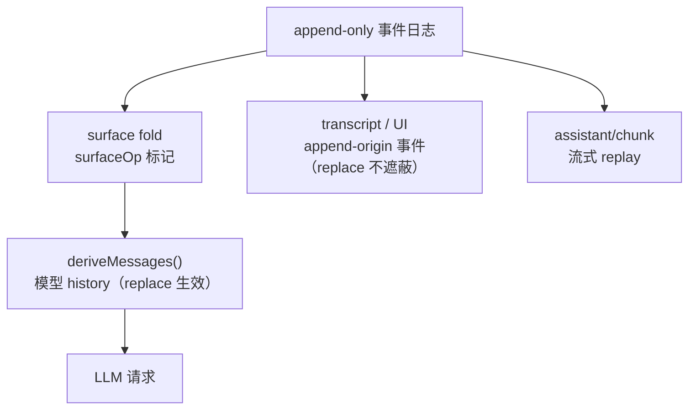

# 第 14 章 deriveMessages()：从日志投影模型上下文

上一章确立了「日志是唯一真相」，但模型 API 要的不是事件日志，是一个 `Message[]`。本章走读这条投影链：`surfaceOp` 标记如何在日志之上维护一个有序的 surface、`deriveEventMessage()` 这条唯一的每节点投影规则、以及 `Session.deriveMessages()` 的增量缓存。读完你会明白为什么 `assistant/chunk` 这样的原始事件要原样入日志，以及「投影与日志分离」在 UI 保真、压缩、缓存三个方向上分别赚到了什么。

## 问题背景：投影为什么不能是「过滤一下」

朴素的想法是：日志里挑出三种消息事件，map 成 `Message[]` 就完了。两个现实需求立刻让它破产：

1. **压缩**。上下文超限时要把一段历史换成摘要。如果投影只是过滤，你只能物理删除日志（丢失审计），或者在投影里硬编码「跳过被压缩的区间」（投影从纯函数腐化成带外部状态的补丁堆）。
2. **性能**。日志会长到几千个事件，而 agent loop 每个 step 都要一份 history。每次全量重放是 O(log)，长会话里每步都在做重复功。

DeepSeek Harness 的解法是在日志与投影之间放一层显式的**surface**：一个由事件自己声明的、有序的「模型可见节点」序列。投影规则保持纯函数，改写语义（replace）成为日志里的一等公民，缓存则按节点增量推进。

## 源码剖析

### surface：日志之上的有序视图

回顾第 13 章：只有 `user/message`、`assistant/message`、`tool/result` 三种事件可以携带 `surfaceOp`，且**必须**携带——每个产生消息的追加都要声明自己如何加入 surface：

```ts
// packages/core/session/src/types.ts
export type SurfaceOp =
  | 'append'
  | { op: 'replace'; start: number; end: number }
```

`'append'` 是常规路径：加到 surface 尾部。`replace` 则声明「我取代 surface 上从 `start` 到 `end`（含）这段节点」——这是第 16 章压缩的底层机制，但机制本身与压缩解耦，任何生产者都可以用。

`packages/core/session/src/surface.ts` 用一个 fold 把日志重放成 surface 状态：

```ts
// packages/core/session/src/surface.ts
export function foldSurface(events: readonly SessionEvent[]): SurfaceFoldResult {
  const state = createFoldState()
  const replacements: SurfaceFoldReplacement[] = []
  for (const [index, event] of events.entries()) {
    const replacement = applySurfaceEvent(state, event, index, events, 0)
    if (replacement !== undefined) replacements.push(replacement)
  }
  return { nodes: [...state.nodes], replacements }
}
```

`state.nodes` 就是 surface：一个 `number[]`，按模型可见顺序存放事件 seq。`append` 是 `nodes.push(seq)`；`replace` 是 `nodes.splice(startIdx, ..., seq)` 并递增 `replaceGeneration` 计数。日志本身一个字节没动——surface 只是它的一个 fold。

live 路径不用每次全量 fold。`SurfaceManager` 是同一个 fold 的增量版本，并且身兼验证者：

```ts
// packages/core/session/src/surface.ts
export class SurfaceManager implements SessionSurface {
  private _state = createFoldState()
  private _lastProcessedSeq: number
  private _pendingPlan: { event: SessionEvent; expectedSeq: number; plan: SurfacePlan | undefined } | undefined

  /** Validate the next candidate without mutating the committed surface. */
  validateNext(event: SessionEvent): void {
    if (this._lastProcessedSeq < this.baseSeq + this.log.length - 1) this._processDelta()
    const expectedSeq = this.baseSeq + this.log.length
    this._pendingPlan = {
      event,
      expectedSeq,
      plan: planSurfaceEvent(this._state, event, expectedSeq, this.log, this.baseSeq),
    }
  }
  // ...
}
```

注意 plan/apply 两阶段：`planSurfaceEvent` 只做验证并产出一个尚未落地的 transition（replace 的目标区间是否存在、`sourceEventSeqs` 是否覆盖全部被遮蔽节点、tool/result 改写是否只动了 content……），`applySurfacePlan` 才真正 mutate。第 13 章的 `append()` 在 push 之前调 `validateNext`——**候选事件在进日志前就被 surface 规则拒绝**，一次失败不可能让 surface 半更新。更妙的是，`Session` 构造函数里 seed 重放走的也是同一个 `validateNext`：live 追加、seed 重放、离线 `foldSurface` 三条路径共享同一套 transition 规则，不存在「重放版逻辑」和「实时版逻辑」两套代码漂移的可能。

### deriveEventMessage：唯一的每节点投影规则

surface 给出「哪些节点、什么顺序」，`deriveEventMessage` 回答「每个节点投影成什么」：

```ts
// packages/core/session/src/surface.ts
export function deriveEventMessage(event: SessionEvent): Message | null {
  switch (event.type) {
    case 'user/message': {
      return event.data
    }
    case 'assistant/message': {
      // Skip an empty-content assistant/message: it exists only to host a
      // max-tokens step's usage and must not inject a content-less assistant
      // turn into the provider transcript.
      if (event.data.message.content.length === 0) return null
      return event.data.message
    }
    case 'tool/result': {
      return event.data.message
    }
    default:
      return null
  }
}
```

三个值得注意的决定。第一，`user/message` **原样透传**：注入的上下文（文件变更通知、skill 内容）如果需要 `<system-reminder>` 之类的包装，由生产者在写日志前烘焙进 `content`——投影层拒绝二次加工，注释里明说「framing is caller-owned」。这保证了日志里的字节就是模型看到的字节。第二，空 content 的 `assistant/message` 投影为 `null`：它存在只为承载 max-tokens step 的 usage，不能给 provider 塞一条空 assistant 消息。第三，这是个**纯函数导出**：live 的 `deriveMessages`、离线重建器、外部 transcript 工具 fold 的是同一个函数——注释称之为「THE per-node projection rule」，第 15 章的 invariant 正是靠它才能断言请求与日志一致。

### deriveMessages：O(new nodes) 的增量缓存

```ts
// packages/core/session/src/index.ts
deriveMessages(): Message[] {
  const surface = this.surface
  const nodes = surface.nodes
  const generation = surface.replaceGeneration
  if (generation !== this.derivedGeneration) {
    this.derived = []
    this.derivedNodes = 0
    this.derivedGeneration = generation
  }
  for (const seq of nodes.slice(this.derivedNodes)) {
    const msg = this.deriveEventMessage(this.log[seq]!)
    if (msg) this.derived.push(msg)
  }
  this.derivedNodes = nodes.length
  return [...this.derived]
}
```

缓存策略全在这十几行里：每个 surface 节点**只投影一次**，常规调用只处理新增节点；`replaceGeneration` 变化（发生过 replace）时整体重建——replace 会改变 surface 中段，增量假设失效，而 replace 是低频事件，全量重建一次划算。返回值是每次新建的数组（调用方持有的数组不会被后续追加悄悄改长），但数组里的 `Message` 对象是**共享且深冻结**的——直接复用日志里已冻结的事件数据，缓存不需要第二次深拷贝，消费者也改不动日志。

agent loop 的每个 step 就是拿这个投影去发请求（`packages/core/agent-loop/src/agent.ts:341`）：

```ts
const { request, preparedCall } = await this.buildRequest(
  turn, step, assembly.tools, system, this.session.deriveMessages(), signal,
)
```

模型收到的 history 与日志之间没有任何中间人。

### assistant/chunk：replay 与 UI 保真为什么要进日志

`assistant/chunk` 不是 surface 事件，不参与投影，那为什么每个 token 级 delta 都要入日志？因为投影只服务模型，而日志服务所有人：

- **UI replay 保真**。重新打开会话时，前端可以按原始 chunk 序列（连同 `time` 时间戳）重现流式打字效果和 reasoning 展开顺序，而不是一次性砸出成品消息。
- **溯源**。`assistant/message` 的 `sourceEventSeqs` 引用构成它的 chunk 事件 seq——成品消息与原始流之间有显式的证据链。
- **审计**。provider 流式协议出问题时（乱序 delta、丢 finish），原始序列就是现场。

代价是体积：token 级事件的 JSON 信封远大于载荷。harness 在**存储层**解决这个问题——`packages/core/session/src/chunk-rows.ts` 把连续同块的 delta run 打包成一条存储行（实测对真实 DeepSeek 会话约 56× 压缩），读取时无损展开回逐个事件。注释里的边界划得很清楚：「Storage rows are a durable-encoding vocabulary, NOT session events」——压缩是编码问题，不许污染事件词汇表。逻辑层永远看到全保真的 chunk 序列。

### 投影与日志分离：同一份日志的两个视图

分离最直接的红利是**一份日志、多个互不妥协的视图**。surface.ts 导出了一对谓词：

```ts
// packages/core/session/src/surface.ts
export function isAppendSurfaceEvent(
  event: SessionEvent,
): event is SurfaceEvent & { surfaceOp: 'append' } {
  return isSurfaceEvent(event) && event.surfaceOp === 'append'
}
```

注释解释了为什么需要它：模型 surface 会遮蔽被 replace 的区间，所以它是**错误的**人类 transcript 数据源——一次压缩落地会「抹掉用户已经看过的对话」。UI 时间线用 `isAppendSurfaceEvent` 取所有 append-origin 事件（`packages/client/ui-conversation` 的各 conversation-node 都在用它），replace 副本只对模型生效。同一条日志，模型看到压缩后的短上下文，用户看到完整对话史，两者都不需要为对方让步。



> 💎 **设计亮点：改写语义是数据不是代码**。普通做法把「压缩后跳过某段」写成投影函数里的特判，改写规则散落在读端。这里把它编码为事件自带的 `surfaceOp: { op: 'replace', ... }`——改写本身也是一次 append，携带完整的证据（`sourceEventSeqs` 必须列出每个被遮蔽节点，`foldSurface` 强制校验）。读端只需要一个通用 fold，任何未来的 surface 改写者（不止压缩）自动获得同样的语义。

> 💎 **设计亮点：三条路径一套 transition**。live `append` → `validateNext`、构造函数 seed 重放、离线 `foldSurface` 全部经过 `planSurfaceEvent`/`applySurfacePlan` 同一对函数。换普通写法——实时路径一套快速逻辑、重放路径一套「兼容」逻辑——两者迟早在某个边界 case 上分家，而分家的表现是 resume 后模型看到不同的 history。这里结构上不可能分家。

> 💎 **设计亮点：generation 计数做缓存失效**。增量缓存最难的是失效条件。这里的观察是：surface 只有两种变化——尾部追加（增量安全）和 replace（增量不安全）。于是失效信号被压缩成一个单调整数 `replaceGeneration`：不变则续投影新节点，变了则整体重建。没有脏标记网络，没有细粒度依赖追踪，一个 int 解决。

> 💎 **设计亮点：空消息投影为 null**。max-tokens 截断的 step 也要记录 usage，于是有了空 content 的 `assistant/message`。让它进日志（保住 usage 事实）但不进投影（不给 provider 发空消息），一行 `if (content.length === 0) return null` 同时满足审计与协议合规——「日志记录事实，投影选择呈现」这条分离原则的最小示例。

## 小结与延伸

`deriveMessages()` 是「日志 → 模型上下文」的投影：`surfaceOp` 把节点排序与改写语义显式化为数据，`deriveEventMessage` 提供唯一的纯函数投影规则，增量缓存让每步的成本降到 O(新节点)。原始 chunk 与 append-origin 谓词则证明了分离的价值——同一份日志同时喂饱模型、UI 和审计，互不迁就。第 15 章看守住这条投影链的 runtime invariant；第 16 章看 replace 机制的最大用户——compaction。

**阅读清单**

- `packages/core/session/src/surface.ts` — surface fold、`deriveEventMessage`、谓词
- `packages/core/session/src/index.ts` — `deriveMessages` 缓存
- `packages/core/session/src/chunk-rows.ts` — chunk run 的存储级打包
- `docs/subsystems/session.md`、`docs/subsystems/session-projection.md` — 官方文档
- [第 13 章](13-session-event-log.md) — 事件信封与 append 协议
- [第 16 章](16-fork-resume-compaction.md) — replace 的使用者：compaction
