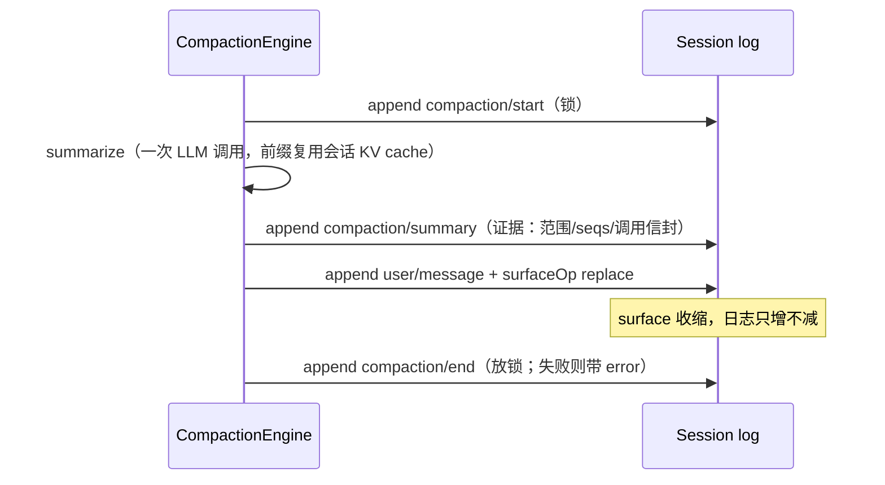

# 第 16 章 Fork、Resume 与 Compaction

前三章建立了事件日志、投影和不变量，本章看这套架构兑现回报的三个高级能力：fork（从历史某点分叉出新会话）、resume（进程重启后从磁盘重建会话）、compaction（上下文超限时压缩历史）。三者在传统「消息数组」方案里各是一个专项工程，在这里全都退化为对同一条日志的切片、重放与追加。我们重点验证一个问题：压缩这种「改写历史」的操作，如何做到不破坏日志真相——答案是压缩自己也是一组 session events。

## 问题背景

- **Fork** 的朴素做法是深拷贝消息数组。但拷到哪个点是安全的？拷贝之后 turn 计数、pending tool call 这些散装状态怎么办？
- **Resume** 的朴素做法是反序列化一个「会话快照」。但进程如果在 turn 中间崩溃，快照是半个状态；而且快照格式和内存结构耦合，每次重构都是一次迁移。
- **Compaction** 的朴素做法是删掉旧消息、插入摘要。删除让审计与 UI 双双失忆；如果压缩过程本身崩在中间，你甚至不知道压缩发生过。

三个问题的共同解是：一切都表达为日志操作——fork 是取日志前缀做 seed，resume 是重放整条日志，compaction 是追加一个 `replace` 事件。日志从不删改，所以三者互相组合也不出事（fork 一个已压缩的会话、resume 一个 fork 出来的会话，都是平凡情形）。

## 源码剖析

### fork：一次带校验的前缀切片

`ctx.sessions.fork(source, boundary?, childSessionId?)` 的实现不到 60 行（`packages/core/session/src/index.ts`）：

```ts
// packages/core/session/src/index.ts
fork(source: SessionForkSource, boundary?: number, childSessionId?: SessionId): Session {
  if (childSessionId !== undefined && this.get(childSessionId) !== undefined) {
    throw new SessionForkError(`session "${childSessionId}" already exists`, 'SESSION_ALREADY_EXISTS')
  }
  const liveSource = this._resolveForkSource(source)
  const seed = this._forkSeed(liveSource, boundary)
  return this.create(childSessionId, {
    seed,
    meta: {
      ...liveSource.header.cwd !== undefined ? { cwd: liveSource.header.cwd } : {},
      parentSession: liveSource.id,
      seedLength: seed.length,
    },
  })
}
```

`_forkSeed` 做两类校验后返回 `events.slice(0, boundary + 1)`：`boundary` 必须命中一个真实存在的连续 seq（`INVALID_BOUNDARY`），并且切片不能结束在未闭合的 turn 里——它向前找最后一个 turn 边界事件，若是 `turn/start` 则拒绝：

```ts
// packages/core/session/src/index.ts — _forkSeed 节选
const lastTurnBoundary = events.slice(0, boundary + 1)
  .findLast(event => event.type === 'turn/start' || event.type === 'turn/end')
if (lastTurnBoundary?.type === 'turn/start') {
  throw new SessionForkError(
    `fork boundary ${boundary} in session "${session.id}" ends inside open turn ${lastTurnBoundary.data.turn}`,
    'OPEN_TURN',
  )
}
return events.slice(0, boundary + 1)
```

血缘信息（`parentSession`、`seedLength`）写进 `SessionHeader`——第 13 章说过 header 是存储元数据，刻意不进事件日志：血缘是「这个会话怎么来的」，不是「对话里发生了什么」，不应该被 `deriveMessages()` 看到。错误则是带 `code` 的类型化 `SessionForkError`（五种失败码），调用方可以程序化处理而不是解析错误文案。

seed 进入子会话时走 `Session` 构造函数，被按**与 live append 完全相同的不变量**逐条验证——JSON 可序列化、seq 从 0 连续、surface transition 合法（第 14 章的 `validateNext`）。构造函数末尾还有一笔：

```ts
// packages/core/session/src/index.ts — Session 构造函数节选
this.firstLiveSeq = this.log.length
this.header = restoredHeader ?? snapshotSessionHeader(id, header)
if (seed !== undefined && this.log.at(-1)?.type !== 'session/end-seed') {
  this.append('session/end-seed', {})
}
```

`session/end-seed` 是一个空载荷的 log-only 事件，durable 地标出「seed 到此为止，之前的事件来自继承，本 lifecycle 一条没写」。为什么需要它？因为 seed 历史和 live 工作在字节上无法区分——telemetry 要知道从哪里开始算「本进程的事件」，compaction 要靠它判断一个未配对的 `compaction/start` 是前世遗留还是当前活锁（见下文）。注意 `at(-1)` 的判断：seed 末尾已经是 end-seed 的不再补一个，反复打开一个没动过的会话不会让日志每次都长一条。

### resume：从磁盘重放整条日志

resume 走 `ctx.agents.resume({ resumeSessionId })`，agent-loop 的实现（`packages/core/agent-loop/src/index.ts`）把它拆成「准备—发布」两段：

```ts
// packages/core/agent-loop/src/index.ts — resumeWith 节选
preparation = await raceAbortCall(
  () => persistence.prepare(id, fused),
  fused, id,
  (abandoned) => { abandoned[Symbol.dispose]() },
)
// ...
return await this.setupAndPublish(
  ownerCtx, id, preparation, options.agentOptions ?? {}, options.setup, options.signal, 'resume',
)
```

`persistence.prepare(id)` 由持久化后端加载存储的日志与 header，构造一个**未发布**的 `Session`（走 `SessionStore.prepare` 的 `seedSource: 'persistence'` 所有权转移路径——新鲜的反序列化对象免掉第二次拷贝，原地验证并冻结）。`SessionPreparation` 是一个 `Disposable`：发布成功它被消费，任何一步失败 `[Symbol.dispose]()` 归还或丢弃，半成品不会泄漏进 store。

重建“状态”这件事根本不存在专门代码：turn 计数、surface、request header 全是日志的 fold，日志装回来它们就都回来了。唯一需要特殊处理的是**崩溃在 turn 中间**的日志。`docs/subsystems/persistence.md` 记录了后端的处理原则：**不截断**——一个长程任务的单个 turn 可能非常大，崩溃前那些事件都是 durable 的事实——而是补一个合成的 `turn/end { reason: { kind: 'interrupted' } }` 闭合孤儿 turn。`interrupted` 是 `TurnEndReasonMap` 里唯一一个 loop 自己永不发出的 reason（`types.ts` 注释：「A persistence backend closed a crash-orphaned turn on reload」），所以日志里见到它就等于见到一次崩溃恢复的记录。

resume 后的第一次请求还有个日志层面的锚点：agent loop 发现日志里已有 header 事件而本实例还没记过，会追加 `request/header` 且 `reason: 'resume'`（`packages/core/agent-loop/src/agent.ts:466`）——新 lifecycle 用了什么配置、和上一世是否一致，同样可审计。

### compaction：改写 surface，但从不改写日志

现在验证本章的核心命题：**压缩是否也是 session event？** 是，而且是四个。compaction 包（`packages/compaction/compaction`）通过 declaration merging 给 `SessionEventMap` 合并了 `compaction/start`、`compaction/summary`、`compaction/end`（外加 pruner 的 `compaction/prune`），全部 log-only；摘要本身则复用 `user/message` 搭载 `replace`。`compaction-basic` 的事务代码（`packages/compaction/compaction-basic/src/region.ts`）：

```ts
// packages/compaction/compaction-basic/src/region.ts — compactSurfaceRegion 节选
const startEvent = session.append('compaction/start', lifecycle)  // 日志内的锁
try {
  const prepared = prepareCompaction(dependencies, session, selection)
  const summarized = await summarizeCompaction(/* ... */)
  assertStable(dependencies, session, summarized)   // 摘要期间选区未被改写
  const pending = commitCompactionBody(session, startEvent, summarized)
  const endEvent = session.append('compaction/end', lifecycle)
  // ...
} catch (error: unknown) {
  // 失败也要闭合 bracket，error 记录在 compaction/end 里
  session.append('compaction/end', { ...lifecycle, error: errorChain(error) })
}
```

而提交体就是两次 append：

```ts
// packages/compaction/compaction-basic/src/region.ts — commitCompactionBody 节选
const summaryEvent = session.append('compaction/summary', {
  compactionId: startEvent.data.compactionId,
  summary,
  shadowedRange: { start, end },
  shadowedSeqs: [...shadowedSeqs],
  shadowedTokenCount,
  provider, model,   // 摘要调用的完整信封，含可选 rawOutput / usage
  // ...
})
session.append('user/message', checkpointMessage, {
  surfaceOp: { op: 'replace', start, end },
  sourceEventSeqs: [startEvent.seq, summaryEvent.seq, ...shadowedSeqs],
})
```

逐条核对「不破坏日志真相」的证据链：

- **被压缩的内容一个字节没删**。`replace` 只改 surface（第 14 章的 `nodes.splice`），原事件仍在日志里；UI transcript 走 append-origin 谓词，用户看到的完整对话不受影响。
- **摘要消息必须自证出处**。`sourceEventSeqs` 列出 start、summary 以及**每一个**被遮蔽节点——第 14 章的 `assertProvenance` 强制校验缺一不可，一条来历不明的 replace 根本进不了日志。
- **摘要生成过程本身可重建**。`compaction/summary` 记录了摘要调用的 provider/model/maxTokens/usage 乃至完整 rawOutput——对摘要 LLM 的那次调用同样遵守「model-visible means logged」的精神。
- **锁就是日志**。`compaction/start` 落盘即加锁，`compaction/end` 落盘即放锁，顺序刻意是「先干完所有事最后放锁」：崩在中间留下的是一个可检测的孤儿 start（而不是一个谎称完成的 end）。判定孤儿是否「活着」时就用到了 `session/end-seed`——一个未配对的 start 若出现在最新 end-seed 之前，属于已死 lifecycle 的陈迹，忽略；之后的才是活锁。



触发侧同样值得一瞥（`compaction-basic/src/index.ts`）：pressure 压缩挂在 `agent/pre-step` waterfall 上于请求派生前运行；provider 报 context-overflow 时走 `agent/request-error` 恢复路径，且只有 `surface.replaceGeneration` 确实前进了才返回 `{ kind: 'retry' }`——重试的依据不是「我觉得压缩过了」，而是 surface generation 这个可观察事实。

> 💎 **设计亮点：fork 是 O(boundary) 的切片而非深拷贝**。事件本身深冻结、不可变（第 13 章），所以 seed 可以直接共享事件对象，子会话只是持有前缀引用加自己的新尾巴。真正的工程含量在两条边界校验上——`INVALID_BOUNDARY` 与 `OPEN_TURN` 把「fork 出一个模型无法续写的半截 turn」在入口处封死。

> 💎 **设计亮点：合成闭合而非截断的崩溃恢复**。快照式方案崩溃后只能回滚到上个快照；这里连崩溃都成了日志里的一等事实——`turn/end { kind: 'interrupted' }` 由且仅由持久化后端写入，崩溃前 durable 的每个事件都保留。长程任务里一个 turn 跑几小时的场景下，「不丢已发生的工作」是实打实的产品能力。

> 💎 **设计亮点：锁在日志里**。普通实现用内存 mutex 防并发压缩，崩溃后锁状态蒸发。这里锁就是 `compaction/start`/`compaction/end` bracket：durable、可审计、崩溃后可检测（孤儿 start），且配合 `session/end-seed` 能区分「前世遗锁」与「今生活锁」。锁的生命周期与它保护的数据用同一条日志、同一次 flush 落盘，天然不会不同步。

> 💎 **设计亮点：压缩自己也服从事件溯源**。最容易偷懒的地方是把压缩做成「日志外的魔法」。这里压缩的输入（shadowedSeqs）、过程（summary 调用信封）、输出（checkpoint user/message）、乃至失败（`compaction/end.error`）全部入日志。于是 resume 一个压缩过的会话零特判——重放日志，`replace` 在 fold 中自然生效，模型看到的仍是压缩后的 surface。

## 小结与延伸

fork 是带校验的日志前缀切片，resume 是日志重放加崩溃闭合，compaction 是携带完整证据链的 surface replace——三个「高级功能」没有一个引入新的状态机，全是第 13、14 章原语的组合。这正是事件溯源架构的复利：真相只有一条日志，所以每个新能力只需回答「我往日志里追加什么」。下一章离开日志本身，看它下面的地基：storage 抽象层、spill 外溢与原子写。

**阅读清单**

- `packages/core/session/src/index.ts` — `fork`、`_forkSeed`、构造函数 seed 验证
- `packages/core/agent-loop/src/index.ts` — `resume` / `resumeWith`
- `packages/compaction/compaction-basic/src/region.ts` — 压缩事务全文
- `packages/compaction/compaction/src/checkpoint.ts` — checkpoint source 的跨包识别
- `docs/subsystems/persistence.md`（crash recovery 节）、`docs/subsystems/compaction.md`
- [第 12 章](../part3/12-cancellation-and-recovery.md) — turn 取消与错误恢复的 loop 侧视角
