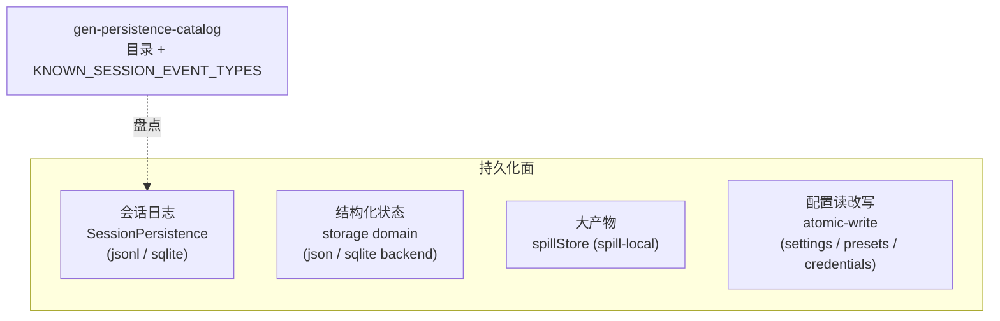

# 第 17 章 Spill 与 Storage：持久化的分层设计

会话日志有自己的持久化接缝（第 16 章提到的 `SessionPersistence`），但一个 harness 要落盘的远不止日志：设置、凭据、投影缓存、工具吐出的超大文本……本章看这些「非日志」持久化面的分层：`packages/storage/` 的 hub—backend—domain 三层抽象、`packages/spill/` 的大产物外溢接缝、生成式的 `docs/persistence-catalog.md` 如何盘点全部持久化面，以及最底层 `packages/util/atomic-write` 的原子写原语。这一章的主题是**分层的纪律**：谁拥有介质、谁拥有语义、谁拥有原子性，各归各位。

## 问题背景

持久化代码的腐化路径高度雷同：起初每个功能自己 `fs.writeFile` 一个 JSON；然后有人要 SQLite，于是 if/else 分叉；然后崩溃留下半个文件，于是到处补 try/catch；然后一个工具返回了 2MB 文本塞进对话上下文，token 爆炸。等你想统一治理时，读写点已散落全仓库。

单独看每个问题都不难——难的是边界划分：序列化格式、存储介质、数据 schema、原子性、并发这五件事如果耦合在同一层，换任何一个都要动全部。DeepSeek Harness 把它们拆成了互不知晓的四个包组。

## 源码剖析

### storage：hub 不做 IO，backend 拥有介质，domain 拥有语义

`docs/subsystems/storage.md` 开篇一句话划清了三层：「backends own media, data forms own semantics, and product packages never touch backends directly」。

**hub**（`ctx.storage`，`packages/storage/storage`）只是一个会面点：`register(name, backend)` 维护 name → backend 表，多个后端并排挂载；`mount(form, facility)` 挂载数据形态。hub 自己不碰一个字节的 IO，甚至不决定「谁用哪个后端」——路由是消费者（domain 层）的配置。

**backend 契约**（`packages/storage/storage/src/backend.ts`）以 facet 形式声明能力：

```ts
// packages/storage/storage/src/backend.ts（结构见 docs/subsystems/storage.md）
interface StorageBackend {
  /** Key-value operations; absent when this backend cannot serve them. */
  readonly kv?: KvFacet
  /** Drain in-flight writes across all open units and release the medium. */
  close(): Promise<void>
}
```

一个后端拥有**一个介质**（json 后端是一棵文件树，每 unit 一个人类可读文件、整体原子重写；sqlite 后端是一个库文件，每记录一行）。facet 可缺席：不支持某类操作就不实现，解析时 loud fail（`facet-unsupported`）而非静默降级。契约文件本身是逐条款的 normative 文本，且 `tests/contract.ts` 有一套共享 conformance suite 对每个后端逐条款验证——两个后端的行为等价不是靠自觉，是靠同一份测试。

**domain**（`packages/storage/storage-domain`）是唯一的 Consumer 数据形态，用 zod spec 一次性声明身份、版本与 schema：

```ts
// packages/storage/storage-domain/src/spec.ts（结构见 docs/subsystems/storage.md）
interface DomainSpec {
  readonly name: string       // 须匹配 UNIT_NAME_RE，兼作后端 unit 名
  readonly version: number    // 介质版本不符 → open 时拒绝
  readonly global?: DomainGlobalSpec<unknown>
  readonly tables: Record<string, DomainTableSpec>
}
```

`defineDomain(spec)` 在**模块加载时**就 loud fail：名字不合法、版本非自然数、global schema 接受 `null`（`null` 是介质的「从未写过」哨兵，可空 global 无法 round-trip）统统当场抛。`open(spec)` 加载时用 zod 校验介质上的每条记录（`invalid-record` 带上出错的表和 key）。类型经 `z.infer` 流向消费者，schema 与类型永不分家。

读写模型是这层最精彩的部分。读是同步的、来自权威内存态；写排上每 domain 一条链，顺序固定为：

> 后端 durability → 内存 mutate → `domain/changed` 事件

后端写失败则内存不动——**读永远不会领先于介质**。`domain/changed` 在 durability 确认之后才发出，是通知不是事务参与者：同步抛错的 listener 被 contain 成一条 warning，不可能否决一次已 durable 的写。对照第 13 章 `session/event` 的 post-commit 广播——两个子系统在「提交点之后不许否决」这件事上给出了同一个答案。

### spill：大产物外溢的三角接缝

spill 解决的问题很具体：一个工具（比如 `web_fetch`）返回了几百 KB 文本，全量塞进 tool result 会撑爆上下文预算；直接截断则永久丢信息。spill 接缝（`docs/subsystems/spill.md`）按能力接缝三角切成三个包：

- **Definition**（`dsh-spill`，`ctx.spillStore`）：一个方法的抽象服务——`saveText(input) → Promise<SpillRef>`，全文 verbatim 落盘，返回不透明的 `locator`（branded type）、精确字节数和 `retrievalHint`。
- **Provider**（`dsh-spill-local`）：宿主文件系统实现，locator 是本地路径，hint 告诉模型「用 read 或 grep 取回」。
- **Consumer**（`dsh-spill-policy`）：挂在 `tools/post-execute` 上的策略，把超过 `maxInlineBytes` 的纯文本结果换成「头尾预览 + spill 引用」。

模型于是获得了一种自然的分页：完整产物在外部，locator 与检索提示留在对话里，需要时用自己的工具按需读取。locator 的不透明性让后端可以整体替换——远程或数据库后端渲染成 URI 或 key，消费者不解析只透传 hint，这正是第 22 章接缝三角「换 Provider 不动 Consumer」的又一例。

Provider 的落盘代码（`packages/spill/spill-local/src/store.ts`）是一堂文件系统安全课：

```ts
// packages/spill/spill-local/src/store.ts
export async function saveTextFile(options: SaveTextOptions): Promise<SavedText> {
  const dir = sessionDir(options.root, options.sessionId)   // <root>/session-<sha256前12位>
  await mkdir(dir, { recursive: true, mode: 0o700 })
  const safeName = encodeSegment(options.suggestedName)
  const path = join(dir, `${randomBytes(6).toString('hex')}-${safeName}`)
  const bytes = Buffer.byteLength(options.content, 'utf8')
  const handle = await open(path, 'wx', 0o600)
  try {
    await handle.writeFile(options.content)
  } finally {
    await handle.close()
  }
  return { path, bytes }
}
```

`suggestedName` 是不可信输入（可能来自模型），`encodeSegment` 把它**单射地**编码为一个安全路径段：`[A-Za-z0-9._-]` 保留，其余每个 UTF-16 code unit 转 `~XXXX`，`~` 自身也转义（保证可逆、不同输入不碰撞），`.` 和 `..` 整段转义（永不可穿越目录），空串编码为 `~`。文件名前缀 6 字节随机 hex（防共享目录里的 symlink 预埋），`open(path, 'wx', 0o600)` 独占创建加 owner-only 权限——路径已存在（无论是不是 symlink）直接失败，预埋目标无法重定向写入。而 policy 消费端是 best-effort：spill 失败保留原始内联结果，绝不把一次成功的工具调用变成 `isError`。

### atomic-write：两个原语解决「半个文件」

`packages/util/atomic-write` 是零依赖的最底层，118 行提供两个原语，服务于 settings、agent-presets、credentials 这些「读改写」型配置面：

```ts
// packages/util/atomic-write/src/index.ts
export async function writeFileAtomic(filename: string, content: string, options: WriteFileAtomicOptions): Promise<void> {
  await mkdir(dirname(filename), { recursive: true, /* ... */ })
  const temp = `${filename}.${randomBytes(6).toString('hex')}.tmp`
  try {
    await writeFile(temp, content, { mode: options.mode, flag: 'wx' })
    await rename(temp, filename)
  } catch (error) {
    await rm(temp, { force: true })
    throw error
  }
}
```

配方是经典的 temp + rename，但细节密度极高：temp 用 `wx` 独占创建（拒绝跟随预埋 symlink）；`mode` 是**必填项**——权限决策必须在每个调用点可见，且权限跟随全新 inode 走过 rename，把一个宽权限旧文件换成窄权限时不存在 chmod 竞窗；同目录 sibling 保证 rename 不跨文件系统。读者永远看到旧或新的完整内容，绝无中间态。

`withFileLock` 补上跨进程写者互斥：`wx` 创建 `<file>.lock` sibling，拿不到就指数退避（20ms→200ms，2s 超时）。最克制的一条是：**竞争者永远不删既有锁**——文件年龄证明不了持有者已死，孤儿锁的清理是运营动作而非代码猜测。读者则因 rename 提交的原子性完全免锁。

会话日志的 JSONL 后端用的是另一套针对 append-only 的机制（`packages/session/session-persistence-jsonl/src/index.ts`）：首批事件 temp 写入、fsync 后用 `link()+unlink()` 发布——注释点明为什么不用 rename：link 在目标已存在时以 EEXIST 失败，两个进程并发创建同一会话不会互相覆盖，rename 会静默 clobber；后续批次 `open(path, 'a')` 追加并 fsync，崩溃留下的撕裂尾行在 load 时截断修复（第 16 章的合成闭合）。同是「原子性」，读改写面与 append-only 面用了不同的正确工具。

### persistence-catalog：持久化面的自动盘点

最后看治理层。`docs/persistence-catalog.md` 是**生成的**（`scripts/gen-persistence-catalog.ts`）：扫描仓库里对 `SessionEventMap` 的每一处 declaration merge，产出全部 43 种可持久化事件的目录——信封声明、payload JSDoc、surface/log-only 徽标、声明位置——并由 `pnpm run verify-persistence-catalog` 在 CI 里保证与源码零漂移。同一个生成器还产出运行时工件 `KNOWN_SESSION_EVENT_TYPES`（`packages/core/session/src/known-event-types.ts`）：持久化读端拒绝解释包含该集合之外类型的日志（除非事件带 `ignorable`，见第 13 章）。文档、校验清单、运行时守卫三者出自同一次扫描，插件新 merge 一个事件类型，三处自动同步。



> 💎 **设计亮点：hub 是会面点不是上帝对象**。常见的 `StorageService` 会长成「懂所有格式、路由、缓存」的巨物。这里 hub 只有两张表（backend 名、form 名），IO 归 backend、schema 归 domain、路由归消费者配置。每层可独立替换，且共享 conformance suite 保证后端行为等价——「多后端」不是 if/else，是契约加测试。

> 💎 **设计亮点：durability → memory → event 的写链顺序**。三步顺序一旦固定，两类经典 bug 结构性消失：读到未落盘的数据（内存先于介质更新）、事件通知了一次实际失败的写（事件先于 durability 发出）。配合「已提交事件不可被 listener 否决」，storage 与 session 两个子系统共享同一套提交纪律。

> 💎 **设计亮点：单射的路径段编码**。对不可信文件名，常见做法是黑名单替换（`replace(/[\/\\]/g, '_')`）——不可逆且可碰撞（`a/b` 和 `a_b` 撞名）。`encodeSegment` 是一个真正的单射：全部 code unit 要么字面保留要么 `~XXXX` 转义，转义字符自身也转义。可逆、零碰撞、`..` 永不出现，一个函数封死整类路径穿越与撞名问题——并与 JSONL 后端的同名编码器刻意保持镜像而不共享代码，让两个存储后端保持解耦。

> 💎 **设计亮点：mode 必填的 API 设计**。`writeFileAtomic` 把 `mode` 做成必填参数而非默认值。写凭据的调用点必须写出 `0o600`，写普通配置的调用点必须写出自己的选择——权限从「隐式默认」变成「每个调用点的显式决策」，review 时一眼可查。小到一个参数的强制性，也是安全设计。

## 小结与延伸

非日志持久化被拆成四层：storage 的 hub—backend—domain 分离让介质、语义、路由各归其主；spill 用一个单方法接缝把大产物移出上下文而不丢信息；atomic-write 用 `wx` + rename 与永不抢锁的文件锁守住最底层原子性；生成式 catalog 则让全部持久化面保持一份与源码零漂移的清单。贯穿五个包组的是同一种品味——每层只拥有一件事，并把它做到条款级精确。至此第四部分完整：一条 append-only 日志向上派生出模型上下文与全部读模型，向下落在这套分层地基上。

**阅读清单**

- `packages/storage/storage/src/backend.ts` — 逐条款的后端契约；`tests/contract.ts` 共享 conformance suite
- `packages/storage/storage-domain/src/spec.ts` — zod domain spec 与 `defineDomain`
- `packages/spill/spill-local/src/store.ts` — 120 行的文件系统安全课
- `packages/util/atomic-write/src/index.ts` — 两个原子写原语全文
- `docs/subsystems/storage.md`、`spill.md`、`persistence.md`、`docs/persistence-catalog.md`
- [第 22 章](../part6/22-seam-triangle.md) — 能力接缝三角的系统性阐述
- [第 40 章](../part10/40-docs-as-engineering.md) — 生成式文档流水线
