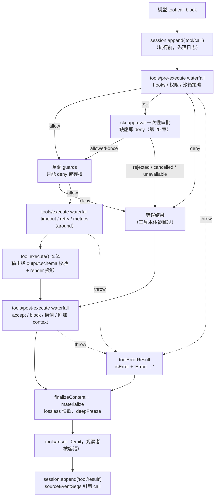

# 第 19 章 工具执行流水线：三段 waterfall

上一章看完了工具怎么注册进来，这一章看一次调用怎么流出去：从模型吐出 tool-call block，到 session log 里落下一条模型可见的 `tool/result`。`ToolRuntime.execute` 把这条路切成三段 waterfall——`tools/pre-execute`、`tools/execute`、`tools/post-execute`——每段职责边界清晰、失败路径闭合。读懂这条流水线，就读懂了这个 harness 里「策略」「执行」「审计」三件事是如何解耦又不失序的。

## 问题背景

朴素实现是一个函数：`const result = await tools[name](args)`，然后把 result 塞回消息历史。需求一来就会发现这个函数要长出无数分叉：

- 执行前要过 hook、权限、审批——在哪儿插？在调用点堆 if，还是让每个工具自己检查？
- 超时、重试、指标要包住执行——每个工具自己 `Promise.race` 一遍？
- 结果要能被策略改写或拦截（比如 spill 大结果、注入纠偏提示）——在调用点后处理，还是散落在各工具里？
- 工具抛异常了怎么办？直接让 agent loop 崩掉，模型永远不知道自己那次调用发生了什么；吞掉，日志和模型上下文就出现「有 call 没 result」的洞，回放直接坏掉。

更隐蔽的坑是**顺序与并发**：多个 tool call 想并行执行提速，但策略检查和结果提交必须保持模型顺序，否则日志里 result 的顺序和模型请求里 call 的顺序对不上。DeepSeek Harness 用「三段 waterfall + 一个内部分段调度器」同时解决这两组问题。

## 源码剖析

### 三段 waterfall 的契约

三个扩展点都声明在 `packages/core/tools/src/index.ts` 的 `Events` 合并里（waterfall 机制本身见[第 5 章](../part2/05-typed-events.md)），并且都是 scope-filtered：通过 `agent.ctx` 注册的 listener 只看到那个 agent 的调用。

```ts
// packages/core/tools/src/index.ts（JSDoc 删节）
interface Events {
  /** Allow, deny, or ask before dispatch. `next()` delegates to allow. @mode waterfall */
  'tools/pre-execute'(this: Scoped<ToolRuntime>, exec: ToolExecution,
    next: () => Promise<PreToolDecision>): Promise<PreToolDecision>
  /** Around-dispatch waterfall for timeout, retry, or metrics. @mode waterfall */
  'tools/execute'(this: Scoped<ToolRuntime>, exec: ToolDispatchExecution,
    next: () => Promise<ToolExecutionResult>): Promise<ToolExecutionResult>
  /** Accept, replace, enrich, or block a normalized dispatch result. @mode waterfall */
  'tools/post-execute'(this: Scoped<ToolRuntime>, exec: ToolExecution,
    result: Readonly<ToolExecutionResult>, next: () => Promise<PostToolDecision>): Promise<PostToolDecision>
  /** Observe the frozen, lossless-JSON final outcome. @mode emit */
  'tools/result'(this: Scoped<ToolRuntime>, exec: Readonly<ToolExecution>,
    result: Readonly<ToolExecutionResult>): undefined
}
```

三段的**返回类型就是职责边界**：

- `pre-execute` 返回 `PreToolDecision = allow | deny | ask`——它只能决定「让不让跑」，**不能改写参数**（注释点明原因：参数在进入流水线前已经落日志、已经被 UI 展示，改写会让三处不一致）。hooks、权限策略住在这里。
- `execute` 返回 `ToolExecutionResult`——它是 around 语义，包住 `next()`（最内层是工具本体）。wrapper 只允许替换 `exec.signal`（用于超时），调用身份不可变，而且 registry 会把原始 caller signal 重新熔接回去，wrapper 无法切断上游取消。
- `post-execute` 返回 `PostToolDecision = accept | block`——accept 可替换 `content` 或 `value`（二选一，两者都给会抛 TypeError），block 把成功结果翻转成携带纠偏 feedback 的错误；两者都能附加 `additionalContexts` 给下一个 step。

### prepare：pre-execute 门 + 单调 guard

`prepareExecution` 是第一段的实现。注意 deny 的去向：

```ts
// packages/core/tools/src/index.ts（删节）
private async prepareExecution<T>(input, next): Promise<T> {
  const created = this.createExecution(input)   // 参数 lossless 快照 + deepFreeze
  // ...
  const gate = await this.ctx.waterfall(
    carrier, 'tools/pre-execute', exec,
    () => Promise.resolve<PreToolDecision>({ kind: 'allow' }),
  )
  const askResolution = gate.kind === 'ask'
    ? await this.serviceAsk(exec, gate)          // 审批座席，见第 20 章
    : { decision: gate, approvalCancelled: false }
  const denialReason = decision.kind === 'allow'
    ? this.guardReason(exec)                     // 单调 guard：只能否决，不能放行
    : decision.reason
  if (denialReason !== undefined) {
    return await next({
      kind: 'post-result', exec,
      result: this.materializeFinalResult({
        content: [{ type: 'text', text: `Error: ${denialReason}` }],
        isError: true,
        error: { message: denialReason },
      }),
    })
  }
  return await next({ kind: 'dispatch', exec })
}
```

两个关键点。第一，waterfall 之后还有一层 `guardReason`——`tools.guard()` 注册的 guard 是**单调的**（`ToolGuard` 只能返回拒绝理由或 `undefined`），没有 allow 分支，所以 listener 注册顺序永远不可能把一个否决翻转回放行；可扩展策略住 waterfall，不容协商的 owner 策略住 guard。第二，deny 的结果 kind 是 `'post-result'` 而非 `'final-result'`——**被拒绝的调用仍然要过 post-execute**。这不是多余：`repeat-tool-reminder` 就靠这一点在 post-execute 里数「模型反复撞同一个被拒调用」的循环（`packages/guard/repeat-tool-reminder/src/index.ts` 的注释原话：「a model hammering a denied call is exactly the loop worth breaking」）。

### dispatch：around wrapper 与信号熔接

第二段用 `dispatchToolBody` 作为 waterfall 的最内层 `next()`：

```ts
// packages/core/tools/src/index.ts（删节）
private async dispatchToolBody(exec: MutableToolRunContext): Promise<ToolExecutionResult> {
  const state = this.cancellationStates.get(exec)
  const wrapperSignal = exec.signal
  const fused = fuseToolSignals(state.callerSignal, wrapperSignal)
  exec.signal = fused.signal
  try {
    const tool = this.resolveExecution(exec.name, exec.agent, exec.parent !== undefined)
    if (!tool) throw new ToolNotFoundError(exec.name)
    state.bodyInvoked = true
    const returned = await tool.execute(exec.arguments, exec)
    const result = this.createSuccessResult(exec, tool, returned)
    return isAborted(fused.signal) ? toolAbortedResult(result) : result
  } catch (error: unknown) {
    return toolErrorResult(error)
  } finally {
    fused.dispose()
    exec.signal = wrapperSignal
  }
}
```

wrapper 可以把 `exec.signal` 换成自己的（比如 deadline signal），但 body 实际收到的是 `fuseToolSignals(callerSignal, wrapperSignal)`——两者任一 abort 都会传导下去，所以 wrapper 永远无法把调用从上游取消里「摘」出去。`timeout-policy`（`packages/guard/timeout-policy/src/index.ts`）是这段的标准住户：读工具声明的 `timeoutMs`，换上 deadline signal，`await next()` 之后如果是自己的定时器触发的，就把结果替换成结构化的 `TOOL_TIMEOUT` 错误——注意它**不 race、不遗弃工具 promise**，工具看到 abort 自己收敛后它才替换结果。

成功返回值不会直接放行：`createSuccessResult` 先 `snapshotToolValue`（非 lossless JSON 直接判 `INVALID_TOOL_OUTPUT`），再用工具自己声明的 `output.schema` 校验，最后调用纯函数 `output.render(args, value)` 投影出模型可见的 `content`。工具吹的牛（输出 schema）由 registry 当场验收。

### finalize：post-execute 决策的应用

```ts
// packages/core/tools/src/index.ts（删节）
private async postExecute(exec, result): Promise<ToolExecutionResult> {
  const decision = await this.ctx.waterfall(
    scopeTarget(this, exec.agent), 'tools/post-execute', exec, result,
    () => Promise.resolve<PostToolDecision>({ kind: 'accept' }),
  )
  if (decision.kind === 'block') {
    return this.markCanonical(exec, {
      content: decision.feedback,
      isError: true,
      error: { message: failureMessageFromContent(decision.feedback) },
      // ...
    })
  }
  // accept：可换 content 或换 value（换 value 会重走 schema 校验 + render）
  // 两路 additionalContexts 合并，随结果一路带出
}
```

替换 `value` 的路径值得注意：它不是直接塞进去，而是重新走 `createSuccessResult`——策略改写的值也要过工具声明的输出 schema 和 render 投影，**post-execute 无法绕过输出契约**。之后 `finishScheduledExecution` 做最后三步：`materializeFinalResult`（lossless 快照 + deepFreeze，失败自身也降级为 error result）、工具定义自有的 `finalizeContent`（开始执行时就快照好的最后一道内容变换，连绕过 post-execute 的流水线失败也会经过它）、`notifyResult`（冻结 exec 后同步派发 `tools/result`，观察者的异常被捕获打日志，**不可能污染结果**）。

### durable 落日志：call 在前，result 引用 call

流水线本身不写日志——落日志是 agent loop 的事，在 `packages/core/agent-loop/src/tool-calls.ts`：

```ts
// packages/core/agent-loop/src/tool-calls.ts
function appendToolCall(session: Session, turn: number, step: number, block: ToolCallBlock): number {
  const event = session.append('tool/call', { turn, step, callId: block.id, name: block.name, arguments: block.arguments })
  return event.seq
}

function appendToolResult(session, turn, step, block, result, callSeq: number): void {
  const message = createToolResultMessage({
    callId: block.id, content: result.content, isError: result.isError,
  })
  session.append('tool/result', {
    turn, step, message,
    ...result.error?.info ? { error: result.error.info } : {},
    ...result.meta !== undefined ? { meta: result.meta } : {},
  }, { surfaceOp: 'append', sourceEventSeqs: [callSeq] })
}
```

`tool/call` 在**执行开始前**追加（`startCall` 的第一行），拿回 seq；`tool/result` 通过 `sourceEventSeqs: [callSeq]` 精确引用自己的 call 事件。这对事件是[第 15 章](../part4/15-model-visible-invariant.md)「model-visible means logged」不变量在工具域的化身。调度器（registry 的 `TOOL_RUNTIME_SCHEDULER` 内部视图，prepare/dispatch/finalize 三段拆开暴露给 loop）允许并发安全的调用重叠 dispatch，但 `commitReady` 只沿模型顺序连续推进提交——**执行可以乱序，提交永远按模型顺序**。取消时已开始的调用被 drain 而不是遗弃，未开始的调用由 `appendSkippedToolCall` 补上合成的 `ABORTED_BEFORE_DISPATCH` 错误结果——日志里绝不留下没有 result 的 call。

### 错误如何变成模型可见的 tool result

整条流水线上没有任何一个异常能逃到 agent loop：每段都被 try/catch 收口成 `toolErrorResult`：

```ts
// packages/core/tools/src/index.ts
function toolErrorResult(error: unknown): ToolExecutionResult {
  const info = errorInfo(error)   // HarnessError → { name, code }
  const message = errorMessage(error)
  return {
    content: [{ type: 'text', text: `Error: ${message}` }],
    isError: true,
    error: { message, ...info ? { info } : {} },
  }
}
```

模型面永远是一条 `Error: ...` 文本 + `isError: true`——模型能读到失败原因并自我纠正；结构化的 `error.info`（`UNKNOWN_TOOL`、`INVALID_ARGS`、`TOOL_TIMEOUT`、`ABORTED`…）随 `tool/result` 事件持久化，供重试策略与回放路由，但不占模型上下文。连 `errorMessage` 自己都是全防御的：恶意 thrown value 用 getter 陷阱炸掉 `instanceof` 或字符串化时，兜底返回 `'<unprintable thrown value>'`——错误归一化是最外层安全边界，边界自身必须 total。

### 全景图



## 设计亮点

> 💎 **设计亮点：用返回类型划分职责边界。** 三段 waterfall 不靠文档约定各自能干什么——`PreToolDecision` 没有改参数的位置，`PostToolDecision` 的 accept 用互斥的 `content?: never / value?: never` 字段禁止同时换两样，guard 类型干脆没有 allow 返回值。「策略能做什么」被编码成类型，越权操作在编译期就不存在。

> 💎 **设计亮点：deny 也走 post-execute。** 普通写法里拒绝就是提前 return，后置策略对被拒调用一无所知。这里 deny 生成的错误结果以 `post-result` 身份继续流经 post-execute，于是 repeat-tool-reminder 能数出「模型反复撞被拒调用」的死循环并注入提醒——恰恰是最需要打断的那种循环。流水线的完整性比短路的性能更值钱。

> 💎 **设计亮点：wrapper 换 signal，registry 熔回来。** `tools/execute` wrapper 拥有替换 `exec.signal` 的自由（timeout 需要），但 `fuseToolSignals` 保证 body 收到的是 caller ∪ wrapper 的熔接信号——wrapper 拿到了实现超时的能力，却拿不到屏蔽上游取消的能力。能力下放与不变量保持，靠同一个函数完成。

> 💎 **设计亮点：没有 result 的 call 不存在。** `tool/call` 先落日志、`tool/result` 用 seq 引用它、取消时未启动的调用补合成结果、观察者异常被隔离、连快照失败都降级成 error result——从任何路径上看，日志里的 call/result 都严格成对。回放、UI、模型上下文三个消费者共享这条由构造保证的不变量。

## 小结与延伸

一次工具调用 = 前置门（可扩展 waterfall + 单调 guard）→ around 执行（信号熔接 + 输出契约验收）→ 后置加工（accept/block + 附加 context）→ 物化通知（冻结、审计、落日志）。错误在每一段被就地收口成模型可见的 `isError` 结果，日志里 call/result 严格成对，执行可以并发而提交保持模型顺序。下一章把镜头对准 `pre-execute` 里那个 `ask` 分支：审批如何让流水线停下来等一个人。

延伸阅读：

- `docs/tool-execution-pipeline.md` — 官方生成的全景图（与本章 mermaid 对照）
- `packages/core/agent-loop/src/tool-calls.ts` — 并行调度与模型顺序提交的完整实现
- `packages/guard/timeout-policy/src/index.ts`、`packages/guard/repeat-tool-reminder/src/index.ts` — 两个「教科书住户」
- `packages/core/tools/tests/tools.spec.ts`、`tests/execution-mode.spec.ts` — 流水线行为契约
- [第 12 章](../part3/12-cancellation-and-recovery.md) — 取消语义的全局视角
