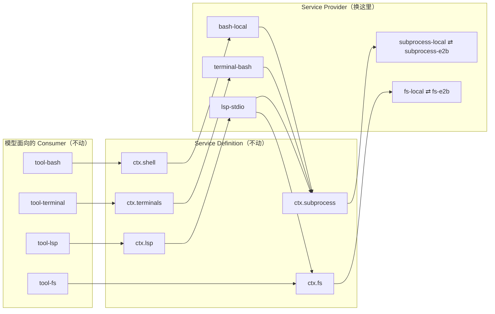

# 第 22 章 接缝三角：Definition / Provider / Consumer

一个 Agent Harness 迟早要回答这个问题：本地跑得好好的 bash、读写文件、PTY、LSP，怎么才能一键搬进远程沙箱、容器、或者另一台机器？DeepSeek Harness 的答案是一个贯穿整个仓库的架构模式——**capability seam（能力接缝）**：每个可替换能力拆成 Service Definition、Service Provider、Consumer 三个角色。这一章讲清楚这个三角模型的定义、它靠什么机制成立、以及它最惊人的推论——替换一两个 provider 包，整个产品的执行世界就整体迁移，模型看到的工具 schema 一个字都不变。后面四章（[文件系统](23-filesystem.md)、[执行世界](24-execution-world.md)、[沙箱](25-sandbox.md)、[LSP 与 code-runtime](26-lsp-and-code-runtime.md)）都是这个模型的具体实例。

## 问题背景

自己实现一个带 bash 工具的 harness，朴素做法是在工具的 `execute()` 里直接 `child_process.spawn('bash', ['-c', command])`。能跑，但第一次需求变更就会暴露问题：要支持沙箱执行，你得在工具里加 `if (sandboxed)` 分支；要支持远程执行，再加一个分支；每加一种执行方式，模型面向的工具代码都要重新改、重新测。

进一步的做法是抽一个 `interface Executor`，工具依赖接口。这解决了一半问题，但留下三个坑：

1. **接口不管注册与生命周期**。谁在什么时候提供实现？两个实现同时加载了怎么办？实现热重载时，正在跑的后台进程归谁管？TypeScript 的 `interface` 在运行时是空气，回答不了这些问题。
2. **词汇表没有归属**。`ExecResult`、超时语义、输出截断规则这些「合同词汇」放在哪个包？放实现包里，消费方就 import 了实现；放工具包里，实现方反向依赖工具。
3. **能力之间的组合关系断裂**。bash 换成远程执行了，文件读写呢？PTY 呢？LSP 呢？每个能力各自为政地抽象，换环境时还是要逐个排查。

DeepSeek Harness 用一份 38 行的架构决策记录（`.agents/notes/implemented/architecture/2026-06-13-capability-seams.md`）钉死了答案，然后把它执行到了 40+ 个服务上。

## 源码剖析

### 三个角色的定义

架构笔记里的原文（这是仓库的决策记录，不是事后总结）：

```markdown
// .agents/notes/implemented/architecture/2026-06-13-capability-seams.md
A swappable capability has **three roles**:

1. **Service Definition** — the Cordis `Service` and vocabulary types owning
   `ctx.<key>` and depending only on the vocabulary the contract needs
   (e.g. `dsh-shell`: `ShellExecutor`, `ShellRunResult`, `ShellProcess`).
   A definition may be an abstract class or a concrete registry service;
   it is never a TypeScript `interface`.
2. **Service Provider** — a plugin that supplies or registers an implementation
   (e.g. `dsh-bash-local`: subprocesses, process-group kills, spill-file truncation).
3. **Consumer** — what the model and plugins program against
   (e.g. `dsh-tool-bash`: the `bash` schema, ...). Consumers inject the
   service key and never import provider-specific types.
```

注意第一条最后那句话：**Definition 永远不是 TypeScript `interface`，而是 Cordis `Service`（抽象类或具体注册表）**。这不是风格偏好。看文件系统接缝的 Definition 是怎么写的：

```ts
// packages/fs/fs/src/index.ts
declare module '@deepseek-ai/cordis' {
  interface Context {
    fs: FileSystem
  }
  // ...（fs/* 事件声明，见第 23 章）
}

export abstract class FileSystem extends Service {
  constructor(ctx: Context) {
    super(ctx, 'fs')
  }

  abstract resolve(path: string, opts?: { cwd?: string; signal?: AbortSignal }): Promise<FsTarget>
  abstract processPath(target: FsTarget): string
  // ...
}
```

抽象类 + declaration merging 一次解决了 `interface` 方案的所有坑：

- `super(ctx, 'fs')` 把「注册到 `ctx.fs`」写进了 Definition 本身——任何子类被加载为插件时自动占据这个键，加载第二个实现直接抛错（Cordis 的标准重复服务行为，见 `docs/subsystems/subprocess.md` 对 `ctx.subprocess` 的描述）。
- `declare module` 让每个消费方拿到的 `ctx.fs` 是强类型的，且类型来自 Definition 包，不来自任何 provider。
- 词汇表（`FsTarget`、`FsError`……）与抽象类同包，归属清晰：provider 和 consumer 都只 import Definition 包。

### 「一个角色不是接缝」

架构笔记专门为术语立了一节：

```markdown
// .agents/notes/implemented/architecture/2026-06-13-capability-seams.md
A **seam** is the whole capability — the three roles together ...
`packages/shell` is the canonical example — `dsh-shell` /
`dsh-bash-local`+`dsh-bash-sandbox` / `dsh-tool-bash`. A package may own
multiple roles, but one role alone is not the seam.
```

「seam」这个词被保留给三角整体。这意味着**加一个能力必须设计全部三个角色**：只写一个抽象类，没回答谁实现、谁消费；只写一个工具，能力就焊死在实现上。仓库的目录结构直接体现这个纪律——`packages/shell/` 下能看到 `shell`（Definition）、`bash-local` / `bash-sandbox` / `pwsh-local`（Providers）、`tool-bash` / `tool-pwsh`（Consumers）并排躺着。

但笔记同样反对教条：LLM 接缝就把 Definition 和 Consumer 折叠在 `dsh-llm` 一个包里，因为那个 Consumer 是 agent loop 自己，不是可替换的 schema 表面；「一个能力只有一种可能的 provider 和一个 Consumer 时，保持一个包，等第二个出现再拆」。

### 消费方到底怎么「不认识」provider

三角成立的机制细节在消费方的 `inject` 声明里。三个真实例子：

```ts
// packages/shell/bash-local/src/index.ts —— bash 的本地 Provider，
// 它同时是 subprocess 接缝的 Consumer
export class LocalBashExecutor extends ShellExecutor {
  static inject = ['subprocess']
  // ...
  async run(spec: ShellExecSpec): Promise<ShellRunResult> {
    return this.runArgv(spec, ['bash', '-c', spec.command])
  }
```

```ts
// packages/lsp/lsp-stdio/src/index.ts —— LSP 的通用 stdio Provider
/** Services required by this plugin. */
export const inject = ['fs', 'lsp', 'subprocess']
```

```ts
// packages/terminal/terminal-bash/src/index.ts —— PTY 后端
/** Required services: PTY registry, shared confinement policy, and process substrate. */
export const inject = ['terminals', 'sandboxPolicy', 'subprocess']
```

`inject` 数组里全是 `ctx` 键，没有一个包名。`bash-local` 不知道 `ctx.subprocess` 背后是本地 `node:child_process` 还是 E2B 的远程 SDK；`lsp-stdio` 不知道 `ctx.fs` 是本地磁盘还是远程沙箱文件系统。Cordis 会让声明了 `inject` 的插件挂起（pend），直到对应服务被某个 provider 注册——依赖注入本身是第 4 章讲过的框架机制，接缝三角是在它之上的**包边界纪律**。

### 一次 provider 替换，整个世界搬迁

现在可以推出这个模型最漂亮的结论了。把上面三段 `inject` 连成图：



`ctx.fs` 和 `ctx.subprocess` 是两个「地基接缝」：bash 执行器通过 `ctx.subprocess` spawn，PTY 后端通过 `ctx.subprocess.spawnTerminal` 拿终端，LSP 宿主通过 `ctx.fs` 读源码、通过 `ctx.subprocess` 拉起 language server。于是，把组合配置里的 `fs-local` + `subprocess-local` 换成 `fs-e2b` + `subprocess-e2b`——**只是换两个 provider 包**——Bash、后台任务、持久 PTY、LSP 导航就全部在 E2B 的远程 Linux 沙箱里运行了。`tool-bash` 的 schema、`tool-fs` 的 read/write 语义、模型的提示词，零修改。

E2B 这一侧还有个配套设计保证两个 provider 落在**同一个**远程世界：

```ts
// packages/e2b/e2b/src/index.ts
/**
 * Shared ownership of one E2B sandbox. Capability adapters await the same SDK
 * handle, so filesystem and process operations inhabit one remote Linux world.
 */
export class E2BRuntime extends Service {
  constructor(ctx: Context, config: Config) {
    super(ctx, 'e2b')
    // ...
    this.ready = this.open()
  }
  async getSandbox(): Promise<Sandbox> { /* ... */ }
}
```

`ctx.e2b` 只创建一个沙箱句柄，`fs-e2b` 和 `subprocess-e2b` 都从它 `getSandbox()`——文件视角和进程视角天然一致（这个「同一个执行世界」不变量在[第 24 章](24-execution-world.md)展开）。

### 能力图谱：生成出来的地图

`docs/capability-seams.md` 是这套模型的全景图——但它不是手写文档。文件头两行：

```markdown
<!-- Generated by scripts/gen-doc-graphs.ts - do not edit by hand.
     Run `pnpm run gen-doc-graphs` to regenerate. -->
```

脚本从 Cordis 服务声明里扫出全部 40+ 个 `ctx.*` 键，给每个标注角色（`seam` 可替换 / `core` 脊柱服务 / `bundle` 组合点）、Owner 包、实现包、直接消费包，输出一张 mermaid 依赖图加一张表。抽几行感受一下密度：

```markdown
// docs/capability-seams.md（生成产物，节选）
| `ctx.fs`      | seam | fs      | fs-local, fs-sandbox, fs-e2b       | tool-fs   |
| `ctx.shell`   | seam | shell   | bash-local, bash-sandbox, pwsh-local | tool-bash, tool-pwsh, hooks-* |
| `ctx.subprocess` | seam | subprocess | subprocess-local, subprocess-e2b | bash-local, bash-sandbox, terminal-bash, lsp-stdio, subagent-* |
| `ctx.sandbox` | seam | sandbox | sandbox-local                      | bash-sandbox, terminal-bash |
```

表尾注明维护模式：`services are discovered from Cordis declarations; ... classified in scripts/gen-doc-graphs.ts with a completeness guard`——分类脚本带完整性守卫，新增一个服务而没归类会让文档生成失败。第 40 章会回到这条「文档即工程」流水线。

从这张表还能读出一个容易被忽略的层次：接缝的 Consumer 不只是工具。`ctx.subprocess` 的消费方里有 `subagent-acp` / `subagent-codex` / `subagent-claude-code`——连「把 Codex、Claude Code 作为子代理拉起来」都走同一个 spawn 接缝，所以子代理也跟着执行世界一起搬迁。

## 设计亮点

> 💎 **设计亮点：Definition 是抽象 Service，不是 interface。** 普通写法用 `interface Executor` 做抽象，注册、去重、生命周期、类型可见性全都要另想办法。这里抽象类构造器里的 `super(ctx, 'fs')` 让「实现即注册」，重复加载即抛错；`declare module` 的 declaration merging 让消费方的 `ctx.fs` 类型来自 Definition 包。一个语言机制同时解决了合同、注册、类型三件事——这正是 STYLE 里说的「用一个原语统一多种场景」。

> 💎 **设计亮点：接缝命名的是三角整体，不是接口。** 「one role alone is not the seam」把一条架构纪律压缩成一句可执行的评审标准：提交一个新能力时，评审者只需要问「Definition、Provider、Consumer 各在哪个包」。同时笔记明确反对预拆分（LLM 接缝就折叠了两个角色），防止纪律退化成八股。

> 💎 **设计亮点：地基接缝让「换 provider」升级为「换世界」。** 如果 bash、PTY、LSP 各自直接调 OS API，迁移远程就要写三个远程实现。因为它们统一是 `ctx.subprocess`/`ctx.fs` 的 Consumer，远程化只需要实现两个地基 provider，上层能力免费跟着走——`lsp-stdio` 的模块注释直说：「so both local and remote implementations share one host」。能力抽象的复利在这里兑现。

> 💎 **设计亮点：能力图谱是生成的，且带完整性守卫。** 手写的架构图从画完那天开始腐烂。`gen-doc-graphs.ts` 从代码里的服务声明生成 `capability-seams.md`，漏分类会失败——于是这张 40+ 服务的地图永远和代码一致，本书才敢把它当索引用。

## 小结与延伸

接缝三角是「依赖倒置」在插件系统里的工程化版本：Definition 用 Cordis Service 占据 `ctx.<key>` 并持有词汇表，Provider 以插件身份实现或注册，Consumer 只 inject 键、永不 import 实现。因为 bash/PTY/LSP/子代理全部建立在 `ctx.fs` + `ctx.subprocess` 两个地基接缝之上，替换两个 provider 包就能把产品的整个执行世界从本地搬进远程沙箱，模型面向的合同纹丝不动。接下来四章逐个解剖最重要的几个接缝实例。

**阅读清单**

- `.agents/notes/implemented/architecture/2026-06-13-capability-seams.md` — 三角模型的决策记录（含被否决的方案）
- `docs/capability-seams.md` — 生成的全量能力图谱，本部分的导航地图
- `packages/shell/` — 笔记钦定的「canonical example」，目录即教材
- `packages/e2b/e2b/src/index.ts` — 「换世界」的最小共享句柄实现
- [第 4 章](../part2/04-context-and-service.md) — 三角赖以成立的 Context/Service 机制
