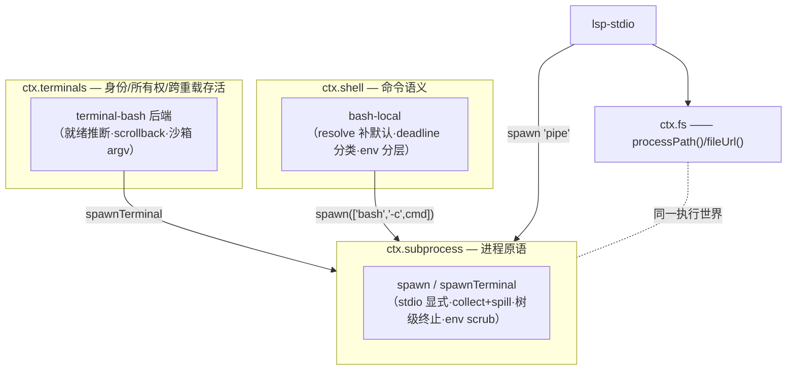

# 第 24 章 Subprocess、Shell 与 Terminal：同一个执行世界

模型要跑命令，harness 至少要回答三个粒度的问题：怎么起一个裸进程（管道、收集输出、杀进程树）、怎么跑一条 bash 命令（超时、cwd、后台任务）、怎么维持一个可以连续交互的终端（PTY、前台进程组、scrollback）。DeepSeek Harness 把它们做成三个叠放的接缝——`ctx.subprocess`、`ctx.shell`、`ctx.terminals`——下层是上层的实现基座，而不是三套平行的进程代码。这一章讲三层各自的职责切分、把它们钉在一起的「同一个执行世界」不变量，以及贯穿三层的几个反常识决策：接缝不给默认值、outcome 不做原因分类、后台进程的生命周期不跟工具走。

## 问题背景

朴素做法是每个需要进程的地方各自 `child_process.spawn`：bash 工具一份 spawn 逻辑，LSP 客户端一份，PTY 用 `node-pty` 再来一份。三份代码各自处理输出缓冲、超时杀进程、环境变量——然后各自漏掉一部分：bash 工具杀了 shell 但孙进程还活着；LSP server 继承了父进程的 `OPENAI_API_KEY`；PTY 的输出缓冲无限增长直到 OOM。更隐蔽的坑是**世界不一致**：文件工具看到的路径和 shell 里 `cwd` 指的不是同一棵目录树（比如文件走远程 API、shell 在本地跑），模型「先 read 再 sed」的合理动作序列就会精神分裂。

分层的另一个诱惑是做成「贫血封装」：`shell.run()` 只是 `spawn()` 的一层薄糖。那样超时语义、输出预算、cwd 默认值还是散在调用方。这三层的价值在于每层压住一类不变量。

## 源码剖析

### 底层：ctx.subprocess——全显式的进程原语

`SubprocessRuntime` 只有三个抽象方法：`resolveExecutable`、`spawn`、`spawnTerminal`。看 spawn 的规格：

```ts
// packages/subprocess/subprocess/src/types.ts
/**
 * A fully-specified spawn request. This seam applies no defaults: every
 * disposition, limit, and directory is explicit, so the caller's own config —
 * not a hidden subprocess-service default — decides them ...
 */
export interface SubprocessSpawnSpec {
  /** Executable and arguments; argv[0] is the program. Never shell-interpreted here. */
  argv: readonly string[]
  cwd: string
  stdio: SubprocessStdio
  graceMs: number
  signal?: AbortSignal | undefined
  env?: NodeJS.ProcessEnv | undefined
}
```

「This seam applies no defaults」是这层的宪法。每条流的去向也必须显式选择：`stdin` 是 `'ignore' | 'pipe' | { data }`，`stdout/stderr` 是 `'pipe' | 'inherit' | SubprocessCollect`。三种消费方各取所需——LSP 的 JSON-RPC 和 ACP 子代理拿 `'pipe'` 自己解协议帧，bash 工具拿 collect 模式（带内存上限 + 可选 spill 文件），language server 的 stderr 拿「只留内存尾巴、不留文件」的诊断形态。

collect 模式的读取器是这层最考究的一笔：

```ts
// packages/subprocess/subprocess/src/types.ts
/**
 * Cursor-free incremental access to one collected output stream. Offsets are
 * whole-stream byte coordinates owned by the caller, so independent readers
 * cannot consume one another's output ...
 */
export interface SubprocessOutputReader {
  readFrom(fromByte: number): SubprocessOutputRead
}
```

读取按调用方自己持有的全流字节偏移量进行，**非消费式**——前台结果、后台增量轮询、UI 展示可以各拿一个 reader 互不干扰；偏移滑出内存尾巴窗口时读到 `lossy: true` 加 spill 文件路径，丢没丢、丢了去哪找，全是显式事实。

环境变量在这层做统一清洗：

```ts
// packages/subprocess/subprocess/src/index.ts
export const SENSITIVE_ENV_PATTERN = /KEY|PASSWORD|SECRET|TOKEN/i

export function scrubbedParentEnv(): Record<string, string> {
  const env: Record<string, string> = {}
  for (const [key, value] of Object.entries(process.env)) {
    if (value !== undefined && !SENSITIVE_ENV_PATTERN.test(key)
      && !key.toUpperCase().startsWith(DSH_ENV_PREFIX)) env[key] = value
  }
  return env
}
```

凭证形态的名字和所有环境里残留的 `DSH_*`（harness 自有命名空间）一律不进子进程；调用方 `env` 里的显式字符串条目在清洗**之后**合并，所以「刻意转发一个 token」依然可行——隐式泄露被堵死，显式意图被放行。终止语义同样收敛成唯一动词：`terminate()` 做树级 SIGTERM→grace→SIGKILL 升级（POSIX 用 detached 进程组，Windows 用 `taskkill /T`，见 `packages/subprocess/subprocess-local/src/spawn.ts`），`waitForExit()` 观察**整棵树**的静默——帮助进程不可能悄悄活过句柄。

而 `done` 的结果刻意「贫血」：

```ts
// packages/subprocess/subprocess/src/types.ts
/**
 * Exit facts of one closed process — Node's close-event vocabulary.
 * Deliberately carries NO timeout or cancellation classification (the caller
 * reads the signal it owns to classify causes) ...
 */
export interface SubprocessOutcome {
  exitCode: number | null
  signal: NodeJS.Signals | null
}
```

进程服务只报告退出事实，不猜「为什么死」——因为 deadline 是调用方创建的，只有调用方能区分「我的超时」和「上游取消」。分类逻辑随之上浮到 shell 层。

### 中层：ctx.shell——bash 命令的语义层

`ShellExecutor` 的三个方法是 `resolve` / `run` / `start`，其中 `resolve` 体现了这层的核心纪律——**request/spec 分离**：模型面向的请求里 `workdir`/`timeoutMs` 可省略，`ctx.shell.resolve(request)` 用实现自己的配置补全并封顶，`run`/`start` 只收补全后的 `ShellExecSpec`、绝不二次取默认值。看 `bash-local` 怎么落到 `ctx.subprocess` 上：

```ts
// packages/shell/bash-local/src/index.ts
export class LocalBashExecutor extends ShellExecutor {
  static inject = ['subprocess']
  // ...
  async run(spec: ShellExecSpec): Promise<ShellRunResult> {
    return this.runArgv(spec, ['bash', '-c', spec.command])
  }

  protected async runArgv(spec: ShellExecSpec, argv: readonly string[]): Promise<ShellRunResult> {
    // One deadline combines timeout and upstream cancellation; disposal clears its timer.
    using d = deadline(spec.signal, spec.timeoutMs, 'BASH_TIMEOUT')
    const handle = this.ctx.subprocess.spawn(this.spawnSpec(spec, argv, spec.stdoutMaxBytes, d.signal))
    const outcome = await handle.done
    const collected = LocalBashExecutor.collected(handle)
    // Only this executor's timeout reason counts as timedOut; outer deadlines count as aborts.
    const timedOut = timeoutOf(d.signal, 'BASH_TIMEOUT') !== undefined
    const aborted = d.signal.aborted && !timedOut
    return { ...outcome, timedOut, aborted, timeoutMs: spec.timeoutMs,
      stdout: finalOutput(collected.stdout), stderr: finalOutput(collected.stderr) }
  }
```

「local shell 通过 `ctx.subprocess` spawn」在这里具体成一行：`['bash', '-c', spec.command]` 是这层**唯一**引入的 shell 解释——下层合同明说 argv「Never shell-interpreted here」。`using d = deadline(...)` 把超时和上游取消熔成一个信号交给下层（下层只负责在 abort 时杀树），事后用 `timeoutOf` 按熔断原因把 `timedOut` 和 `aborted` 拆成互斥的两个事实；连同 `exitCode`/`signal`，`ShellRunResult` 把正交结局独立上报——一个 trap 了 SIGTERM 然后 exit 0 的进程会同时报 `timedOut: true` 和 `exitCode: 0`，调用方永远不会把被掐断的运行误读成干净成功。

环境的合并顺序也在这层定型：`env: { ...ENV_OVERRIDES, ...spec.env, ...spec.dshEnv }`——终端友好覆盖（`TERM=dumb`、`PAGER=cat`）垫底，调用方 env 居中，`ctx.shellEnv` 收集的受信 `DSH_*` 快照压轴，保证托管事实不可能被普通 env 顶掉；整包再交给下层在 scrub 之后合并。而 `runArgv`/`startArgv` 被设计成 protected——[第 25 章](25-sandbox.md)的 `SandboxBashExecutor` 正是继承此类、在执行边界替换 argv 后回调它们。

后台进程 `start()` 返回的句柄没有 id、没有 owner——`tool-bash` 把它适配进通用的 `ctx.jobs` 运行时去获得身份和生命周期。类文档里的合同值得注意：「A still-running background process is stopped and awaited when its owning composition tears down. With the subprocess seam that boundary is `ctx.subprocess` disposal, so a background process survives an executor-only reload」——热重载 bash 执行器插件不打断跑着的后台任务，因为进程真正的属主是下层服务。

### 上层：ctx.terminals——持久 PTY 的注册表与后端

终端层再次复用同一个基座。`ctx.subprocess.spawnTerminal(spec)` 是「非管道进程原语」：provider 负责分配控制终端、UTF-8 文本传输、前台进程组的观察与发信号（普通 `spawn()` 无法重构控制终端语义）。`terminal-bash` 作为后端把它包装成持久 shell 会话：

```ts
// packages/terminal/terminal-bash/src/index.ts
export const inject = ['terminals', 'sandboxPolicy', 'subprocess']

export class BashTerminalBackend implements TerminalBackend {
  async spawn(spec: TerminalBackendSpawnSpec): Promise<LocalPtySession> {
    // ...
    const policy = this.ctx.sandboxPolicy.resolve({ session: spec.owner.session })
    const argv = spawnArgv(this.ctx, this.config, policy)   // 沙箱模式下经 ctx.sandbox.confine 包装
    const terminal = await this.spawnTerminal({
      argv,
      cwd: spec.cwd ?? policy.workspaceRoot,
      env: childEnvironment(spec),   // 受控 PS1 提示符、DSH_PTY_SESSION_ID 等
      rows: this.config.rows, cols: this.config.cols,
      graceMs: this.config.disposeGraceMs, signal: spec.signal,
    })
    const session = this.createSession(terminal, this.config)
    // ...
  }
}
```

职责切分是三段式的：**subprocess provider** 管终端机制（PTY 分配、字节 I/O、前台组信号、整会话静默清理）；**terminal-bash 后端**管 shell 策略——注入受控提示符 `PS1=CONTROLLED_PROMPT` 加 OSC 133 序列做就绪推断（`session.ts` 里的 `acceptsStdinWait` 靠前台进程组是否在等 stdin 判断一次 send 何时归还控制权）、有界 scrollback、输出消毒；**`ctx.terminals` 服务**管身份与所有权——mint branded `TerminalSessionId`，鉴权比较的是**精确的 owner Agent 对象**而不是名字，把清理挂到 owner scope，并保证会话跨后端/工具插件的热重载存活。

`terminal-bash` 里还有一道容易错过的防线：`ensureSandboxModeFence` 监听 `sandbox/mode` 会话事件，只要该 Agent 还有存活的 PTY 会话就**拒绝切换沙箱模式**——因为已在跑的 shell 是按旧策略 confine 的，换模式必须先关终端。执行世界的一致性连时间维度都要守。

### 「同一个执行世界」

三层讲完，回到贯穿它们的不变量。`SubprocessRuntime` 的实现合同第一条（`packages/subprocess/subprocess/src/index.ts` 类文档）：

```text
- Executable paths belong to one execution world shared with the mounted
  filesystem provider.
```

配对的是上一章 `ctx.fs` 的出口方法：`processPath(target)` 返回「本执行世界里的子进程能打开的规范绝对路径」。两个接缝各自留了一半接口，拼起来才是承诺：**fs 解析出的目标，进程侧一定打得开；进程 cwd 指向的目录，fs 一定解析得到。** 消费方据此跨能力协作而不解析任何不透明 key——`lsp-stdio` 是教科书式示范：

```ts
// packages/lsp/lsp-stdio/src/host.ts
export async function canonicalizeWorkspace(fs: FileSystem, workspaceRoot: string, signal?: AbortSignal): Promise<HostWorkspace> {
  // ...
  return {
    target,
    canonicalPath: fs.processPath(target),  // ← 作为 subprocess cwd
    fileUrl: fs.fileUrl(target),            // ← 作为 LSP initialize 的 rootUri
  }
}
```

于是「换世界」变成机械操作：E2B 组合里，`ctx.e2b` 持有唯一的远程沙箱句柄，`fs-e2b` 与 `subprocess-e2b` 都从它取沙箱（`docs/capability-seams.md`：「so both fundamental E2B providers inhabit the same Linux runtime」），`processPath` 返回的是远程 Linux 路径、spawn 在远程执行——bash、后台任务、PTY（`subprocess-e2b/src/terminal.ts` 实现了远程 `spawnTerminal`）、LSP 全部落进同一个远程世界，三层的任何代码都没改。



## 设计亮点

> 💎 **设计亮点：默认值只许出现在一层。** subprocess 规格「no defaults」全显式，shell 用 `resolve()` 把默认值集中成一次显式补全，工具层拿到的 spec 已无空洞。普通写法里 `timeout ?? 120_000` 会散落在每个调用点，改一处默认值要全库 grep；这里「explicit > implicit at package boundaries」被架构成了不可能写错的形状。

> 💎 **设计亮点：outcome 不分类原因，deadline 归属调用方。** `SubprocessOutcome` 只有 `exitCode`/`signal`；bash-local 用一个熔断的 `deadline` 信号事后拆出互斥的 `timedOut`/`aborted`。如果下层替调用方猜原因，两层各持一份分类逻辑必然漂移；把「谁拥有 deadline 谁负责解释」定成合同，正交结局才能被独立、准确地上报。

> 💎 **设计亮点：偏移量读取器让输出没有唯一消费者。** 传统 stream 是消费式的，前台等待、后台轮询、结果渲染抢同一份数据必出 bug。`readFrom(fromByte)` 把游标交给各调用方自己持有，同一份有界缓冲支撑任意多个独立读者，truncation 与 spill 恢复路径都是显式事实而非静默丢失。

> 💎 **设计亮点：进程生命周期锚定在最底层服务上。** 后台进程和 PTY 会话都在 `ctx.subprocess` 服务的 disposal 边界被杀死并 join，而不是跟随创建它们的执行器或工具插件——于是热重载 bash 执行器不打断后台任务、重载 PTY 后端不丢终端会话。「谁被替换得最少，谁当属主」是可逆性设计在进程管理上的应用。

## 小结与延伸

三层执行接缝各压一类不变量：subprocess 层管进程原语的完备性（显式 stdio、树级终止、env 清洗、非消费式读取），shell 层管命令语义（默认值补全、超时/取消分类、env 分层），terminal 层管持久会话的身份与所有权。fs 的 `processPath()` 与 subprocess 的「shared execution world」合同互为两半，让 bash、PTY、LSP、子代理全部长在同两个地基接缝上——上一章的文件世界与本章的进程世界因此能被一对 provider 整体搬迁。下一章看第三个正交维度：不换世界，而是把本地世界圈起来的 `ctx.sandbox`。

**阅读清单**

- `docs/subsystems/subprocess.md`、`shell.md`、`terminal.md` — 三层的完整合同
- `packages/subprocess/subprocess-local/src/spawn.ts` — detached 进程组、平台差异化的树级终止
- `packages/terminal/terminal-bash/src/sanitize.ts` — 受控提示符与终端输出消毒
- `packages/e2b/subprocess-e2b/src/` — 同一合同的远程实现（含远程 PTY）
- `.agents/notes/implemented/feature/2026-07-16-persistent-pty-sessions.md` — 持久 PTY 的设计动机
