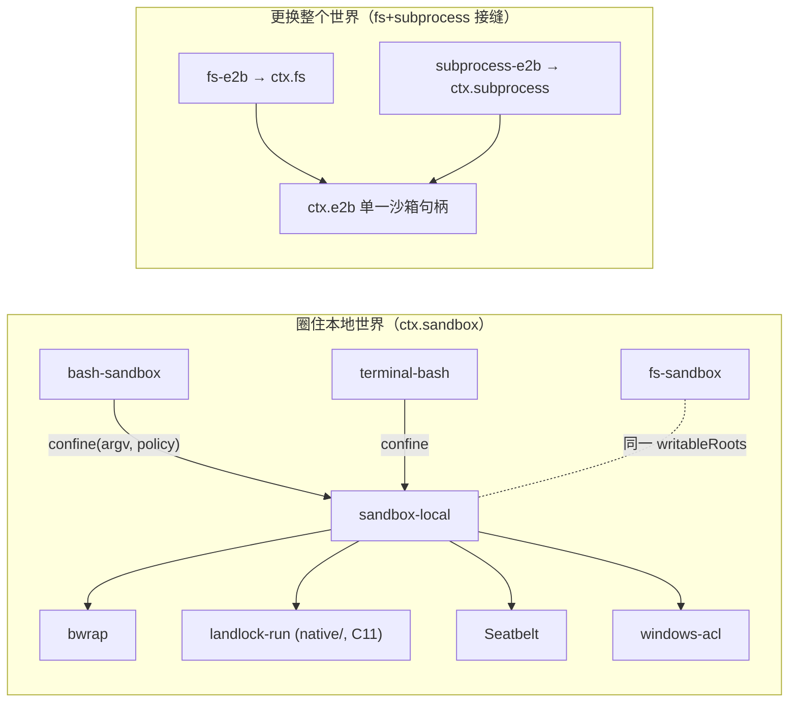

# 第 25 章 Sandbox：进程约束与远程执行

上一章的执行世界可以整体搬去远程，但更常见的需求是：就在本机跑，只是不许模型的命令乱写文件。DeepSeek Harness 的 `ctx.sandbox` 接缝给出了一个刻意「小」的答案——它不拦截系统调用、不代理执行，只做一件事：**把消费方即将 spawn 的 argv 包装成一个受约束的 argv 还回去**。这一章解剖这个包装式（wrapping）设计与更常见的拦截式方案的分野、backend 链的失败关闭（fail-closed）机制、`native/` 目录里那个 298 行的 C 启动器，以及一个容易混淆的边界问题：E2B 远程沙箱为什么**不是** `ctx.sandbox` 的 provider。

## 问题背景

给 agent 的 bash 命令加文件系统约束，直觉方案有几类。**拦截式**：LD_PRELOAD 钩 libc（静态链接的程序直接漏掉）、ptrace 监督（性能和信号语义都是雷）、或者自己当代理逐条审查命令字符串（`bash -c` 的组合语义根本不可静态审查）。**容器式**：把命令丢进 Docker——但那其实换了执行世界：文件系统是镜像的、装的工具链不在了、和 `ctx.fs` 看到的目录树对不上。**平台原生**：Linux 的 Landlock/bwrap、macOS 的 Seatbelt、Windows 的 restricted token——语义最对（同一世界、内核强制），但三个平台三种机制、三种失败方言，抽象不好就会把平台细节漏到每个调用方。

还有两个必须一开始就想清楚的问题：**沙箱自己坏了怎么办**（bwrap 没装、内核太老）——静默放行等于没有沙箱；**怎么从失败的命令输出里区分**「命令自己失败」「沙箱拒绝了文件操作」「沙箱运行器压根没跑起来」——这三者对模型的意义完全不同（重试、请求升级、报告基础设施故障）。

## 源码剖析

### 包装式接口：一个同步方法

整个 Service Definition 只有一个抽象方法：

```ts
// packages/sandbox/sandbox/src/index.ts
export abstract class SandboxProvider extends Service {
  /**
   * Wrap `argv` so it executes confined under `policy` on this host; the
   * caller spawns the returned argv in place of its own.
   * @param argv - the exact argv the caller is about to spawn ..., NOT a
   *   shell string — a shell-shaped consumer passes `['bash', '-c', command]`.
   */
  abstract confine(argv: readonly string[], policy: SandboxPolicy): ConfinedArgv
}
```

这就是 `docs/capability-seams.md` 表里那句「consumers hand over the exact argv they are about to spawn; same-world backends wrap it under a per-call policy」。对比拦截式，包装式的关键性质：

- **provider 不接触进程**。它不 spawn、不监督、不持有子进程状态，只做 argv 变换——同步、无副作用、天然支持并发调用带不同策略（注释明说：bash 在 `read-only` 的同时，一个受限子代理可以要求自己的状态目录可写）。
- **执行路径不分叉**。消费方拿回 `ConfinedArgv.argv` 后走的还是[上一章](24-execution-world.md)的 `runArgv`/`spawnTerminal`——超时、输出收集、树级终止、env 清洗全部复用，沙箱不需要自己的进程管理代码。
- **约束由内核执行**。包装出来的 argv 是 `bwrap ... -- bash -c cmd` 或 `landlock-run ... -- bash -c cmd`，真正的强制在内核；harness 进程自身始终不受限。

策略按调用携带（`SandboxPolicy`：`mode` + `workspaceRoot` + 可选 `sessionId`），且 `danger-full-access` 被类型排除在外——`ConfinedSandboxMode = Exclude<SandboxMode, 'danger-full-access'>`，全放行的调用方**根本不调 `confine`**，「绕过沙箱」在类型上就不是 provider 需要处理的分支。

### ConfinedArgv：把「事后归因」做成合同

包装式有个天然难题：命令跑完了，stderr 里的 `EACCES` 到底是沙箱拒绝还是命令自己的权限问题？runner 退出码 1 是命令失败还是 runner 没启动？`ConfinedArgv` 把归因证据随 argv 一起返回：

```ts
// packages/sandbox/sandbox/src/index.ts
export interface ConfinedArgv {
  /** The wrapped argv (runner, profile, separator, then the caller's argv). */
  argv: string[]
  enforcement: SandboxEnforcement   // 'full' | 'partial'
  /**
   * The selected backend's denial DIALECT: the case-insensitive stderr
   * substrings a file effect denied by THIS backend produces (EROFS text
   * under bwrap's read-only binds, EACCES under Landlock, EPERM under
   * Seatbelt). A consumer ... matches against exactly these rather than a
   * cross-backend union — the union claims denials a given backend never produces.
   */
  denialSignatures: readonly string[]
  /** Structured runner-failure evidence rules. ... */
  runnerFailureRules: readonly RunnerFailureRule[]
}
```

`denialSignatures` 是**本次选中的 backend 的拒绝方言**，不是所有平台方言的并集——并集会把 bwrap 永远不会产生的 `EPERM` 也当成 bwrap 的拒绝证据，制造假阳性。`runnerFailureRules` 则是结构化的「运行器自己挂了」证据：非零退出码门限 + 一行 stderr 内的致命签名 + 先按整行精确匹配剔除的良性提示行——「Exit status alone never proves runner failure」。消费方 `bash-sandbox` 的归因顺序严格是：runner 失败 > 拒绝 > 普通命令失败：

```ts
// packages/shell/bash-sandbox/src/index.ts
override async run(spec: ShellExecSpec): Promise<ShellRunResult> {
  const policy = spec.sandboxPolicy as SandboxExecutionPolicy
  const { mode } = policy
  if (mode === 'danger-full-access') {
    const result = await super.run(spec)
    return { ...result, sandbox: { mode, denied: false } }
  }
  const confined = this.confine(spec.command, { ...policy, mode })
  let result: ShellRunResult
  try {
    result = await this.runArgv(spec, confined.argv)   // ← 复用本地执行器全部机制
  } catch (error) {
    if (spec.signal?.aborted === true) spec.signal.throwIfAborted()
    if (isRunnerSpawnFailure(error, confined.argv[0], spec.workdir)) {
      throw new SandboxUnavailableError(mode, String(error))
    }
    throw error
  }
  // Runner failure outranks denial because the command did not run.
  const runnerFailure = classifyRunnerFailure(result.exitCode, result.stderr.text, confined.runnerFailureRules)
  if (runnerFailure !== undefined) throw new SandboxUnavailableError(mode, runnerFailure.detail)
  return { ...result, sandbox: { mode, denied: classifyDenial(result, confined.denialSignatures), enforcement: confined.enforcement } }
}
```

整个类只是 `LocalBashExecutor` 的子类：`confine` 一下、把 argv 换掉、事后归因——沙箱化 bash 执行器的**全部新代码**就是包装与归因，第 23 章 `fs-sandbox` 的「差量 provider」模式在这里再现。归因结果作为 `result.sandbox` 事实随工具结果给到模型，模型看到 `[sandbox: …]` 拒绝标记后可以带 `sandbox_permissions` + `justification` 请求一次**严格更宽**的重试，由 `ctx.approval` 审批放行（见 `docs/subsystems/shell.md`）。

失败关闭写进了 Definition：`confine` 要么返回强制执行的 argv，要么抛 `SandboxUnavailableError`（code `SANDBOX_UNAVAILABLE`）——「Silent unconfined passthrough is never legal for a confined policy」。

### sandbox-local：平台链与功能探针

本地 provider 按平台选 runner 链：

```ts
// packages/sandbox/sandbox-local/src/index.ts
const PLATFORM_CHAINS: Record<string, readonly SelectedRunner['runner'][]> = {
  linux: ['bwrap', 'landlock'],
  darwin: ['seatbelt'],
  win32: ['windows-acl'],
}
```

选择规则是「平台优先，探针仲裁」：只有链上多于一个候选时才做功能探针（Linux 上先探 bwrap——真的用只读 profile 跑一次 `true`，失败再探 Landlock 启动器），唯一候选直接选中、由其执行期拒绝兜底失败关闭。探针都是**功能性**的：不是「二进制存在吗」而是「内核真的接受并强制这个 profile 吗」（`defaultProbeSeatbelt` 用真实 read-only profile 跑 `sandbox-exec -p ... -- true`）。`enforcement: 'partial'` 同样是探出来或 backend 自报的事实——老 Landlock ABI 管不全的文件效果、Windows ACL 的 Everyone/硬链接边界都会如实降级上报，要求绝对边界的调用方必须自己拒绝 partial。

### 验证：native/ 目录里的沙箱原生代码

任务书问「`native/` 里是否有 sandbox 相关原生代码」——**有，且只有这一个**：`native/landlock-run/`，即 Linux 链第二级 runner 的来源，以 npm 包 `@deepseek-ai/node-addon-landlock-run` 的形式被 `sandbox-local` import。README 的自我描述：「~300 lines of C11 over the raw kernel UAPI, statically linked against musl」，实测 `packages/entry/src/main.c` 共 298 行。机制是 **self-restrict-then-exec**：

```c
// native/landlock-run/packages/entry/src/main.c（节选）
#define __NR_landlock_restrict_self 446
// ...
if (prctl(PR_SET_NO_NEW_PRIVS, 1, 0, 0, 0) != 0) { /* fail */ }
if (syscall(__NR_landlock_restrict_self, ruleset_fd, 0) != 0) { /* fail */ }
// ...
execvp(cli.command[0], cli.command);
```

启动器先给**自己**装上 Landlock 规则集，然后 `execvp` 被包装的命令——规则集跨 `execve` 继承，命令及其所有子孙进程全部受限，而调用它的 harness 进程毫发无损。这是包装式设计在内核层的镜像：不监督、不代理，安好笼子就把自己变成猎物。失败关闭同样贯彻到底：内核无法强制则以 `LAUNCHER_FAILURE_EXIT`(125) 退出、不跑命令；发行方式是 per-platform 预编译 npm 包，没有 install 时编译回退——「on a host without a platform package the resolved path never exists, the probe reports `unusable`, and the consumer falls closed」。

（Windows 一侧的 `packages/sandbox/sandbox-windows-acl/` 是 restricted-token runner，纯 TypeScript 经 FFI 调 Win32 ABI，不在 `native/`。）

### E2B：为什么远程沙箱不走这条接缝

`docs/subsystems/sandbox.md` 开篇就划清界限：「Containers, microVMs, and remote execution are sibling implementations of **whole capability seams**, not providers of `ctx.sandbox`」。原因藏在 `ctx.sandbox` 的隐含前提里——它是 **same-world** 约束：包装后的 argv 仍在本机 spawn，仍访问 `ctx.fs` 指向的同一棵目录树，只是被圈住。而 E2B 是**另一个世界**：文件和进程都在远程 Linux 里。硬把它做成 `confine()` 的 provider，返回的 argv 在本地 spawn 个什么？

所以 E2B 借的是[第 22 章](22-seam-triangle.md)的另一条接缝组合：`fs-e2b` 实现 `ctx.fs`、`subprocess-e2b` 实现 `ctx.subprocess`，两者共享 `ctx.e2b` 持有的唯一 SDK 句柄（「so both fundamental E2B providers inhabit the same Linux runtime」）。此时隔离由 microVM 边界天然提供，`ctx.sandbox` 在该组合里可以不存在——`terminal-bash` 对此有防御：策略要求受限模式而执行世界里没有 `ctx.sandbox` provider 时直接抛错，绝不静默放行。两种手段正交而可叠加的全景：



左右两边最终对模型呈现同一套工具 schema——这正是能力接缝的全部意义。

## 设计亮点

> 💎 **设计亮点：包装式把 provider 缩成一个纯函数。** 拦截式沙箱必须介入执行（监督进程、代理 I/O），provider 被迫持有进程状态并复制一遍超时/终止逻辑。`confine(argv, policy) → ConfinedArgv` 同步无状态，策略按调用携带，执行 100% 复用 subprocess 接缝——沙箱能力与进程能力正交分解，各自可独立替换。

> 💎 **设计亮点：拒绝方言按 backend 下发，不做跨平台并集。** 事后归因是包装式的软肋，这里把它做成合同数据：每次 `confine` 返回**本 backend** 的 stderr 拒绝签名与结构化 runner 失败规则，消费方按「runner 失败 > 拒绝 > 命令失败」的优先级归因。换一个 backend，归因证据自动跟着换，消费方零改动。

> 💎 **设计亮点：失败关闭贯穿四层。** Definition 禁止静默放行；sandbox-local 的功能探针探不过就抛 `SANDBOX_UNAVAILABLE`；landlock-run 内核不强制就 exit 125 不跑命令；npm 发行故意不带编译回退，没有平台包就 `unusable`。每一层的「坏了」都收敛到显式失败，没有一层会退化成「假装有沙箱」。

> 💎 **设计亮点：enforcement 是被报告的事实，不是被假设的属性。** `full/partial` 由探针和 backend 自报（老 Landlock ABI、Windows ACL 的先天缺口都如实标 partial），随每次包装返回并最终随工具结果落盘。普通实现会把「有沙箱」当布尔值；这里把「沙箱管得有多全」做成一等数据，把判断权留给需要绝对边界的调用方。

## 小结与延伸

`ctx.sandbox` 是一个刻意收窄的接缝：只管同世界进程的文件效果，只做 argv 包装,策略按调用携带，失败一律关闭。平台差异被压进 sandbox-local 的 runner 链与按 backend 下发的归因方言里，`native/landlock-run` 用 298 行 C 实现了 self-restrict-then-exec 的内核级笼子。而远程执行被明确排除在这条接缝之外——它是 fs+subprocess 接缝的兄弟实现，两种手段在组合层各取所需。下一章看两个纯消费方视角的接缝：LSP 与 code-runtime 如何在这些地基上长出来。

**阅读清单**

- `docs/subsystems/sandbox.md` — 模式、策略、方言分类的完整合同
- `packages/sandbox/sandbox/src/escalation.ts` — 一次性升级重试的审批词汇（`WIDER_MODES`、`sandbox_permissions`）
- `packages/sandbox/sandbox-local/src/profiles.ts` — bwrap/Landlock/Seatbelt 三家的 profile 生成
- `native/landlock-run/docs/cli-contract.md` — 启动器的 argv 语法、退出码与报告行合同
- `.agents/notes/implemented/feature/2026-07-06-sandbox.md` — 沙箱策略与模式切换的完整设计记录
