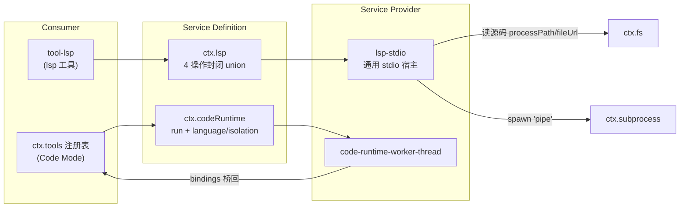

# 第 26 章 LSP 与 code-runtime

本部分最后两个接缝有点特别：LSP 给模型语义级代码导航（跳定义、找引用），code-runtime 让模型改用**写程序**的方式调工具（Code Mode）。它们自己不拥有任何 OS 资源——LSP 的 language server 要靠进程接缝拉起、源码要靠文件接缝读，code-runtime 的消费方甚至不是某个工具包而是工具注册表本身。这一章看这两个「站在别的接缝肩膀上」的能力如何接入：一个演示了消费执行世界的标准姿势，另一个演示了接缝消费方可以深入到 harness 核心的什么位置。

## 问题背景

**LSP 侧**的朴素做法是给模型一个「lsp」工具、后面直连某个 language server 进程，坑排着队来：LSP 协议是位置编码敏感的（UTF-8/UTF-16 offset 谈判）、有初始化握手和能力协商、server 会崩要重启、不同语言要不同 server、workspace 的 rootUri 在远程执行时根本不是本地路径。更要命的诱惑是把整个 JSON-RPC 面暴露给模型或插件——从此每个消费方都耦合协议细节，backend 再也换不动。

**code-runtime 侧**：Agent 每次工具调用都要一轮模型往返，批量操作（读 50 个文件、逐个改名）极其昂贵。让模型写一段程序、程序里直接调工具，一轮往返干完——这就是 Code Mode。但「执行模型写的代码」的朴素实现是 `eval` 或 `new Function`：模型代码和 harness 同一个堆、同一个事件循环，一个 `while(true)` 就把整个 harness 挂死，更别提原型链污染。需要的是一个有预算、可终止、把宿主函数安全桥接进去的执行基座——而且它本身也该是可替换的（worker 线程今天够用，明天可能要进程级或容器级）。

## 源码剖析

### LSP Definition：四个操作，没有逃生舱

`ctx.lsp` 的合同小得惊人：

```ts
// packages/lsp/lsp/src/types.ts
export type LspOperation = 'goToDefinition' | 'findReferences' | 'goToImplementation' | 'hover'

export type LspQueryResult =
  | { readonly kind: 'locations'; readonly locations: readonly LspLocation[]; readonly resolvedWorkspaceUri: string }
  | { readonly kind: 'hover'; readonly hover: LspHover | null }

export interface LspService {
  registerProvider(provider: LspProvider): () => void
  query(request: LspQueryRequest, signal?: AbortSignal): Promise<LspQueryResult>
}
```

操作是**封闭 union**——加第五个操作是横跨接缝、provider、工具的编译期强制变更；结果也是封闭 union，消费方 `switch` 到穷尽。文档里那句合同值得抄下来：「The seam offers **no protocol escape hatch**, so a backend translates into the normalized request and result」——没有 `sendRawRequest()` 后门，任何 backend 想接入就必须完整翻译到规范化词汇，消费方因此永远不会绕过接缝耦合到某家协议实现。provider 注册按「id + 扩展名映射」**原子**保留（冲突则什么都不发布，disposer 释放全部保留），查询按文件扩展名逐次选择 provider，无匹配抛 `LSP_UNAVAILABLE`。

一个远程化伏笔：`locations` 结果携带 `resolvedWorkspaceUri`——provider 视角的规范 workspace `file:` URI。消费方要把结果 URI 相对化时必须用它，而不是拿宿主平台的路径规则去切请求路径，「the execution platform may differ from the caller's」。

### lsp-stdio：站在两个地基接缝上的通用宿主

Provider 侧没有 per-language 包，而是一个**配置驱动的通用 stdio 宿主**：

```ts
// packages/lsp/lsp-stdio/src/index.ts
/**
 * ... Providers read sources through `ctx.fs` and launch servers through
 * `ctx.subprocess`, so both local and remote implementations share one host.
 */
export const inject = ['fs', 'lsp', 'subprocess']
```

配置一张 `servers` 表（每项：`command`、`args`、`extensionToLanguage`、各种字节/超时上限），插件为每项注册一个独立 provider。运行机制全在注释里声明：每个 provider **按 canonical workspace 惰性单飞（single-flight）一个 server 进程**，用 transient-open（查询时临时 `didOpen` 文档、查完关掉）服务查询，transport 在下一次只读查询前失败则替换重启。

它消费执行世界的方式是上一章伏笔的兑现——workspace 与源码全部经 `ctx.fs` 取得坐标：

```ts
// packages/lsp/lsp-stdio/src/host.ts
export async function canonicalizeWorkspace(fs: FileSystem, workspaceRoot: string, signal?: AbortSignal): Promise<HostWorkspace> {
  // ...resolve + stat 校验是目录...
  return {
    target,                                 // 稳定身份，用于 server 进程池的键
    canonicalPath: fs.processPath(target),  // ← language server 的 cwd
    fileUrl: fs.fileUrl(target),            // ← initialize 的 rootUri
  }
}
```

server 进程经 `ctx.subprocess.spawn` 以 `'pipe'` stdio 拉起（`connection.ts`：「A JSON-RPC endpoint over one language server spawned through the subprocess seam」，协议帧自己解，进程组/树终止归下层），stderr 用「只留内存尾巴」的 collect 形态做诊断。于是 fs+subprocess 指向 E2B 时，**language server 在远程沙箱里跑、读远程文件、报远程 URI**，lsp-stdio 一行不改——第 22 章「换世界」的清单里 LSP 就是这么免费上车的。

Consumer 侧 `tool-lsp` 同样克制（`packages/lsp/tool-lsp/src/index.ts` 模块注释）：一个只读 `lsp` 工具四种操作，one-based ↔ zero-based 坐标转换、结果截断渲染、超时预算声明都在工具层，「It runtime-injects only `tools`, `lsp`, and `systemPrompt` and **imports no provider**」。

### code-runtime Definition：跑一个程序，别的什么都不知道

`ctx.codeRuntime` 的合同同样一句话能说完：跑**一段**模型写的程序，把宿主异步函数按命名空间注入成程序内全局对象，报告它打印了什么、返回了什么：

```ts
// packages/code-runtime/code-runtime/src/index.ts
export abstract class CodeRuntime extends Service {
  /** The source language run expects ... Well-known values: 'typescript' and 'python' ... */
  abstract readonly language: string
  /** The execution substrate ... a descriptor ..., not a security claim. */
  abstract readonly isolation: string
  abstract run(request: CodeRunRequest): Promise<CodeRunResult>
}
```

回答任务书的验证问题：**code-runtime 不是通用「代码解释器」工具**——仓库里没有一个叫 `tool-code` 的消费方,模型也没有一个「run_python」工具。它的定位是 Code Mode 的执行基座：程序作为 async 函数体运行（顶层 `await`/`return` 可用），`bindings` 里的每个 `CodeBindingNamespace` 变成一个全局对象（Code Mode 只传一个：`tools`），参数与返回值必须是无损 JSON。失败是结果字段而非 rejection，且六种失败正交上报：`exception` / `timeout` / `abort` / `worker-exit` / `invalid-output` / `output-limit`——OOM 死掉的基座（worker-exit）不是超时，预算耗尽不是异常，模型收到的自纠错信号是精确的。

Definition 里最有意思的是三张**跨语言保留名单**。`RESERVED_BINDING_GLOBALS`（`console`、`__dsh_main__`、`__builtins__`、`__name__`、`__debug__`）与 `PORTABLE_RESERVED_WORDS`（ECMAScript ∪ Python 的保留字并集）由**每个** backend 共同拒绝，注释解释了为什么不能各拒各的：

```ts
// packages/code-runtime/code-runtime/src/index.ts（注释节选）
// One shared set — rather than each backend refusing only its own slots —
// keeps the portability promise real: a namespace list valid on one backend
// is valid on all, so a caller cannot pick a name that works on the worker
// and collides on Python (or vice versa).
```

Python backend 还没发布（`language` 的 well-known 值里只有 `'typescript'` 有实现），但它的命名空间约束已经生效——`lambda` 今天就注册不进去。接缝在**只有一个 provider 的时候就为第二个 provider 立法**，这是可移植性承诺和「事后兼容性破坏」的区别。

### worker-thread provider：容不下的都算清楚

唯一发布的 backend 是 `code-runtime-worker-thread`（`language = 'typescript'`，`isolation = 'worker-thread'`）。模块注释先把威胁模型说死：「This is **containment, not a security boundary**: model code has bash-equivalent trust」——模型代码本来就能用 bash 干任何事，worker 提供的是资源圈护，不是新的信任边界（呼应 `isolation` 描述符「not a security claim」的措辞）。每次运行一个新 worker：`node:module` 的 `stripTypeScriptTypes` 剥掉类型直接执行，binding 调用经 message port 桥接，堆上限走 `resourceLimits`（超了 worker 死、上报 `worker-exit`）。预算设计是这个包的招牌：

```ts
// packages/code-runtime/code-runtime-worker-thread/src/index.ts（Config 注释节选）
/**
 * Busy-time budget in milliseconds: the run fails with kind 'timeout'
 * once the worker's MEASURED event-loop active time
 * (`worker.performance.eventLoopUtilization()`) exceeds this. Metering
 * measured busy time — not wall time, not host-side pending-call
 * bookkeeping — is what makes the budget both fair (a program awaiting a
 * slow tool accrues nothing) and ungameable (a hot loop accrues whether
 * or not a decoy dispatch is in flight).
 */
computeMs?: number
/** Wall-clock ceiling ... The backstop for what busy-time cannot see
 * (a program awaiting a promise nobody will resolve). */
maxWallMs?: number
```

计费的是 worker 事件循环的**实测忙碌时间**：程序 await 一个慢工具不计费（公平——工具慢不该吃掉程序预算），热循环里挂个诱饵调用也照样计费（不可钻营）；wall-clock 上限兜住忙碌时间看不见的「等一个永远不 resolve 的 promise」。终止用 `worker.terminate()`，同步死循环也停得下来——这正是 `eval` 方案永远做不到的。binding 名被当敌意输入处理（null-prototype 构造，`__proto__` 只是普通自有属性）。

### 消费方是工具注册表本身

Code Mode 的接入位置在 `ctx.tools`（`docs/capability-seams.md`：`ctx.codeRuntime` 的 Direct consumers 一栏只有 `tools`）：

```ts
// packages/core/tools/src/index.ts
private requireCodeRuntime(mode: ToolPresentationMode): CodeRuntime {
  const runtime = this.ctx.get('codeRuntime')
  if (!runtime) {
    throw new Error(`dsh-tools: mode "${mode}" requires a code runtime — load a ctx.codeRuntime implementation (e.g. @deepseek-ai/dsh-code-runtime-worker-thread) or set tools mode to "native"`)
  }
  if (!Object.hasOwn(SDK_RENDERERS, runtime.language)) { /* fail loud */ }
  return runtime
}
```

注册表按 `runtime.language` 选 SDK 渲染器，把当前会话可用的工具渲染成程序可见的类型化 `tools.*` 绑定（arguments/返回值走上文的无损 JSON 合同），模型的程序对工具的调用**仍然逐条穿过第 19 章的三段 waterfall 执行流水线**——审批、权限、观察策略对 Code Mode 一视同仁。注意防御姿势的选择：`ctx.get('codeRuntime')` 是可选读取（native 模式不需要 runtime），但 code mode 下缺失就大声失败并给出两条修复路径——可选依赖不等于静默降级。

两个接缝的接入拓扑放在一张图里：



左下角是本章的题眼：lsp-stdio 对 fs 和 subprocess 的两条边，就是「执行世界可整体搬迁」的最后一块拼图；右侧 worker 的 bindings 箭头调头指回 `ctx.tools`——消费方与 provider 在运行期互为客户端，而合同仍只有无损 JSON 一层。

## 设计亮点

> 💎 **设计亮点：封闭 union + 无逃生舱，接缝才换得动。** 普通 LSP 封装总会留一个 `request(method, params)` 后门「以防万一」,然后所有消费方都从后门走，backend 从此焊死。`ctx.lsp` 只有四个操作、两种结果，加操作是编译期强制的三方变更——约束消费方的同时，也把「任何 backend 都能完整实现这个合同」变成了可信承诺。

> 💎 **设计亮点：provider 是「配置 × 通用宿主」，不是「语言 × 包」。** 朴素演化会长出 lsp-typescript、lsp-python、lsp-go 一堆包，各自复制握手/重启/编码谈判。lsp-stdio 把协议机制写一遍，语言差异降维成 `servers` 表里的一行配置；又因为它只站在 fs+subprocess 上,同一个宿主天然覆盖本地与远程两种世界。

> 💎 **设计亮点：预算计的是实测忙碌时间。** wall-clock 超时会冤枉 await 慢工具的程序，宿主侧记账会被诱饵调用绕过。用 `eventLoopUtilization()` 计实测 busy time、wall-clock 只做兜底，「公平且不可钻营」两个通常互斥的性质同时成立——这是把计量学问题当工程问题认真解的罕见例子。

> 💎 **设计亮点：为还不存在的 backend 立法。** `PORTABLE_RESERVED_WORDS` 在 Python backend 发布前就拒绝 `lambda` 做绑定名，`RESERVED_BINDING_GLOBALS` 一份名单全体 backend 共守。接缝的可移植性承诺不是「以后再兼容」，而是从第一天就把未来 provider 的约束并进合同——宁可今天严一点，不要明天破坏性收紧。

## 小结与延伸

LSP 和 code-runtime 展示了能力接缝的两种「上层」形态：前者是执行世界之上的复合消费方——Definition 收窄到四个操作零逃生舱，通用 stdio 宿主借 fs+subprocess 两条地基自动获得本地/远程双形态；后者是深入 harness 核心的基座——工具注册表本身作为 Consumer,把工具面渲染成程序绑定，worker provider 用实测忙碌时间预算圈护模型代码。至此第六部分的图景完整了：两个地基接缝（fs、subprocess）、三层执行栈（subprocess/shell/terminal）、一个正交约束（sandbox）、两个上层能力（lsp、code-runtime），全部由第 22 章的同一个三角模型组织——这也是读任何一个新增 `packages/` 目录时应该带着的那张地图。

**阅读清单**

- `docs/subsystems/lsp.md`、`docs/subsystems/code-runtime.md` — 两条接缝的完整合同
- `packages/lsp/lsp-stdio/src/instance.ts` 与 `translate.ts` — server 生命周期、位置编码谈判与结果规范化
- `packages/code-runtime/code-runtime-worker-thread/src/bootstrap.ts` — worker 内的程序包装与 console 捕获
- `packages/core/tools/src/code-mode.ts` — 工具面到程序绑定的完整渲染（接[第 19 章](../part5/19-tool-pipeline.md)）
- `.agents/notes/implemented/architecture/2026-07-15-lsp-capability-seam.md`、`.agents/notes/implemented/feature/2026-06-15-code-mode.md` — 两个能力的决策记录
