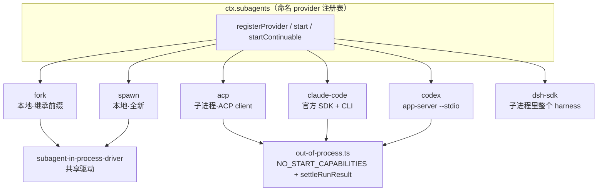

# 第 30 章 Subagent：从子代理到跨产品委托

多智能体是这两年 agent 工程里最容易写烂的部分：子代理怎么创建、上下文继承多少、权限怎么收窄、结果怎么回传，每一问都能长出一坨特判。DeepSeek Harness 把这一切收进一个 seam——`ctx.subagents` 的命名 provider 注册表。同一个接口下，「本地起一个全新子 agent」和「把一个 turn 委托给另一个产品（Claude Code、Codex、任何 ACP agent）」是两个 provider 的差别，而不是两套系统。这一章读 `packages/subagent/` 的 11 个包，共约 8400 行。

## 问题背景

朴素的子代理实现是在工具执行函数里递归调用主循环：new 一个 messages 数组、跑同一个 loop、把最后一条回复当结果。问题立刻排队出现：子代理要不要看到父对话？（有时要有时不要——于是加个布尔参数。）子代理能不能再开子代理？（会无限递归——于是加个全局深度计数，然后发现进程重启后计数丢了。）子代理跑一半父亲被取消了怎么办？想把子任务交给另一个更擅长的产品跑怎么办？——每一问都在朴素实现上打一个洞。

Harness 的答案延续[第 22 章](../part6/22-seam-triangle.md)的接缝三角：定义包 `subagent` 只写契约（接口、能力表、事件、深度记账、continuation 管理器），六个 provider 包各自实现一种传输，三个 tool 包提供模型可见面。子代理的会话就是普通 [Session](../part4/13-session-event-log.md)，父子关系、深度、委托策略全部落在日志里。

## 源码剖析

### Provider 接口：五个成员，两种能力发现机制

```ts
// packages/subagent/subagent/src/types.ts
export interface SubagentProvider {
  /** Unique registry name (e.g. `spawn`, `fork`, `acp`). */
  readonly name: string
  /** The start-time features this provider supports (see {@link SubagentCapabilities}). */
  readonly capabilities: SubagentCapabilities
  /**
   * Whether the child sees the parent's completed-turn prefix. This is descriptive, not a
   * service-validated start capability: the model-facing tool derives truthful wording from it.
   */
  readonly inheritsParentContext: boolean
  start(request: ResolvedSubagentStartRequest): Promise<SubagentRun>
  /**
   * OPTIONAL (continuable-creation capability): ... Method presence IS the
   * capability: the service rejects continuable starts on providers without it ...
   */
  prepareContinuable?(request: ContinuableCreateRequest): Promise<ContinuableCreateSpec>
}
```

注册是命名注册表（模块注释直接点明：像 LLM adapter 注册表，不像单例的 bash executor——多个 provider 共存，调用方按名字选）。`tool-subagent` 的配置里写 `provider: 'spawn'`，工具挂载时按名字解析；provider 还没加载就监听 `subagent/provider-added` 等它出现，加载顺序无关。

能力有两种表达。静态能力是四个布尔（`outputSchema` / `depthLimit` / `toolFilter` / `persona`），服务在派发给 provider **之前**逐条校验：

```ts
// packages/subagent/subagent/src/index.ts — assertCapabilities()
const needs: { when: boolean; cap: keyof SubagentCapabilities }[] = [
  { when: request.outputSchema !== undefined, cap: 'outputSchema' },
  { when: request.maxDepth !== undefined, cap: 'depthLimit' },
  { when: request.toolFilter !== undefined, cap: 'toolFilter' },
  { when: request.persona !== undefined, cap: 'persona' },
]
for (const { when, cap } of needs) {
  if (when && !provider.capabilities[cap]) {
    throw new SubagentError(
      `subagent provider "${provider.name}" does not support the "${cap}" capability`,
      'UNSUPPORTED_CAPABILITY',
    )
  }
}
```

动态能力（可续对话）则是"方法存在即能力"——`prepareContinuable` 缺席就拒绝，不需要第二个布尔。所有跨进程 provider 共用一个冻结常量 `NO_START_CAPABILITIES`（`out-of-process.ts`）：别的进程里的子代理无法执行父方强制的启动特性，所以四个能力全 false——请求带了就拒，"never accepted-then-ignored"。配置错误还会更早爆炸：`tool-subagent` 挂载时发现数字 `maxDepth` 配给了没有 `depthLimit` 能力的 provider，直接在 mount 抛错，而不是等第一次委托。

### 本地子代理：fork 与 spawn 各 30 行

看两个本地 provider 的全部差异：

```ts
// packages/subagent/subagent-fork-in-process/src/index.ts
function completedTurnPrefix(parent: Agent): SessionEvent[] {
  const events = parent.session.events
  const lastEnd = events.findLast(e => e.type === 'turn/end')
  if (lastEnd === undefined) return []
  // seq === array index (the append contract), so slice up to and including it.
  return events.slice(0, lastEnd.seq + 1)
}

class ForkInProcessProvider implements SubagentProvider {
  readonly capabilities: SubagentCapabilities = { outputSchema: true, depthLimit: true, toolFilter: true, persona: true }
  readonly inheritsParentContext = true
  start(request: ResolvedSubagentStartRequest) {
    const seed = completedTurnPrefix(request.parent)
    return startInProcessRun(request, { ...seed.length > 0 ? { seed } : {} })
  }
  // ...
}
```

spawn 与之完全同构，只是 `inheritsParentContext = false`、不传 seed。fork 的"继承上下文"就是把父日志的完整已完成 turn 前缀作为子会话的 seed——[第 16 章](../part4/16-fork-resume-compaction.md)的 fork 机制在此原样复用，`seedLength` 写进子会话 header 标记"前 N 条来自父亲"。所有真正的构建逻辑在共享驱动 `startInProcessRun`（`subagent-in-process-driver`）：铸 id、算深度、`parent.ctx.agents.create({ setup })` 在未发布的创建窗口里组合子 Context、发 prompt、等 `whenIdle()`、从 `boundary` 之后的日志切片读结果。

子 Context 的组合浓缩在 `applyChildComposition`（`packages/subagent/subagent/src/child-agent.ts`）：join 父亲的 preset → 注册固定的委托声明（"your permission scope was fixed when you were started and cannot be widened from inside this session"）→ 叠加 per-child persona 与 `tools.restrict(toolFilter)`。注释解释了为什么 join 和 per-child 注册必须在同一个函数里：一个没 join preset 的孩子看到的是空工具表——"Taking the parent as a parameter is what makes that omission unrepresentable at the call sites"。委托时刻的策略也被固化进子日志：`captureDelegatedPolicyOverrides` 在第一个 await 之前同步快照父亲的 sandbox 模式，并把 `approval/policy: 'never'` 以 `source: 'delegation'` append 到子会话——"the child's effective policy is reconstructable from its log alone"，子代理的审批请求被确定性拒绝，而不是挂着等一个永远不会来的人。

### 跨产品委托：subagent-acp 与 subagent-claude-code

先澄清一个依赖关系：`subagent-acp` 的 dependencies 里**没有**仓库内的 `packages/acp`。后者是 harness 自己的 ACP **服务端**（`AgentSideConnection`，让别人把 harness 当子代理驱动），前者是 ACP **客户端**（`ClientSideConnection`，把别的 ACP agent 当子代理用）。两者共用外部 SDK `@agentclientprotocol/sdk`，方向相反——harness 既能当别人的 subagent，也能把别人当 subagent，这就是"跨产品委托"最干净的闭环。

`subagent-acp` 的 `startAcpRun`（`packages/subagent/subagent-acp/src/run.ts`）：spawn 配置的命令（stdio 走 NDJSON，stderr 直通父进程）→ `initialize`（刻意零 client 能力：不给 fs、不给 terminal，"the child self-serves in its own process"）→ `newSession({ cwd, mcpServers: [] })` → `conn.prompt()` 与本地取消竞速。消息双向翻译都是薄层：出站只保留 text 块；入站只收 `agent_message_chunk` 折进 `AssistantOutputFold`，thoughts/tool calls/plans 全部消费但不上浮——"the subagent returns only its final answer"。停止原因的映射拒绝乐观：

```ts
// packages/subagent/subagent-acp/src/run.ts — acpStopReason() 节选
    // `max_turn_requests` ... means the task did NOT finish cleanly — surface it
    // as a generic failure so the consumer maps it to an isError result rather
    // than reporting a partial answer as success.
    case 'max_turn_requests':
      return 'error'
    // ACP StopReason is a closed wire union, but a future SDK could add a
    // variant; treat an unknown terminal reason as a failure (never silently
    // 'completed').
    default:
      return 'error'
```

`subagent-claude-code` 更进一步：它**不自己实现协议**，直接调官方 `@anthropic-ai/claude-agent-sdk` 的 `query()`，只通过一个钩子把 SDK 要起的真 CLI 进程接管到 harness 自己的 subprocess seam：

```ts
// packages/subagent/subagent-claude-code/src/run.ts — claudeQueryOptions() 节选
return {
  abortController: controller,
  cwd: spec.cwd,
  pathToClaudeCodeExecutable: spec.executable,
  env: { ...scrubbedParentEnv(), ...spec.env },
  persistSession: false,
  disallowedTools: ['AskUserQuestion'],
  spawnClaudeCodeProcess: (options: SpawnOptions) => {
    const child = spec.spawn(claudeSpawnSpec(options, spec.disposeGraceMs))
    capture(child)
    return new ManagedClaudeCodeProcess(child)
  },
}
```

四个固定策略各有含义：`persistSession: false`（子产品不许写自己的会话历史）、禁用 `AskUserQuestion`（子代理不许问人）、env 先过 harness 的凭据擦洗再叠加、可执行文件由 `ctx.subprocess.resolveExecutable('claude', ...)` 解析。`ManagedClaudeCodeProcess` 把 harness 的 `SubprocessHandle` 投影成 SDK 期待的进程接口，其中 `kill(signal)` 不透传信号而是转成 harness 的 `terminate()`——SIGTERM→grace→SIGKILL 的进程树阶梯归共享 seam 所有，[第 24 章](../part6/24-execution-world.md)的执行世界在这里闭环。结果消费是严格派：`subtype !== 'success'`、`is_error`、空文本都抛错，且部分输出返回空数组——与 acp 保留部分输出形成刻意的产品语义分歧。

三个跨进程 provider（claude-code、codex、dsh-sdk）的结算共用 `settleRunResult`（`out-of-process.ts`）：`result` 契约上发布后**永不 reject**，取消赢过一切、传输失败压平成 `stopReason: 'error'`、连诊断 sink 自己抛异常都被内层 try 收掉。有个耐人寻味的细节：`subagent-acp` 还没迁移到这个收口，`run.ts` 里保留着与之逐分支对应的手写版——抽象是从三份重复里提炼出来的，而不是先验设计。

### 子代理与父会话：一个 SessionEvent，三条回传路径

全仓 grep 的结果值得先摆出来：`subagent/*` 名下只有 **一个** SessionEvent——`subagent/descriptor`，而且写在**子**的日志里（记录 mode/provider/label，log-only，不进模型历史，活过 compaction）。`subagent/start` 和 `subagent/end` 是 Cordis 的 observe-only emit 事件，**不进任何 session log**，并且用 scope-filtered dispatch 按委托父亲过滤——一个 parent-scoped 监听器只看到自己的委托。

那么子代理的输出如何抵达父会话日志？三条路径，各有各的 `MessageSource` kind：

1. **前台 tool result**：`subagent` 工具等 `run.result`，成功输出进结果；失败时 `withPartialText` 把已产出的部分答案附在错误文本后——"partial output is not success, but the preserved partial answer still reaches the parent"。
2. **子的主动上报**：continuable 子调用 `report` 工具，父收到 `kind: 'subagent-report'` 的消息（"Background subagent xx reported: ..."）。
3. **runtime 的交代**：continuable 子结算时，continuation 管理器给父发 `kind: 'subagent-settled'` 的 notice。它与 report 刻意用不同的 source kind，理由写在注释里："a report is content the child chose, while this message is the manager stating what became of the child, and a transcript that merged them would credit the child with words it never wrote."

结果选择由 `assistant-output.ts`（全文 74 行）统一：最后一条非空 assistant message，否则累积的流式文本。同一条规则服务三种输入形态——本地驱动的日志切片、Activation 观察者的 epoch 后缀、ACP 的裸文本 chunk，保证 `SubagentResult.output` 和 `subagent/end.lastAssistantMessage` 永远一致。web 端的展示则靠两个 session projection（timing 与 identity），identity 投影带 `seq` 字段——`seq >= header.seedLength` 证明这条 descriptor 来自孩子自己的日志后缀，而不是 fork seed 里回放的祖先 descriptor。



### 模型可见面与深度记账

模型看到的 `subagent` 工具只有三个参数：`description`（必填，展示标签兼 durable label）、`prompt`（必填）、`run_in_background`（可选）。`persona`、`toolFilter`、`maxDepth` 全是部署配置，模型不可选——能力的可见性与权威分离。工具描述还随 provider 的 `inheritsParentContext` 切换措辞：对 fork 说"child inherits this conversation"，对 spawn 说要写自足的 prompt——对 fork 的孩子说"它看不到对话"就是撒谎。配套的 `tool-subagent-control` 提供 `send_message` / `interrupt_agent` / `list_agents`（工具自身不带任何权限，血缘授权全在服务里做）；`tool-subagent-report` 则通过 `registerContinuableSetup` 扩展点把 `report` 工具装进**每个 continuable 子的作用域**——root、one-shot 子、远程 provider 永远看不到这个工具。

深度限制是全书防御式编程的一个小标本（`depth.ts`，51 行）：

```ts
// packages/subagent/subagent/src/depth.ts
export function delegationDepthOf(agent: Agent): number {
  const runtime = agent.options.subagentDepth
  // ...
  // The persisted session header is authoritative and monotone: runtime
  // `AgentOptions.subagentDepth` may DEEPEN the count but can never lower it —
  // a resumed child arrives with fresh options, and counting it from zero would
  // let it delegate as if it were top-level.
  return Math.max(agent.session.header.delegationDepth ?? 0, runtime ?? 0)
}
```

深度存两处（持久 header + 运行时 options，后者用 declaration merging 挂到 `AgentOptions` 上），读取取 `Math.max`——冷恢复的孩子带着全新 options 回来，如果从 0 数起，它就能像顶层 agent 一样无限委托。校验分布在四个层次（服务入口、共享驱动、continuation、工具配置期），连 `-0` 都被 `Object.is` 拒掉。

continuable 子代理的完整生命周期在 `continuation.ts`（1483 行，本章最大单文件）：稳定子 id、descriptor 持久化、`Activation`（一次驻留 epoch）、冷恢复（**不经过 provider**——持久会话已含初始前缀，descriptor 就是全部重建输入）、child-first 拆卸、结算投递。其中并发正确性的支点是 `Activation.disposal` 字段——"Presence IS the admission cutoff"：拆卸事务被同步赋值到这个字段，竞速中的投递看到它就等待然后冷恢复，判定与开事务在 `ChildLock`（23 行的 per-child promise 串行链）的同一个临界区内完成。settlement notice 的发送时机也有一段教科书级注释：必须在 `releaseOwnership` **之前**投递——否则父亲的 settlement watcher 可能在一个 microtask 后发现自己"无子且安静"，把自己 dispose 掉，顺手清掉了 notice 所在的 inbox。

## 设计亮点

> 💎 **设计亮点：能力校验全部前移到"子还不存在"的时刻**。三种能力表达各司其职——四布尔表（服务统一 fail-loud 校验）、方法存在即能力（`prepareContinuable?`，不需要第二个布尔）、跨进程共享的 `NO_START_CAPABILITIES` 冻结常量。加上工具 mount 期就拒绝"数字 maxDepth × 无 depthLimit provider"的组合，所有不可能的请求都死在任何子资源被创建之前。普通实现的能力协商最终会散成运行时 if-else 和静默降级；这里的规则是"要么明确拒绝，要么完整执行"。

> 💎 **设计亮点：`Math.max` 的单调深度**。递归预算最怕的不是没有上限，而是上限被重置。深度同时存在持久 header 和运行时 options 里，读取取两者最大值——一行 `Math.max` 封死了"冷恢复的孩子以顶层身份重新委托"的整类漏洞。注释把攻击路径说得明明白白："a resumed child arrives with fresh options, and counting it from zero would let it delegate as if it were top-level."

> 💎 **设计亮点：disposal 事务本身就是状态**。并发关闭通常靠加一个 `closing` 布尔，然后布尔与真实状态漂移。`Activation.disposal` 反其道：用"拆卸 Promise 是否已赋值"当准入闸门，同步赋值保证无窗口，memoize 保证所有收敛的释放者共享同一个事务，竞速投递 await 它之后冷恢复。一个字段兼任事务、闸门、等待对象三种角色，物理上不可能漂移。

> 💎 **设计亮点：report 与 settled 是两种 MessageSource**。子的上报（`subagent-report`）和管理器的交代（`subagent-settled`）在父日志里是两个不同的 kind。合并它们能省一个类型，但正如注释所说，合并后的 transcript 会"credit the child with words it never wrote"——把 runtime 的转述算成孩子说的话。消息溯源的粒度选择在这里不是洁癖，而是审计语义：日志里每句话的作者必须真实。

## 小结与延伸

Subagent 子系统的骨架是一个五成员接口加一个命名注册表：本地 fork/spawn 各用约 30 行接入，跨产品委托（ACP、Claude Code、Codex）各用几百行适配，同一个模型工具毫无感知地在它们之间切换。父子之间的一切事实——descriptor、深度、委托策略、seed 边界——都持久在子自己的日志里，使冷恢复不需要 provider 参与；父会话里则只有三种来源明确的消息。one-shot 与 continuable 两套生命周期共享词汇（descriptor、composition、output 选择规则、start/end 事件）而不共享继承，这是"共享词汇而非共享基类"的完整样本。

延伸阅读：

- `docs/subsystems/subagent.md`（734 行）—— 子系统官方文档
- `packages/subagent/subagent/src/continuation.ts` —— Activation 生命周期与结算时序的全部细节
- `packages/subagent/subagent/src/lifecycle.ts` —— `ActivationObserver` 四方法接口：把时序约束编码进类型
- `.agents/notes/implemented/architecture/2026-08-10-fork-children-stay-one-shot.md` —— 为什么 fork 的孩子不做 continuable
- [第 33 章](33-mcp-and-extensions.md) —— `packages/acp` 服务端一侧：harness 如何反过来被当成别人的子代理
