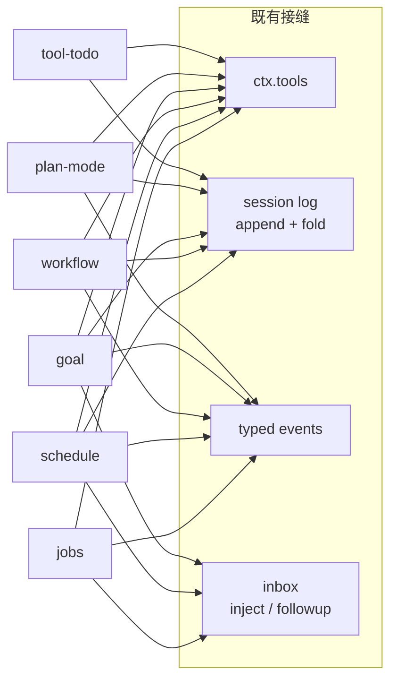

# 第 32 章 Workflow、Jobs、Schedule 与 Goal：不侵入循环的六个子系统

这一章一次讲六个包：`jobs`（后台工作）、`schedule`（定时提醒）、`workflow`（脚本编排）、`goal`（同会话目标续跑）、`plan`（计划模式）、`todo`（任务清单）。它们功能各异，但值得放在一章里读，因为它们展示了同一件事的六种做法：**给 agent 加"时间维度"的能力，却一行都不改 agent-loop**。每个包都只通过既有接缝——typed events、session log、tool registry、inbox——挂进系统。读完这一章，你会对"harness 的扩展点够不够用"这个问题有一个可验证的答案。

## 问题背景

假设你要给自己的 agent 加后台任务：模型发起一个耗时命令，先去干别的，完成后再回来收结果。朴素做法是在主循环里加一个 `pendingJobs` 数组，每个 step 开始前轮询一遍，完成的塞进 messages。定时任务？主循环里再加一个 `setInterval`。目标续跑？循环外面再包一层 `while (!done)`。三个功能下来，主循环从"驱动一次对话"变成"调度中心"，每加一个功能都要重读七百行循环代码确认没踩坏别人。

更隐蔽的坑在持久化和并发：后台任务完成时 agent 可能正忙、可能空闲、也可能已经被销毁；定时器触发时进程可能刚重启，内存里的状态没了；目标续跑可能和用户的新输入抢同一个 turn。这些竞态如果散落在主循环里，每一个都是一次侵入式修改。

DeepSeek Harness 的答案是让这六个子系统全部住在循环外面。它们依赖的接缝在前面各章都出现过：[第 5 章](../part2/05-typed-events.md)的 typed events、[第 13 章](../part4/13-session-event-log.md)的 append-only session log、[第 18 章](../part5/18-tool-registry.md)的工具注册表、[第 10 章](../part3/10-inbox-and-injection.md)的 inbox 注入。

## 源码剖析

### ctx.jobs：后台工作的抽象注册表

`packages/jobs/jobs` 只定义 seam，不含实现——和[第 22 章](../part6/22-seam-triangle.md)的接缝三角一致。`ctx.jobs` 通过 declaration merging 挂上 Context，实现（`jobs-local`）作为插件加载：

```ts
// packages/jobs/jobs/src/index.ts
declare module '@deepseek-ai/cordis' {
  interface Context {
    jobs: JobRegistry
  }
}

export abstract class JobRegistry extends Service {
  constructor(ctx: Context) {
    // `abstract` erases at runtime, so a composition row naming this package
    // would register a ctx.jobs with no method implementations and fail far
    // from the misconfiguration. Fail loud at load instead.
    if (new.target === JobRegistry) {
      throw new Error('@deepseek-ai/dsh-jobs is the abstract job registry seam; load an implementation such as @deepseek-ai/dsh-jobs-local instead')
    }
    super(ctx, 'jobs')
  }

  abstract start(spec: JobStart): JobId
  abstract read(id: JobId, caller?: Agent): JobRead
  abstract kill(id: JobId, caller?: Agent, reason?: string): 'requested' | 'already-finished'
  abstract wait(id: JobId, timeoutMs: number, caller?: Agent, signal?: AbortSignal): Promise<JobSnapshot>
  abstract onJobDone(listener: JobDoneListener): () => void
  // ...
}
```

job 的"种类"同样用 declaration merging 开放：`bash`、`subagent` 是内置 kind，任何插件都可以往 `JobKindMap` 里 merge 新键（`packages/jobs/jobs/src/types.ts`）。job id 是 branded type（`JobId = Branded<'JobId'>`），注册表签发 `<kind>-N` 格式的可预测 id——注释里明确写了设计取舍："predictable ids rely on owner authorization rather than secrecy"：访问控制靠 owner 的 session id 校验，不靠 id 猜不到。

模型看到的三个工具 `job_output` / `job_list` / `job_kill` 由 `tool-jobs` 注册。真正有意思的是完成通知怎么送回会话——它没有碰循环，而是用 inbox：

```ts
// packages/jobs/tool-jobs/src/index.ts
ctx.jobs.onJobDone((snapshot, owner) => {
  if (snapshot.reported || owner === undefined) return
  const message = createUserMessage({
    content: [{ type: 'text', text: fitCompletionNotice(snapshot) }],
    source: { kind: 'plugin', plugin: 'tool-jobs', form: 'notice', /* ... */ },
  })
  const spent = spentWakes.get(owner) ?? 0
  if (delivery === 'wakeup' && owner.status === 'idle' && spent < wakeBudget) {
    spentWakes.set(owner, spent + 1)
    owner.followup(message)   // 空闲：开一个新 turn 叫醒它
    return
  }
  owner.inject(message)       // 忙碌：注入下一个 step 的 inbox
})
```

忙碌的 agent 走 `inject`（通知排进下一 step，几个同时完成的 job 只花一个 step）；空闲的 agent 走 `followup`（开新 turn，否则模型永远不知道 job 完成了）。`spentWakes` 是一个按 Agent 实例计数的 wake 预算：一个被唤醒的 turn 可能又启动新 job，其完成又唤醒下一个 turn——`maxConsecutiveWakes`（默认 3）给这条自激链设了上限，而预算的重置点选在 `ctx.on('agent/inbox/claimed')` 里判断 `message.source.kind === 'user'`：只有真人输入被 claim 才重置，插件自己排的通知不能给自己续命。

### schedule：把定时器建在 session log 上

`schedule` 包最激进的选择是：**没有自己的数据库**。所有提醒（`after` 延时、`at` 定点、`every` 固定频率）都是 session log 里的 `schedule/change` 事件，通过 declaration merging 声明进 `SessionEventMap`（`packages/schedule/schedule/src/types.ts`）。进程内存里只有一个可丢弃的投影：每次需要决策时从 log 重新 fold（`foldScheduleEvents`），崩溃重启后状态自然恢复——这正是[第 13 章](../part4/13-session-event-log.md)事件溯源模式的又一次复用。

触发路径上的持久化纪律值得细看。`ScheduleRuntime.driveOnce()`（`packages/schedule/schedule/src/runtime.ts`）的完整序列是：flush 持久化屏障 → fold 日志 → 决策 → `agent.runMaintenance()` 里再 fold 再决策（拿到 idle 阶段独占权后重验）→ `agent.followup()` 送出提醒消息 → `session.append('schedule/change', { operation: 'dispatch', ... })` 记账 → 再 flush 一次：

```ts
// packages/schedule/schedule/src/runtime.ts — driveOnce() 内的 maintenance 闭包
maintenance = this.agent.runMaintenance(() => {
  if (!this.isRunnable()) return Promise.resolve(false)
  const claimed = this.readFolded()          // 拿到独占权后重新 fold
  // ...
  const message = createUserMessage({
    content: [{ type: 'text', text }],
    source: { kind: 'plugin', plugin: 'schedule' },
  })
  this.agent.followup(message)
  // ...
  this.agent.session.append('schedule/change', {
    version: 1, operation: 'dispatch', id: decision.record.id,
  })
  return Promise.resolve(true)
})
```

dispatch 事件写回日志意味着"这条提醒已送达"本身也是持久事实：重启后 fold 会跳过已 dispatch 的一次性提醒，`every` 型则用 `acceptedAt` 直接跳过错过的所有 occurrence。前后两道 `flushSchedulePersistence`（`persistence.ts`，30 行）保证"决策依据已落盘"和"送达记录已落盘"。而 `transaction.ts` 全文只有 23 行——用一个 `WeakMap<Agent, Promise<void>>` 存每个 agent 的事务尾巴，把同一 agent 的 Schedule 读写串行化，没有锁、没有队列类。

接入方式同样全是既有接缝：`ctx.on('agent/created')` 给每个 root agent 挂一个 runtime，`agent.ctx.effect()` 保证卸载时定时器、工具、监听器一起可逆清理（[第 6 章](../part2/06-reversible-effects.md)），`agent.ctx.on('agent/status')` 在 agent 转 idle 时补一次驱动。

### workflow：脚本编排引擎作为 Service seam

`workflow` 包又是一个纯 seam：抽象类 `WorkflowEngine`（`ctx.workflowEngine`）+ 六个 `workflow/*` 生命周期事件（`start` / `phase` / `log` / `agent-start` / `agent-end` / `end`）声明进 cordis `Events`。实现是 `workflow-worker-thread`：模型写的编排脚本在 Node worker thread 里的 vm 中执行，脚本里只有 `agent()` / `pipeline()` / `parallel()` / `phase()` / `log()` 几个 hook，每个 `agent()` 调用通过 RPC 回到主线程，走[第 30 章](30-subagent.md)的 subagent seam 起子代理。

主线程和 worker 之间的协议（`packages/workflow/workflow-worker-thread/src/protocol.ts`）是这套代码里类型工程的一个小样板——先用 enum 定 tag，再用 payload map 给每个 tag 配参数，最后用 mapped type 推导出可辨识联合：

```ts
// packages/workflow/workflow-worker-thread/src/protocol.ts
export enum WorkerToHostType {
  Ready = 'ready',
  Phase = 'phase',
  // ...
  ChildStart = 'child-start',
  Result = 'result',
}

export interface WorkerToHostPayloads {
  [WorkerToHostType.ChildStart]: { callId: number; request: ChildStartRequest }
  [WorkerToHostType.Result]: { result: WorkflowResult }
  // ...
}

export type WorkerToHostMessage<T extends WorkerToHostType = WorkerToHostType> =
  { [K in T]: { type: K } & WorkerToHostPayloads[K] }[T]
```

接收端 `switch` 后跟 `assertNever`，发送端是泛型 `Post` 函数（`session.ts`：`type Post = <T extends WorkerToHostType>(type: T, payload: WorkerToHostPayloads[T]) => void`）——tag 和 payload 配错在编译期就报错，协议加一条消息则在所有接收端强制编译失败。

穿越 worker 边界的值由 `realm.ts` 的 `materializeFromRealm` 白名单式深拷贝成纯 JSON：非有限数字、bigint、函数、稀疏数组、带非索引属性的数组、原型链异常的对象一律报 `MaterializeError` 并带上出错路径。其中有个安全细节：拷贝对象属性用 `Object.defineProperty` 而非赋值，注释写明"a `__proto__` key must become an OWN data property of the copy, not a prototype mutation"。

`tool-workflow` 把引擎暴露为 `workflow` 工具，并示范了"观察者写日志"的姿势：它订阅 `workflow/agent-start` 等事件，把 `tool-workflow/run-start`、`tool-workflow/agent-start` 等自有事件 append 进父会话——但 append 失败只是"disable durable record"（打 warn、从 active 表移除），绝不让记录失败影响工具执行本身（`createWorkflowRecorder`，`packages/workflow/tool-workflow/src/index.ts`）。

`tool-ralph` 则是 workflow seam 之上的一个固定用法：Ralph loop（每轮起一个全新子代理、只传结构化 handoff）不让模型写脚本，脚本是包内写死的 `RALPH_SCRIPT` 常量，模型只能提供 `objective` 和 `maxRounds` 两个数据参数——注释原话："The model supplies data only; it cannot alter the loop, provider route, schema, or handoff validation."

### goal：同会话续跑的三权分立

goal 子系统把"持续朝一个目标干活"拆成三个包，职责边界非常清楚：

- **`goal`**：领域与持久化。目标状态（`active`/`paused`/`blocked`/`complete`）作为 `goal/change` 事件存进 session log，`fold.ts` 是一个 349 行的严格 replay 解码器——字段清单精确到 `Object.keys(value).sort().join(',') !== expectedKeys` 级别的校验，坏事件宁可炸也不静默容忍。每次变更携带完整快照（whole-value, last-wins），revision 递增构成 CAS：改目标必须带上你读到的 `{ id, revision }`。
- **`goal-round-driver`**：调度。它订阅 agent 状态，在 agent 空闲、goal 处于 `active` 且本进程 `armed` 时，通过 `agent.followup()` 注入一条 `source: { kind: 'goal', goalId, revision, round }` 的续跑提示（`prompt.ts` 渲染 `<goal_round>` 块）。注入前先 `ctx.sessions.flush` 做持久化 checkpoint；轮数到达 `maxGoalRounds` 就把目标置为 `blocked`（code `'round-limit'`）而不是无限跑。它和用户输入的竞态用 `RoundAttempt` 状态机（`queued`/`claimed`/`admitted` + `cancelled`/`stale`）逐条对账。
- **`tool-goal`**：模型接口与权限。`get_goal` / `create_goal` / `update_goal` 三个工具，但状态变更要过 `authority.ts` 的硬校验：从 session log 向后扫描找到当前 open turn 的 `turn/start`，据此判定本次调用的 authority 是 `direct-human`（真人直接发起的 turn）还是 `goal-round`（自动续跑轮）——子代理和非人类来源直接拒绝。也就是说"谁有权改目标"不是 prompt 约定，而是从日志里推导出来的运行时事实。

`goal` 还注册了一个 session projection（`SessionProjectionMap` merge，`packages/goal/goal/src/types.ts`），web 端因此能直接订阅目标状态，无需额外 API。

### plan 与 todo：两个最小样板

`plan-mode` 和 `tool-todo` 是理解"会话状态怎么做"的最小样板。plan mode 的全部状态是一种 session event：`'plan/mode': { active: boolean }`，last-wins fold（`foldPlanMode`，10 行）；resume、fork 天然恢复，无需 live mirror。它最反直觉的决定写在模块注释里：

```ts
// packages/plan/plan-mode/src/index.ts（模块注释节选）
 * The exit tool remains registered while plan mode is inactive, so entering
 * or leaving plan mode changes only the prompt section, not the request tool
 * catalog.
```

`exit_plan_mode` 工具在非 plan 模式下也保持注册——进出 plan 模式只切换 system prompt 的 `plan:policy` section，工具目录保持稳定。普通写法会在进入 plan 模式时动态注册/注销工具，代价是每次切换都改变请求的 tools 数组（破坏 prompt cache，还引入"工具消失时刚好有未决调用"的竞态）。

`tool-todo` 同理：`todo_write` 每次全量替换，直接 `exec.agent.session.append('todo/write', { todos })`；投影注册里一行 `if (event.type === 'turn/start') return null` 让清单在新 turn 开始时自动清空，而 `turn/end` 保留——完成的清单在 turn 结束后仍然可见。`allowParallelInProgress` 是必填的部署配置，工具 description 随之切换措辞，"至多一个 in_progress"在 false 时是运行时校验而非口头约定。

### 六个子系统，一张接缝清单

把上面所有接入点列成表，就是本章的核心论点：

| 包 | 工具注册 | session log | 事件 | inbox / turn | 其他 seam |
|---|---|---|---|---|---|
| jobs | `job_output/list/kill` | — | `agent/inbox/claimed`、`tools/pre-execute` | `inject` / `followup` | `ctx.jobs` 抽象服务、`systemPrompt.section` |
| schedule | `schedule_create/list/delete` | `schedule/change` | `agent/created`、`agent/status` | `followup` | `sessions.flush`、`runMaintenance`、`effect` |
| workflow | `workflow`、ralph | `tool-workflow/*` | `workflow/*` 六事件 | — | `ctx.workflowEngine`、subagent seam |
| goal | `get/create/update_goal` | `goal/change` + projection | `agent/status` 等 | `followup` | `sessions.flush`、turn 边界推导权限 |
| plan | `exit_plan_mode` | `plan/mode` + projection | `agent/pre-step` | — | `systemPrompt.section`、commands |
| todo | `todo_write` | `todo/write` + projection | — | — | sessionProjections |



agent-loop（[第 9 章](../part3/09-agent-loop-deep-dive.md)）对这六个包一无所知——`grep -r "jobs\|schedule\|workflow\|goal" packages/core/agent-loop/src` 找不到任何依赖。这不是巧合，而是接缝设计是否够用的直接检验：六个含时间维度、含并发竞态的子系统，全部在循环外完成。

## 设计亮点

> 💎 **设计亮点：抽象 Service 的 `new.target` 防御**。TypeScript 的 `abstract` 在运行时会被擦除——如果部署配置错把 seam 包 `dsh-jobs` 当实现加载，会注册一个所有方法都缺失的 `ctx.jobs`，直到第一次调用才在离配置错误很远的地方爆炸。`JobRegistry` 构造函数里一行 `if (new.target === JobRegistry) throw`，把报错从"运行时某次工具调用"提前到"插件加载"，错误信息还直接告诉你该加载哪个包。普通写法根本不会意识到这个坑存在。

> 💎 **设计亮点：wake 预算切断自激链**。job 完成唤醒 idle agent → 被唤醒的 turn 又起新 job → 完成又唤醒……这是一条不花人类一分钱注意力却持续烧 token 的自激链。`tool-jobs` 用 `maxConsecutiveWakes` 计数封顶，且重置条件极其精确：只有 `agent/inbox/claimed` 里 `source.kind === 'user'` 的消息（真人输入被实际消费）才重置预算——插件自己注入的通知不算。超预算的完成通知降级为 `inject`，信息不丢，只是不再主动开 turn。

> 💎 **设计亮点：定时器建在事件日志上**。schedule 没有数据库、没有常驻状态表，`ScheduleRuntime` 是"disposable live projection"——所有真相在 session log 的 `schedule/change` 流里，连"已送达"（dispatch）都是日志事件。代价是每次决策都要重新 fold，换来的是崩溃恢复免费（重启后 fold 即恢复）、fork/resume 语义免费（日志走到哪状态就到哪）、以及送达前后两道 flush 屏障可以精确表达"没落盘就不算数"。`transaction.ts` 用 23 行 WeakMap promise 链完成 per-agent 串行化，是"用最小原语解决并发"的教科书示例。

> 💎 **设计亮点：`exit_plan_mode` 永不注销**。plan mode 的开关只改 prompt section，不改工具目录。这避免了两类问题：工具列表变化导致的 prompt cache 失效，以及"模式切换瞬间工具消失"的竞态。状态机的可见面（模型看到什么指导语）和能力面（模型能调什么工具）被刻意解耦——能力恒定，指导语切换，工具自身在非 plan 模式下调用时才拒绝。

## 小结与延伸

这六个包合起来回答了一个架构问题：agent harness 的扩展点是否足以承载"时间维度"的功能——后台并发、定时触发、跨 turn 续跑。答案是肯定的，且每个包都恪守同一套纪律：状态进 session log（可恢复、可 fork）、通知走 inbox（不抢 turn）、能力走 tool registry（模型可见面收敛）、生命周期走 effect（可逆卸载）。其中 jobs 和 workflow 还留了第二层接缝——`JobRegistry` 和 `WorkflowEngine` 都是抽象 Service，换分布式实现不动模型可见面。

延伸阅读：

- `docs/subsystems/jobs.md`、`docs/subsystems/schedule.md`、`docs/subsystems/workflow.md`、`docs/subsystems/goal.md`、`docs/subsystems/plan.md` —— 各子系统的官方文档
- `packages/jobs/jobs-local/src/index.ts` —— first-wins settlement 与 teardown 语义的完整实现
- `packages/workflow/workflow-worker-thread/src/runtime.ts` —— 脚本 vm、并发上限与 `pipeline`/`parallel` 组合子
- `packages/goal/goal/src/fold.ts` —— 严格事件解码的完整范例
- [第 30 章](30-subagent.md) —— workflow 的 `agent()` 调用落到的 subagent seam
