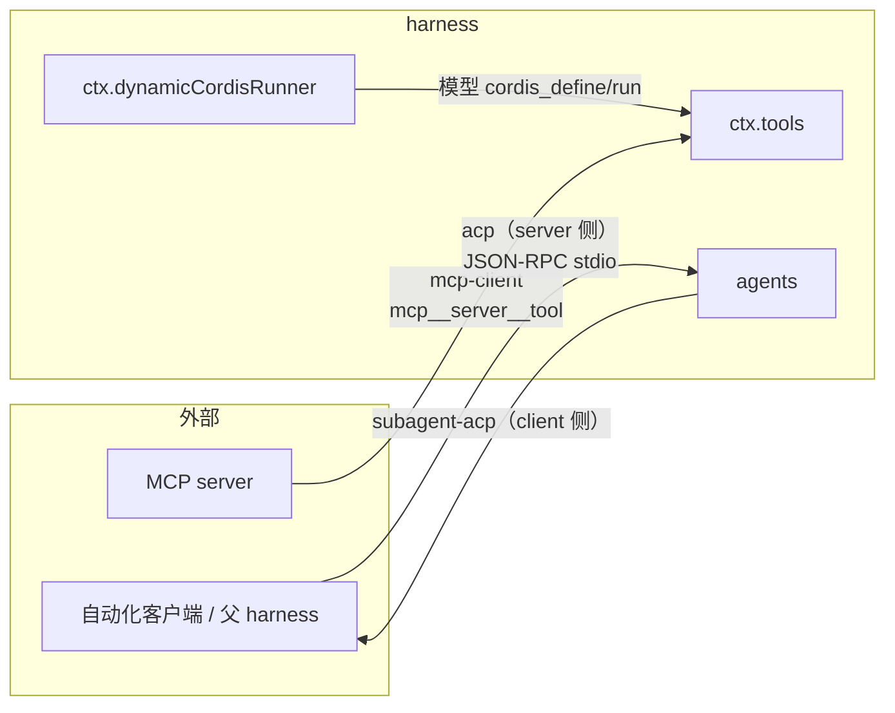

# 第 33 章 MCP 与 Extensions：生态的三个开放方向

这一章看 harness 如何对外开放：`mcp-client` 把外部 MCP server 的工具接**进来**；`acp` 把 harness 自己变成可被程序驱动的 ACP server 露**出去**；`extensions`（四个 `cordis-*` 包）则最激进——让模型在运行时给 harness **写插件**。三条通道方向不同、信任模型不同、审批策略也不同，放在一起对照着读，能看清一个 agent 系统对"外部代码"这件事可以有多少种立场。

## 问题背景

接 MCP 看起来只是"调 SDK、把工具塞进注册表"，实操里全是边角：两台 server 的工具重名怎么办？server 的工具名带 `.` 而模型 API 只接受 `[A-Za-z0-9_-]`（还限 64 字符）怎么办？server 崩了重连，旧一代工具和新一代工具在注册表里交错怎么办？注册到一半冲突了，模型是不是就看到半套工具？

让模型给系统写扩展就更吓人。朴素做法 `eval(code)` 等于把进程交出去；做一个"安全沙箱"又是不可能完成的任务（vm 不是安全边界，这是 Node 文档明说的）。真正可行的中间态是什么？——这正是 extensions 子系统用 57 个 ts 文件回答的问题。

## 源码剖析

### mcp-client：929 行源码，2393 行测试

先说配置来源，这里有个反常识点：MCP server 配置**不走 settings 层**，而是 Cordis 插件配置——一个插件实例连一台 server，多台 server 就在 `cordis.yml` 里 `insert` 多个实例。`serverName` 是全局命名空间保留，用 `WeakMap<Context, Set<string>>` 按 app 根记账，重名在加载时就炸掉后来的实例，"never silent shadowing"。transport 只有两种：`stdio` 与 `streamable-http`（`transport.ts` 一共 50 行；没有独立 SSE 分支，SSE 恢复由 SDK 的 Streamable HTTP 内部承担）。stdio 的子进程环境复用 subprocess seam 的凭据擦洗——SDK 负责 spawn，但擦洗规则是 harness 统一的。

工具映射的核心是命名契约（`packages/mcp/mcp-client/src/tools.ts`）：

```ts
// packages/mcp/mcp-client/src/tools.ts
export function publicToolName(serverName: string, rawName: string): string {
  const joined = `mcp__${serverName}__${rawName}`
  const normalized = joined.replace(INVALID_NAME_CHARS, '_')
  if (normalized === joined && normalized.length <= MAX_PUBLIC_NAME_LENGTH) return normalized
  const hash = createHash('sha256').update(`${serverName}\0${rawName}`).digest('hex').slice(0, HASH_LENGTH)
  return `${normalized.slice(0, MAX_PUBLIC_NAME_LENGTH - HASH_LENGTH - 1)}_${hash}`
}
```

干净的名字零成本直通（`mcp__github__create_issue` 逐字保留）；只有当字符替换或截断真的改变了名字，才追加 12 位 SHA-256 哈希。哈希输入是 `serverName\0rawName` 而非归一化结果，所以 `admin.reset` 和 `admin_reset` 即使归一化后撞车也仍能区分（测试里有精确断言）。配套一条铁律：raw name 只在 wire 上出现（`tools/call`），public name 永远不被反解析。

同步是两阶段的："Phase 1: fetch and build the next generation without touching the registry" —— 拉全量工具列表、构建下一代定义，期间注册表纹丝不动；"Phase 2: swap generations" —— 先释放上一代 disposer，再逐个注册新一代。注册途中撞上外来的同名注册，则整代回滚：

```ts
// packages/mcp/mcp-client/src/tools.ts — Phase 2 节选
} catch (error) {
  // A conflict on an `mcp__<serverName>__`-qualified name means a foreign
  // registration occupies this server's namespace. Roll back so the model
  // sees either the full generation or none of it — never a partial set.
  for (const dispose of disposers.values()) dispose()
  // ...
}
```

`connection.ts` 是一个 generation 监督者：连接掉线后有界指数退避重连（默认 500ms 起、封顶 30s、连续 10 次失败耗尽），**一次 outage 共享一份 attempt 预算**——连接存活超过稳定窗口（= `maxDelayMs`）才关闭上一次 outage、下次掉线才有新预算，crash-loop 的 server 即使每次都短暂连上也会耗尽上限而不是永远重启。所有 sync 走一条串行 promise 链（`enqueueSync`），两次"释放上一代/注册下一代"的 swap 永不交错；失败的 generation 若 5 秒内没关干净，直接停止重连——"reconnect stopped to avoid overlapping server processes"，宁可没有工具也不能有两个子进程并存。

结果转换上，canonical 值保留完整 MCP content 数组，模型看到的是 `extractText` 的文本投影：image/audio/resource 块降级为 `[image: ..., content discarded]` 占位而不是静默丢弃。输出 schema 做能力子集降级（`supportedOutputSchema`：不支持的词汇整体回退为 JsonValue，而非解析一半）。模型传来非对象参数时兜底 `{}`——注释说得清楚：让 MCP server 产出具体的"missing required param"错误，模型才学得会。

审批呢？grep 全包，`policy` 一词只出现在 reconnect policy——**mcp-client 完全不参与审批**。MCP 工具和本地工具一样落进[第 20 章](../part5/20-approval-and-presets.md)的通用审批/权限面，permission preset 里 `mcp_*` 通配即可覆盖。桥只做桥。

### Extensions：模型自己写的临时插件

先验证任务书里的问题："57 个 ts 文件在做什么？"实测 `find packages/extensions -name '*.ts' | wc -l` 正好 57：`cordis-host-runner` 14（src 8 + tests 6）、`cordis-client-runner` 18（src 12 + tests 5 + tsdown.config 1）、`tool-cordis` 9（src 8 + tests 1）、`ui-cordis` 16（src 12 + tests 3 + tsdown.config 1）。另有 4 个 `.tsx` React 组件不计入。其中两个最大的"源文件"其实是生成物：`tool-cordis/src/api-catalog.ts`（4751 行）和 `cordis-client-runner/src/client/slot-catalog.ts`（1722 行），由 `scripts/gen-cordis-api.ts` 从与 `docs/cordis-catalog` 同一次 AST walk 生成，doc-sync 门禁保证不腐化——[第 40 章](../part10/40-docs-as-engineering.md)讲的生成式文档流水线在这里直接变成了模型可查询的运行时数据。

extension 不是"用户装的插件"，而是**模型运行时定义的临时 Cordis Plugin**。system prompt（`tool-cordis/src/prompt.ts`）对模型的说法：

```
Dynamic Cordis plugins temporarily extend the current DSH process. ...
- Plugin and Package definitions exist only in the current process. define itself
  does not modify repository source, configuration, or disk, and definitions do
  not survive a process restart.
- The restricted execution environment prevents accidental misuse; it is not a
  security boundary for malicious code.
```

四个包的分工：`tool-cordis` 注册七个模型工具（`cordis_inspect_list` / `cordis_inspect_query` / `cordis_inspect_self` / `cordis_define` / `cordis_run` / `cordis_stop` / `cordis_undefine`）；`cordis-host-runner` 提供 `ctx.dynamicCordisRunner`——定义注册表、`node:vm` 沙箱、run 请求往返；`cordis-client-runner` 是浏览器半场，把 Package 的 `code.client` 求值成活的浏览器插件；`ui-cordis` 提供操作面板和工具卡片。一个 Package 可以有 `code.host`、`code.client` 或两者，Host 半永远先激活，两半之间只有 Client→Host 方向的 JSON 方法调用。

沙箱的立场在模块注释里写得毫不含糊："This keeps cooperative packages inspectable and disposable but is not containment: host-realm helper functions remain an escape route." 防的是误用，不是恶意。具体手段是三层：

其一，**可调用陷阱**。`require`/`fetch`/`setTimeout` 等函数值全局被换成抛教学性错误的 trap，指路到对应的 cordis 服务（`inject: ['fs']`、`ctx.web`、Cordis timer）；而 `process` 这种数据值全局刻意留 `undefined` 不设陷阱——"a throwing accessor would detonate the common `typeof process` feature probe at resolution time"。define 时还有 compile-only 的语法预检（`new Script(...)` 只解析不执行），发现 TypeScript 的 `as` 语法直接给出 ✗/✓ 对照的改法。

其二，**ctx 白名单 façade**（`cordis-host-runner/src/guard.ts`，836 行）。沙箱代码拿到的 ctx 是 Proxy：动词白名单（`effect`/`on`/`provide`/timer 系列）、服务必须在 `inject` 里声明过才可读、`set` 一律拒绝、任何服务方法若返回 Context 实例被当场拦截（"never another context"）。跨边界的值走显式工作栈实现的 lossless JSON 克隆，class 实例、函数、Map/Set、Date、undefined、循环、稀疏数组全拒——错误信息不讲规则讲修法："Return a plain object built from the values you need"。最锋利的一处是工具 façade：

```ts
// packages/extensions/cordis-host-runner/src/guard.ts
/**
 * The tool-registry façade: `register` (marker-guarded) plus READ-ONLY
 * metadata (`schemas`, and `get` returning a schema view, never the live
 * `ToolDefinition`). Exposing the raw definition would hand package code the
 * tool's `execute` function, letting it call another tool directly and bypass
 * `ToolRuntime.execute` — identity protection, pre-policy, monotonic guards,
 * around dispatch, post-policy, final observation, and result normalization.
 */
function sandboxTools(ctx: Context): Record<string, unknown> {
  return {
    register: (tool: unknown): (() => void) => sandboxRegisterTool(ctx, tool),
    schemas: () => ctx.tools.schemas(scopeOf(ctx)),
    get: (name: string) => ctx.tools.schemas(scopeOf(ctx)).find(schema => schema.name === name),
  }
}
```

其三，**身份与版本**。三个 branded id（`CordisDynamicPluginId` / `PackageId` / `PluginRunId`）+ 两个版本指针：`currentPackageId`（最近一次完整成功的版本）和 `nextPackageId`（待审批/尝试中/最近失败的目标）。带 Client 半场的 Package 需要用户授权，且分两级——单勾只授权这一个 Package，双勾授权该 Plugin 的未来版本：

```ts
// packages/extensions/cordis-host-runner/src/index.ts
const requiresApproval = !plan.plugin.clientVersionUpdatesApproved
  && !plan.plugin.approvedClientPackages.has(packageId)
```

`commitActivation` 是唯一推进 `currentPackageId` 的地方——失败的 update 保留 current、留下 next 供诊断，`tests/versioning.spec.ts` 就是这条不变量的规格。最有味道的是失败反馈的去向：激活失败不是报给用户，而是 `agent.steer()` 一条消息**回给模型**，附上完整错误、两个版本指针和一句 "correct it on the same Plugin when needed, and retry the activation autonomously"——定义/激活/失败/修复构成一条模型自主闭环。

浏览器侧同样克制：页面激活时什么都不加载，"A refresh therefore starts clean by design"——host 进程内存里仍有定义，页面只是不跑它，直到 `cordis_run` 或用户按下卡片的启动键。Package 的 UI 落点是一个专用 slot `tool.view.cordis`，动态代码只能用 `key: 'self'` 注册，guard 把它重写成 `${pluginId}.${packageId}`——包不可能往别人的卡片里塞 UI。会话里同一 Package 出现多张 run 卡时，`run-card-index.ts` 按会话日志序号仲裁，business view 只落在最新一张上。`tool-cordis` 还在 `agent/pre-step` waterfall 上注册了 `@pluginId` 手势：用户消息里出现 `@abc-1` 就注入该 Plugin 的身份与版本指针（不含源码），并明令 "Do not claim that it was updated or silently create a replacement Plugin"。

### acp：532 行的自动化传输层

`packages/acp/acp` 的 package.json 一句话说清定位："Automation-only Agent Client Protocol server for driving DeepSeek Harness agents over JSON-RPC stdio"。README 进一步划界：它是 transport adapter，不是 UI 集成——editor 导航、transcript 回放、reasoning、plans、titles、工具呈现全都不在 wire 上。桥只发**已提交的** assistant 文本；`codec.ts` 66 行做 `TurnEndReason → StopReason` 等三个纯函数映射，注释里连 `cancelled` 为什么保留给显式 `session/cancel` 都交代了。

审批是本包与审批面的唯一接点，而且态度谨慎——只提供 one-shot 选项，绝不从未知 client 的响应推断持久授权：

```ts
// packages/acp/acp/src/index.ts
// Permission requests are a machine policy channel for ACP clients such as
// dsh-subagent-acp. The bridge offers one-shot choices only and never infers a
// durable grant from an unknown client response.
ctx.on('approval/request', (request, next) => {
  const record = ownedRecord(request.agent)
  if (record === undefined || request.callId === undefined) return next()
  return conn.requestPermission({
    sessionId: record.agent.session.id,
    toolCall: { toolCallId: request.callId },
    options: [
      { optionId: 'allow-once', name: 'Allow once', kind: 'allow_once' },
      { optionId: 'reject-once', name: 'Reject', kind: 'reject_once' },
    ],
  }).then(/* ... */)
})
```

它在生态中的位置用 grep 就能钉死：全仓唯一 workspace 依赖方是 `packages/examples/acp-demo`；web 端零引用。而 `@agentclientprotocol/sdk` 的另一个使用者是[第 30 章](30-subagent.md)的 `subagent-acp`（`ClientSideConnection`，client 侧）。于是闭环成形：父 harness（subagent-acp 作 ACP client）→ 子进程 bin（acp-demo 加载 dsh-acp，作 ACP server）→ 子 harness agent。ACP 在这个仓库里是**子代理与自动化的传输层**，不是 IDE 集成层。还有一行值得玩味的代码——两个协议正面相遇：`validateSessionParams` 里 `if (params.mcpServers.length > 0) throw invalidParams('mcpServers is not supported')`：ACP 规范允许 client 递交 MCP server 配置，但这座桥拒绝——MCP 接入是部署配置（cordis.yml）的事，不由自动化 client 决定。

### 三条通道对照

| | MCP（mcp-client） | ACP（acp） | Extensions（cordis-*） |
|---|---|---|---|
| 方向 | harness 作**客户端**接入外部能力 | harness 作**服务端**被自动化驱动 | harness **对自己**开放运行时 |
| 配置面 | `cordis.yml` 插件实例 | 插件 config | 无静态配置，模型运行时 `cordis_define` |
| 信任模型 | 外部进程，防御式解析 | "trusted programmatic clients" | "not a security boundary for malicious code" |
| 审批 | 不参与，落通用 ToolRuntime 策略 | one-shot，永不推断持久授权 | 单 Package 授权 / Plugin 级未来版本授权 |
| 失败反馈对象 | 用户（logger） | ACP client（RequestError） | **模型**（`agent.steer`） |



## 设计亮点

> 💎 **设计亮点：有损即哈希的命名纯函数**。工具名冲突的通常解法是全局计数器或注册时挑一个后缀——两者都有状态，重启、HMR、重连后同一个工具可能换名字，模型的历史调用瞬间失效。`publicToolName` 是纯函数：干净名字逐字直通，只有归一化真的有损时才追加内容哈希，哈希吃的是归一化**前**的 `serverName\0rawName`。可重放、无状态、跨代稳定，附赠"raw name 只上 wire、public name 永不反解析"的单向契约。

> 💎 **设计亮点：模型只见全有或全无**。MCP 同步的两阶段结构（fetch 不碰注册表、swap 才换代）+ 冲突整代回滚 + sync 串行链 + outage 预算与稳定窗口，合起来维护同一条不变量：注册表里要么是某台 server 完整的一代工具，要么一个都没有，绝无半套。这条不变量普通实现几乎必然违反——工具逐个注册、逐个失败，模型看到的目录处在中间态而没人知道。

> 💎 **设计亮点：沙箱工具 façade 的 `get` 只给 schema**。给动态代码看工具列表，最顺手的写法是 `get: name => ctx.tools.get(name)`——而这一行就把 `execute` 函数交了出去，沙箱代码从此可以绕过 ToolRuntime 的身份保护、pre/post policy、审批、结果归一化直接调用任意工具。这里的 `get` 复用 `schemas()` 的只读投影，"nothing invocable"；配合 `DYNAMIC_TOOL` Symbol marker 保证注册进来的必须是 `harness.defineTool` 的产物。能力开放的边界精确到了"可注册、可查询、不可借用"。

> 💎 **设计亮点：失败 steer 回模型的自主修复回路**。动态 Package 激活失败时，host-runner 不是向用户弹错误，而是把失败原因、`currentPackageId`/`nextPackageId` 指针和"自主修正并重试"的指令用 `agent.steer()` 送回模型。加上运行期错误按 `(run, key)` 去重（`claimRuntimeFailure`），模型得到的是一条可收敛的 define→run→fail→fix 循环，而不是一堆重复报警。三条通道的"失败反馈对象"对比（用户 / client / 模型）正是各自信任模型的镜像。

## 小结与延伸

MCP、ACP、Extensions 是同一个问题的三种解：外部能力怎么进来、自己怎么被外部驱动、模型怎么扩展自己。三者全部通过既有接缝落地——MCP 工具进 `ctx.tools`、ACP 桥只依赖 `agents` 服务和 `approval/request` 事件、动态插件本质上就是一个受 façade 约束的 Cordis Plugin。信任光谱也拉得很开：对 MCP server 防御式解析、对 ACP client 声明信任但拒绝越界参数、对模型代码"防误用不防恶意"并把恶意场景明白写进文档。读完这三个包再回看[第 3 章](../part1/03-architecture-overview.md)的 "Everything is a Plugin"，会发现这句话的完整版是：连模型自己写的代码，也只是一个插件。

延伸阅读：

- `docs/subsystems/extensions.md` —— extensions 子系统官方文档
- `packages/mcp/mcp-client/README.md` —— Known Limitations（Tools 是唯一被桥接的 MCP 能力）
- `packages/extensions/cordis-host-runner/src/guard.ts` —— 全仓最值得逐行读的 836 行防御式代码
- `docs/postmortem/0001-acp-default-export-drops-inject.md` —— subagent-acp 注释里引用的 postmortem
- [第 30 章](30-subagent.md) —— subagent-acp 如何用 ACP 把子代理跑成独立进程
