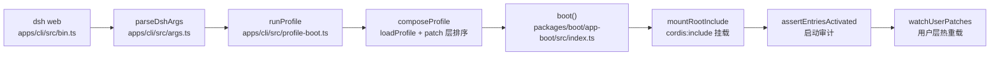

# 第 34 章 Boot：从命令行到插件树

你在终端敲下 `dsh web`，几秒后浏览器 UI 的服务端就绪——这中间发生了什么？本章沿着真实调用链走一遍：commander 解析、profile 解析、patch 层组装、Loader 挂载、启动审计，最后看 `--dump-config` 如何在不启动任何插件的前提下打印出「将要挂载的树」。boot 是整个 harness 里「配置即补丁」哲学（[第 7 章](../part2/07-profiles-and-bundles.md)）落到进程上的那一段，也是错误呈现最讲究的一段：一个插件挂了，用户看到的不是堆栈瀑布，而是一行有名有姓的诊断。

## 问题背景

自己写一个「CLI 启动插件树」的 launcher，朴素做法大概是：一个大 commander 程序声明所有 flag（`--port`、`--resume`、`--model`……），解析完塞进一个全局 config 对象，然后读一个 YAML 配置文件、按顺序 `import()` 每个插件。这条路会在三个地方翻车：

1. **flag 归属**。launcher 声明所有 flag，意味着每加一个 app 插件都要改 launcher；`--help` 也变成一份与实际挂载的插件树脱节的大杂烩。
2. **配置文件是「终态」还是「过程」**。如果配置文件就是最终树，那么「官方默认 + 用户覆盖 + 临时实验」三层只能靠手工合并；工具一旦把运行时状态写回文件，默认值就再也回不去了。
3. **启动错误一锅粥**。几十个插件并发挂载，一个 `import` 失败、一个 service 永远等不到，朴素实现要么整个进程静默挂起，要么打印一屏 Promise 堆栈，没人知道该改哪一行配置。

DeepSeek Harness 的 boot 层（`packages/boot/app-boot`、`packages/boot/cmdline`、`apps/cli`）针对这三个坑各给了一个明确答案：launcher 只解析自己的 flag，其余原样透传；整棵树是「空根 + 有序补丁层」；启动失败有专门的审计与 fail-loud 管道。

## 源码剖析

### 总路径



`apps/cli/src/bin.ts` 只有 50 来行：解析出 `profile` / `plugin` / `dump-config` 三种 invocation，按 mode 动态 `import()` 对应模块——每条路径只加载自己需要的代码。真正的分量在解析和 boot 两端。

### cmdline：launcher 与 app 的双层解析

`dsh` 的 flag 语法有个反常识的设计：**launcher 的 flag 必须写在前面，第一个它不认识的 token 之后的所有内容原样透传给被启动的 app**。`apps/cli/src/args.ts`：

```ts
// apps/cli/src/args.ts
const program: Command = new Command()
program
  .name('dsh')
  // ...
  .exitOverride()
  // The launcher's flags come first and end at the first token it does not
  // know; everything from there on belongs to the booted app, including
  // its -h. `dsh -h` with no profile still prints this help, below.
  .helpOption(false)
  .allowUnknownOption()
  .passThroughOptions()
  .enablePositionalOptions()
  .argument('[args...]', 'arguments for the booted profile\'s app (see: dsh --profile <name> --help)')
  .option('--profile <name>', 'the profile under $DSH_HOME/profiles to boot')
  .option('--patch <path>', 'extra patch-list overlay applied after the profile layer (repeatable)', collect)
```

`passThroughOptions()` + `allowUnknownOption()` 让 `dsh --profile web --port 8080` 中的 `--port 8080` 完全不经过 launcher 的语法检查；连 `-h` 都被关掉（`helpOption(false)`）——`dsh --profile web --help` 打印的是 **web app 自己的** help，只有裸的 `dsh -h`（没有 profile 可以转交）才打印 launcher 的。`web` 是 `--profile web` 的硬编码别名子命令，同样透传。

透传出去的参数去了哪里？launcher 在树挂载前把它们作为 service 注入（`apps/cli/src/profile-boot.ts` 里的 `provideCmdline`），app 侧的「命令行提供者插件」再用 `packages/boot/cmdline` 的 `parseCmdline` 消费。web app 的提供者是 `packages/bundle/web-app/src/startup.ts`：

```ts
// packages/bundle/web-app/src/startup.ts
export function apply(ctx: Context): void {
  const program = webCommand()
  program.action(() => {
    const options = program.opts<WebOptions>()
    if (options.host === '0.0.0.0') {
      program.error('error: --host 0.0.0.0 is intentionally not supported yet for safety: ...')
    }
    // ...
    ctx.provide(WEB_STARTUP_SERVICE, {
      ...options.host !== undefined && { host: options.host },
      ...options.port !== undefined && { port: Number(options.port) },
      trustedHosts: options.trustedHost ?? [],
    } satisfies WebStartupValues)
  })
  parseCmdline(ctx, program)
}
```

解析成功后 flag 变成一个普通的 Cordis service `webStartup`。于是配置行可以在 `!!js` 表达式里「flag 优先于配置」地消费它（`packages/bundle/web-app/cordis.patch.yml`）：

```yaml
# packages/bundle/web-app/cordis.patch.yml
- id: webserver
  name: '@deepseek-ai/dsh-webserver'
  inject: [webStartup]
  config:
    host: !!js ctx.webStartup.host ?? '127.0.0.1'
    port: !!js ctx.webStartup.port ?? 3080
```

`inject: [webStartup]` 保证 Loader 在 service 就绪之后才求值表达式。`dsh --profile web --help` 的路径也因此天然正确：commander 打印 help 后 `parseCmdline` 调 `ctx.appExit`，`webStartup` 从未被 provide，webserver 行永远 pending，**没有任何端口被绑定**——help 不启动服务器不是特判出来的，是依赖图推出来的。

`parseCmdline`（`packages/boot/cmdline/src/index.ts`）还有一个防呆检查值得注意：它用结构探测（`_actionHandler`）确认程序声明了 action，否则直接 throw——因为一个忘了写 action 的程序会「解析成功但什么 service 都不发布」，唯一症状是下游行无限 pending，那是最难查的一类静默失败。识别 commander 的控制流异常也是结构判断而非 `instanceof`：树外插件自带的 commander 副本是另一个类身份，身份判断会把「打印了 help」误报成致命加载失败。

### Profile 解析与补丁层排序

一个 profile 是 `$DSH_HOME/profiles/<name>/` 目录：`package.json` 里 `dsh.profile.bundles` 声明有序的 bundle 层，`cordis.patch.yml` 是用户自己的补丁层。首次使用 `dsh web` 时，`loadProfile`（`packages/boot/app-boot/src/profile.ts`）按内置模板自动初始化：

```ts
// packages/boot/app-boot/src/profile.ts
export const PROFILE_TEMPLATES: Record<string, readonly string[]> = {
  web: ['@deepseek-ai/dsh-base', '@deepseek-ai/dsh-web-app'],
  headless: ['@deepseek-ai/dsh-base', '@deepseek-ai/dsh-headless'],
}
```

关键在于树的根。`apps/cli/src/profile-boot.ts` 每次 boot 都会**重写**根配置文件为一个空数组：

```ts
// apps/cli/src/profile-boot.ts
const PROFILE_ROOT_CONFIG = `# dsh profile root — an empty entry list. The tree is composed as patches:
# each bundle in package.json's dsh.profile.bundles, then cordis.patch.yml, then any
# --patch overlays. Edit cordis.patch.yml, not this file.
[]
`
```

整棵树没有一行是「直接写在配置文件里」的：一切都是补丁。完整的应用顺序（`composeProfile`）是：

1. 各 bundle 的 `cordis.patch.yml`，按 `dsh.profile.bundles` 声明顺序（base 先插入行，web-app 再按 id 覆盖/追加）；
2. profile 自己的 `cordis.patch.yml`（用户层，长驻 surface 上热重载）；
3. `$DSH_HOME/cordis.patch.yml`（home 层：机器级偏好，对所有 profile 生效，所以排在 per-profile 之后）;
4. `--patch` overlay，按 argv 顺序；
5. flag 派生补丁（如 `DSH_TELEMETRY_DISABLED` 生成的 telemetry 禁用行）。

为什么根文件要每次重写？注释里写得很直白：Loader 的 tree write-back（插件自我卸载时持久化当前树）可能把**组合后的行**烤进根文件，下次 boot 时 bundle 的 insert 就会全部重复。同理，`composeLive`（热重载时的重组）对每一代补丁都做 `structuredClone`——include 把 `insert` 行**按引用**推进挂载树，后续 id 定向补丁会原地改这些对象；复用同一份解析结果，用户的一次 override 就会永久污染 bundle 默认值的内存副本，「删掉 override 恢复默认」从此失效。可逆性（[第 6 章](../part2/06-reversible-effects.md)）在这里不是框架特性，是靠 boot 层每一处克隆纪律撑住的。

模块解析是「双锚点」：bundle 名先从 dsh 安装本体解析，再从 profile 目录解析——保证 `@deepseek-ai/dsh-base` 永远来自与运行中的 dsh 同一份安装；而 `healProfilesModuleFallback` 维护 `$DSH_HOME/profiles/node_modules` 下的平铺符号链接（对 app 依赖闭包做 BFS，含 peerDependencies），让任何 profile 都能通过 Node 标准的父目录爬升解析到盒内插件，pnpm 只管理树外插件。

### boot()：挂载与审计

`packages/boot/app-boot/src/index.ts` 的 `boot()` 是所有 dsh surface 共用的挂载函数：

```ts
// packages/boot/app-boot/src/index.ts
export async function boot(
  binName: string, absoluteConfigPath: string, patches?: PatchOptions[],
  prepare?: (ctx: Context) => Promise<void> | void, bareModuleBaseUrl?: string,
): Promise<Context> {
  const ctx = new Context()
  let stage = 'host preparation failed'
  try {
    ctx.baseUrl = pathToFileURL(dirname(absoluteConfigPath)).href + '/'
    ctx.provide('dshHomePath', dshHomePath)
    await ctx.plugin(Loader)
    await prepare?.(ctx)
    stage = 'plugin tree failed to load'
    await mountRootInclude(ctx, absoluteConfigPath, patches, bareModuleBaseUrl)
    await ctx.get('loader')?.await()
    if (ctx.get('loader') === undefined) return ctx
    await assertEntriesActivated(ctx, binName)
    return ctx
  } catch (cause) {
    await ctx.fiber.dispose()
    // ...
  }
}
```

顺序即语义：`prepare` 回调（launcher 在这里注入 `cmdlineArgs`、`appExit`、环境快照）跑在**任何配置树 entry 挂载之前**，所以每个插件看到的都是同一份不可变的启动事实。`mountRootInclude` 把 include 作为 `cordis:include` builtin 挂载，id 固定为 `'include'`——注释解释了原因：这个 id 会出现在 Loader 的失败链里，随机 id 会让启动诊断在多次运行（和 snapshot fixture）之间不稳定。

树 settle 之后还有一道**启动审计** `assertEntriesActivated`：Loader「不再有事做」不等于「每个 entry 都活了」。审计区分三种病态并分别给出可行动的诊断：

```ts
// packages/boot/app-boot/src/index.ts — assertEntriesActivated
if (state === FIBER_FAILED) {
  try {
    await fiber.await()
  } catch (error) {
    rejectionReasons.push(error)
    failures.push(`${entry.options.name}: ${formatActivationError(error)}`)
  }
  continue
}
if (state === FIBER_PENDING) {
  const missing = Object.keys(fiber.inject).filter(service => fiber.ctx.get(service) === undefined)
  const subject = missing.length === 1 ? 'service' : 'services'
  failures.push(`${entry.options.name}: pending (waiting for ${subject}: ${missing.join(', ') || 'unknown'})`)
}
```

FAILED 的 fiber 被 `await` 一次以取回**原始拒因和堆栈**；PENDING 的 entry 则列出它在等哪些不存在的 service——「你少配了一个 provider 行」这种错误从「进程挂起」变成一行指名道姓的输出。`boot()` 的 catch 里再做一层收尾：先 dispose 掉半成品树，然后沿 `cause` 链走到最深的原始 Error，把它的堆栈附在包装信息之后——事务化 Loader 每层都会包一次错误信息，不挖到底的话用户只能看到包装链。

### 兜底：installFailLoud 与有界停机

审计只覆盖启动窗口内的同步失败；插件初始化里**迟到的** unhandled rejection 由 `installFailLoud` 兜底。它不是简单的 `process.on('unhandledRejection', () => exit(1))`——因为 Loader 并发挂载，某个兄弟 entry 拒绝时，TUI 类 surface 可能已经持有终端（raw mode、bracketed paste）。所以它带一个 `release` 钩子：**先写诊断、再还终端、最后退出**，release 被 2 秒超时（`FAIL_LOUD_RELEASE_TIMEOUT_MS`）包住且计时器保持 referenced——一个永不 settle 的 disposer 只能拖延致命退出，不能取消它，更不能让 Node 因事件循环清空而以 0 退出。一个 latch 保证首个 rejection 是被报告的那个，之后的（包括 release 自己抛的）全部吞掉，落到已在途的 exit 上。

正常退出走 `apps/cli/src/process-shutdown.ts` 的 `createProcessShutdown`：`shutdown` 优雅 dispose、5 秒超时后强杀；信号处理在 `runProfile` 里**boot 尚未 settle 时就已注册**（插入的 provider 可能在兄弟行挂载完成前发布），SIGTERM 视为 supervisor 的常规停止、以 0 退出，SIGINT 报 130；重复打断则升级为立即强退。

### --dump-config：不启动的真相

`dsh --profile web --dump-config` 打印组合后的整棵树，且**不 boot、不求值 `!!js`**。它的核心约束是：打印出来的必须和同一 invocation 真正挂载的完全一致。`renderConfigDump`（`packages/boot/app-boot/src/index.ts`）的做法是直接复用 include 自己的补丁算法 `applyEntryPatches`——boot 就是用这同一个单次调用挂载的，所以连补丁可见性的边角情形都逐字一致。为了标注来源，它对「前缀快照」做逐位置 diff：

```ts
// packages/boot/app-boot/src/index.ts — renderConfigDump
// snapshot_k = ONE application of layers 1..k flattened, using the exact
// arguments boot passes for that prefix. snapshot_N is the mounted composition.
const snapshot = (count: number, warnings: string[]): ReturnType<typeof applyEntryPatches> => {
  const flattened = structuredClone(layers.slice(0, count).flatMap(layer => layer.patches))
  return applyEntryPatches(base, flattened, /* ... */)
}
// ...
const before = previous.map(entry => JSON.stringify(entry))
for (let index = 0; index < composed.length; index += 1) {
  if (index >= before.length) provenance.push({ origin: layer.label, patchedBy: [] })
  else if (JSON.stringify(composed[index]) !== before[index]) provenance[index]?.patchedBy.push(layer.label)
}
```

补丁算法只会原地改写或追加，所以顶层下标可以跨快照标识同一行；第 k 层加入后某行变了，就记「被该层 patch 过」。输出里每段连续的同源行前面有 `# == dsh-web-app, patched by /home/you/.dsh/profiles/web/cordis.patch.yml` 这样的注释，整份输出仍是可加载的 YAML。两处防误导的拒绝也值得看：dump 拒绝携带 app 参数（`args.ts` 里 `config dumps take no app arguments`），因为 dump 不 boot、不跑命令行提供者，无法反映 flag 会怎么改树，打印一棵与实际 boot 不同的树只会骗人；`--dump-default-config` 则**跳过解析**用户层——它是「用户把 `cordis.patch.yml` 改坏了」时的恢复诊断，自然不能栽在那份坏文件上。

## 设计亮点

> 💎 **设计亮点：flag 变成 service，help 不启动服务器是推论不是特判**
> 普通写法是 launcher 集中声明所有 flag，解析结果塞全局 config。这里 launcher 只认自己的 flag，其余透传，app 侧插件解析后 `ctx.provide('webStartup', ...)`——flag 从此是普通的依赖注入值，配置行用 `inject: [webStartup]` + `!!js ctx.webStartup.port ?? 3080` 表达「flag 优先于配置」。副产品极漂亮：`--help` 路径上 service 从未发布，webserver 行 pending，端口不绑定——正确行为由依赖图自动导出。

> 💎 **设计亮点：根永远是 `[]`，克隆纪律守住可逆性**
> 把最终树写进配置文件是最自然的做法，但那样「默认 vs 覆盖」的层次在落盘瞬间就丢了。dsh 的根配置是每次 boot 重写的空数组，整棵树 = 有序补丁层，于是删除用户 override 一定能回到 bundle 默认。支撑它的是两处不起眼的纪律：boot 重写根文件防 Loader write-back 烤入组合行；每代补丁 `structuredClone` 防 insert 行按引用被后续补丁原地污染。

> 💎 **设计亮点：dump 与 boot 共用同一个补丁算法调用**
> `--dump-config` 若自己实现一遍合并逻辑，迟早与 boot 漂移。这里 dump 直接调 include 的 `applyEntryPatches`，参数与 boot 逐字相同，再用「前缀快照 + 位置 diff」低成本地标出每行的来源层。诚实到连「dump 无法反映 app flag 的影响」都用报错承认，而不是打印一棵近似的树。

> 💎 **设计亮点：错误分诊——FAILED 挖原始堆栈，PENDING 点名缺失 service**
> 朴素实现里启动失败是一屏 Promise 堆栈或干脆挂起。`assertEntriesActivated` 把两类病态分开：失败的 fiber 被 await 一次取回原始拒因；pending 的 entry 列出它等的每个不存在的 service。配上 `installFailLoud` 的「先诊断、再还终端、限时退出」，boot 阶段做到了「错误无处藏身，终端不留残局」。

## 小结与延伸

`dsh web` 到插件树的路径可以浓缩成一句话：launcher 解析自己的 flag、把其余参数与环境快照作为 service 注入，然后在一个空根上按序应用 bundle → profile → home → overlay 补丁层，交给 Loader 挂载，最后用启动审计和 fail-loud 管道保证任何失败都有名有姓。配置分层的语义在[第 7 章](../part2/07-profiles-and-bundles.md)，被挂载的 web 服务端在[下一章](35-web-server-and-api.md)展开。

延伸阅读：

- `apps/cli/src/args.ts`、`apps/cli/src/bin.ts` — launcher 语法与三种 invocation
- `apps/cli/src/profile-boot.ts` — 补丁层排序、热重载重组、信号与停机
- `packages/boot/app-boot/src/index.ts` — `boot()`、`renderConfigDump`、`installFailLoud`、启动审计
- `packages/boot/app-boot/src/profile.ts` — profile/bundle 解析与双锚点模块解析
- `packages/boot/cmdline/src/index.ts` — `provideCmdline` / `parseCmdline` 契约
- `packages/bundle/web-app/src/startup.ts` 与 `packages/bundle/web-app/cordis.patch.yml` — flag→service→配置表达式的完整样例
