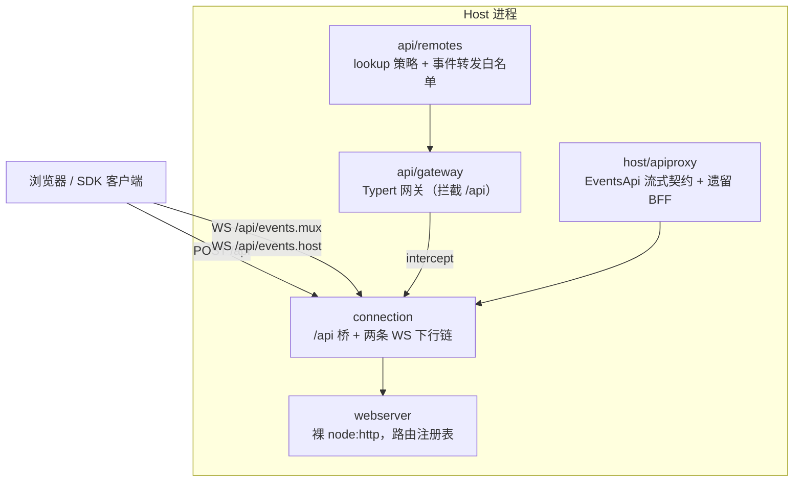

# 第 35 章 Web 服务端与 API

[上一章](34-boot.md)结束时，`dsh web` 已经把插件树挂载起来，其中就包括 `webserver` 行。本章看这棵树如何对浏览器说话：HTTP 与 WebSocket 面长什么样、会话事件流怎样推到前端、`docs/api-gateway.md` 描述的 Typert 网关如何让一个 `@Remote` 装饰器在客户端长出全类型的 `ctx.remote.goals.edit(...)`，以及一个刻意「没有鉴权」的本地服务器靠什么守住安全边界。这一层的分工纪律非常严格：每层只认识下一层，值得对照自己项目里「一个 Express 全家桶」的写法来读。

## 问题背景

给本地 agent 配一个浏览器 UI，朴素做法是：起一个 Express，每个功能加一组 REST 路由，前端手写 fetch 封装，事件推送各自开 SSE。三个月后你会得到：路由和 handler 散落各处、前后端类型靠口口相传（改了 server 的返回结构，client 编译照样通过，运行时炸）、每个功能一套私有推送协议、断线重连语义各不相同。更隐蔽的是安全问题：`localhost` 服务器看似不需要鉴权，但 DNS rebinding 可以让任意网页拿你的浏览器当跳板打 `127.0.0.1`——本地 RCE 面就此暴露。

DeepSeek Harness 的答案是一叠严格分层的包：`packages/host/webserver`（裸 HTTP 载体）→ `packages/client/connection`（RPC/WS 传输）→ `packages/host/apiproxy`（流式契约与遗留 BFF）+ `packages/api/gateway`（类型化 RPC 网关）→ `packages/api/remotes`（远程面组装）。`docs/api-gateway.md` 用一句话钉死方向：API 层组织为 `remotes → gateway → connection → webserver`。

## 源码剖析

### 分层地图



`packages/host/webserver` 是刻意「无知」的：一个 `node:http` 服务器加一张具名路由表（`exact`/`prefix` 两类）、一个 HTTP upgrade 注册表、一个 fallback 席位（给 SPA 静态资源），它不知道 session、RPC、鉴权为何物。路由注册自带一条不变量：

```ts
// packages/host/webserver/src/index.ts
register(route: WebRoute): () => void {
  const table = route.kind === 'exact' ? this.exact : this.prefixes
  if (table.has(route.path)) {
    throw new Error(`webserver: duplicate ${route.kind} route "${route.path}"`)
  }
  table.set(route.path, route)
  return () => { table.delete(route.path) }
}
```

重复注册直接 throw——路由归属是组合层（patch 层）的契约，冲突就是配置错误，静默后写覆盖只会把 bug 推迟到运行时。返回 disposer 则接上 Cordis 的可逆副作用纪律（[第 6 章](../part2/06-reversible-effects.md)）：插件卸载，路由随之消失。

### HTTP/WS 面：一个前缀，两条下行链

`packages/client/connection` 在 webserver 上注册三个入口：`prefix /api`（统一 RPC 桥）、`upgrade /api/events.mux`、`upgrade /api/events.host`。线上的每条消息都是 `RpcMessage` 四象限之一（`packages/host/apiproxy/src/api/rpc.ts`）：`ClientRequest`/`ServerResponse` 走 POST 往返，`ServerRequest` 是下行 WS 帧（纯推送或可应答的交互），`ClientResponse` 通过 POST `/api/respond` 回答服务端发起的交互（审批、提问）。`RpcId` 做请求相关；服务端发起的待答交互在页面刷新后**复用同一个 RpcId 重放**，重连的客户端因此能认出「这还是刚才那个没答的审批」。

WS 是严格单向的下行链，`packages/client/connection/src/websocket-downlink.ts`：

```ts
// packages/client/connection/src/websocket-downlink.ts
this.server.handleUpgrade(req, socket, head, (websocket) => {
  const abort = new AbortController()
  websocket.once('close', () => { abort.abort() })
  websocket.once('error', () => { abort.abort() })
  websocket.once('message', () => {
    websocket.close(1008, 'downlink only')
  })
  const pump = this.pump(websocket, open(abort.signal), abort)
  this.pumps.add(pump)
  void pump.then(() => { this.pumps.delete(pump) })
})
```

客户端敢在这条链上发任何消息，直接 1008 关闭——上行只有 POST 一条路。这不是洁癖：单向化之后，重连语义只需要考虑「重开流」，不存在「半途的上行请求怎么办」。

### 会话事件如何推给前端

流式契约定义在 `packages/host/apiproxy/src/api/events.ts` 的 `EventsApi`：`mux` 是全会话聚合流，`host` 是宿主级流（会话增删、运行状态翻转、workspace 变化、以及 `host/remote-event`——由 `packages/api/remotes/src/remote-events.ts` 白名单决定转发哪些 Cordis 事件，比如 `credentials/updated`）。mux 流的帧类型用 zod 判别联合钉死（`packages/host/apiproxy/src/api/events.schema.ts`）：

```ts
// packages/host/apiproxy/src/api/events.schema.ts
export const muxFrameSchema = z.discriminatedUnion('type', [
  z.object({ type: z.literal('session/event'), sessionId: sessionIdSchema, event: sessionEventSchema, view: toolEventViewSchema.optional() }),
  z.object({ type: z.literal('session/subscribed'), sessionId: sessionIdSchema, lastSeq: z.number().int() }),
  z.object({ type: z.literal('approval/requested'), sessionId: sessionIdSchema, approvalId: approvalRequestIdSchema, toolName: z.string(), callId: z.string().optional(), reason: z.string().optional() }),
  // ...
])
```

注意 `session/event` 帧就是[第 13 章](../part4/13-session-event-log.md)那份 append-only 日志的**原样透传**（附带可选的 Host 侧预投影 `ToolEventView`）——前端消费的不是某个 REST 资源模型，而是与持久层同一套事件词汇。除日志事件外，`session/queue`、`session/jobs`、`session/projection` 三类帧是**无日志条目的权威全量快照**：每次变化重发完整当前值，订阅/重订阅时也重发。文档注释把动机说得很清楚——完整快照是让「一次启动、一次 kill、一次重连、第二个 tab」收敛到同一个权威值的手段，用重发全量换掉一整类增量 diff + ack 的乱序 bug。

重连由客户端 `ConnectionController`（`packages/client/connection/src/client/connection.ts`）以「代」为单位驱动：每代同时打开两条流并调 `host.describe` 做就绪握手，两条流都 open（或 3 秒超时）才宣告 `connected`；任一条流失败就废弃整代、指数退避重试（base 500ms、倍率 2、上限 10s、带抖动）。线上的按序恢复（`mux` 的 `since` 水位参数）在 v1 刻意**未实现**：文档化的重连策略就是「重开流 + 重拉历史」，`session/subscribed` 的 `lastSeq` 提供对齐基线，快照帧自动重发——因为事件日志本身可以随时重放，传输层就不必再造一套可靠投递。

### Typert 网关：声明一次，两端消费

`docs/api-gateway.md` 描述的网关解决的是「前后端类型漂移」。业务服务在方法上加 `@Remote` 装饰器（如 `packages/goal/goal/src/index.ts` 的 `@Remote('edit')`），Typert 生成器在构建期静态分析出两份产物：给 Host 网关的反射描述符（`typert.host.js`），和给客户端的 `typert.remote-client.d.ts` + 运行时 codec——后者通过 declaration merging 汇入 `TypertRemoteNamespaceMap`，客户端于是**编译期**就有了 `ctx.remote.goals.edit` 的完整签名，还带 `.d.ts.map` 能从调用点直接跳回 `@Remote` 源方法。Host 与 Client 是**两个从不合并的 `ts.Program`**（`packages/api/gateway/tsconfig.host.json` vs `tsconfig.client.json`），跨越接缝的只有生成的声明文件与 codec 对象。

网关上线的方式同样克制——它不注册新路由，而是**拦截** connection 已有的 `/api`：

```ts
// packages/api/gateway/src/index.ts
constructor(ctx: Context) {
  super(ctx, 'typertGateway')
  // ...
  ctx.inject(['connection'], (connectionCtx) => {
    connectionCtx.connection.rpc.intercept(
      '/api',
      endpoint => this.claimsEndpoint(endpoint),
      (endpoint, payload, signal) => this.dispatchRpc(endpoint, payload, signal),
      { authority: 'trusted-host' },
    )
  })
}
```

`claimsEndpoint` 只认领「恰好两段」的 `namespace/method` 端点，认不出的落回遗留 `apiProxy` handler——新旧两套 RPC 共存于同一个 URL 前缀，客户端不需要知道某个方法由谁实现。边界校验是结构性的：`assertExactArguments` 对 wire payload 的键集合与描述符做**双向** diff（多一个键、少一个键都 fail loud），`assertJsonValue` 在业务调用前后递归拒绝循环引用、稀疏数组、非有限数——「能过 `JSON.stringify` 」不等于「JSON 安全」。客户端侧对每个响应做严格 codec parse，且 `requireStrictDescriptor` 拒绝挂载任何没有生成产物的弱描述符：dev 模式下 Host 可以用 `Function.prototype.toString` 推参数名的降级描述符服务 `curl` 和测试，但编译出的前端**绝不**降级——契约要么是生成的、强的，要么不存在。

错误传播有一张闭合的分类表：基础设施失败抛 `TypertGatewayError`（`arguments-invalid`、`service-unavailable`、`result-invalid` 等有限 code 集），而业务抛出的错误与 `TypertLookupFailure`（`agent-busy`、`session-not-found` 这类领域失败）**原样穿透**，在最外层由 `rpcFailure()` 收进统一的 `RpcResult` 信封——领域错误保留自己的语义 code，其余坍缩为 `internal`。

### 鉴权：一道明确写着「这不是 auth」的栅栏

`docs/subsystems/web-server.md` 直言：没有 TLS、没有 auth、没有 origin policy——这是一个绑在 loopback 的本地服务器。真正守门的是 `packages/client/connection/src/api-request-trust.ts` 的信任栅栏，每个 `/api` 请求都过：

```ts
// packages/client/connection/src/api-request-trust.ts
export function isTrustedApiRequest(request: ApiTrustRequest, trustedHosts: readonly string[]): boolean {
  const host = header(request.headers, 'host')
  if (host === undefined) return false
  const hostUrl = parseAuthority(host)
  if (hostUrl === undefined) return false
  if (!isLoopbackHostname(hostUrl.hostname) && !isTrustedAuthority(hostUrl, trustedHosts)) return false
  // Cross-site fence: modern browsers label the initiator relationship on
  // every fetch; an explicit cross-site marker is refused regardless of Origin.
  if (header(request.headers, 'sec-fetch-site') === 'cross-site') return false
  // ...
}
```

三重检查各挡一类攻击：Host header 对照 loopback / `--trusted-host` 白名单，挡 DNS rebinding（被重绑的页面发请求时，浏览器填的 Host 是攻击者域名，即使 socket 落在本机）；`Sec-Fetch-Site: cross-site` 一律拒绝；出现 `Origin` 时必须与请求自身 authority 严格一致。在此之上还有一层 `PRIVILEGED_METHODS`（`packages/client/connection/src/index.ts`）：`settings.*`、`credentials.set/unset`、`host.pickDirectory` 等方法被钉死为**仅 loopback**，即使部署配置了 `trustedHosts` 也不放行——源码注释点明理由：`trustedHosts` 是 DNS rebinding 栅栏，「explicitly not authentication」。

credentials 子系统（`docs/subsystems/credentials.md`）与 web 服务器的关系因此很薄：它管的是 LLM provider 的密钥（`CredentialRef` → `ctx.credentials.resolve()`），不管谁能访问服务器。它只以两种形态浮出 web 层——被钉进特权名单的 `credentials.describe/set/unset` RPC，以及经 `api-remotes` 白名单转发的 `credentials/updated` 事件，让设置页能刷新「已配置」徽标而**永远看不到密钥值**。

## 设计亮点

> 💎 **设计亮点：拦截而非占有——新 RPC 系统在旧 BFF 体内生长**
> 常规做法是给新网关开 `/api/v2`，然后客户端维护两套入口、迁移拖成长期工程。Typert 网关用 `connection.rpc.intercept('/api', ...)` 挂在同一前缀上，以「端点是否恰好两段」为判别，认领不了的落回遗留 apiproxy。没有版本号、没有迁移开关、客户端无感知——传输层的一个拦截原语吃掉了整个渐进迁移问题。

> 💎 **设计亮点：两个从不合并的 ts.Program，只靠生成的 .d.ts 握手**
> 前后端共享类型的常见做法是 shared types 包，但那会让 server 内部类型悄悄泄漏进 client 依赖图。这里 Host/Client 是物理隔离的两次编译，接缝上只有生成器产出的声明合并与严格 codec；客户端 `requireStrictDescriptor` 连「降级到运行时推断的弱契约」都拒绝。两侧漂移在编译期爆炸，而不是在用户的浏览器里。

> 💎 **设计亮点：用全量快照消灭增量同步的整类 bug**
> queue/jobs/projection 这些易变状态不做 diff + ack，每次变化和每次（重）订阅都重发完整权威值。付出的是报文体积，买到的是「启动、kill、重连、第二个 tab」自动收敛到同一状态——而且这是写进帧类型文档注释的**声明式不变量**，不是恰好没实现增量。`since` 参数保留在接口上但 v1 明确不实现，是同一判断的另一面：事件日志本身可重放，传输层不必重复造可靠投递。

> 💎 **设计亮点：把「这不是鉴权」写成代码结构**
> 本地服务器最危险的谎言是「加了 host 白名单就算安全了」。这里 `trustedHosts` 的注释自我声明只是 DNS rebinding 栅栏，并用 `PRIVILEGED_METHODS` 把 credentials、settings、目录选择器等高危方法**结构性地**钉在 loopback——白名单部署也不放行。安全假设不靠文档提醒，靠一个 `Set` 常量强制执行。

## 小结与延伸

Web 服务端是四层各司其职的栈：webserver 只做 HTTP 载体，connection 提供「POST 上行 + 双 WS 下行」的 RPC 传输与信任栅栏，apiproxy 定义以事件日志透传 + 权威快照为核心的流式契约，gateway/remotes 用构建期生成把 `@Remote` 方法投影成客户端的类型化调用面。会话状态到达浏览器后如何被渲染成 UI，是[下一章](36-web-client.md)的主题。

延伸阅读：

- `docs/api-gateway.md`、`docs/subsystems/web-server.md` — 两份子系统地图
- `packages/host/webserver/src/index.ts` — 路由注册表与 fallback 席位
- `packages/client/connection/src/index.ts`、`src/websocket-downlink.ts`、`src/api-request-trust.ts`、`src/client/connection.ts` — 传输、下行链、信任栅栏、重连代循环
- `packages/host/apiproxy/src/api/events.ts`、`events.schema.ts`、`rpc.ts` — 流式契约与 RpcMessage 四象限
- `packages/api/gateway/src/index.ts`、`src/client/index.ts` — 网关分发与客户端严格挂载
- `packages/api/remotes/src/remote-events.ts` — Cordis 事件转发白名单
