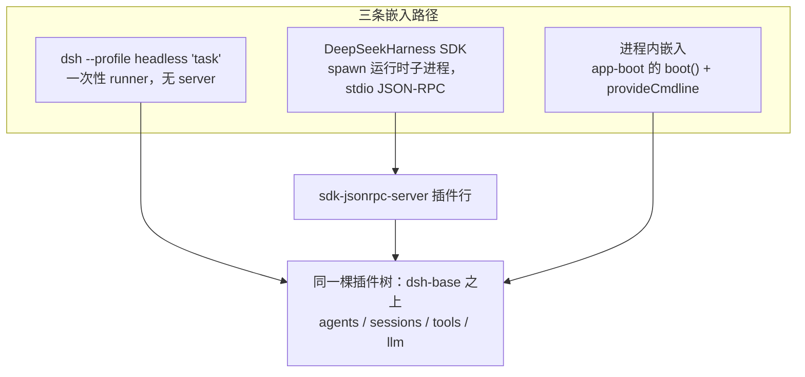

# 第 37 章 SDK 与 Headless：把 harness 嵌进别的程序

前三章的主角是浏览器；本章回答另一个问题：**不要 UI，只要能力**，怎么把 harness 变成别人程序里的一个函数调用。仓库给了三条路径：`dsh --profile headless` 一次性 runner（无 server、打印结果即退）、`packages/sdk` 的子进程 JSON-RPC 协议栈（TypeScript/Python SDK 共用）、以及直接用 `boot()` 做进程内嵌入。三条路径都建立在同一个事实上：会话是事件日志（[第 13 章](../part4/13-session-event-log.md)），所以对外接口可以小到只有三个 RPC 方法。最后看 `packages/session-query`——嵌入场景下「查询历史会话」的能力，以及它如何反过来成为 agent 自己的工具。

## 问题背景

给一个 agent 系统做「可编程接口」，朴素做法有两种，各有各的坑。其一，导出一个大而全的 SDK 类：`onToken`、`onToolCall`、`onApproval`……每加一种事件加一个回调，SDK 版本与内核版本锁死，Python/TS 两份实现各自漂移。其二，让调用方直接 import 内核函数——然后内核的每次内部重构都变成 breaking change，且 stdout 上的日志、子进程清理、超时语义全部甩给调用方。还有一个容易被忽略的需求：批处理场景要的是「一条命令，答完就退，退出码可靠」，而长驻 server + HTTP 轮询对此是杀鸡用牛刀。

DeepSeek Harness 的答案分层很清楚：headless bundle 用**同一套补丁组合机制**拼出一个无 server 的一次性 surface；SDK 把进程边界钉死在一个**三方法 + 四通知**的 stdio JSON-RPC 协议上，事件流原样透传会话日志；session-query 则把「读历史」抽成又一个 Definition/Provider 接缝。

## 源码剖析



### Headless：一次性 runner 是一个普通插件行

`packages/bundle/headless/cordis.patch.yml` 骑在 `dsh-base` 上，不挂 Host、HTTP、浏览器插件，只插三行：

```yaml
# packages/bundle/headless/cordis.patch.yml
- insert:
    # Code Mode is a core execution capability, not a Web component.
    - id: code-runtime
      name: '@deepseek-ai/dsh-code-runtime-worker-thread'

    - id: headless-startup
      name: '@deepseek-ai/dsh-headless/startup'

    # Reads its task from the ordinary headlessStartup provider.
    - id: headless-runner
      name: '@deepseek-ai/dsh-headless'
      inject: [headlessStartup]
      config:
        task: !!js ctx.headlessStartup.task
```

结构与 web bundle（[第 34 章](34-boot.md)）完全同构：`startup` 插件解析任务位置参数（`dsh --profile headless "run the tests"`）并 provide `headlessStartup` service，runner 行用 `!!js` 从 service 读任务——`--help` 时 service 不发布、runner 永远 pending、自然不跑任务。runner 本体（`packages/bundle/headless/src/index.ts`）是对核心 API 最短的一次完整使用，值得整段读：

```ts
// packages/bundle/headless/src/index.ts
async function run(ctx: Context, task: string, io: HeadlessIo): Promise<void> {
  // Loader siblings mount concurrently. Await the complete application before
  // creating an Agent so its scoped tools and adapters are not half-composed.
  await ctx.get('loader')?.await()
  // ...
  const { agent } = await agents.create({
    sessionId: SessionId(`session-${randomUUID()}`),
    meta: { cwd: process.cwd() },
    agentOptions: { provider: selection.provider, model: selection.model },
    // ...
  })
  await agent.whenIdle()
  const firstSeq = agent.session.seq
  agent.followup(createUserMessage({
    content: [{ type: 'text', text: task }],
    source: { kind: 'user' },
  }))
  await agent.whenIdle()
  await sessions.flush(agent.session)
  const outcome = summarize(agent.session.events, firstSeq)
  io.stdout.write(outcome.text + '\n')
  if (outcome.reason?.kind === 'error') {
    io.stderr.write(`dsh: ${outcome.reason.error.code}: ${outcome.reason.error.message}\n`)
  }
  io.exit(outcome.reason?.kind === 'completed' ? 0 : 1)
}
```

没有回调、没有流式协议：记下发问前的 `session.seq`，`whenIdle()` 等静止，然后**从事件日志里读答案**——`summarize` 在 `firstSeq` 之后的区间里找最后一条 `assistant/message` 和 `turn/end` 的 reason。退出码由 `turn/end.reason` 决定（`completed` → 0，否则 1），退出走 launcher 注入的 `ctx.appExit` 有界停机——脚本可以放心 `dsh --profile headless ... && next-step`。

### SDK：三个方法、四个通知、一条 stdio

`packages/sdk` 分 protocol / client / server 三包。协议面小得惊人（`packages/sdk/protocol/src/types.ts`）：

```ts
// packages/sdk/protocol/src/types.ts
/** Server-to-client notifications by JSON-RPC method name. */
export interface HarnessSdkNotificationMap {
  'session.event': SessionEventNotification
  'session.status': SessionStatusNotification
  'subagent.started': SubagentStartedNotification
  'subagent.finished': SubagentFinishedNotification
}

/** Client-to-server request methods with their param and result shapes. */
export interface HarnessSdkRequestMap {
  'initialize': { params: InitializeParams; result: InitializeResult }
  'session/prompt': { params: SessionPromptParams; result: SessionPromptResult }
  'shutdown': { params: undefined; result: Record<string, never> }
}
```

上行只有握手、发问、停机三个方法；`session/prompt` 的返回**只有一个 `messageId`**——入队回执，不含任何回答。回答从哪来？`session.event` 通知携带**完整的会话日志事件信封**（`event: SessionEvent`）——与上一章浏览器消费的、与磁盘上持久化的是同一套类型。SDK 协议之所以能这么小，是因为它根本不定义「输出格式」：输出就是事件日志本身。

客户端高层 API（`packages/sdk/client/src/api.ts`）的 `HarnessSession.run` 展示了这个模型下「一次运行」的语义——不是「等 RPC 返回」，而是**认领一段活动区间**：

```ts
// packages/sdk/client/src/api.ts — HarnessSession.run（节选）
const subscription = client.subscribeSessionTree(this.id)
try {
  const messageId = await client.prompt(this.id, contentBlocks)
  let received = false
  while (true) {
    const notification = await subscription.next()
    if (!received) {
      if (notification.method !== 'session.event'
        || notification.params.sessionId !== this.id
        || !isInboxReceipt(notification.params.event, messageId)) continue
      received = true
    }
    collect(notification)
    if (notification.method === 'session.status'
      && notification.params.sessionId === this.id
      && notification.params.status === 'idle') break
  }
} finally {
  subscription.close()
}
```

先在事件流里等到**自己那条消息的持久入队回执**（`agent/inbox/spliced` 里出现自己的 `messageId`），才开始收集，直到 `session.status: idle`——区间的起点由日志事件锚定，终点由 agent 状态锚定，中途别的会话、别的注入消息都不会污染归属。`subscribeSessionTree` 还会顺着 `subagent.started` 的 parent→child 边做客户端侧的谱系过滤，子代理的事件自动归入这棵树。传输层（`packages/sdk/client/src/client.ts` 的 `HarnessClient`）拥有子进程的完整生命周期：spawn、行分帧 JSON-RPC、通知扇出，关停走「协议 `shutdown` → stdin EOF → SIGTERM → SIGKILL」的升级阶梯，失败诊断自动附上退出码和保留的 stderr 尾部（400 行环形缓冲）。文档注释点明它与 Python SDK 是「design twin」——两个语言的 SDK 实现同一份协议与同一套语义，而不是各自为政。

服务端（`packages/sdk/server`）则回到熟悉的形态：`sdk-jsonrpc-server` 是**一个普通 Cordis 插件行**，由调用方的 `cordis.yml` 决定是否加载。它的模块注释里有一条组合级约束值得抄下来：stdout 保留给协议帧，**这棵树不得加载任何 stdout logger**。`shutdown` 的实现顺序也很讲究（`packages/sdk/server/src/index.ts`）：

```ts
// packages/sdk/server/src/index.ts
transport.onRequest(async (method, params) => {
  const result = await server.handleRequest(method, params)
  if (method === 'shutdown') {
    // Run after the handler result is written; the task then flushes, disposes, and exits.
    setImmediate(() => { void disposeAndExit() })
  }
  return result
})
```

先把 `shutdown` 的响应写出去，再 flush 传输、dispose **整个根运行时**（含持久化落盘）、`exit(0)`——客户端永远能收到确认，磁盘永远是完整的。

第三条路径——进程内嵌入——没有专门的包，因为不需要：[第 34 章](34-boot.md)的 `boot()` 本就是导出函数，任何宿主程序都可以拿一份 `cordis.yml`（或补丁层列表）在自己进程里挂一棵树；`packages/boot/cmdline` 的 `provideCmdline` 注释明说了这种用法——「an embedding host with no command line provides an empty argument list」。headless runner 那 30 行 `agents.create → followup → whenIdle → 读日志` 就是进程内驱动的完整模板。

### session-query：历史会话的查询能力

嵌入场景（以及 agent 自己）经常要问：「之前那次会话里发生了什么？」`packages/session-query` 把这抽成又一组 Definition/Provider 接缝（[第 22 章](../part6/22-seam-triangle.md)的模式再现）：`session-query` 包是 Service Definition，拥有**与后端无关**的精确读取（`SessionLogSnapshot` 完整重放校验的原始日志、`SessionSurfaceSnapshot` 当前模型面观察）、来源优先级（live 优先于 persisted）、谱系追踪和过滤器；`session-query-sqlite` 是具体 Provider，负责 FTS5 全文索引的生命周期。索引的开销控制做成了三档配置（`packages/session-query/session-query-sqlite/src/index.ts`）：

```ts
// packages/session-query/session-query-sqlite/src/index.ts
/** SQLite module/handle opening phase; `never` disables full-text search entirely. */
export type OpenAt = 'startup' | 'first-search' | 'never'
```

`never` 档下继承的精确读、过滤、追踪**照常可用**，只有 `searchSessions/searchEvents` 报 `SESSION_QUERY_SEARCH_DISABLED`，SQLite 模块根本不 import——web bundle 默认就是 `path: ':memory:'` + `openAt: never`，全文搜索是部署方一行补丁的 opt-in。索引本身被明确定位为**可丢弃的派生状态**（「disposable derived query index」），从持久层对账（`_reconcile`）重建，坏了删掉即可——真相永远在事件日志里。这层能力最后以两种形态回到用户面前：`tool-session-query` 把搜索/读取注册为**模型可调用的工具**（`inject = ['tools', 'systemPrompt', 'sessionQuery']`，带工作区授权与 30 秒协作式超时）——agent 可以查询自己的历史；`session-log-export` 注册 Web 端 `/export` 命令，把整份会话日志打包下载。

## 设计亮点

> 💎 **设计亮点：因为会话是事件日志，SDK 协议只需要三个方法**
> 常规 SDK 会为每类输出发明回调或流式 RPC，协议面随功能线性膨胀，多语言 SDK 各自漂移。这里上行只有 initialize/prompt/shutdown，下行把会话日志事件原样透传——web 前端、headless runner、SDK 消费的是同一套 `SessionEvent` 词汇。内核加一种事件，SDK 协议**零改动**；TS 与 Python SDK 能做到「design twin」，正因为协议里几乎没有东西可漂移。

> 💎 **设计亮点：用日志回执锚定「一次运行」的归属**
> `prompt` 只返回 `messageId`，`run()` 先等到含该 id 的 `agent/inbox/spliced` 持久回执才开始收集，到 `idle` 状态收束。区间两端都锚在可靠事实上（durable 事件 + agent 状态），并发提问、注入消息、子代理活动都不会串线——不需要给 RPC 层发明会话内的请求-响应相关性。

> 💎 **设计亮点：headless 不是特殊模式，是又一层补丁**
> 一次性 CLI 常被实现成内核里的 `if (headless)` 分支。这里它是骑在 dsh-base 上的三行 insert：startup 解析 flag 成 service，runner 注入 service 驱动核心 API，退出走与 web 相同的 `ctx.appExit` 有界停机。组合机制本身（[第 7 章](../part2/07-profiles-and-bundles.md)）吃掉了「表面形态」这个变量——web、headless、SDK runtime 只是同一棵基础树上不同的最后一层。

> 💎 **设计亮点：查询索引是可丢弃的派生态，且分档退化**
> session-query-sqlite 把 FTS 索引定位为从持久层对账重建的 derived state，`openAt` 三档让部署方在「启动就建 / 首查再建 / 完全不建」之间选，`never` 档连 SQLite 都不 import 而精确读取照常工作。能力退化是渐进的、按需付费的——而 `tool-session-query` 把同一能力递给模型，让 agent 获得对自身历史的检索，closing the loop。

## 小结与延伸

嵌入 harness 的三条路径成本递增、控制力递增：headless 是「spawn 一条命令读 stdout」，SDK 是「拥有一个 stdio JSON-RPC 子进程、消费事件流」，进程内嵌入是「自己 boot 一棵树、直接调 `agents.create`」。三者共享同一棵插件树、同一套事件词汇、同一个组合机制——这正是全书反复出现的主题：**用一个原语统一多种场景**。至此宿主与界面四章完成；[下一部分](../part10/38-testing-strategy.md)转向支撑这一切的工程实践。

延伸阅读：

- `packages/sdk/README.md`、`packages/sdk/protocol/src/types.ts`、`src/transport.ts` — 协议栈与行分帧传输
- `packages/sdk/client/src/api.ts`、`src/client.ts`、`src/dispose.ts` — 高层 run API、子进程所有权与关停阶梯
- `packages/sdk/server/src/index.ts`、`src/server.ts` — 服务端插件与生命周期事件桥
- `packages/bundle/headless/` — cordis.patch.yml、startup、runner 三件套
- `docs/subsystems/session-query.md`、`packages/session-query/session-query/src/types.ts` — 查询词汇与原子观察语义
- `packages/session-query/session-query-sqlite/src/index.ts` — FTS5 索引生命周期与对账
- `packages/session-query/tool-session-query/` — 模型可调用的历史检索工具
