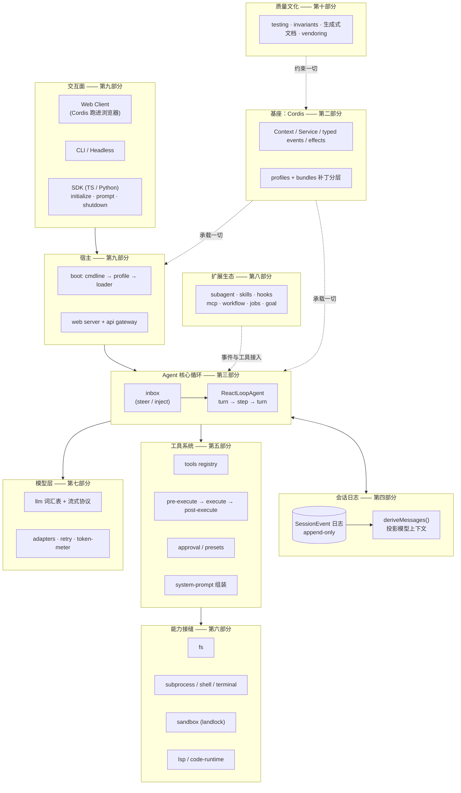
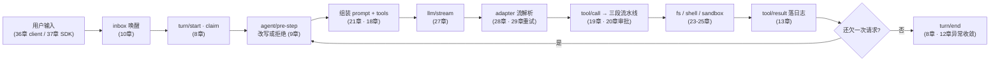

# 导读地图：从全局到局部

读一个 7000+ 文件、219 个包的代码库，最大的风险不是读不懂，而是**迷路**：在某个包里越钻越深，却说不清它在整体里的位置。这一页给你两样东西：一张全局架构图（每一层都标注了本书对应的部分），和几条按不同目标设计的阅读路线。任何时候觉得迷路了，回到这一页重新定位。

## 全局架构图

DeepSeek Harness 可以压缩成一句话：**一棵 Cordis 插件树，围绕一条 append-only 会话日志运转**。下图自上而下是「离用户越来越远、离机制越来越近」的十层，右侧标注每层由本书哪个部分讲解：

三个读图要点，也是这套架构最反直觉的三件事：

1. **核心循环没有特权**。第三层的 `ReactLoopAgent` 只是 `ctx.agentLoop` 的默认 provider，和其他插件一样挂在 Cordis 树上、一样可被替换（[第 3 章](part1/03-architecture-overview.md)）。
2. **日志是中心，不是循环**。第四层与第三层是双向箭头：循环不持有对话状态，每次请求都从日志现场投影；UI、telemetry、fork、SDK 下行协议全部从同一条日志派生（[第 13 章](part4/13-session-event-log.md)）。
3. **扩展生态用虚线接入**。第八层的 subagent/workflow/jobs 等全部通过既有事件与工具接缝挂载，agent-loop 对它们零依赖（[第 32 章](part8/32-workflow-jobs-goal.md)）。

## 一条消息的旅程

架构图是静态的；下面这条动线把十个部分串成一次真实执行。读完任何一章后，回来找到它在动线上的位置：

每一步都有两条纪律贯穿：**凡是模型看得见的都必须在日志里**（invariant 挂在 `llm/stream` 最前端逐字节校验，[第 15 章](part4/15-model-visible-invariant.md)）；**凡是注册的都必须可逆**（effect/disposer，[第 6 章](part2/06-reversible-effects.md)）。

## 四条阅读路线

**路线 A · 主干精读（推荐，约一周）**——「全局 → 局部」的正序：

1. 先建地图：[1](part1/01-what-is-a-harness.md) → [2](part1/02-repo-tour.md) → [3](part1/03-architecture-overview.md)（全景）
2. 打基座：[4](part2/04-context-and-service.md) → [5](part2/05-typed-events.md) → [6](part2/06-reversible-effects.md)（Cordis 三件套；第 7 章可后置）
3. 进核心：[8](part3/08-turn-and-step.md) → [9](part3/09-agent-loop-deep-dive.md) → [13](part4/13-session-event-log.md) → [14](part4/14-derive-messages.md) → [15](part4/15-model-visible-invariant.md)（循环 + 日志，全书心脏）
4. 看动脉：[19](part5/19-tool-pipeline.md) → [22](part6/22-seam-triangle.md) → [27](part7/27-llm-vocabulary-and-streaming.md)（工具、接缝、模型三条主干各取一章）
5. 再按兴趣进入余下章节——此时你已有足够的坐标系，任何一章都能独立消化。

**路线 B · 半天鸟瞰**——只读六章建立完整心智模型：[1](part1/01-what-is-a-harness.md) → [3](part1/03-architecture-overview.md) → [8](part3/08-turn-and-step.md) → [13](part4/13-session-event-log.md) → [22](part6/22-seam-triangle.md) → [38](part10/38-testing-strategy.md)。

**路线 C · 造轮子视角**——你想自己实现一个 harness：第二部分全读（框架基座）→ [9](part3/09-agent-loop-deep-dive.md)（循环怎么写薄）→ [14](part4/14-derive-messages.md)/[15](part4/15-model-visible-invariant.md)（状态怎么外置）→ [19](part5/19-tool-pipeline.md)（策略怎么分层）→ [28](part7/28-adapters.md)（适配器怎么可替换）→ [42](part10/42-vendoring.md)（依赖怎么管）。

**路线 D · 工程文化速览**——不关心 agent、只想偷师工程实践：第十部分全读，外加 [15](part4/15-model-visible-invariant.md)（不变量的用法）和 [5](part2/05-typed-events.md)（类型即契约）。

## 从全局到局部的三层缩放法

无论走哪条路线，建议保持同一个节奏，像地图应用一样分三档缩放：

- **第一档（本页）**：确认当前章节在架构图和消息动线上的位置——它属于哪一层、上下游是谁。
- **第二档（章的「问题背景」节）**：理解「如果我自己写会怎么做、会踩什么坑」，带着问题进源码。
- **第三档（章的「源码剖析」+ 仓库）**：对照书中标注的文件路径，在真实仓库里打开源码。强烈建议 clone 一份 [deepseek-harness](https://github.com/deepseek-ai/deepseek-harness) 边读边跳转；每章末尾的「小结与延伸」给出了继续深挖的文件清单。

读完一章，缩放回第一档，在图上给这一块「点亮」——十个部分点亮完，这个 219 包的系统就真正属于你了。
